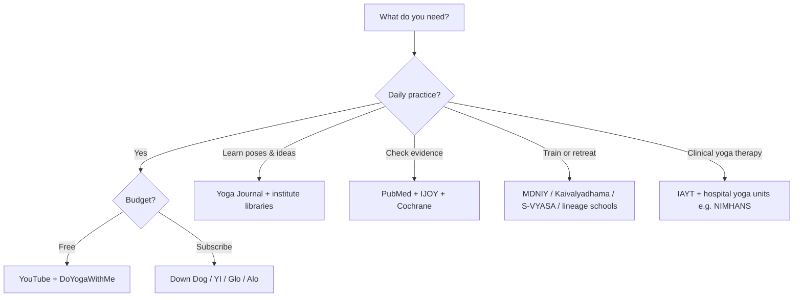
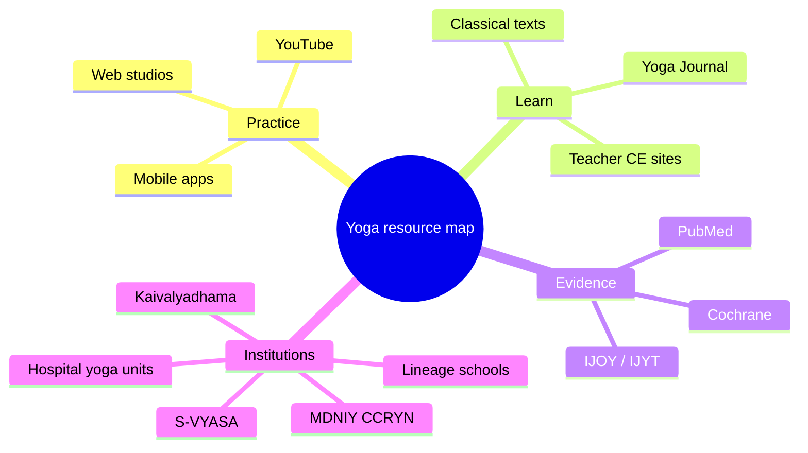

Where should you practice yoga online, read trustworthy pose and philosophy guides, find clinical evidence, or train with a serious institute? The digital yoga landscape mixes **free YouTube teachers**, **subscription apps**, **editorial sites**, **PubMed-indexed journals**, and **century-old research ashrams** — easy to confuse with each other.

This guide is a **navigation map**, not a ranking of “best yoga brand.” It groups resources by job: daily practice (apps & web), learning (info sites), evidence (research), and lineage/education (institutes). Companion drafts on this site go deeper on [mantra science](/_drafts/scientific-benefits-of-mantra-chanting.md) and [yoga for PCOS / menstrual health / pregnancy](/_drafts/yoga-and-sound-therapy-for-pcos-pregnancy-and-menstrual-health.md) — swap those paths to `` when publishing.

> **Health note:** Yoga is generally safe when taught appropriately, but it is not a substitute for medical care. For injury, pregnancy, hypertension, glaucoma, or psychiatric conditions, get clearance from a clinician and prefer **yoga therapy** programs (IAYT-aware / hospital-linked) over random viral flows. Apps and websites vary widely in teacher quality and medical caution.

## TL;DR — Pick by goal

| Your goal | Start here | Why |
| --------- | ---------- | --- |
| **Free daily practice at home** | [Yoga With Adriene](https://www.youtube.com/@yogawithadriene) (YouTube) + [DoYogaWithMe](https://www.doyogawithme.com/) | Large free libraries; beginner-friendly pacing |
| **Customizable app (paid, polished)** | [Down Dog](https://www.downdogapp.com/) | Algorithmic sequences; styles, length, focus areas |
| **Practice + philosophy + CE for teachers** | [Yoga International](https://yogainternational.com/) | Classes plus deep courses/articles |
| **Pose explainers & magazine-style guides** | [Yoga Journal](https://www.yogajournal.com/) | Pose libraries, sequences, teacher essays |
| **Is this claim studied?** | [PubMed](https://pubmed.ncbi.nlm.nih.gov/) + *International Journal of Yoga* | Filter RCTs/reviews; avoid influencer “studies say” alone |
| **India nodal yoga institute / public programs** | [MDNIY](https://yogamdniy.nic.in/) (Ministry of Ayush) | National coordination of education, therapy, research |
| **Oldest scientific yoga research campus** | [Kaivalyadhama](https://kdham.com/) (Lonavla) | Research + education since 1924; *Yoga Mīmāṃsā* tradition |
| **University-scale yoga research & degrees** | [S-VYASA](https://svyasa.edu.in/) (Bengaluru) | Clinical/academic programs; *International Journal of Yoga* |
| **Yoga therapy professional body** | [IAYT](https://www.iayt.org/) | Standards, journal, therapist directory mindset |

> Jump to [Mobile apps](#mobile-apps), [Web & streaming](#web--streaming-platforms), [Information sites](#yoga-information-sites), [Research](#yoga-research-hubs--journals), or [Institutes](#yoga-institutes--lineage-centers).

## Table of Contents

- [TL;DR — Pick by goal](#tldr--pick-by-goal)
- [How to use this map](#how-to-use-this-map)
- [Mobile apps](#mobile-apps)
- [Web & streaming platforms](#web--streaming-platforms)
- [Yoga information sites](#yoga-information-sites)
- [Standards, directories & teacher credentials](#standards-directories--teacher-credentials)
- [Yoga research hubs & journals](#yoga-research-hubs--journals)
- [Yoga institutes & lineage centers](#yoga-institutes--lineage-centers)
- [Government & global programs](#government--global-programs)
- [Recommended stacks by persona](#recommended-stacks-by-persona)
- [FAQ](#faq)
- [References](#references)

## How to use this map

**Pricing legend used below**

| Symbol | Meaning |
| ------ | ------- |
| **Free** | Substantial use without payment |
| **Freemium** | Free tier + paid unlock |
| **Paid** | Subscription or membership for core library |
| **Institution** | Campus / degree / therapy program (fees vary) |

Most “yoga apps” are **commercial**, not open source. This guide still includes them because that is where most people practice — and labels cost clearly so you can choose free paths when you want them.

## Mobile apps

### Practice-first apps

| App | Best for | Cost model | Notes |
| --- | -------- | ---------- | ----- |
| **[Down Dog](https://www.downdogapp.com/)** | Custom length/style/focus; travel practice | Paid (frequent educator/student discounts historically) | Algorithmic cueing; also Pilates/HIIT/meditation under same brand family |
| **[Yoga International](https://yogainternational.com/)** app | Classes + education + teacher CE | Paid membership | Stronger “study yoga” depth than pure workout apps |
| **[Daily Yoga](https://www.dailyyoga.com/)** | Beginner programs, large pose catalog | Freemium → paid | Very popular in app stores; quality varies by program |
| **[Alo Wellness Club](https://www.aloyoga.com/)** / Alo Moves app | Fashion-brand lifestyle classes | Free tier with account / paid expansions | Polished production; less classical philosophy |
| **[Glo](https://www.glo.com/)** | Yoga + Pilates + meditation library | Paid | Education tab useful beyond flows |
| **Find What Feels Good** ([Yoga With Adriene](https://yogawithadriene.com/)) | Adriene’s library beyond YouTube | Paid app; YouTube remains free | Same teacher voice millions already know |
| **Pocket Yoga** | Offline pose-based practice | Paid one-time (often) | Lightweight; less “influencer studio” feel |
| **Asana Rebel** / **Yoga-Go** | Short habit-forming sessions | Freemium | Fitness-app UX; verify cues if you have injuries |

### Adjacent apps (breath, meditation, therapy-adjacent)

| App | Role next to yoga |
| --- | ----------------- |
| **Insight Timer** | Huge free meditation/timer library; some yoga nidra |
| **Healthy Minds / other MBSR apps** | Mindfulness skill; not asana |
| **Hospital / clinic apps** (region-specific) | Sometimes ship prescribed yoga modules — prefer clinician-recommended ones |

### App selection tips

- Prefer apps that show **teacher name, duration, props, contraindications**.
- For back/neck issues, avoid “advanced challenge” packs until a teacher or therapist screens you.
- Download **offline** packs if you practice without stable data (travel, ashram Wi‑Fi).
- Treat calorie-burn scores as marketing; yoga’s better-studied outcomes are stress, flexibility, balance, and some clinical adjuncts — see research section.

## Web & streaming platforms

| Platform | Type | Cost | Strength |
| -------- | ---- | ---- | -------- |
| **[DoYogaWithMe](https://www.doyogawithme.com/)** | Web video library | Free core + paid extras / YTT | High-quality free classes; good starting web hub |
| **[Yoga With Adriene](https://www.youtube.com/@yogawithadriene)** | YouTube | Free (+ optional memberships elsewhere) | Beginner rapport; massive 30-day challenges |
| **[Yoga International](https://yogainternational.com/)** | Web + app | Paid | Articles, courses, trauma-informed & philosophy tracks |
| **[Glo](https://www.glo.com/)** | Web + app | Paid | Multi-modality studio |
| **[Alo Moves](https://www.alomoves.com/)** | Web + app | Paid | Production-heavy class library |
| **YouTube (multi-teacher)** | Video | Free | Search lineage names (Iyengar, Ashtanga Mysore demos) carefully — form quality varies |
| **Institute live streams** (MDNIY IDY events, ashram channels) | Occasional free broadcasts | Free | Best around International Day of Yoga (21 June) |

**Web vs app:** Use the **web** for research tabs and long articles; use an **app** for timed practice with phone on the mat. Many paid services sync both.

## Yoga information sites

### Editorial & pose education

| Site | What you’ll find |
| ---- | ---------------- |
| **[Yoga Journal](https://www.yogajournal.com/)** | Pose how-tos, sequences, teacher essays, app roundups, culture |
| **[Yoga International](https://yogainternational.com/)** (articles) | Longer educational pieces; anatomy, Ayurveda, philosophy |
| **[DoYogaWithMe](https://www.doyogawithme.com/)** blog/library | Practice-oriented free content alongside videos |
| **Accessible Yoga** / adaptive yoga orgs | Disability- and body-inclusive practice framing |
| **Yoga Anatomy** resources (e.g. work descending from Leslie Kaminoff / Amy Matthews tradition) | Structural/breath-centered anatomy literacy — use books + reputable courses, not only social clips |

### Classical texts & study (free/public)

| Resource | Use |
| -------- | --- |
| **Yoga Sūtras of Patañjali** (critical editions / university translations) | Philosophy backbone (eight limbs), not a workout plan |
| **Haṭha Yoga Pradīpikā**, **Gheranda Saṃhitā** (public-domain translations) | Classical haṭha context — historical, not always modern safety guidance |
| **Digital libraries** (Internet Archive, university Sanskrit projects) | Compare translations; avoid single WhatsApp “shloka lists” as authority |

### What *not* to treat as primary sources

- Anonymous Instagram “alignment tips” without teacher credentials  
- Supplement sales pages citing one abstract  
- AI-generated pose libraries with mirrored left/right errors  

## Standards, directories & teacher credentials

| Body / directory | Role |
| ---------------- | ---- |
| **[Yoga Alliance](https://yogaalliance.org/)** | Global RYS/RYT registry — **credentialing popularity**, not a medical license |
| **[IAYT](https://www.iayt.org/)** — International Association of Yoga Therapists | Professional yoga *therapy* standards, journal, public explainer at [yogatherapy.health](https://yogatherapy.health) |
| **National/regional councils** (India Ayush frameworks, country-specific registers) | Local recognition of yoga education and therapy pathways |
| **Studio / lineage certification** (Iyengar CIYT, Ashtanga authorization, etc.) | Often stricter *within* a style than generic 200-hour cards |

**Practical rule:** For fitness-style vinyasa, a clear RYT + good reviews may suffice. For **clinical goals** (anxiety protocols, cardiac rehab adjuncts, oncology fatigue), look for **yoga therapists**, hospital programs, or research-based modules — not only a popular app.

## Yoga research hubs & journals

### Where to search evidence

| Hub | How to use it |
| --- | ------------- |
| **[PubMed](https://pubmed.ncbi.nlm.nih.gov/)** | Search `yoga AND [condition]`; prefer systematic reviews / RCTs |
| **PMC (PubMed Central)** | Free full text when available |
| **Cochrane Library** | High-bar reviews (coverage of yoga topics varies) |
| **ClinicalTrials.gov** / **CTRI (India)** | See what is being tested now; registration ≠ proven benefit |
| **DST SATYAM** (Science and Technology of Yoga and Meditation, India) | Funding umbrella for scientific yoga/meditation projects |

### Journals & institute publications (starting set)

| Journal / series | Notes |
| ---------------- | ----- |
| ***International Journal of Yoga* (IJOY)** | Widely cited yoga research journal (S-VYASA-associated publishing tradition) |
| ***International Journal of Yoga Therapy* (IJYT)** | IAYT peer-reviewed therapy-focused journal |
| ***Yoga Mīmāṃsā*** | Kaivalyadhama’s long-running research journal |
| ***Yoga Vijnana*** | MDNIY quarterly (science of yoga orientation) |
| **Mainstream journals** (*JAMA*, *Lancet*, *Frontiers*, *Evidence-Based Complementary and Alternative Medicine*, etc.) | Occasional yoga RCTs — still apply normal evidence appraisal |

### How to read a yoga study without getting fooled

1. **Population:** Healthy volunteers ≠ patients with your diagnosis.  
2. **Intervention:** Which style, dose (minutes/week), teacher training? “Yoga” is not one protocol.  
3. **Controls:** Wait-list controls inflate effects vs active exercise controls.  
4. **Outcomes:** Subjective stress scales are valid but different from hard biomarkers.  
5. **Conflicts:** Studio brands funding their own outcome studies need extra skepticism.

PubMed volume has grown sharply over the last decade (thousands of yoga-tagged papers); growth ≠ uniform quality. Pair app enthusiasm with review papers.

## Yoga institutes & lineage centers

### India — research, education, national role

| Institute | Location / base | Known for |
| --------- | --------------- | --------- |
| **[Morarji Desai National Institute of Yoga (MDNIY)](https://yogamdniy.nic.in/)** | New Delhi | Nodal Ayush institute: education, therapy, research coordination, public programs |
| **[Central Council for Research in Yoga & Naturopathy (CCRYN)](https://www.ccryn.gov.in/)** | New Delhi | Government research council; collaborative centers |
| **[Kaivalyadhama](https://kdham.com/)** | Lonavla, Maharashtra | Founded 1924 (Swami Kuvalayananda); scientific yoga research + college pathways |
| **[S-VYASA / Vivekananda Yoga Anusandhana Samsthana](https://svyasa.edu.in/)** | Bengaluru | University-scale yoga research, therapy degrees, IJOY ecosystem |
| **[NIMHANS Integrated Centre for Yoga (NICY)](https://nimhans.ac.in/nimhans-integrated-centre-for-yoga/)** | Bengaluru | Yoga in neuropsychiatry — clinical + research |
| **AIIMS yoga / AYUSH-integrated units** (New Delhi and other campuses) | Multiple | Hospital-embedded yoga therapy & research (verify each campus) |
| **[The Yoga Institute](https://theyogainstitute.org/)** | Santacruz, Mumbai | One of the oldest organized yoga centers (Shri Yogendra lineage); education & wellness programs |
| **[Ramamani Iyengar Memorial Yoga Institute (RIMYI)](https://www.riyinyoga.org/)** | Pune | Iyengar method headquarters; precision alignment, props |
| **[Krishnamacharya Yoga Mandiram (KYM)](https://www.kym.org/)** | Chennai | Krishnamacharya–Desikachar therapeutic / individualized tradition |
| **[Bihar School of Yoga](https://www.biharyoga.net/)** / Yoga Publications Trust | Munger | Satyananda tradition; extensive classical publications |
| **International Centre for Yoga Education and Research (ICYER)** | Puducherry | Yoganjali Natyalayam / Ananda Ashram tradition — education & research framing |
| **Isha Foundation** / **Art of Living** | Multi-city | Large public programs; evaluate as *movement organizations* separately from peer-reviewed research |

### Global / lineage-linked (examples)

| Center / network | Focus |
| ---------------- | ----- |
| **Iyengar associations** (national bodies) | Certified teacher lists, syllabi |
| **Ashtanga** (Mysore tradition schools / authorized teachers) | Parampara-style authorization culture |
| **Sivananda** centers | Classical ashram curriculum, teacher training |
| **Integral Yoga**, **Himalayan Institute**, **Kripalu**, **Yoga Institute of … (country)** | Regional education & retreats — quality varies; check faculty |

### Choosing an institute vs an app

| Need | Prefer |
| ---- | ------ |
| Habit & sweat at home | App / YouTube |
| Therapeutic individualization | KYM-style therapy, IAYT therapist, hospital yoga unit |
| Academic research career | S-VYASA, Kaivalyadhama research tracks, CCRYN collaborations |
| Alignment precision | Iyengar (RIMYI network) |
| Public-health / government syllabus exposure | MDNIY / Ayush IDY protocols |

## Government & global programs

| Program | Why it matters |
| ------- | -------------- |
| **International Day of Yoga (21 June)** — UN observance | Annual global practice + protocol releases; good time for free MDNIY/Ayush sessions |
| **Ministry of Ayush (India)** | Policy, Common Yoga Protocol, institute funding |
| **WHO physical activity / traditional medicine mentions** | Yoga referenced in broader healthy-lifestyle framing — not a blanket medical endorsement of every claim |
| **National yoga portals & IDY apps** (seasonal) | Often free protocol videos — verify they are official government or MDNIY channels |

## Recommended stacks by persona

| Persona | Stack |
| ------- | ----- |
| **Complete beginner, ₹0 budget** | Yoga With Adriene 30-day series → DoYogaWithMe gentle classes → Yoga Journal pose pages for names/alignment |
| **Busy professional, wants 15–30 min custom practice** | Down Dog or Pocket Yoga + Insight Timer for short breathwork |
| **Teacher seeking CE & depth** | Yoga International courses + IAYT/Yoga Alliance pathways + one lineage intensives (Iyengar/KYM/etc.) |
| **Clinician or science-curious practitioner** | PubMed alerts for `yoga therapy` + IJOY/IJYT + NIMHANS/S-VYASA review papers; apps only as home practice aids |
| **India-based student seeking formal study** | MDNIY programs and/or S-VYASA / Kaivalyadhama / The Yoga Institute — compare syllabus, residential vs distance |
| **Injury / PCOS / pregnancy focus** | Clinician first → yoga therapist or hospital unit → then curated apps; see companion women’s-health draft |

## FAQ

### Are free YouTube channels “good enough”?

For general wellness and beginner habit-building, **yes — if the teacher cues safely and you avoid ego-driven advanced poses**. They are weaker for personalized therapy, exam-oriented teacher training, and research literacy.

### Is Yoga Alliance certification the same as being a yoga therapist?

**No.** Yoga Alliance RYT credentials are common teaching registrations. **Yoga therapy** is a different professional track (see IAYT). Hospitals and clinical studies usually care more about therapy training and protocols than a generic 200-hour card.

### Which app is most “authentic”?

None fully replace a lineage classroom. Apps optimize for **retention and convenience**. For classical method accuracy, combine a reputable app with books, institute workshops, or a local certified teacher.

### Where do I find research on yoga for anxiety / back pain / PCOS?

Start on PubMed with the condition name + `yoga`, then filter to **systematic review** or **randomized controlled trial**. Cross-check institute pages (NIMHANS, S-VYASA) for protocol papers. Our draft on [PCOS / menstrual / pregnancy mind-body work](/_drafts/yoga-and-sound-therapy-for-pcos-pregnancy-and-menstrual-health.md) points to clinical literature in that niche.

### Should I learn from Instagram reels?

Use reels only as **inspiration**. Learn alignment from slower videos, manuals, or teachers who show preparatory poses and contraindications.

## References

### Practice & media

- [DoYogaWithMe](https://www.doyogawithme.com/)  
- [Yoga Journal](https://www.yogajournal.com/)  
- [Yoga International](https://yogainternational.com/)  
- [Down Dog](https://www.downdogapp.com/)  
- [Yoga With Adriene](https://yogawithadriene.com/)  

### Professional & standards

- [Yoga Alliance](https://yogaalliance.org/)  
- [International Association of Yoga Therapists](https://www.iayt.org/) · [yogatherapy.health](https://yogatherapy.health)  

### Research & institutes

- [PubMed](https://pubmed.ncbi.nlm.nih.gov/)  
- [MDNIY](https://yogamdniy.nic.in/)  
- [CCRYN](https://www.ccryn.gov.in/)  
- [Kaivalyadhama](https://kdham.com/)  
- [S-VYASA](https://svyasa.edu.in/)  
- [NIMHANS Integrated Centre for Yoga](https://nimhans.ac.in/nimhans-integrated-centre-for-yoga/)  
- [The Yoga Institute, Mumbai](https://theyogainstitute.org/)  
- [RIMYI (Iyengar), Pune](https://www.riyinyoga.org/)  
- [Krishnamacharya Yoga Mandiram](https://www.kym.org/)  
- [Bihar School of Yoga](https://www.biharyoga.net/)  

### Related drafts on this site

- Scientific benefits of mantra chanting (`_drafts/scientific-benefits-of-mantra-chanting.md`)  
- Yoga & sound therapy for PCOS, menstrual health, pregnancy (`_drafts/yoga-and-sound-therapy-for-pcos-pregnancy-and-menstrual-health.md`)  

---

*Directories and app pricing change often. Verify official URLs and fee pages before enrollment or subscription. This map is educational, not a clinical protocol.*
