**R programming** is one of the most powerful languages for **data science**, **statistics**, and **machine learning**. Whether you're a complete beginner or looking to advance your R skills, this comprehensive guide covers everything you need to master **R programming** in 2024.

## Table of Contents
- [🚀 Quick Start Guide](#quick-start)
- [⚙️ Setup & Installation](#setup)
- [🌱 Best Resources for Beginners](#beginner)
- [🎓 Top Online Learning Platforms](#online-learning)
- [🎥 Best Video Tutorials and YouTube Channels](#video-tutorials)
- [📚 Free Books and Learning Guides](#free-guides)
- [🛠️ Practice Projects and Datasets](#practice)
- [🎮 Coding Challenges and Gamified Learning](#gamified-learning)
- [📱 Mobile & Interactive Learning](#mobile-learning)
- [📦 Essential R Packages for Different Industries and Domains](#domain-packages)
- [📝 R Markdown for Publishing](#publishing)
- [🏆 Certifications and Professional Credentials](#certifications)
- [🔬 Advanced Resources and Documentation](#advanced)
- [👥 Communities, Forums, and Blogs](#communities)
- [❓ FAQ: Common Questions and Answers](#faq)

---

## 🚀 How to Start Learning R Programming {#quick-start}

**New to R programming? Follow this step-by-step guide:**

```mermaid
flowchart TD
    A["🚀 Start Here"] --> B["📥 Install R + RStudio"]
    B --> C["📖 Read R for Data Science"]
    C --> D["🎮 Try Swirl Interactive"]
    D --> E["📊 Practice Tidy Tuesday"]
    E --> F["🎯 Build Projects"]

    G["🐍 From Python/SQL?"] --> H["📚 Advanced Resources"]

    click B "#setup" "Go to Setup Guide"
    click C "https://r4ds.hadley.nz/" "Read R for Data Science"
    click D "https://swirlstats.com/" "Try Swirl Interactive"
    click E "https://github.com/rfordatascience/tidytuesday" "Practice Tidy Tuesday"
    click H "#advanced" "Jump to Advanced Resources"

    style A fill:#e1f5fe
    style F fill:#c8e6c9
    style G fill:#fff3e0
    style H fill:#f3e5f5
```

1. Install R + RStudio (see [Setup Guide](#setup))
2. Read [R for Data Science](https://r4ds.hadley.nz/){:target="_blank" rel="noopener"} (free online book)
3. Try [Swirl](https://swirlstats.com/){:target="_blank" rel="noopener"} for interactive learning
4. Practice with [Tidy Tuesday](https://github.com/rfordatascience/tidytuesday){:target="_blank" rel="noopener"} projects

**Coming from Python/SQL?** Jump to [Advanced Resources](#advanced)

---

## ⚙️ Setup and Installation Guide {#setup}

### Essential Tools
* [Download R](https://www.r-project.org/){:target="_blank" rel="noopener"} - The R programming language
* [Download RStudio](https://posit.co/download/rstudio-desktop/){:target="_blank" rel="noopener"} - Best IDE for R
* [Posit Cloud](https://posit.cloud/){:target="_blank" rel="noopener"} - No installation needed, run R in browser
* [CRAN Packages](https://cran.r-project.org/web/packages/){:target="_blank" rel="noopener"} - 19,000+ R packages
* [RStudio Documentation](https://docs.posit.co/){:target="_blank" rel="noopener"} - Official help guides

### Installation Steps

```mermaid
flowchart LR
    A["Download R"] --> B["Download RStudio"]
    B --> C["Install Both"]
    C --> D["Open RStudio"]
    D --> E["Install Packages"]
    E --> F["Ready to Code! 🎉"]

    click A "https://www.r-project.org/" "Download R"
    click B "https://posit.co/download/rstudio-desktop/" "Download RStudio"

    style A fill:#2196F3
    style F fill:#4CAF50
```

1. Install R and RStudio (links above)
2. Open RStudio and run: `install.packages(c("tidyverse", "ggplot2"))`

### Video Guide

<iframe width="560" height="315" src="https://www.youtube.com/embed/MFfRQuQKGYg" title="How to install R, RStudio & R package (Windows)" frameborder="0" allow="accelerometer; autoplay; clipboard-write; encrypted-media; gyroscope; picture-in-picture" allowfullscreen></iframe>

*Step-by-step R and RStudio installation guide for Windows*

---

## 🌱 Best Resources for Beginners {#beginner}

### 🆓 Free Interactive Learning
* [freeCodeCamp R Course](https://www.freecodecamp.org/news/r-programming-course/){:target="_blank" rel="noopener"} - Complete beginner course (⏱️ 4 hours)

---

## 🎓 Top Online Learning Platforms {#online-learning}
### 💰 Premium Platforms
* [DataCamp](https://app.datacamp.com/learn/courses?technologies=1){:target="_blank" rel="noopener"} - Interactive R courses (💳 Paid, ⭐ Beginner-friendly)
* [DataQuest](https://www.dataquest.io/){:target="_blank" rel="noopener"} - Data science focused (💳 Paid, ⭐ Project-based)
* [Udemy R Bootcamps](https://www.udemy.com/courses/search/?q=r%20programming){:target="_blank" rel="noopener"} - Comprehensive courses (💳 Paid)
* [LinkedIn Learning R](https://www.linkedin.com/learning/topics/r){:target="_blank" rel="noopener"} - Professional development (💳 Paid)

### 🆓 Free Platforms
* [UBC STAT 545](https://stat545.com/){:target="_blank" rel="noopener"} - Data wrangling & analysis (⏱️ Full semester)
* [OpenIntro](https://www.openintro.org/){:target="_blank" rel="noopener"} - Textbooks, labs, videos
* [edX R Courses](https://www.edx.org/learn/r-programming){:target="_blank" rel="noopener"} - MIT, Harvard courses (🆓 Free audit)
* [Codecademy R Course](https://www.codecademy.com/learn/learn-r){:target="_blank" rel="noopener"} - Interactive browser learning

## 🎥 Best Video Tutorials and YouTube Channels {#video-tutorials}
### YouTube Channels
* [StatQuest with Josh Starmer](https://www.youtube.com/c/joshstarmer){:target="_blank" rel="noopener"} - Statistics explained simply (⭐ Highly recommended)
* [R Programming 101](https://www.youtube.com/c/RProgramming101){:target="_blank" rel="noopener"} - Comprehensive R tutorials
* [Edureka R Tutorial](https://www.youtube.com/watch?v=fDRa82lxzaU){:target="_blank" rel="noopener"} - Complete R tutorial (⏱️ 6 hours)
* [MarinStatsLectures](https://www.youtube.com/c/marinstatlectures){:target="_blank" rel="noopener"} - Statistics with R

### Modern R Creators
* [Andrew Couch](https://www.youtube.com/c/AndrewCouch){:target="_blank" rel="noopener"} - Modern R tutorials and tips
* [David Robinson](https://www.youtube.com/user/safe4democracy){:target="_blank" rel="noopener"} - Tidy Tuesday screencasts (⭐ Live coding)
* [Julia Silge](https://www.youtube.com/c/JuliaSilge){:target="_blank" rel="noopener"} - Text mining and ML in R
* [Riffomonas Project](https://www.youtube.com/c/RiffomonasProject){:target="_blank" rel="noopener"} - Reproducible research workflows

### Data Science Inspiration

<iframe width="560" height="315" src="https://www.youtube.com/embed/r2C8IMHEIJ8" title="Top 10 movies on Data Science & Machine Learning (2018)" frameborder="0" allow="accelerometer; autoplay; clipboard-write; encrypted-media; gyroscope; picture-in-picture" allowfullscreen></iframe>

*Top 10 movies on Data Science & Machine Learning (2018) - Movies to inspire your data science journey*

---

## 📚 Free Books and Learning Guides {#free-guides}
### Essential Books (Free Online)
* [Hands-On Programming with R](https://rstudio-education.github.io/hopr/){:target="_blank" rel="noopener"} - Programming fundamentals
* [R Graphics Cookbook](https://r-graphics.org/){:target="_blank" rel="noopener"} - Data visualization recipes
* [ModernDive](https://moderndive.com/){:target="_blank" rel="noopener"} - Statistical inference (⭐ Beginner-friendly)

### Modern Specialized Books
* [Big Book of R](https://www.bigbookofr.com/){:target="_blank" rel="noopener"} - Comprehensive resource collection (⭐ 200+ books)
* [Geocomputation with R](https://geocompr.robinlovelace.net/){:target="_blank" rel="noopener"} - Spatial data analysis
* [Text Mining with R](https://www.tidytextmining.com/){:target="_blank" rel="noopener"} - Natural language processing

### Official Documentation
* [An Introduction to R](https://cran.r-project.org/doc/manuals/R-intro.pdf){:target="_blank" rel="noopener"} - Official R manual (PDF)
* [R Cheatsheets](https://posit.co/resources/cheatsheets/){:target="_blank" rel="noopener"} - Quick reference cards
* [Posit Recipes](https://posit.cloud/learn/recipes){:target="_blank" rel="noopener"} - R code snippets collection
* [Posit Education](https://education.rstudio.com/){:target="_blank" rel="noopener"} - Learning resources and materials

---

## 🎮 Coding Challenges and Gamified Learning {#gamified-learning}

### Coding Challenges
* [Tidy Tuesday](https://github.com/rfordatascience/tidytuesday){:target="_blank" rel="noopener"} - Weekly R data projects
* [Exercism R Track](https://exercism.org/tracks/r){:target="_blank" rel="noopener"} - R coding exercises with mentorship

---

## 📱 Mobile & Interactive Learning {#mobile-learning}

### Mobile Apps
* [Posit Cloud](https://posit.cloud/){:target="_blank" rel="noopener"} - Run R in browser, no installation needed

---

## 📦 Essential R Packages for Different Industries and Domains {#domain-packages}

### Bioinformatics & Computational Biology
* [Bioconductor](https://www.bioconductor.org/){:target="_blank" rel="noopener"} - Genomics and bioinformatics analysis
* [GenomicRanges](https://bioconductor.org/packages/GenomicRanges/){:target="_blank" rel="noopener"} - Genomic intervals manipulation
* [DESeq2](https://bioconductor.org/packages/DESeq2/){:target="_blank" rel="noopener"} - RNA-seq differential expression

### Finance & Economics
* [quantmod](https://cran.r-project.org/package=quantmod){:target="_blank" rel="noopener"} - Financial modeling and trading
* [tidyquant](https://business-science.github.io/tidyquant/){:target="_blank" rel="noopener"} - Tidy financial analysis
* [PerformanceAnalytics](https://cran.r-project.org/package=PerformanceAnalytics){:target="_blank" rel="noopener"} - Investment performance analysis

### Psychology & Social Sciences
* [psych](https://cran.r-project.org/package=psych){:target="_blank" rel="noopener"} - Psychological research tools
* [lavaan](https://lavaan.ugent.be/){:target="_blank" rel="noopener"} - Structural equation modeling
* [lme4](https://cran.r-project.org/package=lme4){:target="_blank" rel="noopener"} - Mixed-effects models

### Geospatial Analysis
* [sf](https://r-spatial.github.io/sf/){:target="_blank" rel="noopener"} - Simple features for spatial data
* [leaflet](https://rstudio.github.io/leaflet/){:target="_blank" rel="noopener"} - Interactive maps
* [raster](https://cran.r-project.org/package=raster){:target="_blank" rel="noopener"} - Raster data analysis

### Marketing & Business Analytics
* [RFM](https://cran.r-project.org/package=rfm){:target="_blank" rel="noopener"} - Customer segmentation analysis
* [MarketMatching](https://cran.r-project.org/package=MarketMatching){:target="_blank" rel="noopener"} - Market testing analysis

### Text Mining & NLP
* [tm](https://cran.r-project.org/package=tm){:target="_blank" rel="noopener"} - Text mining framework
* [tidytext](https://www.tidytextmining.com/){:target="_blank" rel="noopener"} - Tidy text analysis
* [quanteda](https://quanteda.io/){:target="_blank" rel="noopener"} - Quantitative text analysis

---

## 🛠️ Practice Projects and Datasets {#practice}

### Hands-On Practice
* [Swirl](https://swirlstats.com/){:target="_blank" rel="noopener"} - Interactive R lessons in your console

### Free Datasets for Analysis
* [Kaggle Datasets](https://www.kaggle.com/datasets){:target="_blank" rel="noopener"} - Thousands of real-world datasets
* [UCI Machine Learning Repository](https://archive.ics.uci.edu/ml/index.php){:target="_blank" rel="noopener"} - Classic ML datasets
* [World Bank Open Data](https://data.worldbank.org/){:target="_blank" rel="noopener"} - Global development data
* [Our World in Data](https://ourworldindata.org/){:target="_blank" rel="noopener"} - Research and data on global issues
* [Google Dataset Search](https://datasetsearch.research.google.com/){:target="_blank" rel="noopener"} - Search engine for datasets
* [FiveThirtyEight Data](https://github.com/fivethirtyeight/data){:target="_blank" rel="noopener"} - Data behind news stories
* [Data.gov](https://www.data.gov/){:target="_blank" rel="noopener"} - US government open data
* [European Data Portal](https://data.europa.eu/en){:target="_blank" rel="noopener"} - EU open data

```mermaid
flowchart LR
    subgraph LEFT [" "]
        direction TB
        subgraph DS ["📊 Data Sources & Datasets"]
        DS1["🏆 Kaggle Datasets<br/>Real-world competitions"]
        DS2["🎓 UCI ML Repository<br/>Classic ML datasets"]
        DS3["🌍 World Bank Open Data<br/>Global development"]
        DS4["📰 FiveThirtyEight Data<br/>News & politics"]
        DS5["🔍 Google Dataset Search<br/>Search engine"]
        DS6["🏛️ Data.gov<br/>US government data"]
        DS7["🇪🇺 European Data Portal<br/>EU open data"]
        DS8["📈 Our World in Data<br/>Global research"]
    end

        subgraph LP ["📚 Learning Resources"]
        LP1["💻 DataCamp<br/>Interactive courses"]
        LP2["🎓 Coursera<br/>University courses"]
        LP3["📺 YouTube Channels<br/>StatQuest, R Programming"]
        LP4["📖 Free Online Books<br/>R4DS, ModernDive"]
        LP5["🎮 Swirl<br/>Interactive R lessons"]
        LP6["📝 Tidy Tuesday<br/>Weekly data projects"]
        LP7["💡 Exercism<br/>Coding exercises"]
        LP8["☁️ Posit Cloud<br/>Browser-based R"]
        LP9["📊 R Weekly<br/>Weekly R news"]
        LP10["📕 R Journal<br/>Academic articles"]
    end

    end

    subgraph RIGHT [" "]
        direction TB
        subgraph PK ["📦 Essential R Packages"]
        PK1["🧹 tidyverse<br/>Data manipulation"]
        PK2["📊 ggplot2<br/>Data visualization"]
        PK3["✨ shiny<br/>Interactive web apps"]
        PK4["📄 rmarkdown<br/>Reports & documents"]
        PK5["🧬 Bioconductor<br/>Bioinformatics"]
        PK6["💰 quantmod<br/>Financial analysis"]
        PK7["🗺️ sf & leaflet<br/>Geospatial analysis"]
        PK8["📝 tidytext<br/>Text mining"]
    end

        subgraph CM ["👥 Community & Support"]
        CM1["👩‍💻 R-Ladies Global<br/>Gender diversity"]
        CM2["❓ Stack Overflow<br/>Programming help"]
        CM3["📰 R-bloggers<br/>Community blogs"]
        CM4["💬 Posit Community<br/>Official forum"]
        CM5["🤝 R User Groups<br/>Local meetups"]
        CM6["📊 Simply Statistics<br/>Data science insights"]
    end

    click DS1 "https://www.kaggle.com/datasets" "Kaggle Datasets"
    click DS2 "https://archive.ics.uci.edu/ml/index.php" "UCI ML Repository"
    click DS3 "https://data.worldbank.org/" "World Bank Data"
    click DS4 "https://github.com/fivethirtyeight/data" "FiveThirtyEight Data"
    click DS5 "https://datasetsearch.research.google.com/" "Google Dataset Search"
    click DS6 "https://www.data.gov/" "Data.gov"
    click DS7 "https://data.europa.eu/en" "European Data Portal"
    click DS8 "https://ourworldindata.org/" "Our World in Data"

    click LP1 "https://app.datacamp.com/learn/courses?technologies=1" "DataCamp R Courses"
    click LP2 "https://www.coursera.org/" "Coursera"
    click LP3 "#video-tutorials" "YouTube Channels Section"
    click LP4 "#free-guides" "Free Books Section"
    click LP5 "https://swirlstats.com/" "Swirl Interactive"
    click LP6 "https://github.com/rfordatascience/tidytuesday" "Tidy Tuesday"
    click LP7 "https://exercism.org/tracks/r" "Exercism R Track"
    click LP8 "https://posit.cloud/" "Posit Cloud"
    click LP9 "https://rweekly.org/" "R Weekly"
    click LP10 "https://journal.r-project.org/" "R Journal"

    click CM1 "https://rladies.org/" "R-Ladies Global"
    click CM2 "https://stackoverflow.com/questions/tagged/r" "R Questions on Stack Overflow"
    click CM3 "https://www.r-bloggers.com/" "R-bloggers"
    click CM4 "https://forum.posit.co/" "Posit Community Forum"
    click CM5 "https://www.meetup.com/pro/r-user-groups/" "R User Groups"
    click CM6 "https://simplystatistics.org/" "Simply Statistics"

    end

    style DS fill:#e3f2fd,stroke:#1976d2,stroke-width:2px
    style LP fill:#f3e5f5,stroke:#7b1fa2,stroke-width:2px
    style PK fill:#e8f5e8,stroke:#388e3c,stroke-width:2px
    style CM fill:#fff3e0,stroke:#f57c00,stroke-width:2px
    style LEFT fill:none,stroke:none
    style RIGHT fill:none,stroke:none
```

---

## 📝 R Markdown for Publishing {#publishing}

### Create Books, Presentations & Websites
* [R Markdown: The Definitive Guide](https://bookdown.org/yihui/rmarkdown/){:target="_blank" rel="noopener"} - Complete R Markdown guide
* [bookdown](https://bookdown.org/){:target="_blank" rel="noopener"} - Write books and long-form articles
* [xaringan](https://slides.yihui.org/xaringan/){:target="_blank" rel="noopener"} - Create HTML presentations
* [blogdown](https://bookdown.org/yihui/blogdown/){:target="_blank" rel="noopener"} - Create websites and blogs
* [pagedown](https://pagedown.rbind.io/){:target="_blank" rel="noopener"} - Paginated documents (resumes, posters, business cards)

---

## 🏆 Certifications and Professional Credentials {#certifications}

### Professional Certifications
* [RStudio Certified Trainer Program](https://education.rstudio.com/trainers/){:target="_blank" rel="noopener"} - Official RStudio certification
* [Google Data Analytics Certificate](https://www.coursera.org/professional-certificates/google-data-analytics){:target="_blank" rel="noopener"} - Includes R (💳 Paid)
* [IBM Data Science Certificate](https://www.coursera.org/professional-certificates/ibm-data-science){:target="_blank" rel="noopener"} - R track available (💳 Paid)
* [Microsoft Certified: Azure Data Scientist](https://docs.microsoft.com/en-us/learn/certifications/azure-data-scientist/){:target="_blank" rel="noopener"} - R integration

---

## 🔬 Advanced Resources and Documentation {#advanced}

### Advanced Learning
* [Advanced R](https://adv-r.hadley.nz/){:target="_blank" rel="noopener"} - Deep dive into R programming
* [R Packages](https://r-pkgs.org/){:target="_blank" rel="noopener"} - Learn to build R packages
* [Mastering Shiny](https://mastering-shiny.org/){:target="_blank" rel="noopener"} - Interactive web apps
* [Efficient R Programming](https://csgillespie.github.io/efficientR/){:target="_blank" rel="noopener"} - Performance optimization
* [R Internals](https://cran.r-project.org/doc/manuals/r-release/R-ints.html){:target="_blank" rel="noopener"} - Under the hood of R

### Getting Help
* [StackOverflow](https://stackoverflow.com/questions/tagged/r){:target="_blank" rel="noopener"} - Programming questions
* [Cross Validated](https://stats.stackexchange.com/){:target="_blank" rel="noopener"} - Statistics questions
* [R Documentation](https://www.rdocumentation.org/){:target="_blank" rel="noopener"} - Package documentation

### Stay Updated
* [R Weekly](https://rweekly.org/){:target="_blank" rel="noopener"} - Weekly R news
* [R Journal](https://journal.r-project.org/){:target="_blank" rel="noopener"} - Academic R articles

---

## 👥 Communities, Forums, and Blogs {#communities}

### Forums & Communities
* [Posit Community](https://forum.posit.co/){:target="_blank" rel="noopener"} - Official support forum
* [R-Ladies Global](https://rladies.org/){:target="_blank" rel="noopener"} - Promoting gender diversity in R
* [R User Groups](https://www.meetup.com/pro/r-user-groups/){:target="_blank" rel="noopener"} - Local meetups worldwide

### Blogs & News
* [R-bloggers](https://www.r-bloggers.com/){:target="_blank" rel="noopener"} - Aggregated R blogs
* [Simply Statistics](https://simplystatistics.org/){:target="_blank" rel="noopener"} - Data science insights
* [RStudio Blog](https://blog.rstudio.com/){:target="_blank" rel="noopener"} - Official RStudio updates

---

## ❓ FAQ: Common Questions and Answers {#faq}

### Coding Challenges
* [Tidy Tuesday](https://github.com/rfordatascience/tidytuesday){:target="_blank" rel="noopener"} - Weekly R data projects
* [Exercism R Track](https://exercism.org/tracks/r){:target="_blank" rel="noopener"} - R coding exercises with mentorship

---

## 📱 Mobile & Interactive Learning {#mobile-learning}

### Mobile Apps
* [Posit Cloud](https://posit.cloud/){:target="_blank" rel="noopener"} - Run R in browser, no installation needed

---

### Common Beginner Questions

**Q: Should I learn R or Python for data science?**
A: Both are excellent. R excels in statistics and visualization, Python in general programming and machine learning. Start with whichever fits your immediate needs.

**Q: How long does it take to learn R?**
A: Basic proficiency: 2-4 weeks of regular practice. Intermediate level: 2-3 months. Advanced: 6+ months.

**Q: Do I need a statistics background?**
A: Not required to start! You can learn statistics and R together. [ModernDive](https://moderndive.com/){:target="_blank" rel="noopener"} is perfect for this.

**Q: What's the difference between R and RStudio?**
A: R is the programming language, RStudio is the IDE (editor) that makes R easier to use.

**Q: Is R free?**
A: Yes! R, RStudio, and most learning resources are completely free.

## 🔗 Related Topics

### **Explore More:**
- [Data Science Resources](/categories/data-science/)
- [Programming Tutorials](/categories/programming/)
- [Statistical Analysis Guides](/tags/statistics/)
- [Machine Learning Resources](/tags/machine-learning/)

---

*💡 **Pro Tip**: Join the [R4DS Online Learning Community](https://www.rfordatasci.com/){:target="_blank" rel="noopener"} for study groups and mentorship!*
