**R programming** is one of the most powerful languages for **data science**, **statistics**, and **machine learning**. Whether you're a complete beginner or looking to advance your R skills, this comprehensive guide covers everything you need to master **R programming** in 2024.

## Table of Contents

### 🟢 **BEGINNER (0-3 months)**
- [🚀 Quick Start Guide](#quick-start)
- [⚙️ Setup & Installation](#setup)
- [🌱 Interactive Learning](#beginner)
- [📖 Core Concepts](#core-concepts)
- [🛠️ First Projects](#first-projects)

### 🟡 **INTERMEDIATE (3-12 months)**
- [🎓 Advanced Learning Platforms](#online-learning)
- [📊 Portfolio Building](#portfolio-building)
- [📦 Specialized Packages by Domain](#domain-packages)

### 🔴 **ADVANCED (12+ months)**
- [🤖 Machine Learning & AI](#machine-learning)
- [⚡ High Performance Computing](#high-performance)
- [🔬 Specialized Analytics](#specialized-analytics)
- [📝 R Markdown & Publishing](#publishing)
- [🏆 Professional Development](#professional-development)

### 📚 **RESOURCES & COMMUNITY**
- [📖 Books & Documentation](#books-docs)
- [🎥 Video Tutorials](#video-tutorials)
- [👥 Community & Support](#communities)
- [❓ FAQ](#faq)

---

## 🚀 How to Start Learning R Programming {#quick-start}

**New to R programming? Follow this step-by-step guide:**

```mermaid
flowchart TD
    A["🚀 Start Here"] --> B["📥 Install R + RStudio"]
    B --> C["🟢 BEGINNER (0-3mo)"]
    C --> C1["📖 R for Data Science"]
    C --> C2["🎮 Swirl Interactive"]
    C --> C3["📊 Basic ggplot2"]

    C1 --> D["🟡 INTERMEDIATE (3-12mo)"]
    C2 --> D
    C3 --> D

    D --> D1["📝 R Markdown"]
    D --> D2["📊 Interactive Viz"]
    D --> D3["💾 Data Import/Export"]

    D1 --> E["🔴 ADVANCED (12mo+)"]
    D2 --> E
    D3 --> E

    E --> E1["🤖 Machine Learning"]
    E --> E2["⚡ High Performance"]
    E --> E3["🔬 Specialized Domains"]

    F["🐍 From Python/SQL?"] --> D

    click B "#setup" "Setup Guide"
    click C1 "https://r4ds.hadley.nz/" "R for Data Science"
    click C2 "https://swirlstats.com/" "Swirl Interactive"
    click E1 "#machine-learning" "ML Section"
    click E2 "#high-performance" "HPC Section"

    style A fill:#e1f5fe
    style C fill:#c8e6c9
    style D fill:#fff3e0
    style E fill:#ffcdd2
    style F fill:#f3e5f5
```

### 🟢 **Beginner Path (0-3 months)**
1. Install R + RStudio → Complete [Swirl](https://swirlstats.com/){:target="_blank" rel="noopener"} lessons
2. Read [R for Data Science](https://r4ds.hadley.nz/){:target="_blank" rel="noopener"} chapters 1-8
3. Master: `dplyr`, `ggplot2`, basic data types

### 🟡 **Intermediate Path (3-12 months)**
4. Learn R Markdown → Create reproducible reports
5. Explore interactive viz → [plotly](https://plotly.com/r/){:target="_blank" rel="noopener"}, [DT](https://rstudio.github.io/DT/){:target="_blank" rel="noopener"}
6. Practice [Tidy Tuesday](https://github.com/rfordatascience/tidytuesday){:target="_blank" rel="noopener"} → Build portfolio

### 🔴 **Advanced Path (12+ months)**
7. Choose specialization → ML, HPC, or domain-specific
8. Contribute to open source → Build expertise

**Coming from Python/SQL?** Start at [Intermediate Level](#online-learning)

---

## ⚙️ Setup and Installation Guide {#setup}

### Essential Tools
* [Download R](https://www.r-project.org/){:target="_blank" rel="noopener"} - The R programming language
* [Download RStudio](https://posit.co/download/rstudio-desktop/){:target="_blank" rel="noopener"} - Best IDE for R
* [Posit Cloud](https://posit.cloud/){:target="_blank" rel="noopener"} - No installation needed, run R in browser
* [CRAN Packages](https://cran.r-project.org/web/packages/){:target="_blank" rel="noopener"} - 19,000+ R packages
* [RStudio Documentation](https://docs.posit.co/){:target="_blank" rel="noopener"} - Official help guides

### Alternative IDEs & Editors
* [VSCode](https://code.visualstudio.com/){:target="_blank" rel="noopener"} - With [R extension](https://marketplace.visualstudio.com/items?itemName=Ikuyadeu.r){:target="_blank" rel="noopener"} and [R LSP](https://marketplace.visualstudio.com/items?itemName=REditorSupport.r-lsp){:target="_blank" rel="noopener"}
* [Jupyter Notebook](https://jupyter.org/){:target="_blank" rel="noopener"} - With [IRkernel](https://github.com/IRkernel/IRkernel){:target="_blank" rel="noopener"} for R
* [Vim/Neovim](https://neovim.io/){:target="_blank" rel="noopener"} - With [Nvim-R plugin](https://github.com/jalvesaq/Nvim-R){:target="_blank" rel="noopener"}
* [Emacs + ESS](https://ess.r-project.org/){:target="_blank" rel="noopener"} - Emacs Speaks Statistics

### Installation Steps

1. Install R and RStudio (links above)
2. Open RStudio and run: `install.packages(c("tidyverse", "ggplot2"))`

### Video Guide

<iframe width="560" height="315" src="https://www.youtube.com/embed/MFfRQuQKGYg" title="How to install R, RStudio & R package (Windows)" frameborder="0" allow="accelerometer; autoplay; clipboard-write; encrypted-media; gyroscope; picture-in-picture" allowfullscreen></iframe>

*Step-by-step R and RStudio installation guide for Windows*

---

# 🟢 BEGINNER (0-3 months)

## 🌱 Interactive Learning {#beginner}

### 🆓 Start Here (Week 1-2)
* [Swirl](https://swirlstats.com/){:target="_blank" rel="noopener"} - Interactive R lessons in your console ⭐ **Best first step**
* [freeCodeCamp R Course](https://www.freecodecamp.org/news/r-programming-course/){:target="_blank" rel="noopener"} - Complete beginner course (⏱️ 4 hours)
* [Posit Cloud](https://posit.cloud/){:target="_blank" rel="noopener"} - Run R in browser, no installation needed

## 📖 Core Concepts {#core-concepts}

### Essential Reading (Week 3-4)
* [R for Data Science](https://r4ds.hadley.nz/){:target="_blank" rel="noopener"} - Chapters 1-8 (basics + data import)
* [Hands-On Programming with R](https://rstudio-education.github.io/hopr/){:target="_blank" rel="noopener"} - Programming fundamentals
* [ModernDive](https://moderndive.com/){:target="_blank" rel="noopener"} - Statistical inference (⭐ Beginner-friendly)

### Master These Packages
* `dplyr` - Data manipulation
* `ggplot2` - Data visualization
* `readr` - Data import

## 🛠️ First Projects {#first-projects}

### Practice Datasets (Week 5-8)
* Built-in datasets: `mtcars`, `iris`, `diamonds`
* [Kaggle Learn Datasets](https://www.kaggle.com/learn){:target="_blank" rel="noopener"} - Beginner-friendly

### Weekly Challenges (Week 9-12)
* [Tidy Tuesday](https://github.com/rfordatascience/tidytuesday){:target="_blank" rel="noopener"} - Weekly R data projects
* [Exercism R Track](https://exercism.org/tracks/r){:target="_blank" rel="noopener"} - Coding exercises with mentorship

---

# 🟡 INTERMEDIATE (3-12 months)

## 🎓 Top Online Learning Platforms {#online-learning}
### 💰 Premium Platforms
* [DataCamp](https://app.datacamp.com/learn/courses?technologies=1){:target="_blank" rel="noopener"} - Interactive R courses (💳 Paid, ⭐ Beginner-friendly)
* [DataQuest](https://www.dataquest.io/){:target="_blank" rel="noopener"} - Data science focused (💳 Paid, ⭐ Project-based)
* [Udemy R Bootcamps](https://www.udemy.com/courses/search/?q=r%20programming){:target="_blank" rel="noopener"} - Comprehensive courses (💳 Paid)
* [LinkedIn Learning R](https://www.linkedin.com/learning/topics/r){:target="_blank" rel="noopener"} - Professional development (💳 Paid)

### 🆓 Free Platforms
* [UBC STAT 545](https://stat545.com/){:target="_blank" rel="noopener"} - Data wrangling & analysis (⏱️ Full semester)
* [OpenIntro](https://www.openintro.org/){:target="_blank" rel="noopener"} - Textbooks, labs, videos
* [edX R Courses](https://www.edx.org/learn/r-programming){:target="_blank" rel="noopener"} - MIT, Harvard courses (🆓 Free audit)
* [Codecademy R Course](https://www.codecademy.com/learn/learn-r){:target="_blank" rel="noopener"} - Interactive browser learning

## 📊 Portfolio Building {#portfolio-building}

### Build Your Portfolio
* [Tidy Tuesday](https://github.com/rfordatascience/tidytuesday){:target="_blank" rel="noopener"} - Weekly data projects ⭐ **Essential**
* [GitHub Pages](https://pages.github.com/){:target="_blank" rel="noopener"} - Host your R projects
* [Kaggle Competitions](https://www.kaggle.com/competitions){:target="_blank" rel="noopener"} - Real-world challenges

### Showcase Your Work
* Create R Markdown reports
* Build Shiny web applications
* Contribute to open source R packages

---

## 📦 Essential R Packages for Different Industries and Domains {#domain-packages}

### Bioinformatics & Computational Biology
* [Bioconductor](https://www.bioconductor.org/){:target="_blank" rel="noopener"} - Genomics and bioinformatics analysis
* [GenomicRanges](https://bioconductor.org/packages/GenomicRanges/){:target="_blank" rel="noopener"} - Genomic intervals manipulation
* [DESeq2](https://bioconductor.org/packages/DESeq2/){:target="_blank" rel="noopener"} - RNA-seq differential expression

### Finance & Economics
* [quantmod](https://cran.r-project.org/package=quantmod){:target="_blank" rel="noopener"} - Financial modeling and trading
* [tidyquant](https://business-science.github.io/tidyquant/){:target="_blank" rel="noopener"} - Tidy financial analysis
* [PerformanceAnalytics](https://cran.r-project.org/package=PerformanceAnalytics){:target="_blank" rel="noopener"} - Investment performance analysis

### Psychology & Social Sciences
* [psych](https://cran.r-project.org/package=psych){:target="_blank" rel="noopener"} - Psychological research tools
* [lavaan](https://lavaan.ugent.be/){:target="_blank" rel="noopener"} - Structural equation modeling
* [lme4](https://cran.r-project.org/package=lme4){:target="_blank" rel="noopener"} - Mixed-effects models

### Geospatial Analysis
* [sf](https://r-spatial.github.io/sf/){:target="_blank" rel="noopener"} - Simple features for spatial data
* [leaflet](https://rstudio.github.io/leaflet/){:target="_blank" rel="noopener"} - Interactive maps
* [raster](https://cran.r-project.org/package=raster){:target="_blank" rel="noopener"} - Raster data analysis

### Marketing & Business Analytics
* [RFM](https://cran.r-project.org/package=rfm){:target="_blank" rel="noopener"} - Customer segmentation analysis
* [MarketMatching](https://cran.r-project.org/package=MarketMatching){:target="_blank" rel="noopener"} - Market testing analysis

### Text Mining & NLP
* [tm](https://cran.r-project.org/package=tm){:target="_blank" rel="noopener"} - Text mining framework
* [tidytext](https://www.tidytextmining.com/){:target="_blank" rel="noopener"} - Tidy text analysis
* [quanteda](https://quanteda.io/){:target="_blank" rel="noopener"} - Quantitative text analysis

> **Advanced packages** for ML, interactive viz, HPC, and specialized domains are covered in their dedicated sections below.

---

# 🔴 ADVANCED (12+ months)

## 🤖 Machine Learning & AI {#machine-learning}

### Modern ML Frameworks
* [tidymodels](https://www.tidymodels.org/){:target="_blank" rel="noopener"} - Modern ML framework with tidy principles
* [caret](https://topepo.github.io/caret/){:target="_blank" rel="noopener"} - Classification and regression training (⭐ Most popular)
* [mlr3](https://mlr3.mlr-org.com/){:target="_blank" rel="noopener"} - Next-generation extensible ML framework
* [h2o](https://docs.h2o.ai/h2o/latest-stable/h2o-r/docs/index.html){:target="_blank" rel="noopener"} - Scalable ML platform with AutoML

### Gradient Boosting & Tree Methods
* [xgboost](https://xgboost.readthedocs.io/en/stable/R-package/){:target="_blank" rel="noopener"} - Extreme gradient boosting (⭐ Competition winner)
* [lightgbm](https://lightgbm.readthedocs.io/en/latest/R/index.html){:target="_blank" rel="noopener"} - Light gradient boosting machine
* [randomForest](https://cran.r-project.org/package=randomForest){:target="_blank" rel="noopener"} - Breiman's random forests
* [ranger](https://github.com/imbs-hl/ranger){:target="_blank" rel="noopener"} - Fast implementation of random forests

### Deep Learning & Neural Networks
* [torch](https://torch.mlverse.org/){:target="_blank" rel="noopener"} - Deep learning with GPU acceleration
* [tensorflow](https://tensorflow.rstudio.com/){:target="_blank" rel="noopener"} - TensorFlow for R
* [keras](https://keras.rstudio.com/){:target="_blank" rel="noopener"} - High-level neural networks API
* [nnet](https://cran.r-project.org/package=nnet){:target="_blank" rel="noopener"} - Feed-forward neural networks

### Specialized ML Algorithms
* [e1071](https://cran.r-project.org/package=e1071){:target="_blank" rel="noopener"} - SVM, naive Bayes, clustering
* [glmnet](https://glmnet.stanford.edu/){:target="_blank" rel="noopener"} - Lasso and elastic-net regularization
* [kernlab](https://cran.r-project.org/package=kernlab){:target="_blank" rel="noopener"} - Kernel-based machine learning
* [cluster](https://cran.r-project.org/package=cluster){:target="_blank" rel="noopener"} - Cluster analysis

### Model Evaluation & Validation
* [yardstick](https://yardstick.tidymodels.org/){:target="_blank" rel="noopener"} - Tidy model evaluation metrics
* [ROCR](https://cran.r-project.org/package=ROCR){:target="_blank" rel="noopener"} - ROC curve visualization
* [pROC](https://cran.r-project.org/package=pROC){:target="_blank" rel="noopener"} - ROC curve analysis

---

## 📊 Interactive Visualizations & HTML Widgets {#interactive-viz}

### Interactive Plotting
* [plotly](https://plotly.com/r/){:target="_blank" rel="noopener"} - Interactive plots from ggplot2 (⭐ Most popular)
* [highcharter](https://jkunst.com/highcharter/){:target="_blank" rel="noopener"} - Highcharts wrapper for R
* [echarts4r](https://echarts4r.john-coene.com/){:target="_blank" rel="noopener"} - Apache ECharts wrapper
* [rbokeh](https://hafen.github.io/rbokeh/){:target="_blank" rel="noopener"} - R interface to Bokeh

### Data Tables & Dashboards
* [DT](https://rstudio.github.io/DT/){:target="_blank" rel="noopener"} - Interactive data tables (⭐ Essential)
* [reactable](https://glin.github.io/reactable/){:target="_blank" rel="noopener"} - Modern interactive tables
* [gt](https://gt.rstudio.com/){:target="_blank" rel="noopener"} - Grammar of tables
* [formattable](https://renkun-ken.github.io/formattable/){:target="_blank" rel="noopener"} - Formattable data structures

### Network & Graph Visualization
* [networkD3](https://christophergandrud.github.io/networkD3/){:target="_blank" rel="noopener"} - D3 network graphs
* [visNetwork](https://datastorm-open.github.io/visNetwork/){:target="_blank" rel="noopener"} - Network visualization with vis.js
* [DiagrammeR](https://rich-iannone.github.io/DiagrammeR/){:target="_blank" rel="noopener"} - Graph diagrams and flowcharts

### Time Series & Financial Charts
* [dygraphs](https://rstudio.github.io/dygraphs/){:target="_blank" rel="noopener"} - Time series charting
* [timevis](https://github.com/daattali/timevis){:target="_blank" rel="noopener"} - Timeline visualizations

### 3D & Specialized Visualizations
* [threejs](https://github.com/bwlewis/rthreejs){:target="_blank" rel="noopener"} - 3D scatter plots and globes
* [rayshader](https://www.rayshader.com/){:target="_blank" rel="noopener"} - 2D and 3D data visualizations
* [wordcloud2](https://github.com/Lchiffon/wordcloud2){:target="_blank" rel="noopener"} - Interactive word clouds

---

## ⚡ High Performance Computing {#high-performance}

### Parallel Computing
* [future](https://future.futureverse.org/){:target="_blank" rel="noopener"} - Unified parallel computing framework (⭐ Modern approach)
* [foreach](https://cran.r-project.org/package=foreach){:target="_blank" rel="noopener"} - Parallel loops
* [parallel](https://stat.ethz.ch/R-manual/R-devel/library/parallel/html/00Index.html){:target="_blank" rel="noopener"} - Built-in parallel computing
* [doParallel](https://cran.r-project.org/package=doParallel){:target="_blank" rel="noopener"} - Parallel backend for foreach

### Fast Data Manipulation
* [data.table](https://rdatatable.gitlab.io/data.table/){:target="_blank" rel="noopener"} - Fast data manipulation (⭐ Fastest for large data)
* [dtplyr](https://dtplyr.tidyverse.org/){:target="_blank" rel="noopener"} - dplyr backend for data.table
* [collapse](https://sebkrantz.github.io/collapse/){:target="_blank" rel="noopener"} - Advanced data transformation

### C++ Integration
* [Rcpp](https://www.rcpp.org/){:target="_blank" rel="noopener"} - Seamless R and C++ integration (⭐ Essential for speed)
* [cpp11](https://cpp11.r-lib.org/){:target="_blank" rel="noopener"} - Modern C++ interface for R
* [RcppArmadillo](https://cran.r-project.org/package=RcppArmadillo){:target="_blank" rel="noopener"} - Linear algebra with Armadillo

### Big Data & Distributed Computing
* [sparklyr](https://spark.rstudio.com/){:target="_blank" rel="noopener"} - R interface to Apache Spark
* [arrow](https://arrow.apache.org/docs/r/){:target="_blank" rel="noopener"} - Apache Arrow for columnar data
* [disk.frame](https://diskframe.com/){:target="_blank" rel="noopener"} - Larger-than-RAM data manipulation

### Memory Management
* [bigmemory](https://cran.r-project.org/package=bigmemory){:target="_blank" rel="noopener"} - Shared memory matrices
* [ff](https://cran.r-project.org/package=ff){:target="_blank" rel="noopener"} - Memory-efficient data structures
* [fst](https://www.fstpackage.org/){:target="_blank" rel="noopener"} - Lightning fast serialization

---

## 🔬 Specialized Analytics {#specialized-analytics}

### Time Series & Forecasting
* [fable](https://fable.tidyverts.org/){:target="_blank" rel="noopener"} - Tidy time series forecasting (⭐ Modern approach)
* [prophet](https://facebook.github.io/prophet/docs/quick_start.html#r-api){:target="_blank" rel="noopener"} - Facebook's forecasting tool
* [forecast](https://pkg.robjhyndman.com/forecast/){:target="_blank" rel="noopener"} - Classical forecasting methods

### Network Analysis
* [igraph](https://igraph.org/r/){:target="_blank" rel="noopener"} - Comprehensive network analysis (⭐ Most popular)
* [tidygraph](https://tidygraph.data-imaginist.com/){:target="_blank" rel="noopener"} - Tidy API for graph manipulation
* [ggraph](https://ggraph.data-imaginist.com/){:target="_blank" rel="noopener"} - Grammar of graphics for networks

### Bayesian Statistics
* [brms](https://paul-buerkner.github.io/brms/){:target="_blank" rel="noopener"} - Bayesian regression models using Stan (⭐ User-friendly)
* [rstan](https://mc-stan.org/rstan/){:target="_blank" rel="noopener"} - R interface to Stan MCMC
* [bayesplot](https://mc-stan.org/bayesplot/){:target="_blank" rel="noopener"} - Plotting for Bayesian models

### Big Data & Performance
* [arrow](https://arrow.apache.org/docs/r/){:target="_blank" rel="noopener"} - Apache Arrow columnar format (⭐ Fastest)
* [sparklyr](https://spark.rstudio.com/){:target="_blank" rel="noopener"} - R interface to Apache Spark
* [data.table](https://rdatatable.gitlab.io/data.table/){:target="_blank" rel="noopener"} - Fast data manipulation

---

## 📝 R Markdown for Publishing {#publishing}

### Create Books, Presentations & Websites
* [R Markdown: The Definitive Guide](https://bookdown.org/yihui/rmarkdown/){:target="_blank" rel="noopener"} - Complete R Markdown guide
* [bookdown](https://bookdown.org/){:target="_blank" rel="noopener"} - Write books and long-form articles
* [xaringan](https://slides.yihui.org/xaringan/){:target="_blank" rel="noopener"} - Create HTML presentations
* [blogdown](https://bookdown.org/yihui/blogdown/){:target="_blank" rel="noopener"} - Create websites and blogs
* [pagedown](https://pagedown.rbind.io/){:target="_blank" rel="noopener"} - Paginated documents (resumes, posters, business cards)

---

## 🏆 Professional Development {#professional-development}

### Certifications
* [RStudio Certified Trainer Program](https://education.rstudio.com/trainers/){:target="_blank" rel="noopener"} - Official RStudio certification
* [Google Data Analytics Certificate](https://www.coursera.org/professional-certificates/google-data-analytics){:target="_blank" rel="noopener"} - Includes R (💳 Paid)
* [IBM Data Science Certificate](https://www.coursera.org/professional-certificates/ibm-data-science){:target="_blank" rel="noopener"} - R track available (💳 Paid)

### Advanced Learning
* [Advanced R](https://adv-r.hadley.nz/){:target="_blank" rel="noopener"} - Deep dive into R programming
* [R Packages](https://r-pkgs.org/){:target="_blank" rel="noopener"} - Learn to build R packages
* [Mastering Shiny](https://mastering-shiny.org/){:target="_blank" rel="noopener"} - Interactive web apps

### Career Growth
* Contribute to open source R packages
* Speak at R conferences and meetups
* Build a strong GitHub portfolio
* Network with R community leaders

---

# 📚 RESOURCES & COMMUNITY

## 📖 Books & Documentation {#books-docs}

### Essential Books (Free Online)
* [R for Data Science](https://r4ds.hadley.nz/){:target="_blank" rel="noopener"} - The definitive guide ⭐
* [R Graphics Cookbook](https://r-graphics.org/){:target="_blank" rel="noopener"} - Data visualization recipes
* [Big Book of R](https://www.bigbookofr.com/){:target="_blank" rel="noopener"} - 200+ R books collection
* [Text Mining with R](https://www.tidytextmining.com/){:target="_blank" rel="noopener"} - Natural language processing

### Official Documentation
* [R Cheatsheets](https://posit.co/resources/cheatsheets/){:target="_blank" rel="noopener"} - Quick reference cards
* [CRAN Task Views](https://cran.r-project.org/web/views/){:target="_blank" rel="noopener"} - Packages by topic
* [R Documentation](https://www.rdocumentation.org/){:target="_blank" rel="noopener"} - Package documentation

## 🎥 Video Tutorials {#video-tutorials}

### YouTube Channels
* [StatQuest with Josh Starmer](https://www.youtube.com/c/joshstarmer){:target="_blank" rel="noopener"} - Statistics explained simply ⭐
* [David Robinson](https://www.youtube.com/user/safe4democracy){:target="_blank" rel="noopener"} - Tidy Tuesday screencasts
* [Julia Silge](https://www.youtube.com/c/JuliaSilge){:target="_blank" rel="noopener"} - Text mining and ML in R
* [Andrew Couch](https://www.youtube.com/c/AndrewCouch){:target="_blank" rel="noopener"} - Modern R tutorials

### Complete Courses
* [freeCodeCamp R Course](https://www.freecodecamp.org/news/r-programming-course/){:target="_blank" rel="noopener"} - 4-hour complete course
* [Edureka R Tutorial](https://www.youtube.com/watch?v=fDRa82lxzaU){:target="_blank" rel="noopener"} - 6-hour comprehensive tutorial

### Data Science Inspiration

<iframe width="560" height="315" src="https://www.youtube.com/embed/r2C8IMHEIJ8" title="Top 10 movies on Data Science & Machine Learning (2018)" frameborder="0" allow="accelerometer; autoplay; clipboard-write; encrypted-media; gyroscope; picture-in-picture" allowfullscreen></iframe>

*Top 10 movies on Data Science & Machine Learning (2018) - Movies to inspire your data science journey*

## 👥 Community & Support {#communities}

### Forums & Help
* [Posit Community](https://forum.posit.co/){:target="_blank" rel="noopener"} - Official support forum
* [Stack Overflow](https://stackoverflow.com/questions/tagged/r){:target="_blank" rel="noopener"} - Programming questions
* [Cross Validated](https://stats.stackexchange.com/){:target="_blank" rel="noopener"} - Statistics questions

### Communities
* [R-Ladies Global](https://rladies.org/){:target="_blank" rel="noopener"} - Promoting gender diversity in R
* [R User Groups](https://www.meetup.com/pro/r-user-groups/){:target="_blank" rel="noopener"} - Local meetups worldwide
* [R4DS Online Learning Community](https://www.rfordatasci.com/){:target="_blank" rel="noopener"} - Study groups

### News & Blogs
* [R Weekly](https://rweekly.org/){:target="_blank" rel="noopener"} - Weekly R news
* [R-bloggers](https://www.r-bloggers.com/){:target="_blank" rel="noopener"} - Aggregated R blogs
* [Simply Statistics](https://simplystatistics.org/){:target="_blank" rel="noopener"} - Data science insights

### Practice Datasets
* [Kaggle Datasets](https://www.kaggle.com/datasets){:target="_blank" rel="noopener"} - Real-world datasets
* [UCI ML Repository](https://archive.ics.uci.edu/ml/index.php){:target="_blank" rel="noopener"} - Classic ML datasets
* [FiveThirtyEight Data](https://github.com/fivethirtyeight/data){:target="_blank" rel="noopener"} - News story data
* [World Bank Open Data](https://data.worldbank.org/){:target="_blank" rel="noopener"} - Global development data

---

## ❓ FAQ: Common Questions and Answers {#faq}

### Common Beginner Questions

**Q: Should I learn R or Python for data science?**
A: Both are excellent. R excels in statistics and visualization, Python in general programming and machine learning. Start with whichever fits your immediate needs.

**Q: How long does it take to learn R?**
A: Basic proficiency: 2-4 weeks of regular practice. Intermediate level: 2-3 months. Advanced: 6+ months.

**Q: Do I need a statistics background?**
A: Not required to start! You can learn statistics and R together. [ModernDive](https://moderndive.com/){:target="_blank" rel="noopener"} is perfect for this.

**Q: What's the difference between R and RStudio?**
A: R is the programming language, RStudio is the IDE (editor) that makes R easier to use.

**Q: Is R free?**
A: Yes! R, RStudio, and most learning resources are completely free.

**Q: Which machine learning package should I start with?**
A: **Intermediate**: Start with [tidymodels](https://www.tidymodels.org/){:target="_blank" rel="noopener"} (modern, tidy). **Advanced**: [caret](https://topepo.github.io/caret/){:target="_blank" rel="noopener"} for comprehensive features.

**Q: How do I make my R code faster?**
A: **Intermediate**: Use [data.table](https://rdatatable.gitlab.io/data.table/){:target="_blank" rel="noopener"} for large data. **Advanced**: [Rcpp](https://www.rcpp.org/){:target="_blank" rel="noopener"} for intensive tasks, [future](https://future.futureverse.org/){:target="_blank" rel="noopener"} for parallel processing.

**Q: What's the best way to create interactive visualizations?**
A: **Intermediate**: [plotly](https://plotly.com/r/){:target="_blank" rel="noopener"} for ggplot2 conversion. **Advanced**: [DT](https://rstudio.github.io/DT/){:target="_blank" rel="noopener"} for tables, [shiny](https://shiny.rstudio.com/){:target="_blank" rel="noopener"} for full applications.

**Q: What's the learning path from beginner to expert?**
A: **Beginner (0-3mo)**: R basics + ggplot2 + dplyr → **Intermediate (3-12mo)**: R Markdown + specialized packages → **Advanced (12mo+)**: ML + HPC + domain expertise.

## 🔗 Related Topics

### **Explore More:**
- [Data Science Resources](/categories/data-science/)
- [Programming Tutorials](/categories/programming/)
- [Statistical Analysis Guides](/tags/statistics/)
- [Machine Learning Resources](/tags/machine-learning/)

### **Quick Reference Cards:**
- [RStudio Cheat Sheets](https://posit.co/resources/cheatsheets/){:target="_blank" rel="noopener"} - Official reference cards
- [R Reference Card](https://cran.r-project.org/doc/contrib/Baggott-refcard-v2.pdf){:target="_blank" rel="noopener"} - Comprehensive R reference
- [Data Wrangling Cheat Sheet](https://github.com/rstudio/cheatsheets/blob/main/data-transformation.pdf){:target="_blank" rel="noopener"} - dplyr and tidyr
- [ggplot2 Cheat Sheet](https://github.com/rstudio/cheatsheets/blob/main/data-visualization-2.1.pdf){:target="_blank" rel="noopener"} - Data visualization

---

*💡 **Pro Tip**: Join the [R4DS Online Learning Community](https://www.rfordatasci.com/){:target="_blank" rel="noopener"} for study groups and mentorship!*
