## 🎯 What You'll Learn

- Jekyll installation and setup
- GitHub Pages configuration for personal & project sites
- Creating and managing blog posts
- Customizing themes and layouts
- Deployment workflows

## 📋 Prerequisites

- [ ] GitHub account
- [ ] Git installed
- [ ] Basic command line knowledge
- [ ] Text editor/IDE

## 🎓 Learning Path

```mermaid
flowchart TD
    A[🟢 Beginner] --> B[🟡 Intermediate] --> C[🔴 Advanced/Expert]
    
    A --> A1[Quick Start with GitHub Pages]
    A --> A2[Basic Configuration]
    A --> A3[Writing Your First Post]
    A --> A4[Simple Theme Changes]
    
    B --> B1[Local Development Setup]
    B --> B2[Custom Themes]
    B --> B3[Advanced Configuration]
    B --> B4[Draft Management]
    
    C --> C1[Custom Layouts & Includes]
    C --> C2[GitHub Actions CI/CD]
    C --> C3[Performance Optimization]
    C --> C4[Advanced Troubleshooting]
    
    style A fill:#c8e6c9
    style B fill:#fff3e0
    style C fill:#ffcdd2
```



## 📑 Table of Contents

1. [🚀 Quick Start Options](#-quick-start-options) 🟢
2. [🛠️ Installation Methods](#️-installation-methods) 🟡
3. [🏗️ Site Structure Setup](#️-site-structure-setup) 🟡
4. [⚙️ Configuration](#-configuration) 🟢
5. [📝 Creating Blog Posts](#-creating-blog-posts) 🟢
6. [🎨 Themes and Customization](#-themes-and-customization) 🟡
7. [🚀 Deployment Workflows](#-deployment-workflows) 🔴
8. [🔧 Common Tasks](#-common-tasks) 🟡
9. [🐛 Troubleshooting](#-troubleshooting) 🟡
10. [❓ Frequently Asked Questions](#-frequently-asked-questions) 🟢
11. [📖 Related Posts](#-related-posts) 🟢
12. [📚 Resources](#-resources)
13. [🎯 Next Steps](#-next-steps)

---

## 🚀 Quick Start Options

> 💡 **Why Start Here?** Get your blog live in minutes without installing anything locally. Perfect for beginners who want to see results fast!

### Option 1: GitHub Pages (No Local Install) ⏱️ 5 mins | 🟢 Beginner

**Prerequisites:** GitHub account, [basic Git knowledge](/blog/git-github-essentials/)

**For Personal Site:**
```bash
# Create repository
git clone https://github.com/<username>/<username>.github.io.git
cd <username>.github.io
echo "Hello World" > index.html
git add .
git commit -m "Initial commit"
git push origin main
```

> ⚠️ **Beginner Tip:** Replace `<username>` with your actual GitHub username. Your site will be live at `https://<username>.github.io`

**For Project Site:**
```bash
# In your project repository
git checkout --orphan gh-pages
echo "Project Documentation" > index.html
git add .
git commit -m "GitHub Pages"
git push origin gh-pages
```

### 🏃♂️ Try It Now - Quick Exercise
1. Create your repository following the steps above
2. Visit your live site at `https://<username>.github.io`
3. Edit `index.html` and push changes to see updates

### Option 2: Local Development ⏱️ 15 mins | 🟡 Intermediate

> 💡 **Why Local Development?** Test changes before publishing, work offline, and get faster feedback loops.

## 🛠️ Installation Methods

### Method 1: Using Bundler (Recommended) ⏱️ 15 mins | 🟡 Intermediate

**Prerequisites:** Basic terminal knowledge, Homebrew (macOS)


```bash
# Install Ruby (macOS)
brew install ruby

# Install Jekyll and Bundler
gem install jekyll bundler

# Create new site
jekyll new my-blog
cd my-blog

# Install dependencies
bundle install

# Serve locally
bundle exec jekyll serve
```

> ⚠️ **Common Pitfall:** Always use `bundle exec jekyll serve` instead of `jekyll serve` to avoid version conflicts.

> 💡 **Why Bundler?** Ensures consistent gem versions across different environments and prevents "works on my machine" issues.

### 🏃♂️ Try It Now - Local Setup Exercise
1. Follow the installation steps above
2. Visit `http://localhost:4000` to see your site
3. Edit `_config.yml` to change the site title
4. Refresh browser to see changes

### Method 2: GitHub Pages Gem ⏱️ 10 mins | 🟡 Intermediate

**Prerequisites:** Ruby installed

```bash
# Create Gemfile
echo 'source "https://rubygems.org"' > Gemfile
echo 'gem "github-pages", group: :jekyll_plugins' >> Gemfile

# Install
bundle install

# Serve with GitHub Pages environment
bundle exec jekyll serve
```

> 💡 **Why GitHub Pages Gem?** Matches the exact Jekyll version and plugins used by GitHub Pages, preventing deployment surprises.

### Method 3: Docker (No Ruby Install) ⏱️ 5 mins | 🟡 Intermediate

**Prerequisites:** Docker installed

```bash
# Run Jekyll in Docker
docker run --rm -v "$PWD:/srv/jekyll" -p 4000:4000 jekyll/jekyll:latest jekyll serve
```

> 💡 **Why Docker?** Avoids Ruby installation complexity and ensures consistent environment across different operating systems.

---

## 🏗️ Site Structure Setup

> 💡 **Understanding Structure:** Jekyll uses a specific folder structure to organize your content. Each folder has a special purpose.

### Personal Blog Site (username.github.io) ⏱️ 5 mins | 🟢 Beginner

```mermaid
graph TD
    A["🏠 username.github.io/"] --> B["⚙️ _config.yml<br/>Site configuration"]
    A --> C["📝 _posts/<br/>Blog posts go here"]
    A --> D["🎨 _layouts/<br/>HTML templates"]
    A --> E["🧩 _includes/<br/>Reusable HTML snippets"]
    A --> F["📁 assets/<br/>CSS, images, JS files"]
    A --> G["📄 about.md<br/>Static pages"]
    A --> H["🏡 index.html<br/>Homepage"]
    
    C --> C1["2024-01-01-my-first-post.md"]
    D --> D1["default.html"]
    D --> D2["post.html"]
    E --> E1["header.html"]
    E --> E2["footer.html"]
    F --> F1["css/"]
    F --> F2["images/"]
    
    style A fill:#e1f5fe
    style B fill:#fff3e0
    style C fill:#e8f5e8
    style D fill:#fce4ec
    style E fill:#f3e5f5
    style F fill:#e0f2f1
    style G fill:#fff8e1
    style H fill:#e8eaf6
```



```
<username>.github.io/
├── _config.yml          # Site configuration
├── _posts/              # Blog posts go here
│   └── 2024-01-01-my-first-post.md
├── _layouts/            # HTML templates
│   ├── default.html
│   └── post.html
├── _includes/           # Reusable HTML snippets
│   ├── header.html
│   └── footer.html
├── assets/              # CSS, images, JS files
│   ├── css/
│   └── images/
├── about.md             # Static pages
└── index.html           # Homepage
```

> ⚠️ **Beginner Tip:** Files starting with `_` are special Jekyll folders. Regular `.md` files become pages on your site.

### 🏃♂️ Try It Now - Structure Exercise
1. Create an `about.md` file in your root directory
2. Add some content with front matter
3. Visit `/about` on your site to see the new page

### Project Documentation Site ⏱️ 10 mins | 🟡 Intermediate

```
project-repo/
├── docs/                # GitHub Pages source folder
│   ├── _config.yml
│   ├── index.md
│   ├── api.md
│   └── guides/
└── (project files)
```

> 💡 **Why `/docs` folder?** Keeps documentation separate from code while enabling GitHub Pages from the same repository.

---

## ⚙️ Configuration

> 💡 **What is _config.yml?** The brain of your Jekyll site. It controls how your site looks, behaves, and builds.

### Basic _config.yml ⏱️ 10 mins | 🟢 Beginner

**Essential Settings (Start Here):**
```yaml
# Site settings (CHANGE THESE)
title: Your Blog Title
email: your-email@domain.com
description: A brief description of your site
baseurl: "" # for personal sites
url: "https://<username>.github.io"

# Build settings (KEEP THESE)
markdown: kramdown
highlighter: rouge
theme: minima
```

> ⚠️ **Beginner Tip:** After editing `_config.yml`, restart your local server (`Ctrl+C` then `bundle exec jekyll serve`) to see changes.

### 🏃♂️ Try It Now - Configuration Exercise
1. Edit your `_config.yml` file
2. Change the `title` and `description`
3. Restart your server and see the changes

### Advanced Configuration ⏱️ 15 mins | 🟡 Intermediate

```yaml
# Plugins (GitHub Pages safe)
plugins:
  - jekyll-feed # generates RSS/Atom feed for blog posts
  - jekyll-sitemap # creates XML sitemap for search engines
  - jekyll-seo-tag # adds SEO meta tags to pages
  - jekyll-coffeescript # compiles CoffeeScript files to JavaScript
  - jekyll-default-layout # applies default layout when none specified
  - jekyll-gist # embeds GitHub Gists in posts
  - jekyll-github-metadata # provides GitHub repository metadata
  - jekyll-paginate # splits posts across multiple pages
  - jekyll-relative-links # converts relative links to proper URLs
  - jekyll-optional-front-matter # allows pages without YAML front matter
  - jekyll-readme-index # uses README.md as index page
  - jekyll-titles-from-headings # generates page titles from first heading

# Pagination
paginate: 5
paginate_path: "/page:num/"

# Collections
collections:
  projects:
    output: true
    permalink: /:collection/:name/ front matter
  - jekyll-readme-index # uses README.md as index page
  - jekyll-titles-from-headings # generates page titles from first heading

# Pagination
paginate: 5
paginate_path: "/page:num/"

# Collections
collections:
  projects:
    output: true
    permalink: /:collection/:name/
```

> 💡 **Why These Plugins?** Each plugin adds specific functionality - SEO optimization, RSS feeds, sitemaps for search engines.

### Project Site Configuration ⏱️ 5 mins | 🟡 Intermediate

```yaml
# For project sites (docs folder)
title: Project Documentation
baseurl: "/project-name"
url: "https://<username>.github.io"
source: docs
destination: docs/_site
```

---

## 📝 Creating Blog Posts 🟢 Beginner

> 💡 **Post Basics:** Jekyll posts are Markdown files with special naming: `YYYY-MM-DD-title.md` in the `_posts` folder.

### Your First Post ⏱️ 10 mins | 🟢 Beginner


**Step 1: Create the file**
```bash
# Create your first post
touch _posts/2024-01-01-my-first-post.md
```

**Step 2: Add content**
```markdown
---
title: "My First Blog Post"
date: 2024-01-01 12:00:00 +0000
categories: [web-development, tutorial]
tags: [jekyll, github-pages]
author: Your Name
layout: post
---

## Introduction

Welcome to my blog! This is my first post using Jekyll.

### What I Learned Today

- How to create a Jekyll post
- The importance of front matter
- Basic Markdown syntax

### Code Examples

```bash
jekyll serve --drafts
```

### Links

[Jekyll Documentation](https://jekyllrb.com/docs/)
```

> ⚠️ **Naming Convention:** File must be named `YYYY-MM-DD-title.md` or it won't be recognized as a post.

### 🏃‍♂️ Try It Now - First Post Exercise
1. Create a new post file with today's date
2. Add the front matter and some content
3. View your post at `http://localhost:4000`
4. Edit the content and refresh to see changes

### Draft Management ⏱️ 5 mins | 🟡 Intermediate

> 💡 **Why Drafts?** Work on posts without publishing them. Perfect for longer articles or collaborative writing.

<div class="mermaid">
flowchart LR
    A[Create Draft] --> B[Preview with --drafts]
    B --> C[Edit & Refine]
    C --> D[Move to _posts/]
    D --> E[Published!]
    
    style A fill:#fff3e0
    style E fill:#c8e6c9
</div>

```bash
# Create draft
mkdir _drafts
echo "---\ntitle: Draft Post\n---\nContent" > _drafts/draft-post.md

# Preview drafts
jekyll serve --drafts

# Publish draft
mv _drafts/draft-post.md _posts/2024-01-01-draft-post.md
```

> ⚠️ **Draft Tip:** Drafts don't need dates in filenames. Add the date when you publish.

---

## 🎨 Themes and Customization 🟡 Intermediate

> 💡 **Theme Basics:** Themes control your site's appearance. Start with simple changes, then move to custom themes.

### Simple Customizations ⏱️ 5 mins | 🟢 Beginner

**Change Colors (Minima theme):**
```scss
# Create assets/css/style.scss
---
---
@import "minima";

.site-header {
  background-color: #2a7ae4;
}
```

### 🏃‍♂️ Try It Now - Styling Exercise
1. Create the CSS file above
2. Change the header color
3. Refresh your site to see the blue header

### Using Gem-based Themes ⏱️ 10 mins | 🟡 Intermediate

**Prerequisites:** Understanding of Gemfiles

```ruby
# Gemfile
gem "minima", "~> 2.5"
gem "jekyll-theme-cayman"
```

> 💡 **Why Gem Themes?** Easy to update, maintain, and switch between themes without losing content. Learn advanced customization in our [Jekyll Customization Techniques](/blog/advanced-jekyll-customization/) guide.

### Fork-based Themes ⏱️ 20 mins | 🟡 Intermediate

```bash
# Example: Fork Beautiful Jekyll theme
git clone https://github.com/daattali/beautiful-jekyll.git
cd beautiful-jekyll

# Customize and deploy
git remote set-url origin https://github.com/<username>/<username>.github.io.git
git push origin main
```

> ⚠️ **Fork Warning:** Harder to update but gives you complete control over the theme code.

### 🎨 Popular Jekyll Themes ⏱️ 5 mins | 🟢 Beginner

**Top 10 Recommended Themes:**

1. **[Minima](https://github.com/jekyll/minima)** - Default Jekyll theme, clean and simple
2. **[Chirpy](https://github.com/cotes2020/jekyll-theme-chirpy)** - Feature-rich blog theme with dark mode
3. **[Beautiful Jekyll](https://github.com/daattali/beautiful-jekyll)** - Ready-to-use template for GitHub Pages
4. **[Minimal Mistakes](https://github.com/mmistakes/minimal-mistakes)** - Flexible two-column theme
5. **[Academic Pages](https://github.com/academicpages/academicpages.github.io)** - Perfect for academic portfolios
6. **[Hyde](https://github.com/poole/hyde)** - Brazen two-column theme
7. **[Lanyon](https://github.com/poole/lanyon)** - Content-first sliding sidebar theme
8. **[So Simple](https://github.com/mmistakes/so-simple-theme)** - Simple, clean, and responsive
9. **[Cayman](https://github.com/pages-themes/cayman)** - Clean GitHub Pages theme
10. **[Architect](https://github.com/pages-themes/architect)** - GitHub Pages theme with header banner

### Project Site Configuration ⏱️ 5 mins | 🟡 Intermediate

```yaml
# For project sites (docs folder)
title: Project Documentation
baseurl: "/project-name"
url: "https://<username>.github.io"
source: docs
destination: docs/_site
```

---

## 📝 Creating Blog Posts 🟢 Beginner

> 💡 **Post Basics:** Jekyll posts are Markdown files with special naming: `YYYY-MM-DD-title.md` in the `_posts` folder.

### Your First Post ⏱️ 10 mins | 🟢 Beginner


**Step 1: Create the file**
```bash
# Create your first post
touch _posts/2024-01-01-my-first-post.md
```

**Step 2: Add content**
```markdown
---
title: "My First Blog Post"
date: 2024-01-01 12:00:00 +0000
categories: [web-development, tutorial]
tags: [jekyll, github-pages]
author: Your Name
layout: post
---

## Introduction

Welcome to my blog! This is my first post using Jekyll.

### What I Learned Today

- How to create a Jekyll post
- The importance of front matter
- Basic Markdown syntax

### Code Examples

```bash
jekyll serve --drafts
```

### Links

[Jekyll Documentation](https://jekyllrb.com/docs/)

> ⚠️ **Naming Convention:** File must be named `YYYY-MM-DD-title.md` or it won't be recognized as a post.

### 🏃♂️ Try It Now - First Post Exercise
1. Create a new post file with today's date
2. Add the front matter and some content
3. View your post at `http://localhost:4000`
4. Edit the content and refresh to see changes

### Draft Management ⏱️ 5 mins | 🟡 Intermediate

> 💡 **Why Drafts?** Work on posts without publishing them. Perfect for longer articles or collaborative writing.

<div class="mermaid">
flowchart LR
    A[Create Draft] --> B[Preview with --drafts]
    B --> C[Edit & Refine]
    C --> D[Move to _posts/]
    D --> E[Published!]
    
    style A fill:#fff3e0
    style E fill:#c8e6c9
</div>

```bash
# Create draft
mkdir _drafts
echo "---\ntitle: Draft Post\n---\nContent" > _drafts/draft-post.md

# Preview drafts
jekyll serve --drafts

# Publish draft
mv _drafts/draft-post.md _posts/2024-01-01-draft-post.md
```

> ⚠️ **Draft Tip:** Drafts don't need dates in filenames. Add the date when you publish.

---

## 🎨 Themes and Customization 🟡 Intermediate

> 💡 **Theme Basics:** Themes control your site's appearance. Start with simple changes, then move to custom themes.

### Simple Customizations ⏱️ 5 mins | 🟢 Beginner

**Change Colors (Minima theme):**
```scss
# Create assets/css/style.scss
---
---
@import "minima";

.site-header {
  background-color: #2a7ae4;
}
```

### 🏃♂️ Try It Now - Styling Exercise
1. Create the CSS file above
2. Change the header color
3. Refresh your site to see the blue header

### Using Gem-based Themes ⏱️ 10 mins | 🟡 Intermediate

**Prerequisites:** Understanding of Gemfiles

```ruby
# Gemfile
gem "minima", "~> 2.5"
gem "jekyll-theme-cayman"
```

> 💡 **Why Gem Themes?** Easy to update, maintain, and switch between themes without losing content. Learn advanced customization in our [Jekyll Customization Techniques](/blog/advanced-jekyll-customization/) guide.

### Fork-based Themes ⏱️ 20 mins | 🟡 Intermediate

```bash
# Example: Fork Beautiful Jekyll theme
git clone https://github.com/daattali/beautiful-jekyll.git
cd beautiful-jekyll

# Customize and deploy
git remote set-url origin https://github.com/<username>/<username>.github.io.git
git push origin main
```

> ⚠️ **Fork Warning:** Harder to update but gives you complete control over the theme code.

### 🎨 Popular Jekyll Themes ⏱️ 5 mins | 🟢 Beginner

**Top 10 Recommended Themes:**

1. **[Minima](https://github.com/jekyll/minima)** - Default Jekyll theme, clean and simple
2. **[Chirpy](https://github.com/cotes2020/jekyll-theme-chirpy)** - Feature-rich blog theme with dark mode
3. **[Beautiful Jekyll](https://github.com/daattali/beautiful-jekyll)** - Ready-to-use template for GitHub Pages
4. **[Minimal Mistakes](https://github.com/mmistakes/minimal-mistakes)** - Flexible two-column theme
5. **[Academic Pages](https://github.com/academicpages/academicpages.github.io)** - Perfect for academic portfolios
6. **[Hyde](https://github.com/poole/hyde)** - Brazen two-column theme
7. **[Lanyon](https://github.com/poole/lanyon)** - Content-first sliding sidebar theme
8. **[So Simple](https://github.com/mmistakes/so-simple-theme)** - Simple, clean, and responsive
9. **[Cayman](https://github.com/pages-themes/cayman)** - Clean GitHub Pages theme
10. **[Architect](https://github.com/pages-themes/architect)** - GitHub Pages theme with header banner

---

## 🚀 Deployment Workflows

> 💡 **Deployment Options:** GitHub Pages builds automatically, but custom workflows give you more control and faster builds.

### Automatic GitHub Pages ⏱️ 2 mins | 🟢 Beginner

**Default Behavior:**
- Push to `main` branch
- GitHub automatically builds and deploys
- No configuration needed

> ⚠️ **Limitation:** Only supports GitHub Pages safe plugins and themes.

### GitHub Actions (Advanced) ⏱️ 30 mins | 🔴 Expert

**Prerequisites:** Understanding of CI/CD, YAML syntax

> 💡 **Why GitHub Actions?** Use any Jekyll plugins, custom build processes, and faster deployment.


```yaml
# .github/workflows/jekyll.yml
name: Build and Deploy
on:
  push:
    branches: [ main ]

jobs:
  build-and-deploy:
    runs-on: ubuntu-latest
    steps:
    - uses: actions/checkout@v2

    - name: Setup Ruby
      uses: ruby/setup-ruby@v1
      with:
        ruby-version: 3.0
        bundler-cache: true

    - name: Build site
      run: bundle exec jekyll build

    - name: Deploy to GitHub Pages
      uses: peaceiris/actions-gh-pages@v3
      with:
        github_token: ${{ secrets.GITHUB_TOKEN }}
        publish_dir: ./_site
```

> ⚠️ **Expert Warning:** Requires understanding of GitHub Actions, secrets management, and debugging CI/CD pipelines.

### Manual Deployment ⏱️ 5 mins | 🟡 Intermediate

```bash
# Build and push
jekyll build
cp -r _site/* ../<username>.github.io/
cd ../<username>.github.io
git add .
git commit -m "Update site"
git push origin main
```

---

## 🔧 Common Tasks

### Adding Comments (Disqus) ⏱️ 15 mins | 🟡 Intermediate

**Prerequisites:** Disqus account, basic HTML knowledge

> 💡 **Why Comments?** Engage readers and build community around your content.

```html
<!-- _includes/disqus.html -->
<div id="disqus_thread"></div>
<script>
var disqus_config = function () {
  this.page.url = "{{ site.url }}{{ page.url }}";
  this.page.identifier = "{{ page.id }}";
};
(function() {
  var d = document, s = d.createElement('script');
  s.src = 'https://your-site.disqus.com/embed.js';
  s.setAttribute('data-timestamp', +new Date());
  (d.head || d.body).appendChild(s);
})();
</script>
```

> ⚠️ **Setup Required:** Replace `your-site` with your actual Disqus shortname.

### SEO Optimization ⏱️ 10 mins | 🟡 Intermediate

> 💡 **Why SEO?** Help search engines understand and rank your content better. For comprehensive SEO strategies, check out our [Jekyll SEO Best Practices guide](/blog/jekyll-seo-best-practices/).

```yaml
# _config.yml
plugins:
  - jekyll-seo-tag
  - jekyll-sitemap

# In layout head

```

### 🏃♂️ Try It Now - SEO Exercise
1. Add the SEO plugin to your `_config.yml`
2. Add `` to your layout's `<head>` section
3. Check your page source for new meta tags

### Analytics Integration ⏱️ 10 mins | 🟡 Intermediate

**Prerequisites:** Google Analytics account

```html
<!-- _includes/analytics.html -->
<script async src="https://www.googletagmanager.com/gtag/js?id=GA_MEASUREMENT_ID"></script>
<script>
  window.dataLayer = window.dataLayer || [];
  function gtag(){dataLayer.push(arguments);}
  gtag('js', new Date());
  gtag('config', 'GA_MEASUREMENT_ID');
</script>
```

> ⚠️ **Privacy Note:** Always inform users about analytics tracking and comply with GDPR/privacy laws.

---

## 🐛 Troubleshooting

> 💡 **Debugging Approach:** Start with simple fixes, then move to advanced diagnostics. Most issues are configuration-related.

### Common Issues ⏱️ 5 mins | 🟡 Intermediate

**Site not updating?**
```bash
# Clear cache and rebuild
jekyll clean
bundle exec jekyll serve
```

**Dependency conflicts?**
```bash
# Update all gems
bundle update
```

**GitHub Pages not building?**
```bash
# Check GitHub Pages status
curl -H "Accept: application/vnd.github.v3+json" \
  https://api.github.com/repos/<username>/<username>.github.io/pages
```

**Local vs GitHub differences?**
```bash
# Test with GitHub Pages restrictions
bundle exec jekyll serve --safe
```

> ⚠️ **Common Mistake:** Using plugins not supported by GitHub Pages. Check the [allowed plugins list](https://pages.github.com/versions/).

### Build Errors ⏱️ 10 mins | 🟡 Intermediate

**Check your setup:**
```bash
# Check Jekyll version compatibility
bundle exec jekyll --version

# Validate configuration
bundle exec jekyll doctor

# Test build with detailed output
bundle exec jekyll build --verbose
```

### 🏃♂️ Try It Now - Debug Exercise
1. Run `jekyll doctor` to check for issues
2. Intentionally break your `_config.yml` (add invalid YAML)
3. Try to build and read the error message
4. Fix the error and rebuild


> 💡 **Pro Tip:** Error messages usually tell you exactly what's wrong and which file/line to check.

---

## ❓ Frequently Asked Questions

### What is Jekyll and why should I use it?
Jekyll is a static site generator that transforms plain text into static websites and blogs. It's perfect for developers who want fast, secure sites without databases or server-side processing.

### Is Jekyll free to use?
Yes, Jekyll is completely free and open-source. GitHub Pages hosting is also free for public repositories.

### Do I need coding experience to use Jekyll?
Basic knowledge helps, but beginners can start with simple themes and learn gradually. Our guide provides step-by-step instructions for all skill levels.

### How long does it take to set up a Jekyll blog?
With our quick start guide, you can have a basic blog live in 5-10 minutes. Full customization may take several hours depending on your needs.

### Can I migrate from WordPress to Jekyll?
Yes, there are tools and plugins available to help migrate content from WordPress and other platforms to Jekyll.

### What's the difference between Jekyll and other static site generators?
Jekyll has excellent GitHub Pages integration, a large community, extensive theme ecosystem, and Ruby-based flexibility that makes it ideal for blogs and documentation sites.

---

## 📖 Related Posts

**Continue Your Jekyll Journey:**
- [Advanced Jekyll Customization Techniques](/blog/advanced-jekyll-customization/)
- [Jekyll Performance Optimization Guide](/blog/jekyll-performance-optimization/)
- [Building Custom Jekyll Plugins](/blog/custom-jekyll-plugins/)
- [Jekyll vs Hugo: Static Site Generator Comparison](/blog/jekyll-vs-hugo-comparison/)
- [Migrating from WordPress to Jekyll](/blog/wordpress-to-jekyll-migration/)
- [Jekyll SEO Best Practices](/blog/jekyll-seo-best-practices/)
- [Creating Dynamic Content with Jekyll Collections](/blog/jekyll-collections-guide/)
- [Jekyll Liquid Template Mastery](/blog/jekyll-liquid-templates/)

**Web Development Fundamentals:**
- [Git and GitHub Essentials for Developers](/blog/git-github-essentials/)
- [Markdown Complete Guide](/blog/markdown-complete-guide/)
- [CSS Grid and Flexbox for Modern Layouts](/blog/css-grid-flexbox-guide/)
- [JavaScript ES6+ Features Every Developer Should Know](/blog/javascript-es6-features/)

---

## 📚 Resources

### 🟢 Beginner Resources
- [Jekyll Step by Step Tutorial](https://jekyllrb.com/docs/step-by-step/01-setup/)
- [GitHub Pages Documentation](https://docs.github.com/en/pages)
- [Markdown Guide](https://www.markdownguide.org/)
- [Jekyll Themes Gallery](https://jekyllthemes.io/)

### 🟡 Intermediate Resources
- [Jekyll Documentation](https://jekyllrb.com/docs/)
- [Liquid Template Language](https://shopify.github.io/liquid/)
- [Jekyll Plugins Directory](https://jekyllrb.com/docs/plugins/)
- [GitHub Pages Versions](https://pages.github.com/versions/)

### 🔴 Advanced Resources
- [Jekyll Source Code](https://github.com/jekyll/jekyll)
- [Custom Plugin Development](https://jekyllrb.com/docs/plugins/your-first-plugin/)
- [Performance Optimization](https://jekyllrb.com/docs/performance/)
- [Jekyll Community Forum](https://talk.jekyllrb.com/)

## 🎯 Next Steps

<div class="mermaid">
flowchart LR
    A["🎯 CHOOSE YOUR LEVEL"] --> B["🟢 BEGINNER"]
    A --> C["🟡 INTERMEDIATE"]
    A --> D["🔴 ADVANCED"]
    
    style A fill:#e3f2fd,stroke:#1976d2,stroke-width:4px,font-size:18px
    style B fill:#c8e6c9,stroke:#388e3c,stroke-width:3px,font-size:16px
    style C fill:#fff3e0,stroke:#f57c00,stroke-width:3px,font-size:16px
    style D fill:#ffcdd2,stroke:#d32f2f,stroke-width:3px,font-size:16px
</div>

### 🟢 If You're a Beginner
1. **Complete the Quick Start** - Get your site live first
2. **Write 3-5 posts** - Focus on content over customization
3. **Learn basic Markdown** - [Essential syntax guide](/blog/markdown-complete-guide/) for writing posts
4. **Customize your About page** - Make it personal

### 🟡 If You're Intermediate
1. **Set up local development** - Faster iteration cycle
2. **Choose and customize a theme** - Make it yours
3. **Add essential plugins** - SEO, analytics, comments
4. **Organize your content** - Categories and tags

### 🔴 If You're Advanced
1. **Create custom layouts** - Unique design elements
2. **Build custom plugins** - Extend Jekyll's functionality
3. **Optimize performance** - [Fast loading techniques](/blog/jekyll-performance-optimization/) and best practices
4. **Set up CI/CD** - Automated testing and deployment

---

## 🎉 Conclusion

You now have everything needed to create a professional Jekyll blog on GitHub Pages! Whether you're just starting or looking to master advanced techniques, Jekyll provides a powerful platform for blogging and documentation.

**Remember:**
- 🟢 **Beginners:** Start simple, focus on content first
- 🟡 **Intermediate:** Experiment with themes and plugins
- 🔴 **Advanced:** Push the boundaries with custom solutions
- Use the troubleshooting section when issues arise
- Join the Jekyll community for support and inspiration

*Happy blogging with Jekyll! 🚀*
