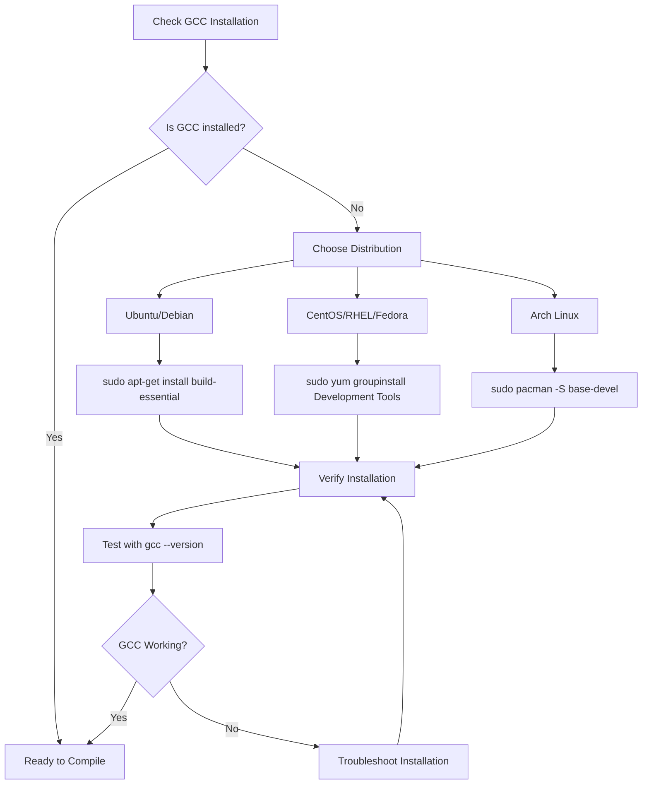
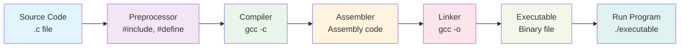
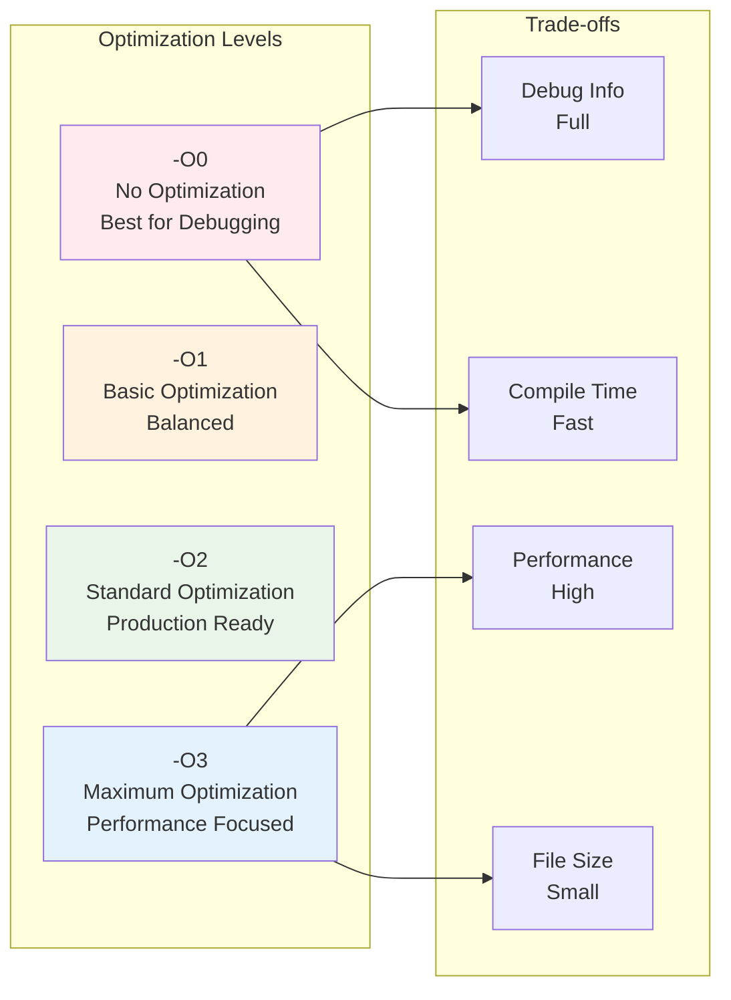
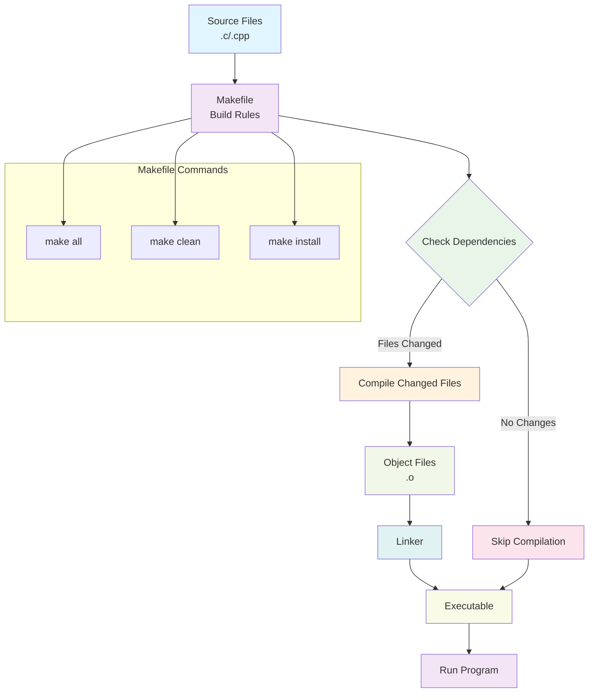

<script type="application/ld+json">
{
  "@context": "https://schema.org",
  "@type": "FAQPage",
  "mainEntity": [
    {
      "@type": "Question",
      "name": "Is GCC pre-installed on all Linux systems?",
      "acceptedAnswer": {
        "@type": "Answer",
        "text": "No, GCC is not pre-installed on many Linux systems including Ubuntu Server, Debian minimal installations, Docker containers, cloud instances, and minimal server distributions. Desktop distributions like Ubuntu Desktop and Fedora Desktop usually include GCC."
      }
    },
    {
      "@type": "Question",
      "name": "How do I check if GCC is installed on my Linux system?",
      "acceptedAnswer": {
        "@type": "Answer",
        "text": "Run the command 'which gcc' or 'gcc --version' in your terminal. If GCC is installed, you'll see the path and version information. If not installed, you'll see 'command not found'."
      }
    },
    {
      "@type": "Question",
      "name": "What's the difference between gcc and g++ compilers?",
      "acceptedAnswer": {
        "@type": "Answer",
        "text": "gcc is the GNU C compiler used for compiling C programs, while g++ is the GNU C++ compiler used for compiling C++ programs. Both are part of the GCC (GNU Compiler Collection) toolchain."
      }
    },
    {
      "@type": "Question",
      "name": "Why do I get 'Permission denied' error when running my compiled program?",
      "acceptedAnswer": {
        "@type": "Answer",
        "text": "Linux requires execute permission to run programs. Use 'chmod +x filename' to make your compiled program executable, then run it with './filename'."
      }
    },
    {
      "@type": "Question",
      "name": "What optimization flags should I use for production code?",
      "acceptedAnswer": {
        "@type": "Answer",
        "text": "Use -O2 for production code as it provides a good balance between performance and compilation time. Use -O0 for debugging and -O3 for maximum optimization when compile time is not a concern."
      }
    }
  ]
}
</script>

Learn how to compile and run C/C++ programs on Linux with this comprehensive guide. From installing GCC to advanced compilation techniques, this tutorial covers everything you need to start programming in C/C++ on Linux systems.

## Why GCC Installation is Needed

> 💡 **Important:** GCC is **not** pre-installed on many Linux systems including:
> - Ubuntu Server, Debian minimal installations
> - Docker containers (`ubuntu:latest`, `alpine:latest`)
> - Cloud instances (AWS, GCP, Azure)
> - Minimal server distributions

**GCC Availability by System:**
- ✅ **Usually included:** Ubuntu Desktop, Fedora Desktop
- ❌ **Usually missing:** Server installations, containers, cloud instances
- 🔍 **Check first:** Run `which gcc` to verify

**Choose Your Distribution:**
- 🟠 **Ubuntu/Debian:** Use `apt-get` commands
- 🔴 **CentOS/RHEL/Fedora:** Use `yum` or `dnf` commands
- 🔵 **Arch Linux:** Use `pacman` command



## Table of Contents
- [Why GCC Installation is Needed](#why-gcc-installation-is-needed)
- [Prerequisites](#prerequisites)
- [Installing GCC Compiler](#installing-gcc-compiler)
- [Compiling C Programs](#compiling-c-programs)
- [Compiling C++ Programs](#compiling-c-programs-1)
- [Advanced Compilation](#advanced-compilation)
- [Makefiles for Automated Builds](#makefiles-for-automated-builds)
- [Troubleshooting](#troubleshooting)
- [Quick Reference](#quick-reference)
- [Best Practices](#best-practices)
- [What's Next?](#whats-next)
- [Conclusion](#conclusion)
- [References & Further Reading](#references--further-reading)

## Prerequisites
- Ubuntu/Debian Linux system (or similar distribution)
- Terminal access with sudo privileges
- Basic understanding of C/C++ syntax
- Text editor (nano, vim, or gedit)

## Installing GCC Compiler

### Installation Progress
**Step 1 of 4:** Installing GCC Compiler ⏳

### Ubuntu/Debian
```shell
sudo apt-get update
sudo apt-get install build-essential manpages-dev
```

### CentOS/RHEL/Fedora
```shell
# CentOS/RHEL
sudo yum groupinstall "Development Tools"
# or for newer versions
sudo dnf groupinstall "Development Tools"

# Fedora
sudo dnf install gcc gcc-c++ make
```

### Arch Linux
```shell
sudo pacman -S base-devel
```

> ⚙️ **What's happening:** This downloads and installs the complete development toolchain (~200MB)

**What this installs:**
- `gcc` - GNU C compiler
- `g++` - GNU C++ compiler
- `make` - Build automation tool
- `libc6-dev` - C library development files
- Manual pages for system calls and library functions

### Verify Installation

**Step 2 of 4:** Verification ⏳

```shell
whereis gcc
which gcc
gcc --version
```

> 🔍 **Quick Check:** If any command shows "command not found", the installation failed

**Expected output:**
```
gcc: /usr/bin/gcc /usr/lib/gcc /usr/share/man/man1/gcc.1.gz
/usr/bin/gcc
gcc (Ubuntu 9.4.0-1ubuntu1~20.04.1) 9.4.0
```

```shell
whereis g++
which g++
g++ --version
```

**Expected output:**
```
g++: /usr/bin/g++ /usr/share/man/man1/g++.1.gz
/usr/bin/g++
g++ (Ubuntu 9.4.0-1ubuntu1~20.04.1) 9.4.0
```

## Compiling C Programs

**Step 3 of 4:** Your First C Program ⏳

> 🔥 **Let's Code:** Time to write and compile your first C program!

### Create Your First C Program

**helloWorld.c**

```c
#include <stdio.h>

int main(void)
{
    printf("Hello World !.\n");
    printf("This is 'C'. \n");
    return 0;
}
```

### Compile the C Program

**Compilation Checklist:**
- [ ] Source code saved as `helloWorld.c`
- [ ] Terminal open in correct directory
- [ ] Ready to compile

```shell
cc helloWorld.c -o helloWorld
```

**Alternative compilation methods:**
```shell
make helloWorld
# or
gcc helloWorld.c -o helloWorld
```

> ✅ **Success:** If no errors appear, compilation succeeded!

### Run the C Program

```shell
./helloWorld
```

**Expected output:**
```
Hello World !.
This is 'C'.
```



## Compiling C++ Programs

**Step 4 of 4:** Your First C++ Program ⏳

> 🎆 **Almost Done:** Let's try C++ compilation!

### Create Your First C++ Program

**helloWorld.cpp**

```cpp
#include <iostream>
using namespace std;

int main()
{
    cout << "Hello World! ";
    cout << "\n";
    cout << "I'm a C++ program";
    cout << "\n";
    return 0;
}
```

### Compile the C++ Program

```shell
g++ -o helloWorld helloWorld.cpp
```

**Alternative compilation:**
```shell
make helloWorld
```

### Run the C++ Program

```shell
./helloWorld
```

**Expected output:**
```
Hello World!
I'm a C++ program
```


## Advanced Compilation

> 🔴 **Advanced Level:** These techniques are for experienced developers

### Sections by Difficulty
- 🟢 **Beginner:** Basic compilation (above)
- 🟡 **Intermediate:** Debug flags and optimization
- 🔴 **Advanced:** Multiple files and libraries

### Debug Information and Warnings

> 🐛 **Debug Mode:** Essential for finding and fixing bugs

Generate debugging symbols and enable warnings:

```shell
cc -g -Wall helloWorld.c -o helloWorld
```

```shell
g++ -g -Wall helloWorld.cpp -o helloWorld
```

**Flags explained:**
- `-g` - Include debugging information for GDB
- `-Wall` - Enable all common warning messages

### Optimization Levels

> ⚠️ **Warning:** Don't use optimization while debugging - it makes debugging harder!

```shell
# No optimization (default) - Best for debugging
cc -O0 helloWorld.c -o helloWorld

# Standard optimization - Good balance
cc -O2 helloWorld.c -o helloWorld

# Maximum optimization - Fastest execution
cc -O3 helloWorld.c -o helloWorld
```

> 💡 **Pro Tip:** Use `-O2` for production code, `-O0` for debugging



### Compilation Flags Comparison

| Flag | Purpose | File Size | Performance | Debug Info |
|------|---------|-----------|-------------|------------|
| `-O0` | No optimization | Larger | Slower | Yes |
| `-O1` | Basic optimization | Medium | Faster | Partial |
| `-O2` | Standard optimization | Smaller | Much Faster | Limited |
| `-O3` | Maximum optimization | Smallest | Fastest | No |

### Linking External Libraries

Link math library using `-l` option:

```shell
cc program.c -o executable -lm
```

**Common libraries:**
- `-lm` - Math library
- `-lpthread` - POSIX threads
- `-lssl` - OpenSSL library

### Multiple Source Files

```shell
cc file1.c file2.c file3.c -o executable
```

```shell
g++ main.cpp utils.cpp helper.cpp -o my-program
```

## Makefiles for Automated Builds

> 🔨 **Build Automation:** Create Makefiles to automate compilation and manage dependencies

### Basic Makefile Example

**Makefile** (no file extension):

```makefile
# Simple Makefile for C/C++ projects
CC = gcc
CXX = g++
CFLAGS = -Wall -Wextra -g
CXXFLAGS = -Wall -Wextra -g -std=c++11

# Target executable names
TARGET_C = hello_c
TARGET_CPP = hello_cpp

# Source files
C_SOURCES = helloWorld.c
CPP_SOURCES = helloWorld.cpp

# Default target
all: $(TARGET_C) $(TARGET_CPP)

# Compile C program
$(TARGET_C): $(C_SOURCES)
	$(CC) $(CFLAGS) -o $@ $<

# Compile C++ program
$(TARGET_CPP): $(CPP_SOURCES)
	$(CXX) $(CXXFLAGS) -o $@ $<

# Clean compiled files
clean:
	rm -f $(TARGET_C) $(TARGET_CPP) *.o

# Install dependencies (example)
install:
	sudo apt-get install build-essential

# Show help
help:
	@echo "Available targets:"
	@echo "  all     - Build all programs"
	@echo "  clean   - Remove compiled files"
	@echo "  install - Install dependencies"
	@echo "  help    - Show this help"

.PHONY: all clean install help
```

### Using the Makefile

```shell
# Build all programs
make

# Build specific target
make hello_c

# Clean compiled files
make clean

# Show available targets
make help
```

### Advanced Makefile with Multiple Files

**Makefile for multi-file project:**

```makefile
# Advanced Makefile for C++ project
CXX = g++
CXXFLAGS = -Wall -Wextra -g -std=c++17
LDFLAGS = -lm

# Project name
TARGET = calculator

# Source files
SOURCES = main.cpp calculator.cpp utils.cpp
OBJECTS = $(SOURCES:.cpp=.o)

# Header files
HEADERS = calculator.h utils.h

# Default target
$(TARGET): $(OBJECTS)
	$(CXX) $(OBJECTS) -o $(TARGET) $(LDFLAGS)

# Compile object files
%.o: %.cpp $(HEADERS)
	$(CXX) $(CXXFLAGS) -c $< -o $@

# Clean
clean:
	rm -f $(OBJECTS) $(TARGET)

# Install
install: $(TARGET)
	sudo cp $(TARGET) /usr/local/bin/

.PHONY: clean install
```

### Makefile Best Practices

1. **Use variables** for compiler, flags, and targets
2. **Include .PHONY** for non-file targets
3. **Add help target** for documentation
4. **Use automatic variables** like `$@`, `$<`, `$^`
5. **Include dependency tracking** for header files



## Troubleshooting

> 🆘 **Help Section:** Solutions to common compilation problems

### Common Issues and Solutions

#### ❌ Error: "Permission denied"
**Solution:**
```shell
# Make file executable
chmod +x helloWorld
./helloWorld
```
> 🔧 **Why this works:** Linux requires execute permission to run programs

#### ❌ Error: "Missing libraries"
**Solution:**
```shell
# Install development libraries
sudo apt-get install libc6-dev
sudo apt-get install libstdc++-dev
```

#### ❌ Error: "Compilation errors"
**Solution:**
```shell
# Check for syntax errors with verbose output
gcc -v -Wall helloWorld.c -o helloWorld
```
> 🔍 **Debug tip:** The `-v` flag shows detailed compilation steps

#### ❌ Error: "gcc: command not found"
**Solution:**
```shell
# Verify GCC installation
which gcc
# If not found, reinstall
sudo apt-get install --reinstall build-essential
```
> 🔄 **Fresh start:** This reinstalls the entire toolchain

## Quick Reference

> 📝 **Cheat Sheet:** Bookmark this section for quick command lookup

| Command | Purpose |
|---------|---------|
| `gcc file.c -o output` | Compile C program |
| `g++ file.cpp -o output` | Compile C++ program |
| `./output` | Run executable |
| `gcc -g -Wall file.c -o output` | Compile with debug info |
| `gcc -O2 file.c -o output` | Compile with optimization |
| `gcc file.c -lm -o output` | Link math library |
| `make filename` | Auto-compile (no extension) |

## Best Practices

> ✨ **Pro Tips:** Follow these practices for better code quality

1. 📝 **Always use meaningful filenames** - `calculator.c` instead of `prog1.c`
2. ⚠️ **Enable warnings** - Use `-Wall` flag to catch potential issues
3. 📏 **Use consistent indentation** - 4 spaces or tabs
4. 💬 **Add comments** - Explain complex logic
5. 🔄 **Test incrementally** - Compile and test frequently

## What's Next?

> 🎆 **Congratulations!** You've completed the C/C++ Linux compilation tutorial

**Continue Your Learning Journey:**
- 🐛 Learn debugging with GDB debugger
- 🔨 Create Makefiles for automated builds
- 🚀 Explore C++ advanced features and best practices
- 💻 Set up integrated development environments (IDEs)

**Recommended IDEs & Editors:**
- **[VS Code](https://code.visualstudio.com/){:target="_blank" rel="noopener"}** - Lightweight with [C/C++ extensions](https://marketplace.visualstudio.com/items?itemName=ms-vscode.cpptools){:target="_blank" rel="noopener"}
- **[CLion](https://www.jetbrains.com/clion/){:target="_blank" rel="noopener"}** - Full-featured JetBrains IDE
- **[Code::Blocks](https://www.codeblocks.org/){:target="_blank" rel="noopener"}** - Free, cross-platform IDE
- **[Vim](https://www.vim.org/){:target="_blank" rel="noopener"}/[Neovim](https://neovim.io/){:target="_blank" rel="noopener"}** - Terminal-based editor for advanced users
- **[Eclipse CDT](https://www.eclipse.org/cdt/){:target="_blank" rel="noopener"}** - Eclipse-based C/C++ development

**Time Investment Summary:**
- ✅ Installation: 5 minutes
- ✅ First C program: 10 minutes
- ✅ First C++ program: 5 minutes
- ✅ Advanced concepts: 10 minutes

## Conclusion

🎉 **Congratulations!** You've successfully completed this comprehensive guide to compiling and running C/C++ programs on Linux.

### 🎯 **What You've Accomplished:**

✅ **GCC Installation & Setup**
- Installed GCC compiler on your Linux distribution
- Verified installation with version checks
- Understood system-specific installation methods

✅ **Basic Compilation Skills**
- Compiled your first C program with `gcc`
- Compiled your first C++ program with `g++`
- Learned to run compiled executables

✅ **Advanced Compilation Techniques**
- Used debugging flags (`-g`, `-Wall`)
- Applied optimization levels (`-O0`, `-O2`, `-O3`)
- Linked external libraries (`-lm`, `-lpthread`)
- Compiled multi-file projects

✅ **Build Automation**
- Created and used Makefiles
- Automated compilation workflows
- Managed project dependencies

✅ **Troubleshooting Expertise**
- Resolved common compilation errors
- Fixed permission and library issues
- Debugged installation problems

### 🚀 **Your Next Steps:**

1. **Practice Regularly** - Compile programs daily to build confidence
2. **Explore Advanced Features** - Experiment with different compiler flags
3. **Build Real Projects** - Apply these skills to actual software development
4. **Learn Debugging** - Master GDB for advanced troubleshooting
5. **Contribute to Open Source** - Use these skills in real-world projects

### 💡 **Key Takeaways:**

- **GCC is powerful** - Learn to leverage its full potential
- **Makefiles save time** - Automate repetitive compilation tasks
- **Debugging is essential** - Always compile with `-g` during development
- **Optimization matters** - Use appropriate `-O` flags for production code
- **Linux is developer-friendly** - The command line is your friend

Remember: **The best way to learn is by doing**. Start with simple programs, gradually increase complexity, and don't hesitate to experiment with different compilation options. Every error you encounter is a learning opportunity!

---

**Ready to take your C/C++ skills to the next level?** Check out our other programming tutorials and start building amazing software on Linux! 🐧💻

## References & Further Reading

**Official Documentation:**
- [GCC Manual](https://gcc.gnu.org/onlinedocs/){:target="_blank" rel="noopener"} - Complete GCC documentation
- [GNU Make Manual](https://www.gnu.org/software/make/manual/){:target="_blank" rel="noopener"} - Build automation guide
- [GDB Manual](https://www.gnu.org/software/gdb/documentation/){:target="_blank" rel="noopener"} - Debugging with GDB

**C/C++ Standards:**
- [C Standard (ISO/IEC 9899)](https://www.iso.org/standard/74528.html){:target="_blank" rel="noopener"} - Current C standard (C18)
- [C++20 Standard](https://isocpp.org/std/the-standard){:target="_blank" rel="noopener"} - Modern C++ features
- [cppreference.com](https://en.cppreference.com/){:target="_blank" rel="noopener"} - Comprehensive C/C++ reference

**Learning Resources:**
- [Learn C](https://www.learn-c.org/){:target="_blank" rel="noopener"} - Interactive C tutorial
- [C++ Tutorial](https://www.cplusplus.com/doc/tutorial/){:target="_blank" rel="noopener"} - Comprehensive C++ guide
- [Linux Command Line](https://linuxcommand.org/){:target="_blank" rel="noopener"} - Terminal basics

**Practice Projects:**
- **[C-kide](https://github.com/sagarnikam123/C-kide){:target="_blank" rel="noopener"}** - Collection of 30+ fun C programs (developed during my college days) perfect for practicing compilation and learning C concepts

**Community & Support:**
- [Stack Overflow C](https://stackoverflow.com/questions/tagged/c){:target="_blank" rel="noopener"} - Q&A community
- [Stack Overflow C++](https://stackoverflow.com/questions/tagged/c%2b%2b){:target="_blank" rel="noopener"} - C++ discussions
- [r/C_Programming](https://reddit.com/r/C_Programming){:target="_blank" rel="noopener"} - Reddit community
- [r/cpp](https://reddit.com/r/cpp){:target="_blank" rel="noopener"} - C++ Reddit community

---

> 💬 **Found this tutorial helpful?** Share it with fellow developers and check out our other [programming tutorials](https://sagarnikam123.github.io/categories/programming/).
