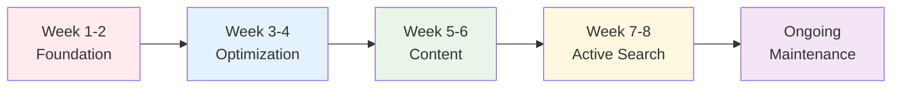

**Finding jobs online** requires more than just uploading your resume to job boards. This comprehensive guide reveals proven strategies used by successful job seekers to land their dream roles through digital channels.

**What you'll learn:**
- LinkedIn optimization techniques that get recruiter attention
- GitHub portfolio strategies that showcase your skills
- ATS-friendly resume formatting that passes automated screening
- Email templates for networking and follow-ups
- Industry-specific job search tactics
- Free tools and resources for professional branding

## Table of Contents

1. [Building Your Online Job Search Strategy](#building-your-online-job-search-strategy)
2. [Job Search Timeline & Checklist](#job-search-timeline--checklist)
3. [Top Job Search Platforms for Online Applications](#top-job-search-platforms-for-online-applications)
4. [LinkedIn Optimization for Job Search](#linkedin-optimization-for-job-search)
5. [GitHub Portfolio Development](#github-portfolio-development)
6. [Professional Website and Portfolio](#professional-website-and-portfolio)
7. [Content Creation for Professional Branding](#content-creation-for-professional-branding)
8. [Technical Community Engagement](#technical-community-engagement)
9. [Professional Development Platforms](#professional-development-platforms)
10. [Resume Optimization for Online Job Applications](#resume-optimization-for-online-job-applications)
11. [Free Tools for Creating Professional Resumes](#free-tools-for-creating-professional-resumes)
12. [Resume Design Best Practices](#resume-design-best-practices-for-online-applications)
13. [Email Templates for Job Search](#email-templates-for-job-search)
14. [Industry-Specific Job Search Strategies](#industry-specific-job-search-strategies)
15. [Advanced Online Job Search Strategies](#advanced-online-job-search-strategies)
16. [Frequently Asked Questions (FAQ)](#frequently-asked-questions-faq)
17. [Key Takeaways](#key-takeaways)
18. [Conclusion](#conclusion)

## Building Your Online Job Search Strategy

Modern job searching extends far beyond traditional applications. Recruiters now evaluate candidates across multiple digital platforms, examining your GitHub contributions, personal website, and professional social media presence. They seek candidates who demonstrate continuous learning, authentic engagement, and proven skills.

## Job Search Timeline & Checklist



### Week 1-2: Foundation Setup
- [ ] Audit current online presence (Google yourself)
- [ ] Update LinkedIn profile with professional photo and compelling headline
- [ ] Create/update GitHub profile with pinned repositories
- [ ] Set up professional email address (firstname.lastname@domain.com)
- [ ] Create master resume document with all experiences

### Week 3-4: Platform Optimization
- [ ] Complete LinkedIn profile (summary, experience, skills, recommendations)
- [ ] Upload 3-5 quality projects to GitHub with detailed README files
- [ ] Create personal website/portfolio
  - [ ] Create personal website/portfolio (see guide: [Install Jekyll locally]())
- [ ] Join relevant professional communities and groups
- [ ] Start following target companies and industry leaders

### Week 5-6: Content Creation
- [ ] Write first technical blog post or case study
- [ ] Share professional insights on LinkedIn (2-3 posts/week)
- [ ] Contribute to Stack Overflow or relevant forums
- [ ] Create project demo videos or tutorials
- [ ] Update resume for ATS optimization

### Week 7-8: Active Job Search
- [ ] Apply to 5-10 relevant positions weekly
- [ ] Customize resume and cover letter for each application
- [ ] Track applications in spreadsheet or job tracking tool
- [ ] Network with professionals in target companies
- [ ] Practice interview skills with mock interviews

### Ongoing Maintenance
- [ ] Post valuable content regularly (2-3 times/week)
- [ ] Engage with your professional network
- [ ] Update skills and certifications
- [ ] Monitor and respond to messages/opportunities
- [ ] Analyze and improve job search strategy based on results

## Top Job Search Platforms for Online Applications

### Modern Job Platforms

- **Traditional Sites:** [Indeed](https://indeed.com){:target="_blank" rel="noopener"}, [Glassdoor](https://glassdoor.com){:target="_blank" rel="noopener"}, [LinkedIn Jobs](https://linkedin.com/jobs){:target="_blank" rel="noopener"}
- **Tech-Focused:** [AngelList (Wellfound)](https://wellfound.com){:target="_blank" rel="noopener"}, [Dice](https://dice.com){:target="_blank" rel="noopener"}
- **Remote Work:** [Remote.co](https://remote.co){:target="_blank" rel="noopener"}, [We Work Remotely](https://weworkremotely.com){:target="_blank" rel="noopener"}, [FlexJobs](https://flexjobs.com){:target="_blank" rel="noopener"}, [Remotive](https://remotive.io){:target="_blank" rel="noopener"}
- **Freelance:** [Upwork](https://upwork.com){:target="_blank" rel="noopener"}, [Toptal](https://toptal.com){:target="_blank" rel="noopener"}, [Freelancer](https://freelancer.com){:target="_blank" rel="noopener"}

Complete all profile sections including projects, certifications, and relevant coursework.

### LinkedIn Optimization for Job Search

[LinkedIn](https://www.linkedin.com/){:target="_blank" rel="noopener"} remains the most important platform for online job hunting. Optimize your profile with these strategies:

**Profile Optimization Checklist:**
- [ ] Professional headshot (high-quality, business appropriate)
- [ ] Compelling headline with keywords (not just job title)
- [ ] Detailed summary highlighting achievements and value proposition
- [ ] Complete work experience with quantified results
- [ ] Skills section with endorsements from colleagues
- [ ] Recommendations from supervisors and peers
- [ ] Education, certifications, and relevant coursework
- [ ] Volunteer experience and professional interests

**LinkedIn Headline Examples:**
- ❌ "Software Developer at XYZ Company"
- ✅ "Full-Stack Developer | React & Node.js Expert | Building Scalable Web Applications"
- ❌ "Marketing Manager"
- ✅ "Digital Marketing Manager | SEO & PPC Specialist | Driving 40% Revenue Growth"

**Networking Strategy:**
- Connect with colleagues, alumni, and industry professionals
- Send personalized connection requests with context
- Engage with posts through meaningful comments
- Share valuable industry insights and personal achievements
- Follow target companies and engage with their content

### GitHub Portfolio Development

[GitHub](https://github.com/){:target="_blank" rel="noopener"} serves as your technical portfolio and demonstrates coding skills to potential employers:

**GitHub Profile Optimization:**
- [ ] Professional profile picture and bio
- [ ] Pinned repositories showcasing best work
- [ ] Consistent commit history showing regular activity
- [ ] Clear repository names and descriptions
- [ ] Comprehensive README files for each project

**Project Portfolio Ideas by Skill Level:**

**Beginner Projects:**
- Personal portfolio website
- Todo list application
- Weather app using APIs
- Simple calculator or converter
- Basic CRUD application

**Intermediate Projects:**
- E-commerce website with payment integration
- Social media dashboard
- Data visualization tool
- Mobile app with backend API
- Automated testing suite

**Advanced Projects:**
- Microservices architecture
- Machine learning model deployment
- Real-time chat application
- DevOps pipeline automation
- Open source contribution to popular projects

**README Template Structure:**
```markdown
# Project Name

## Description
Brief overview of what the project does and why it's useful.

## Technologies Used
- Frontend: React, CSS3, HTML5
- Backend: Node.js, Express
- Database: MongoDB
- Deployment: Heroku

## Features
- User authentication
- Real-time updates
- Responsive design
- API integration

## Installation
Step-by-step instructions to run locally

## Demo
[Live Demo Link] | [Video Walkthrough]

## Screenshots
[Include 2-3 key screenshots]

## Future Improvements
- Feature additions planned
- Performance optimizations
```

### Professional Networking Through Meetups

[Meetup](https://www.meetup.com/){:target="_blank" rel="noopener"} provides valuable face-to-face networking opportunities for job seekers:

- Connect directly with industry professionals and gain insights from their experiences
- Join technology-focused and industry-specific groups in your local area
- Attend weekend events (typically Saturday/Sunday) that are usually free to join
- Build relationships that can lead to job referrals and career opportunities

### Professional Social Media Presence

[Twitter/X](https://twitter.com/){:target="_blank" rel="noopener"} helps build your professional brand and industry connections:

- Follow and engage with industry leaders, target companies, and thought leaders
- Share valuable insights about technologies, trends, and professional development
- Participate in relevant tech community discussions and Twitter chats
- Use professional language and maintain a consistent brand voice

### Professional Website and Portfolio

A personal website establishes your online presence and showcases your expertise:

**Essential Website Sections:**
- [ ] Hero section with clear value proposition
- [ ] About page with professional story
- [ ] Portfolio/projects showcase with case studies
- [ ] Skills and technologies section
- [ ] Contact information and social links
- [ ] Blog/articles section (optional but recommended)
- [ ] Resume/CV download link

**Portfolio Case Study Template:**
```
# Project Name

## Challenge
What problem were you solving?

## Solution
How did you approach the problem?

## Technologies
What tools and technologies did you use?

## Results
What was the outcome? Include metrics if possible.

## Lessons Learned
What did you learn from this project?

## Links
- [Live Demo]
- [GitHub Repository]
- [Additional Resources]
```

**Website Performance Checklist:**
- [ ] Mobile-responsive design
- [ ] Fast loading times (< 3 seconds)
- [ ] SEO-optimized meta tags
- [ ] Professional domain name
- [ ] SSL certificate (HTTPS)
- [ ] Contact form functionality
- [ ] Analytics tracking (Google Analytics)
- [ ] Regular content updates

### Academic and Research Networking

[ResearchGate](https://www.researchgate.net/){:target="_blank" rel="noopener"} is essential for academic and research-focused career paths:

- Share your research publications and academic achievements
- Connect with researchers and academics in your field
- Stay updated on latest research developments and opportunities

### Technical Community Engagement

[Stack Overflow](https://stackoverflow.com/){:target="_blank" rel="noopener"} demonstrates your technical expertise to potential employers:

- Ask well-researched technical questions and provide comprehensive answers
- Build your reputation score through consistent, valuable contributions
- Showcase problem-solving abilities and depth of technical knowledge
- Include your Stack Overflow profile link on your resume and LinkedIn

### Content Creation for Professional Branding

[YouTube](https://www.youtube.com/){:target="_blank" rel="noopener"} and content creation help establish thought leadership:

- Produce technical tutorials, project demonstrations, and coding walkthroughs
- Use professional tools: [OBS Studio](https://obsproject.com){:target="_blank" rel="noopener"}, [Loom](https://loom.com){:target="_blank" rel="noopener"}, or built-in screen recording
- Create short-form content for [Instagram](https://instagram.com){:target="_blank" rel="noopener"} Reels and YouTube Shorts
- Engage actively with your audience through comments and community building
- Consistency in content creation builds authority and attracts potential employers

### Knowledge Sharing and Thought Leadership

[Quora](https://www.quora.com/){:target="_blank" rel="noopener"} allows you to demonstrate expertise and build professional authority:

- Follow technical topics: [Java](https://www.quora.com/topic/Java-programming-language){:target="_blank" rel="noopener"}, [Python](https://www.quora.com/topic/Python-programming-language-1){:target="_blank" rel="noopener"}, [JavaScript](https://www.quora.com/topic/JavaScript-programming-language){:target="_blank" rel="noopener"}, [Docker](https://www.quora.com/topic/Docker-software){:target="_blank" rel="noopener"}
- Engage with career-focused topics: [Software Engineering](https://www.quora.com/topic/Software-Engineering){:target="_blank" rel="noopener"}, [Data Science](https://www.quora.com/topic/Data-Science){:target="_blank" rel="noopener"}, [Machine Learning](https://www.quora.com/topic/Machine-Learning){:target="_blank" rel="noopener"}, [Web Development](https://www.quora.com/topic/Web-Development){:target="_blank" rel="noopener"}
- Explore emerging technologies: [Artificial Intelligence](https://www.quora.com/topic/Artificial-Intelligence){:target="_blank" rel="noopener"}, [DevOps](https://www.quora.com/topic/DevOps){:target="_blank" rel="noopener"}, [Web3](https://www.quora.com/topic/Web3){:target="_blank" rel="noopener"}, [Blockchain](https://www.quora.com/topic/Blockchain){:target="_blank" rel="noopener"}, [Cloud Computing](https://www.quora.com/topic/Cloud-Computing){:target="_blank" rel="noopener"}
- Provide detailed, helpful answers that showcase your knowledge and communication skills
- Ask insightful questions that demonstrate your curiosity and learning mindset

### Coding Skills Development and Demonstration

Online coding challenges and hackathons prove your technical abilities to employers:

- Regular practice on coding platforms builds confidence and improves problem-solving skills
- Participate in hackathons on [HackerEarth](https://hackerearth.com){:target="_blank" rel="noopener"} and [HackerRank](https://hackerrank.com){:target="_blank" rel="noopener"} for direct recruiter exposure
- Many companies use these platforms for technical screening and recruitment
- Explore platforms like [LeetCode](https://leetcode.com){:target="_blank" rel="noopener"}, [Codewars](https://codewars.com){:target="_blank" rel="noopener"}, and [Codecademy](https://codecademy.com){:target="_blank" rel="noopener"} for skill development (see our guide: [])

### Continuous Learning and Skill Development

Online courses help you stay competitive in the job market:

- Focus on job-relevant skills: programming languages, data analysis, digital marketing, UX design
- Complete courses through video tutorials, hands-on projects, and practical exercises
- Many free courses offer the same quality content as paid alternatives
- Display completed certifications on your LinkedIn profile and resume

### Professional Development Platforms

Choose the right learning platform based on your career goals and budget:

- **Free Options:** [freeCodeCamp](https://freecodecamp.org){:target="_blank" rel="noopener"}, [Coursera](https://coursera.org){:target="_blank" rel="noopener"} (audit mode), [edX](https://edx.org){:target="_blank" rel="noopener"}, [Khan Academy](https://khanacademy.org){:target="_blank" rel="noopener"}
- **Premium Platforms:** [Pluralsight](https://pluralsight.com){:target="_blank" rel="noopener"}, [Udemy](https://udemy.com){:target="_blank" rel="noopener"}, [LinkedIn Learning](https://linkedin.com/learning){:target="_blank" rel="noopener"}, [Skillshare](https://skillshare.com){:target="_blank" rel="noopener"}
- **Interactive Coding:** [Codecademy](https://codecademy.com){:target="_blank" rel="noopener"}, [LeetCode](https://leetcode.com){:target="_blank" rel="noopener"}, [HackerRank](https://hackerrank.com){:target="_blank" rel="noopener"}, [Codewars](https://codewars.com){:target="_blank" rel="noopener"}
- Always add completed certifications to your LinkedIn profile and resume for credibility

### Technical Writing and Thought Leadership

Technical blogging establishes your expertise and attracts potential employers:

- **Publishing Platforms:** [Medium](https://medium.com){:target="_blank" rel="noopener"}, [Dev.to](https://dev.to){:target="_blank" rel="noopener"}, [Hashnode](https://hashnode.com){:target="_blank" rel="noopener"}, or your personal website
- Write about completed projects, learning journeys, and technical problem-solving
- Create tutorials, code reviews, and industry analysis articles
- Consistent, high-quality content builds professional authority and search engine visibility
- Share your articles on LinkedIn and Twitter to expand your professional reach

### Online Professional Communities

Active participation in professional communities increases your visibility to potential employers:

- **Chat Communities:** Join Discord servers and Slack workspaces focused on your technology stack
- **Reddit Engagement:** Contribute valuable content to subreddits like [r/programming](https://reddit.com/r/programming){:target="_blank" rel="noopener"} and [r/webdev](https://reddit.com/r/webdev){:target="_blank" rel="noopener"}
- **[Indie Hackers](https://indiehackers.com){:target="_blank" rel="noopener"}:** Perfect for entrepreneurial developers and startup-focused professionals
- **[Product Hunt](https://producthunt.com){:target="_blank" rel="noopener"}:** Launch your projects and discover trending tools in your industry
- Maintain professional communication and provide helpful insights to build your reputation

## Resume Optimization for Online Job Applications

### What to Avoid in Modern Resumes

Avoid these outdated resume elements that can hurt your online job search:

- Generic objective statements (replace with compelling professional summaries)
- Declaration and signature sections (unnecessary for digital applications)
- Personal photos (unless specifically required by industry or region)
- Irrelevant personal details (age, marital status, personal interests unrelated to the job)
- Unprofessional email addresses (use firstname.lastname@domain.com format)
- References section (provide separately when requested by employers)

### Essential Elements for Online Job Applications

Include these critical components in your resume for successful online job hunting:

**Resume Structure Template:**

```
[Your Name]
[Professional Title] | [City, State] | [Email] | [Phone]
[LinkedIn URL] | [GitHub URL] | [Portfolio URL]

PROFESSIONAL SUMMARY
[2-3 lines highlighting key achievements and value proposition]

TECHNICAL SKILLS
• Programming Languages: [List relevant languages]
• Frameworks & Libraries: [List frameworks]
• Tools & Technologies: [List tools]
• Databases: [List database experience]

PROFESSIONAL EXPERIENCE
[Job Title] | [Company Name] | [Dates]
• [Achievement with quantified result]
• [Achievement with quantified result]
• [Achievement with quantified result]

KEY PROJECTS
[Project Name] | [Technologies Used] | [GitHub Link]
• [Brief description and impact]

EDUCATION & CERTIFICATIONS
[Degree] | [Institution] | [Year]
[Certification] | [Issuing Organization] | [Year]
```

**Professional Summary Examples:**

**Software Developer:**
"Full-stack developer with 3+ years building scalable web applications using React and Node.js. Increased application performance by 40% and led development of features serving 10K+ daily users."

**Digital Marketer:**
"Results-driven digital marketer with expertise in SEO and PPC campaigns. Generated $2M+ in revenue through data-driven strategies and improved conversion rates by 35% across multiple channels."

**Data Analyst:**
"Data analyst with 2+ years experience in Python and SQL. Built automated reporting systems that reduced manual work by 60% and provided insights driving $500K+ cost savings."

**Quantified Achievement Examples:**
- "Increased website traffic by 150% through SEO optimization"
- "Reduced application load time from 5s to 1.2s through code optimization"
- "Led team of 5 developers to deliver project 2 weeks ahead of schedule"
- "Improved customer satisfaction scores from 3.2 to 4.7 out of 5"
- "Generated $100K+ in additional revenue through A/B testing initiatives"

## Free Tools for Creating Professional Resumes

### Resume Building Platforms

These free tools help create professional resumes optimized for online job applications:

- **[Canva](https://canva.com){:target="_blank" rel="noopener"}:** Professional templates with intuitive drag-and-drop editor
- **[Resume.io](https://resume.io){:target="_blank" rel="noopener"}:** ATS-friendly templates with free tier options
- **[Google Docs](https://docs.google.com/document/u/0/){:target="_blank" rel="noopener"}:** Free templates with easy collaboration and sharing features
- **[Novoresume](https://novoresume.com){:target="_blank" rel="noopener"}:** Clean, modern designs with limited free version
- **[Zety](https://zety.com){:target="_blank" rel="noopener"}:** Professional layouts with free download (includes watermark)
- **[Enhancv](https://enhancv.com){:target="_blank" rel="noopener"}:** Creative templates for standing out in competitive job markets
- **[Kickresume](https://kickresume.com){:target="_blank" rel="noopener"}:** AI-powered suggestions with free template options

### AI-Powered Resume Optimization Tools

Leverage these free AI tools to improve your resume for online job applications:

- **[ChatGPT](https://chat.openai.com){:target="_blank" rel="noopener"}/[Claude](https://claude.ai){:target="_blank" rel="noopener"}:** Upload your resume for comprehensive feedback and improvement suggestions
- **[Grammarly](https://grammarly.com){:target="_blank" rel="noopener"}:** Advanced grammar checking, tone analysis, and clarity improvements
- **[Resume Worded](https://resumeworded.com){:target="_blank" rel="noopener"}:** Free ATS compatibility scan with actionable optimization recommendations
- **[Hemingway Editor](https://hemingwayapp.com){:target="_blank" rel="noopener"}:** Readability analysis and conciseness improvements for better impact
- **[LanguageTool](https://languagetool.org){:target="_blank" rel="noopener"}:** Comprehensive grammar and style checking across multiple languages
- **[Readable](https://readable.com){:target="_blank" rel="noopener"}:** Detailed readability analysis with suggestions for clearer communication

**AI Prompts for Resume Optimization:**

**For ChatGPT/Claude:**
```
"Please review my resume and provide specific feedback on:
1. Professional summary effectiveness
2. Achievement quantification opportunities
3. ATS keyword optimization
4. Overall structure and formatting
5. Industry-specific improvements

[Paste your resume here]"
```

**For Cover Letter Writing:**
```
"Help me write a compelling cover letter for [Job Title] at [Company Name].
Key requirements from job posting: [List 3-4 key requirements]
My relevant experience: [Brief summary]
Company information I know: [What you know about the company]"
```

**For LinkedIn Summary:**
```
"Create a professional LinkedIn summary for a [Your Role] with [X years] experience in [Industry].
Key achievements: [List 2-3 major achievements]
Target audience: [Recruiters/Hiring managers in specific industry]
Tone: Professional but approachable"
```

## Resume Design Best Practices for Online Applications

### Professional Resume Formatting Guidelines

Follow these design principles to create resumes that perform well in online job searches:

- **Optimal Length:** Keep to 1-2 pages maximum, prioritizing most relevant and recent content
- **ATS-Compatible Format:** Use clean, consistent formatting that Applicant Tracking Systems can easily parse
- **Professional Color Scheme:** Choose colors from professional palettes ([Coolors](https://coolors.co/palettes/trending){:target="_blank" rel="noopener"}, [Adobe Color](https://color.adobe.com){:target="_blank" rel="noopener"}) with good contrast for accessibility
- **File Format:** Submit as PDF to preserve formatting across different systems and devices
- **Readable Typography:** Use professional fonts like Arial, Calibri, or modern sans-serif alternatives
- **Mobile Optimization:** Ensure your resume displays correctly on smartphones and tablets
- **Consistent Spacing:** Maintain uniform margins, line spacing, and section breaks throughout

## Email Templates for Job Search

### Networking Email Template
```
Subject: [Mutual Connection/Company Interest] - Brief Introduction

Hi [Name],

I hope this message finds you well. I came across your profile through [source] and was impressed by your work at [Company] in [specific area].

I'm currently exploring opportunities in [field/role] and would love to learn more about your experience at [Company]. Would you be open to a brief 15-minute coffee chat or phone call?

I'd be happy to share my background and discuss how I might contribute to teams like yours.

Best regards,
[Your Name]
[LinkedIn Profile]
[Portfolio Website]
```

### Follow-up After Application Template
```
Subject: Following up on [Position Title] Application

Dear [Hiring Manager Name],

I wanted to follow up on my application for the [Position Title] role submitted on [Date]. I'm very excited about the opportunity to contribute to [Company Name]'s [specific project/goal].

Since applying, I've [relevant recent achievement/project]. I believe my experience in [relevant skill] would be valuable for your team.

I'd welcome the opportunity to discuss how I can contribute to [Company Name]. Thank you for your consideration.

Best regards,
[Your Name]
```

### Thank You Email After Interview Template
```
Subject: Thank you - [Position Title] Interview

Dear [Interviewer Name],

Thank you for taking the time to speak with me about the [Position Title] role. I enjoyed our conversation about [specific topic discussed] and learning more about [Company Name]'s approach to [relevant area].

Our discussion reinforced my enthusiasm for this opportunity. I'm particularly excited about [specific aspect of role/company] and how my experience with [relevant skill/project] could contribute to your team's success.

Please let me know if you need any additional information. I look forward to hearing about next steps.

Best regards,
[Your Name]
```

## Industry-Specific Job Search Strategies

### Technology & Software Development
- **Key Platforms:** GitHub, Stack Overflow, AngelList, Dice
- **Portfolio Focus:** Live projects, clean code, documentation
- **Skills to Highlight:** Programming languages, frameworks, problem-solving
- **Networking:** Tech meetups, hackathons, open source contributions

### Digital Marketing & Growth
- **Key Platforms:** LinkedIn, Twitter, marketing communities
- **Portfolio Focus:** Campaign results, analytics, case studies
- **Skills to Highlight:** ROI metrics, tool proficiency, creative campaigns
- **Networking:** Marketing conferences, LinkedIn groups, industry blogs

### Design & Creative
- **Key Platforms:** Dribbble, Behance, LinkedIn, Instagram
- **Portfolio Focus:** Visual projects, design process, client work
- **Skills to Highlight:** Design tools, user experience, creative thinking
- **Networking:** Design communities, creative meetups, online challenges

### Data Science & Analytics
- **Key Platforms:** Kaggle, GitHub, LinkedIn, Stack Overflow
- **Portfolio Focus:** Data projects, visualizations, machine learning models
- **Skills to Highlight:** Statistical analysis, programming, business insights
- **Networking:** Data science meetups, online competitions, research communities

### Sales & Business Development
- **Key Platforms:** LinkedIn, industry-specific job boards
- **Portfolio Focus:** Sales achievements, client testimonials, revenue growth
- **Skills to Highlight:** Relationship building, negotiation, market knowledge
- **Networking:** Industry events, LinkedIn outreach, professional associations

## Advanced Online Job Search Strategies

### Professional Job Search Management

Implement these advanced strategies to maximize your online job search success:

**Application Tracking Template (Spreadsheet Columns):**
- Company Name
- Position Title
- Application Date
- Job Posting URL
- Contact Person
- Application Status
- Interview Dates
- Follow-up Actions
- Notes/Feedback
- Salary Range
- Decision Deadline

**Interview Preparation Checklist:**

**Technical Interviews:**
- [ ] Review common algorithms and data structures
- [ ] Practice coding problems on [LeetCode](https://leetcode.com){:target="_blank" rel="noopener"}
- [ ] Prepare system design examples
- [ ] Review your projects in detail
- [ ] Practice explaining technical concepts simply

**Behavioral Interviews:**
- [ ] Prepare STAR method examples (Situation, Task, Action, Result)
- [ ] Research company culture and values
- [ ] Prepare questions about the role and team
- [ ] Practice salary negotiation scenarios
- [ ] Review common behavioral questions

**Video Interview Setup:**
- [ ] Test camera angle and lighting
- [ ] Check audio quality and internet connection
- [ ] Prepare professional background
- [ ] Have backup communication method ready
- [ ] Test screen sharing functionality

**Professional Communication Standards:**
- **Email Format:** firstname.lastname@gmail.com
- **Phone Setup:** Professional voicemail greeting
- **Response Time:** Within 24 hours for important messages
- **Tone:** Professional but personable
- **Consistency:** Same information across all platforms

**Digital Footprint Audit:**
- [ ] Google your name and review first 3 pages of results
- [ ] Check privacy settings on personal social media
- [ ] Remove or hide unprofessional content
- [ ] Create professional social media presence
- [ ] Monitor online reputation regularly

### Job Search Metrics to Track

**Application Metrics:**
- Applications submitted per week
- Response rate (callbacks/interviews per application)
- Interview-to-offer conversion rate
- Time from application to response

**Network Growth:**
- LinkedIn connections added monthly
- Professional events attended
- Informational interviews conducted
- Referrals received

**Content Performance:**
- Blog post views and engagement
- LinkedIn post reach and comments
- GitHub repository stars and forks
- Portfolio website traffic

### Common Job Search Mistakes to Avoid

- **Generic Applications:** Sending the same resume to every job
- **Incomplete Profiles:** Leaving LinkedIn or GitHub profiles half-finished
- **Poor Follow-up:** Not following up after applications or interviews
- **Neglecting Networking:** Focusing only on online applications
- **Inconsistent Branding:** Different information across platforms
- **Ignoring Company Culture:** Not researching company values and culture
- **Weak Online Presence:** Having no professional content or engagement
- **Unprofessional Communication:** Using casual language in professional emails

## Frequently Asked Questions (FAQ)

<script type="application/ld+json">
{
  "@context": "https://schema.org",
  "@type": "FAQPage",
  "mainEntity": [
    {
      "@type": "Question",
      "name": "How long does it take to find a job online?",
      "acceptedAnswer": {
        "@type": "Answer",
        "text": "The average online job search takes 3-6 months, but this varies by industry, experience level, and market conditions. Tech professionals often find roles in 2-4 months, while specialized positions may take longer. Consistent daily effort and a strong digital presence can significantly reduce this timeline."
      }
    },
    {
      "@type": "Question",
      "name": "What's the best job search platform for remote work?",
      "acceptedAnswer": {
        "@type": "Answer",
        "text": "Remote.co, We Work Remotely, and FlexJobs are the top platforms for remote positions. LinkedIn also has excellent remote job filters. Focus on companies with established remote cultures for better success rates."
      }
    },
    {
      "@type": "Question",
      "name": "How many jobs should I apply to per week?",
      "acceptedAnswer": {
        "@type": "Answer",
        "text": "Quality over quantity is key. Apply to 5-10 carefully selected positions weekly rather than mass-applying to 50+ jobs. Customize each application, research the company, and ensure you meet 70%+ of the requirements for better response rates."
      }
    },
    {
      "@type": "Question",
      "name": "Should I include a photo on my resume?",
      "acceptedAnswer": {
        "@type": "Answer",
        "text": "In most countries (US, UK, Canada, Australia), avoid photos on resumes due to anti-discrimination laws. However, some European countries and creative industries may expect photos. When in doubt, omit the photo and let your skills speak for yourself."
      }
    },
    {
      "@type": "Question",
      "name": "How do I optimize my LinkedIn profile for job searching?",
      "acceptedAnswer": {
        "@type": "Answer",
        "text": "Use a professional headshot, write a keyword-rich headline, craft a compelling summary with achievements, complete all sections, get recommendations, and post valuable content regularly. Turn on 'Open to Work' settings and engage with your network consistently."
      }
    },
    {
      "@type": "Question",
      "name": "What's an ATS-friendly resume format?",
      "acceptedAnswer": {
        "@type": "Answer",
        "text": "Use simple formatting with clear headings, standard fonts (Arial, Calibri), bullet points, and avoid graphics, tables, or complex layouts. Include relevant keywords from job descriptions, use standard section titles, and save as both PDF and Word formats."
      }
    },
    {
      "@type": "Question",
      "name": "How important is a personal website for job searching?",
      "acceptedAnswer": {
        "@type": "Answer",
        "text": "A personal website is increasingly important, especially for tech, creative, and marketing roles. It showcases your work, demonstrates technical skills, and provides a professional online presence. Even a simple portfolio site can set you apart from other candidates."
      }
    },
    {
      "@type": "Question",
      "name": "Should I follow up after submitting an application?",
      "acceptedAnswer": {
        "@type": "Answer",
        "text": "Yes, follow up 1-2 weeks after applying if you haven't heard back. Send a brief, professional email reiterating your interest and highlighting a key qualification. Avoid being pushy, and limit follow-ups to 1-2 attempts."
      }
    }
  ]
}
</script>

### How long does it take to find a job online?

The average online job search takes 3-6 months, but this varies by industry, experience level, and market conditions. Tech professionals often find roles in 2-4 months, while specialized positions may take longer. Consistent daily effort and a strong digital presence can significantly reduce this timeline.

### What's the best job search platform for remote work?

[Remote.co](https://remote.co){:target="_blank" rel="noopener"}, [We Work Remotely](https://weworkremotely.com){:target="_blank" rel="noopener"}, and [FlexJobs](https://flexjobs.com){:target="_blank" rel="noopener"} are the top platforms for remote positions. LinkedIn also has excellent remote job filters. Focus on companies with established remote cultures for better success rates.

### How many jobs should I apply to per week?

Quality over quantity is key. Apply to 5-10 carefully selected positions weekly rather than mass-applying to 50+ jobs. Customize each application, research the company, and ensure you meet 70%+ of the requirements for better response rates.

### Should I include a photo on my resume?

In most countries (US, UK, Canada, Australia), avoid photos on resumes due to anti-discrimination laws. However, some European countries and creative industries may expect photos. When in doubt, omit the photo and let your skills speak for yourself.

### How do I optimize my LinkedIn profile for job searching?

Use a professional headshot, write a keyword-rich headline, craft a compelling summary with achievements, complete all sections, get recommendations, and post valuable content regularly. Turn on "Open to Work" settings and engage with your network consistently.

### What's an ATS-friendly resume format?

Use simple formatting with clear headings, standard fonts (Arial, Calibri), bullet points, and avoid graphics, tables, or complex layouts. Include relevant keywords from job descriptions, use standard section titles, and save as both PDF and Word formats.

### How important is a personal website for job searching?

A personal website is increasingly important, especially for tech, creative, and marketing roles. It showcases your work, demonstrates technical skills, and provides a professional online presence. Even a simple portfolio site can set you apart from other candidates.

### Should I follow up after submitting an application?

Yes, follow up 1-2 weeks after applying if you haven't heard back. Send a brief, professional email reiterating your interest and highlighting a key qualification. Avoid being pushy, and limit follow-ups to 1-2 attempts.

## Key Takeaways

**Essential Actions for Online Job Search Success:**
1. **Build a Strong Foundation:** Complete LinkedIn profile, professional GitHub, personal website
2. **Create Valuable Content:** Technical blogs, project showcases, industry insights
3. **Network Strategically:** Engage authentically, provide value before asking for help
4. **Optimize for ATS:** Use keywords, proper formatting, quantified achievements
5. **Track and Measure:** Monitor applications, response rates, and network growth
6. **Stay Consistent:** Maintain professional branding across all platforms
7. **Continuous Learning:** Update skills, certifications, and industry knowledge

## Conclusion

Successful online job searching requires a comprehensive digital strategy that goes beyond traditional resume submissions. By implementing the proven techniques in this guide—from LinkedIn optimization and GitHub portfolio development to strategic networking and ATS-friendly resume formatting—you'll significantly improve your chances of landing your dream job.

**Your Next Steps:**
1. **Week 1:** Complete the Foundation Setup checklist
2. **Week 2:** Optimize your LinkedIn and GitHub profiles
3. **Week 3:** Create your personal website and start content creation
4. **Week 4:** Begin active job applications with customized materials

**Key Success Factors:**
- **Consistency:** Maintain regular activity across all platforms
- **Authenticity:** Build genuine relationships, not just connections
- **Continuous Learning:** Stay updated with industry trends and new skills
- **Measurement:** Track your progress and adjust strategies based on results

The job search landscape continues evolving with new platforms, AI tools, and remote work opportunities. Stay adaptable, leverage the free tools mentioned in this guide, and remember that building a strong online presence is an investment in your long-term career success.

---

**Ready to transform your job search?** Start with the Week 1-2 checklist and build momentum gradually. Small, consistent actions compound into significant results.

**Share this guide** with fellow job seekers who could benefit from these strategies. Your network's success contributes to your own professional growth. [Share this complete job search guide]() on social media or with your professional network.

**Connect with the author** on [LinkedIn](https://linkedin.com/in/sagarnikam123){:target="_blank" rel="noopener"} for more career insights and job search tips.

**Related Articles:**
- Resume Writing Best Practices
- LinkedIn Networking Strategies
- Remote Work Job Search Tips
- Technical Interview Preparation

**Bookmark this guide** and return for updates as job search strategies and platforms evolve.

---
