## 🎯 Learning Path Overview

```mermaid
flowchart TD
    A[🟢 Beginner] --> B[🟡 Intermediate]
    B --> C[🟠 Advanced]
    C --> D[🔴 Expert]

    A1["📚 Concepts & Setup"] --> A
    A2["⚙️ Basic Operations"] --> A

    B1["🔧 Configuration"] --> B
    B2["📊 Monitoring"] --> B

    C1["🔌 Connect & Streams"] --> C
    C2["🔒 Security"] --> C

    D1["☁️ Production & K8s"] --> D
    D2["🏗️ Architecture Patterns"] --> D
```



## 📋 Quick Start Checklist

- [ ] Java 11+ installed
- [ ] Docker & Docker Compose setup
- [ ] 8GB+ RAM available
- [ ] Basic command line knowledge
- [ ] Text editor/IDE ready

## 📚 Table of Contents
- [🟢 Beginner Level](#-beginner-level)
- [🟡 Intermediate Level](#-intermediate-level)
- [🟠 Advanced Level](#-advanced-level)
- [🔴 Expert Level](#-expert-level)
- [🛠️ Tools & Utilities](#️-tools--utilities)
- [🌍 Real-World Examples](#-real-world-examples)
- [🔗 Resources](#-resources)

---

# 🟢 Beginner Level


## What is Apache Kafka?

Apache Kafka is a distributed streaming platform that acts as a high-throughput message broker for real-time data pipelines. It stores streams of records in fault-tolerant, scalable topics that can be consumed by multiple applications.

## Core Concepts

### Core Components
- **[Broker](https://kafka.apache.org/documentation/#brokerconfigs)**: A Kafka server that stores and serves messages
- **[Topic](https://kafka.apache.org/documentation/#topicconfigs)**: A category or feed name to which messages are published
- **[Partition](https://kafka.apache.org/documentation/#intro_concepts_and_terms)**: An ordered, immutable sequence of messages within a topic
- **[Offset](https://kafka.apache.org/documentation/#semantics)**: A unique identifier for each message within a partition

### Applications
- **[Producer](https://kafka.apache.org/documentation/#producerapi)**: An application that publishes messages to Kafka topics
- **[Consumer](https://kafka.apache.org/documentation/#consumerapi)**: An application that subscribes to topics and processes messages
- **[Consumer Group](https://kafka.apache.org/documentation/#intro_consumers)**: A group of consumers that work together to consume a topic


## Why Use Kafka?

Kafka decouples data producers from consumers, enabling scalable real-time data processing and reliable message delivery. It provides durability, high availability, and can handle millions of messages per second across distributed systems.

### Performance Benchmarks
- **Throughput**: 2M+ messages/sec per broker
- **Latency**: <10ms end-to-end
- **Storage**: Petabyte-scale retention
- **Availability**: 99.99% uptime in production

### Kafka Architecture Overview


## Common Use Cases


## Key Components Overview

<details>
<summary><strong>Kafka Connect</strong> - Data Integration Framework</summary>
A framework for connecting Kafka with external systems like databases, file systems, and cloud services. It provides pre-built connectors and handles data ingestion/export without writing custom code.
</details>

<details>
<summary><strong>Kafka Streams</strong> - Stream Processing Library</summary>
A Java library for building real-time stream processing applications that read from and write to Kafka topics. It enables transformations, aggregations, and joins on streaming data with exactly-once processing guarantees.
</details>

<details>
<summary><strong>KRaft</strong> - Consensus Protocol</summary>
Kafka's new consensus protocol that eliminates the dependency on Apache Zookeeper for metadata management. It simplifies deployment, improves scalability, and reduces operational complexity by making Kafka self-managing.
</details>

## ⚙️ Prerequisites Checker

### System Requirements
- [ ] **Java 11+** installed (Java 8 deprecated)
  ```bash
  java -version  # Should show 11 or higher
  ```
- [ ] **8GB+ RAM** recommended for production
- [ ] **Docker & Docker Compose** for containerized setup
- [ ] **Basic command line** knowledge

### Resource Calculator

| Environment  | Brokers | RAM/Broker | Storage/Broker | Network |
|--------------|---------|------------|----------------|---------|
| Development | 1       | 2GB        | 10GB           | 1Gbps   |
| Testing      | 3       | 4GB        | 100GB          | 1Gbps   |
| Production   | 3-5     | 16GB+      | 1TB+           | 10Gbps  |

## 🚀 Installation Options

### Option 1: KRaft Mode (Recommended - No Zookeeper)

**Download and Setup:**

```bash
# Download latest Kafka
wget https://downloads.apache.org/kafka/2.13-3.8.0/kafka_2.13-3.8.0.tgz
tar -xzf kafka_2.13-3.8.0.tgz
cd kafka_2.13-3.8.0
```

**Initialize KRaft:**

```bash
# Generate cluster UUID
KAFKA_CLUSTER_ID="$(bin/kafka-storage.sh random-uuid)"
echo "Generated Cluster ID: $KAFKA_CLUSTER_ID"

# Format storage
bin/kafka-storage.sh format -t $KAFKA_CLUSTER_ID -c config/kraft/server.properties
```

**Start Kafka:**

```bash
# Start Kafka in KRaft mode
bin/kafka-server-start.sh config/kraft/server.properties
```

**Verification:**

```bash
# Check if Kafka is running
netstat -an | grep 9092
# Should show: tcp46      0      0  *.9092                 *.*                    LISTEN
```

### Option 2: Docker with KRaft (Recommended) 🐳

**Create docker-compose.yml:**

```yaml
# docker-compose.yml
version: '3.8'
services:
  kafka:
    image: apache/kafka:3.8.0
    hostname: kafka
    container_name: kafka
    ports:
      - "9092:9092"
      - "9093:9093"
    environment:
      KAFKA_NODE_ID: 1
      KAFKA_LISTENER_SECURITY_PROTOCOL_MAP: 'CONTROLLER:PLAINTEXT,PLAINTEXT:PLAINTEXT'
      KAFKA_ADVERTISED_LISTENERS: 'PLAINTEXT://localhost:9092'
      KAFKA_PROCESS_ROLES: 'broker,controller'
      KAFKA_CONTROLLER_QUORUM_VOTERS: '1@kafka:29093'
      KAFKA_LISTENERS: 'PLAINTEXT://kafka:29092,CONTROLLER://kafka:29093'
      KAFKA_INTER_BROKER_LISTENER_NAME: 'PLAINTEXT'
      KAFKA_CONTROLLER_LISTENER_NAMES: 'CONTROLLER'
      KAFKA_LOG_DIRS: '/tmp/kraft-combined-logs'
      CLUSTER_ID: 'MkU3OEVBNTcwNTJENDM2Qk'
    volumes:
      - kafka-data:/tmp/kraft-combined-logs
    healthcheck:
      test: ["CMD-SHELL", "kafka-topics.sh --bootstrap-server localhost:9092 --list"]
      interval: 30s
      timeout: 10s
      retries: 3

volumes:
  kafka-data:
```

**Start and Verify:**

```bash
# Start services
docker-compose up -d

# Check health
docker-compose ps
docker-compose logs kafka
```

### 🚫 Common Installation Issues


### 📊 Installation Verification

```bash
# Test installation
echo "test message" | kafka-console-producer.sh --bootstrap-server localhost:9092 --topic test-topic
kafka-console-consumer.sh --bootstrap-server localhost:9092 --topic test-topic --from-beginning
```

## ⚙️ Basic Operations

### Service Management

**Start Kafka:**

```bash
# Start Kafka (KRaft mode - no Zookeeper needed)
bin/kafka-server-start.sh config/kraft/server.propertiesd)
bin/kafka-server-start.sh config/kraft/server.properties

# Start in background
nohup bin/kafka-server-start.sh config/kraft/server.properties > kafka.log 2>&1 &
```

**Stop and Monitor:**

```bash
# Stop Kafka
bin/kafka-server-stop.sh

# Check status
ps aux | grep kafka
```

### 📝 Topic Management

**Create and Configure Topics:**

```bash
# Create topic with custom configuration
bin/kafka-topics.sh --create --bootstrap-server localhost:9092 \
  --replication-factor 1 --partitions 3 --topic my-topic \
  --config retention.ms=86400000 --config compression.type=snappy

# List all topics
bin/kafka-topics.sh --list --bootstrap-server localhost:9092

# Describe topic (shows partitions, replicas, configs)
bin/kafka-topics.sh --describe --bootstrap-server localhost:9092 --topic my-topic
```

**Modify and Delete Topics:**

```bash
# Modify topic (increase partitions)
bin/kafka-topics.sh --alter --bootstrap-server localhost:9092 \
  --topic my-topic --partitions 6

# Delete topic
bin/kafka-topics.sh --delete --bootstrap-server localhost:9092 --topic my-topic

# Topic configuration
bin/kafka-configs.sh --bootstrap-server localhost:9092 \
  --entity-type topics --entity-name my-topic --describe
```

### Topic Partition Strategy


### 📤 Producer & Consumer

**Basic Producer:**

```bash
# Basic producer
bin/kafka-console-producer.sh --bootstrap-server localhost:9092 --topic my-topic
```

**Producer with Key-Value Pairs:**

```bash
# Producer with key-value pairs
bin/kafka-console-producer.sh --bootstrap-server localhost:9092 --topic my-topic \
  --property "parse.key=true" --property "key.separator=:"
# Input: user1:Hello World
```

**Producer with Headers:**

```bash
# Producer with headers
bin/kafka-console-producer.sh --bootstrap-server localhost:9092 --topic my-topic \
  --property "parse.headers=true" --property "headers.delimiter=," \
  --property "headers.separator=:"
# Input: header1:value1,header2:value2\tMessage content
```

**Consumer Examples:**

```bash
# Consumer from beginning
bin/kafka-console-consumer.sh --bootstrap-server localhost:9092 \
  --topic my-topic --from-beginning

# Consumer with group (load balancing)
bin/kafka-console-consumer.sh --bootstrap-server localhost:9092 \
  --topic my-topic --group my-group

# Consumer showing keys and headers
bin/kafka-console-consumer.sh --bootstrap-server localhost:9092 \
  --topic my-topic --property print.key=true --property print.headers=true

# Consumer from specific offset
bin/kafka-console-consumer.sh --bootstrap-server localhost:9092 \
  --topic my-topic --partition 0 --offset 100
```

### 📊 Message Flow Visualization


### 🎆 Quick Win: First Message

```bash
# Terminal 1: Start consumer
kafka-console-consumer.sh --bootstrap-server localhost:9092 --topic hello-world

# Terminal 2: Send message
echo "Hello Kafka!" | kafka-console-producer.sh --bootstrap-server localhost:9092 --topic hello-world
```

---

# 🟡 Intermediate Level


## Apache Kafka Ecosystem 🌐

Kafka is more than just a message broker - it's a complete streaming platform with rich ecosystem of tools and frameworks:


### Ecosystem Components

**Core Platform:**
- **[Kafka Brokers](https://kafka.apache.org/documentation/#brokerconfigs)**: Message storage and distribution
- **[KRaft](https://kafka.apache.org/documentation/#kraft)**: Self-managing consensus (replaces Zookeeper)

**Data Integration:**
- **[Kafka Connect](https://kafka.apache.org/documentation/#connect)**: Framework for connecting external systems
- **[Source Connectors](https://www.confluent.io/hub/)**: Import data from databases, files, APIs
- **[Sink Connectors](https://www.confluent.io/hub/)**: Export data to warehouses, search engines, storage

**Stream Processing:**
- **[Kafka Streams](https://kafka.apache.org/documentation/streams/)**: Java library for stream processing
- **[ksqlDB](https://ksqldb.io/)**: SQL engine for stream processing
- **[Apache Flink](https://flink.apache.org/)**: Advanced stream processing framework
- **[Spark Streaming](https://spark.apache.org/streaming/)**: Micro-batch processing

**Schema & Governance:**
- **[Schema Registry](https://docs.confluent.io/platform/current/schema-registry/)**: Centralized schema management
- **[REST Proxy](https://docs.confluent.io/platform/current/kafka-rest/)**: HTTP interface to Kafka
- **[Control Center](https://docs.confluent.io/platform/current/control-center/)**: Management and monitoring UI

**Monitoring & Operations:**
- **JMX Metrics**: Built-in monitoring via Java Management Extensions
- **[Prometheus](https://prometheus.io/) + [Grafana](https://grafana.com/)**: Modern monitoring stack
- **[Kafka UI](https://github.com/provectus/kafka-ui)**: Web-based cluster management

## Core Concepts Deep Dive

### Partitions & Replication

```bash
# Multi-partition topic
bin/kafka-topics.sh --create --bootstrap-server localhost:9092 \
  --replication-factor 3 --partitions 6 --topic orders

# Producer with key (ensures ordering per key)
bin/kafka-console-producer.sh --bootstrap-server localhost:9092 \
  --topic orders --property "parse.key=true" --property "key.separator=:"
```

### Consumer Groups

```bash
# Check consumer group status
bin/kafka-consumer-groups.sh --bootstrap-server localhost:9092 \
  --group my-group --describe

# Reset consumer offset
bin/kafka-consumer-groups.sh --bootstrap-server localhost:9092 \
  --group my-group --topic my-topic --reset-offsets --to-earliest --execute
```

## Configuration Tuning

### Producer Configuration

```properties
# producer.properties
acks=all
retries=2147483647
batch.size=16384
linger.ms=5
compression.type=snappy
max.in.flight.requests.per.connection=5
enable.idempotence=true
```

### Consumer Configuration

```properties
# consumer.properties
auto.offset.reset=earliest
enable.auto.commit=false
max.poll.records=500
session.timeout.ms=30000
heartbeat.interval.ms=3000
```

### Broker Configuration

```properties
# server.properties
num.network.threads=8
num.io.threads=8
socket.send.buffer.bytes=102400
socket.receive.buffer.bytes=102400
socket.request.max.bytes=104857600
log.retention.hours=168
log.segment.bytes=1073741824
log.retention.check.interval.ms=300000
```

## Monitoring & Observability

### Modern Monitoring with Prometheus

```yaml
# Add JMX exporter to Kafka
kafka:
  image: apache/kafka:3.8.0
  environment:
    KAFKA_JMX_PORT: 9999
    KAFKA_OPTS: '-javaagent:/opt/jmx_prometheus_javaagent.jar=7071:/opt/kafka-jmx-config.yml'
  volumes:
    - ./jmx_prometheus_javaagent.jar:/opt/jmx_prometheus_javaagent.jar
    - ./kafka-jmx-config.yml:/opt/kafka-jmx-config.yml
```

### Key Metrics to Monitor

- **Throughput**: MessagesInPerSec, BytesInPerSec
- **Latency**: ProduceRequestLatency, FetchRequestLatency
- **Consumer Lag**: records-lag-max
- **Broker Health**: UnderReplicatedPartitions, OfflinePartitionsCount

---

# 🟠 Advanced Level


## Kafka Connect

### Setup Distributed Mode

```properties
# connect-distributed.properties
bootstrap.servers=localhost:9092
group.id=connect-cluster
key.converter=org.apache.kafka.connect.json.JsonConverter
value.converter=org.apache.kafka.connect.json.JsonConverter
key.converter.schemas.enable=false
value.converter.schemas.enable=false
offset.storage.topic=connect-offsets
config.storage.topic=connect-configs
status.storage.topic=connect-status
```

```bash
# Start Connect
bin/connect-distributed.sh config/connect-distributed.properties

# Create connector via REST API
curl -X POST http://localhost:8083/connectors \
  -H "Content-Type: application/json" \
  -d '{
    "name": "file-source",
    "config": {
      "connector.class": "FileStreamSource",
      "tasks.max": "1",
      "file": "/tmp/input.txt",
      "topic": "file-topic"
    }
  }'
```

## Kafka Streams

### Basic Stream Processing

```java
// StreamsExample.java
Properties props = new Properties();
props.put(StreamsConfig.APPLICATION_ID_CONFIG, "streams-example");
props.put(StreamsConfig.BOOTSTRAP_SERVERS_CONFIG, "localhost:9092");

StreamBuilder builder = new StreamBuilder();
KStream<String, String> source = builder.stream("input-topic");

source.filter((key, value) -> value.length() > 5)
      .mapValues(value -> value.toUpperCase())
      .to("output-topic");

KafkaStreams streams = new KafkaStreams(builder.build(), props);
streams.start();
```

### Stateful Operations

```java
// Word count example
KStream<String, String> textLines = builder.stream("text-input");
KTable<String, Long> wordCounts = textLines
    .flatMapValues(textLine -> Arrays.asList(textLine.toLowerCase().split("\\W+")))
    .groupBy((key, word) -> word)
    .count(Materialized.as("counts-store"));

wordCounts.toStream().to("word-count-output", Produced.with(Serdes.String(), Serdes.Long()));
```

## Schema Management

### Schema Registry (Docker)

```yaml
# Add to docker-compose.yml
schema-registry:
  image: confluentinc/cp-schema-registry:7.5.0
  hostname: schema-registry
  depends_on:
    - kafka
  ports:
    - "8081:8081"
  environment:
    SCHEMA_REGISTRY_HOST_NAME: schema-registry
    SCHEMA_REGISTRY_KAFKASTORE_BOOTSTRAP_SERVERS: 'kafka:29092'
```

```bash
# Register schema
curl -X POST -H "Content-Type: application/vnd.schemaregistry.v1+json" \
  --data '{"schema":"{\"type\":\"record\",\"name\":\"User\",\"fields\":[{\"name\":\"id\",\"type\":\"int\"},{\"name\":\"name\",\"type\":\"string\"}]}"}' \
  http://localhost:8081/subjects/user-value/versions
```

### Modern Serialization (JSON Schema)

```java
// Preferred over Avro for simpler use cases
Properties props = new Properties();
props.put("bootstrap.servers", "localhost:9092");
props.put("key.serializer", "org.apache.kafka.common.serialization.StringSerializer");
props.put("value.serializer", "io.confluent.kafka.serializers.json.KafkaJsonSchemaSerializer");
props.put("schema.registry.url", "http://localhost:8081");

Producer<String, User> producer = new KafkaProducer<>(props);
```

## Security Configuration

### SSL Setup

```bash
# Generate keystore
keytool -keystore kafka.server.keystore.jks -alias localhost \
  -validity 365 -genkey -keyalg RSA

# Create truststore
keytool -keystore kafka.server.truststore.jks -alias CARoot -import -file ca-cert
```

```properties
# server.properties
listeners=SSL://localhost:9093
security.inter.broker.protocol=SSL
ssl.keystore.location=/path/to/kafka.server.keystore.jks
ssl.keystore.password=password
ssl.key.password=password
ssl.truststore.location=/path/to/kafka.server.truststore.jks
ssl.truststore.password=password
```

---

# 🔴 Expert Level


## Production Architecture

### Multi-Datacenter Replication

```properties
# mm2.properties (MirrorMaker 2.0)
clusters=primary,backup
primary.bootstrap.servers=primary-cluster:9092
backup.bootstrap.servers=backup-cluster:9092

primary->backup.enabled=true
primary->backup.topics=.*
backup->primary.enabled=false

replication.factor=3
checkpoints.topic.replication.factor=3
heartbeats.topic.replication.factor=3
offset-syncs.topic.replication.factor=3
```

### Performance Tuning

```properties
# High-throughput producer
acks=1
compression.type=lz4
batch.size=65536
linger.ms=10
buffer.memory=67108864

# High-throughput consumer
fetch.min.bytes=50000
fetch.max.wait.ms=500
max.partition.fetch.bytes=2097152
```

## Custom Development

### Custom Partitioner

```java
public class CustomPartitioner implements Partitioner {
    @Override
    public int partition(String topic, Object key, byte[] keyBytes,
                        Object value, byte[] valueBytes, Cluster cluster) {
        List<PartitionInfo> partitions = cluster.partitionsForTopic(topic);
        int numPartitions = partitions.size();

        if (key instanceof String) {
            String keyStr = (String) key;
            if (keyStr.startsWith("VIP")) {
                return 0; // VIP messages go to partition 0
            }
        }

        return Utils.toPositive(Utils.murmur2(keyBytes)) % numPartitions;
    }
}
```

### Custom Serializer

```java
public class CustomSerializer implements Serializer<CustomObject> {
    @Override
    public byte[] serialize(String topic, CustomObject data) {
        if (data == null) return null;

        try {
            return objectMapper.writeValueAsBytes(data);
        } catch (JsonProcessingException e) {
            throw new SerializationException("Error serializing object", e);
        }
    }
}
```

## Kubernetes Deployment

### Strimzi Operator (Current Best Practice)

```yaml
# kafka-cluster.yaml
apiVersion: kafka.strimzi.io/v1beta2
kind: Kafka
metadata:
  name: my-cluster
spec:
  kafka:
    version: 3.8.0
    replicas: 3
    listeners:
      - name: plain
        port: 9092
        type: internal
        tls: false
      - name: tls
        port: 9093
        type: internal
        tls: true
    config:
      offsets.topic.replication.factor: 3
      transaction.state.log.replication.factor: 3
      transaction.state.log.min.isr: 2
      # KRaft mode configuration
      process.roles: broker,controller
      controller.quorum.voters: 1@my-cluster-kafka-0.my-cluster-kafka-brokers:9090,2@my-cluster-kafka-1.my-cluster-kafka-brokers:9090,3@my-cluster-kafka-2.my-cluster-kafka-brokers:9090
    storage:
      type: persistent-claim
      size: 100Gi
      class: fast-ssd
  # Remove zookeeper section for KRaft mode
  entityOperator:
    topicOperator: {}
    userOperator: {}
```

## Cloud-Native Patterns

### Event Sourcing with Kafka

```java
@Component
public class EventStore {
    private final KafkaTemplate<String, Event> kafkaTemplate;

    public CompletableFuture<SendResult<String, Event>> saveEvent(String aggregateId, Event event) {
        ProducerRecord<String, Event> record =
            new ProducerRecord<>("events", aggregateId, event);
        return kafkaTemplate.send(record);
    }

    @KafkaListener(topics = "events")
    public void handleEvent(Event event, @Header("kafka_receivedMessageKey") String aggregateId) {
        // Process event
    }
}
```

### CQRS with Spring Boot

```java
@RestController
public class OrderController {

    @Autowired
    private KafkaTemplate<String, OrderEvent> kafkaTemplate;

    @PostMapping("/orders")
    public ResponseEntity<String> createOrder(@RequestBody CreateOrderCommand command) {
        OrderCreatedEvent event = new OrderCreatedEvent(command.getOrderId());
        kafkaTemplate.send("order-events", command.getOrderId(), event);
        return ResponseEntity.accepted().build();
    }
}
```

## Troubleshooting

### Modern Debugging Tools

```bash
# Check cluster metadata (KRaft)
bin/kafka-metadata-shell.sh --snapshot /tmp/kraft-combined-logs/__cluster_metadata-0/00000000000000000000.log

# Performance testing
bin/kafka-producer-perf-test.sh --topic perf-test --num-records 1000000 \
  --record-size 1024 --throughput 10000 --producer-props bootstrap.servers=localhost:9092

# Consumer lag monitoring
bin/kafka-consumer-groups.sh --bootstrap-server localhost:9092 --group my-group --describe

# Log analysis
bin/kafka-dump-log.sh --files /tmp/kraft-combined-logs/my-topic-0/00000000000000000000.log --print-data-log
```

---

# 🛠️ Tools & Utilities

## Kafka UI Tools Comparison

| Tool | Type | Features | Best For |
|------|------|----------|----------|
| **[AKHQ](https://akhq.io/)** | Web UI | Topics, consumers, schema registry | Development |
| **[Kafdrop](https://github.com/obsidiandynamics/kafdrop)** | Web UI | Lightweight, topic browsing | Quick debugging |
| **[Confluent Control Center](https://docs.confluent.io/platform/current/control-center/index.html)** | Enterprise | Full monitoring, alerting | Production |
| **[Kafka Tool](https://kafkatool.com/)** | Desktop | GUI client, message inspection | Local development |

### AKHQ Setup (Recommended)

```yaml
# Add to docker-compose.yml
akhq:
  image: tchiotludo/akhq:latest
  ports:
    - "8080:8080"
  environment:
    AKHQ_CONFIGURATION: |
      akhq:
        connections:
          docker-kafka-server:
            properties:
              bootstrap.servers: "kafka:29092"
```

## CLI Shortcuts & Aliases

```bash
# Add to ~/.bashrc or ~/.zshrc
alias kt='kafka-topics.sh --bootstrap-server localhost:9092'
alias kp='kafka-console-producer.sh --bootstrap-server localhost:9092'
alias kc='kafka-console-consumer.sh --bootstrap-server localhost:9092'
alias kcg='kafka-consumer-groups.sh --bootstrap-server localhost:9092'

# Usage examples
kt --list
kp --topic test
kc --topic test --from-beginning
kcg --group my-group --describe
```

## Monitoring Dashboard Templates

### Grafana Dashboard JSON
```json
{
  "dashboard": {
    "title": "Kafka Monitoring",
    "panels": [
      {
        "title": "Messages per Second",
        "type": "graph",
        "targets": [{
          "expr": "rate(kafka_server_brokertopicmetrics_messagesinpersec_total[5m])"
        }]
      }
    ]
  }
}
```

---

# 🌍 Real-World Examples

## E-commerce Order Processing Pipeline


### Implementation

**Spring Boot Order Service:**

```java
@RestController
public class OrderController {

    @Autowired
    private KafkaTemplate<String, OrderEvent> kafkaTemplate;

    @PostMapping("/orders")
    public ResponseEntity<String> createOrder(@RequestBody Order order) {
        OrderCreatedEvent event = new OrderCreatedEvent(
            order.getId(),
            order.getCustomerId(),
            order.getItems(),
            Instant.now()
        );

        kafkaTemplate.send("orders-created", order.getId(), event);
        return ResponseEntity.accepted().body(order.getId());
    }
}

@KafkaListener(topics = "payment-processed")
public void handlePaymentProcessed(PaymentEvent event) {
    // Update order status
    orderService.markAsPaid(event.getOrderId());

    // Trigger fulfillment
    FulfillmentEvent fulfillmentEvent = new FulfillmentEvent(event.getOrderId());
    kafkaTemplate.send("fulfillment-requested", event.getOrderId(), fulfillmentEvent);
}
```

## IoT Sensor Data Pipeline


### Kafka Streams Processing

**IoT Data Processing:**

```java
StreamBuilder builder = new StreamBuilder();

// Temperature anomaly detection
KStream<String, SensorReading> temperatureStream = builder
    .stream("sensor-readings")
    .filter((key, reading) -> "temperature".equals(reading.getType()));

KTable<Windowed<String>, Double> avgTemperature = temperatureStream
    .groupByKey()
    .windowedBy(TimeWindows.of(Duration.ofMinutes(5)))
    .aggregate(
        () -> new TemperatureAggregate(),
        (key, reading, aggregate) -> aggregate.add(reading.getValue()),
        Materialized.as("temperature-averages")
    )
    .mapValues(TemperatureAggregate::getAverage);

// Alert on high temperature
avgTemperature
    .toStream()
    .filter((window, avgTemp) -> avgTemp > 35.0)
    .mapValues(temp -> new Alert("HIGH_TEMPERATURE", temp))
    .to("temperature-alerts");
```

## Microservices Event-Driven Architecture


---

# 🔗 Resources

## Community & Learning

- **Official Documentation**: [kafka.apache.org](https://kafka.apache.org/documentation/)
- **Confluent Developer**: [developer.confluent.io](https://developer.confluent.io/)
- **Kafka Community Slack**: [confluentcommunity.slack.com](https://confluentcommunity.slack.com/)
- **Reddit**: [r/apachekafka](https://reddit.com/r/apachekafka)

## Books & Courses

- **["Kafka: The Definitive Guide"](https://www.oreilly.com/library/view/kafka-the-definitive/9781491936153/)** by Neha Narkhede - O'Reilly comprehensive guide
- **["Kafka Streams in Action"](https://www.manning.com/books/kafka-streams-in-action)** by William Bejeck - Manning practical guide
- **[Confluent Fundamentals Course](https://developer.confluent.io/courses/)** (Free) - Official training
- **[Udemy Kafka Courses](https://www.udemy.com/course/apache-kafka/)** by Stephane Maarek - Hands-on tutorials
- **[Pluralsight Kafka Path](https://www.pluralsight.com/paths/apache-kafka)** - Complete learning path
- **[Linux Academy Kafka Course](https://acloudguru.com/course/introduction-to-apache-kafka)** - Cloud-focused training

## Tools & Extensions

- **[VS Code Kafka Extension](https://marketplace.visualstudio.com/items?itemName=jeppeandersen.vscode-kafka)**: Kafka topic management in IDE
- **[IntelliJ Kafka Plugin](https://plugins.jetbrains.com/plugin/12275-kafka)**: JetBrains IDE integration
- **[Postman Kafka](https://learning.postman.com/docs/sending-requests/supported-api-frameworks/kafka/)**: API testing with Kafka
- **[Terraform Kafka Provider](https://registry.terraform.io/providers/Mongey/kafka/latest/docs)**: Infrastructure as Code
- **[Kafka Tool](https://kafkatool.com/)**: GUI for managing Kafka clusters
- **[Conduktor](https://www.conduktor.io/)**: Modern Kafka desktop client

## Conference Talks & Videos

- **[Kafka Summit](https://kafka-summit.org/)**: Annual conference recordings and presentations
- **[Confluent YouTube](https://www.youtube.com/c/Confluent)**: Technical deep dives and tutorials
- **[Apache Kafka YouTube](https://www.youtube.com/results?search_query=apache+kafka+official)**: Community presentations
- **[Strimzi Kafka on Kubernetes](https://www.youtube.com/c/Strimzi)**: K8s-focused content
- **[InfoQ Kafka Talks](https://www.infoq.com/kafka/)**: Enterprise architecture discussions

## Next Steps & Modern Ecosystem

- **[Kafka 4.0 Roadmap](https://cwiki.apache.org/confluence/display/KAFKA/KIP-833%3A+Mark+KRaft+as+Production+Ready)**: Complete Zookeeper removal, improved KRaft
- **[Apache Flink](https://flink.apache.org/)**: Modern stream processing alternative to Kafka Streams
- **[Redpanda](https://redpanda.com/)**: Kafka-compatible platform written in C++
- **Cloud Solutions**:
  - **[Amazon MSK Serverless](https://aws.amazon.com/msk/features/msk-serverless/)**
  - **[Confluent Cloud](https://www.confluent.io/confluent-cloud/)**
  - **[Azure Event Hubs Premium](https://azure.microsoft.com/en-us/products/event-hubs/)**
  - **[Google Cloud Pub/Sub](https://cloud.google.com/pubsub)**
- **Observability**: **[OpenTelemetry](https://opentelemetry.io/)** integration, distributed tracing
- **Security**: **[OAuth 2.0](https://kafka.apache.org/documentation/#security_oauth)**, **[mTLS](https://kafka.apache.org/documentation/#security_ssl)**, field-level encryption

---

*This comprehensive guide reflects current Kafka best practices as of 2024. KRaft mode is now production-ready and recommended for all new deployments. 🚀*

**Found this helpful?** ⭐ Star the repository and share with your team!
