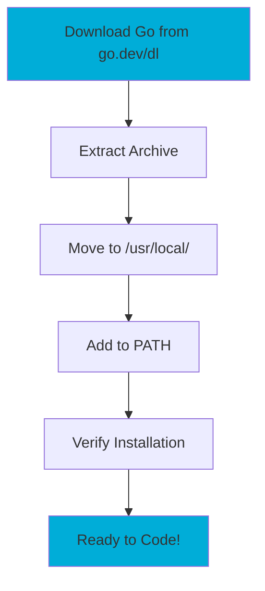
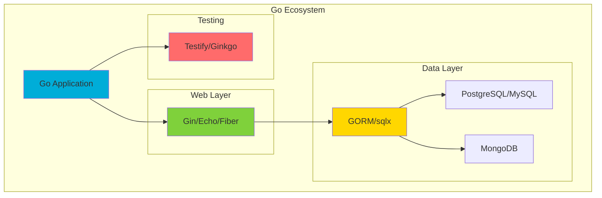
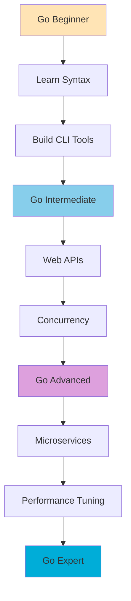

**Go programming** (also known as **Golang**) is Google's modern programming language designed for building scalable, cloud-native applications. This comprehensive **Go tutorial** covers everything from **Go installation** and **Go basics** to advanced **production patterns**, including modern features like enhanced **Go generics**, improved performance, and **cloud-native development** practices.

**What you'll learn in this Go programming guide:**
- Complete Go installation and setup process
- Go syntax, data types, and control structures
- Advanced Go features like generics and concurrency
- Modern Go development tools and best practices
- Building production-ready Go applications
- Go testing, debugging, and performance optimization

## Table of Contents
- [🚀 Beginner Level](#beginner-level)
- [📈 Intermediate Level](#intermediate-level)
- [📚 Learning Go](#learning-go)
- [🌐 Modern Go Ecosystem](#modern-go-ecosystem)
- [🎯 Advanced Level](#advanced-level)
- [🏆 Expert Level & Beyond](#expert-level)
- [🔗 Go Resources & Community](#resources)
- [❓ Frequently Asked Questions](#faq)
- [📚 Related Tutorials & Links](#related)

## 🚀 Beginner Level {#beginner-level}

### Prerequisites & System Requirements

- **Operating Systems:** Windows 10+, macOS 12+, Linux (Ubuntu 20.04+)
- **Memory:** Minimum 4GB RAM (8GB+ recommended for development)
- **Disk Space:** 1GB for Go installation, tools, and workspace
- **Network:** Internet connection for downloading packages and modules

### Install & Configure

#### Option 1: Official Installer (Recommended)
- [Download Go](https://go.dev/dl/){:target="_blank" rel="noopener"} - Get the latest stable version (Go 1.23+)

#### Option 2: Package Managers
```bash
# macOS with Homebrew
brew install go

# Windows with Chocolatey
choco install golang

# Windows with Scoop
scoop install go

# Ubuntu/Debian
sudo apt update && sudo apt install golang-go

# Arch Linux
sudo pacman -S go
```

#### Option 3: Manual Installation
```bash
# Linux/macOS - Download and extract (replace with current version)
wget https://go.dev/dl/go1.23.4.linux-amd64.tar.gz
sudo tar -C /usr/local -xzf go1.23.4.linux-amd64.tar.gz

# Add to PATH (add to ~/.bashrc or ~/.zshrc)
export PATH=$PATH:/usr/local/go/bin
source ~/.bashrc
```

#### Windows Manual Installation
1. Download the `.msi` installer from [go.dev/dl](https://go.dev/dl/){:target="_blank" rel="noopener"}
2. Run the installer (automatically adds to PATH)
3. Restart command prompt/PowerShell



## Verify Installation

```bash
# Check Go version
go version

# Verify environment
go env GOROOT GOMODCACHE

# Test with hello world
echo 'package main; import "fmt"; func main() { fmt.Println("Go is working!") }' > test.go
go run test.go
rm test.go
```

## Essential Tools & Extensions

### **IDEs & Editors**
- **Visual Studio Code** (Most Popular)
  - [Go extension](https://marketplace.visualstudio.com/items?itemName=golang.Go){:target="_blank" rel="noopener"} - Official Go support
  - [GitHub Copilot](https://marketplace.visualstudio.com/items?itemName=GitHub.copilot){:target="_blank" rel="noopener"} - AI code completion
  - [Thunder Client](https://marketplace.visualstudio.com/items?itemName=rangav.vscode-thunder-client){:target="_blank" rel="noopener"} - API testing
  - [Docker](https://marketplace.visualstudio.com/items?itemName=ms-azuretools.vscode-docker){:target="_blank" rel="noopener"} - Container support

- **[GoLand](https://www.jetbrains.com/go/){:target="_blank" rel="noopener"}** (JetBrains) - Professional Go IDE
- **Neovim** with [nvim-go](https://github.com/ray-x/go.nvim){:target="_blank" rel="noopener"} - For terminal users
- **[Zed](https://zed.dev/){:target="_blank" rel="noopener"}** - Fast, modern editor with Go support

### **Essential Go Tools**
```bash
# Core development tools
go install golang.org/x/tools/gopls@latest          # Language server
go install github.com/go-delve/delve/cmd/dlv@latest # Debugger
go install honnef.co/go/tools/cmd/staticcheck@latest # Static analysis
go install github.com/cweill/gotests@latest         # Test generator

# Security and quality tools
go install github.com/securecodewarrior/gosec/v2/cmd/gosec@latest
go install golang.org/x/vuln/cmd/govulncheck@latest
go install github.com/golangci/golangci-lint/cmd/golangci-lint@latest

# Performance and profiling
go install golang.org/x/perf/cmd/benchstat@latest   # Benchmark analysis
go install github.com/google/pprof@latest           # Profiling tool

# Development productivity
go install github.com/air-verse/air@latest          # Hot reload
go install github.com/swaggo/swag/cmd/swag@latest   # API documentation
go install github.com/golang/mock/mockgen@latest    # Mock generation
go install github.com/matryer/moq@latest            # Alternative mock tool
```

### **AI-Powered Development**
- **GitHub Copilot** - AI pair programming
- **Codeium** - Free AI code completion
- **Tabnine** - AI assistant for Go
- **Amazon CodeWhisperer** - AWS-powered AI coding

### **Container & Cloud Tools**
```bash
# Container tools
docker --version                    # Docker for containerization
kubectl version --client           # Kubernetes CLI
helm version                       # Kubernetes package manager

# Cloud development
aws --version                      # AWS CLI
gcloud version                     # Google Cloud CLI
az --version                       # Azure CLI
```


## Go Workspace & Project Structure

```bash
# Create new project with Go 1.23+ features
mkdir my-go-project && cd my-go-project
go mod init github.com/username/my-go-project

# For multi-module projects (Go 1.18+)
go work init
go work use .

# Modern project layout
├── cmd/              # Main applications
│   └── server/       # Application entry points
├── internal/         # Private code (not importable)
│   ├── handlers/     # HTTP handlers
│   ├── models/       # Data models
│   └── services/     # Business logic
├── pkg/             # Public libraries
├── api/             # API definitions (OpenAPI/gRPC)
├── web/             # Web assets
├── deployments/     # Docker, K8s configs
├── scripts/         # Build and deployment scripts
├── test/            # Test data and fixtures
├── .github/         # GitHub Actions workflows
├── go.mod           # Module definition
├── go.sum           # Dependency checksums
└── go.work          # Workspace file (optional)
```

## Essential Go Commands

```bash
# Module management
go mod init <module-name>    # Initialize module
go mod tidy                  # Clean up dependencies
go mod download              # Download dependencies
go work init                 # Initialize workspace (Go 1.18+)
go work use ./module         # Add module to workspace

# Build and run
go run main.go              # Run directly
go build                    # Build executable
go build -o myapp          # Build with custom name
go build -ldflags="-s -w"  # Build optimized (smaller binary)

# Testing and quality
go test ./...              # Run all tests
go test -race ./...        # Run with race detection
go test -bench=.           # Run benchmarks
go fmt ./...               # Format code
go vet ./...               # Static analysis
golangci-lint run          # Advanced linting
gosec ./...                # Security scanning
govulncheck ./...          # Vulnerability checking
go clean                   # Clean build cache
```

### Example: Hello World with Error Handling

```go
package main

import (
    "fmt"
    "os"
)

func main() {
    if err := run(); err != nil {
        fmt.Fprintf(os.Stderr, "Error: %v\n", err)
        os.Exit(1)
    }
}

func run() error {
    name := os.Getenv("NAME")
    if name == "" {
        name = "World"
    }

    _, err := fmt.Printf("Hello, %s!\n", name)
    return err
}
```


## 📈 Intermediate Level {#intermediate-level}

### Beyond Hello World: Practical Examples

### Production-Ready Web Server
```go
package main

import (
    "context"
    "fmt"
    "log/slog"
    "net/http"
    "os"
    "os/signal"
    "syscall"
    "time"
)

func handler(w http.ResponseWriter, r *http.Request) {
    // Add proper error handling and logging
    name := r.URL.Path[1:]
    if name == "" {
        name = "World"
    }

    w.Header().Set("Content-Type", "text/plain")
    if _, err := fmt.Fprintf(w, "Hello, %s!\n", name); err != nil {
        slog.Error("Failed to write response", "error", err)
    }
}

func main() {
    // Setup structured logging
    logger := slog.New(slog.NewJSONHandler(os.Stdout, nil))
    slog.SetDefault(logger)

    // Create server with timeouts
    server := &http.Server{
        Addr:         ":8080",
        Handler:      http.HandlerFunc(handler),
        ReadTimeout:  15 * time.Second,
        WriteTimeout: 15 * time.Second,
        IdleTimeout:  60 * time.Second,
    }

    // Graceful shutdown
    go func() {
        slog.Info("Server starting", "addr", server.Addr)
        if err := server.ListenAndServe(); err != http.ErrServerClosed {
            slog.Error("Server failed", "error", err)
            os.Exit(1)
        }
    }()

    // Wait for interrupt signal
    quit := make(chan os.Signal, 1)
    signal.Notify(quit, syscall.SIGINT, syscall.SIGTERM)
    <-quit

    slog.Info("Server shutting down")
    ctx, cancel := context.WithTimeout(context.Background(), 30*time.Second)
    defer cancel()

    if err := server.Shutdown(ctx); err != nil {
        slog.Error("Server shutdown failed", "error", err)
    }
}
```

### Working with Packages
```go
// calculator/calculator.go
package calculator

func Add(a, b int) int {
    return a + b
}

// main.go
package main

import (
    "fmt"
    "github.com/username/my-go-project/calculator"
)

func main() {
    result := calculator.Add(5, 3)
    fmt.Println(result) // Output: 8
}
```

### Modern Testing Patterns
```go
// calculator_test.go
package calculator

import (
    "math"
    "testing"
    "github.com/stretchr/testify/assert"
)

// Table-driven test with testify
func TestAdd(t *testing.T) {
    tests := []struct {
        name string
        a, b int
        want int
    }{
        {"positive numbers", 2, 3, 5},
        {"zero values", 0, 0, 0},
        {"negative numbers", -1, 1, 0},
        {"large numbers", math.MaxInt32, 1, math.MaxInt32 + 1},
    }

    for _, tt := range tests {
        t.Run(tt.name, func(t *testing.T) {
            got := Add(tt.a, tt.b)
            assert.Equal(t, tt.want, got)
        })
    }
}

// Benchmark test
func BenchmarkAdd(b *testing.B) {
    for i := 0; i < b.N; i++ {
        Add(100, 200)
    }
}

// Fuzz test (Go 1.18+)
func FuzzAdd(f *testing.F) {
    f.Add(2, 3)
    f.Add(0, 0)
    f.Add(-1, 1)

    f.Fuzz(func(t *testing.T, a, b int) {
        result := Add(a, b)

        // Commutative property
        result2 := Add(b, a)
        assert.Equal(t, result, result2)
    })
}
```

### Development Workflow

### Modern Development Workflow

#### Hot Reload Development
```bash
# Install Air for hot reload
go install github.com/air-verse/air@latest

# Initialize Air in your project
air init

# Start development with hot reload
air
```

#### Debugging Setup
```bash
# Debug with Delve
dlv debug main.go

# Debug with VS Code (F5 or Ctrl+F5)
# Debug with GoLand (built-in debugger)

# Remote debugging
dlv debug --headless --listen=:2345 --api-version=2
```

#### API Development
```bash
# Generate Swagger documentation
swag init

# Test APIs with curl or Thunder Client
curl -X GET http://localhost:8080/api/health
```

### Code Quality Tools
```bash
# Format code
go fmt ./...

# Static analysis
go vet ./...

# Advanced linting
staticcheck ./...

# Security scanning
gosec ./...
```

## Learning Go

### **Interactive Learning**
- [A Tour of Go](https://go.dev/tour/welcome/3){:target="_blank" rel="noopener"} - Official interactive tutorial
- [Go Playground](https://go.dev/play/){:target="_blank" rel="noopener"} - Online code editor and sharing
- [Go by Example](https://gobyexample.com/){:target="_blank" rel="noopener"} - Hands-on examples
- [Exercism Go Track](https://exercism.org/tracks/go){:target="_blank" rel="noopener"} - Practice exercises with mentoring
- [Go Dev](https://go.dev/learn/){:target="_blank" rel="noopener"} - Official learning hub

### **Video Courses & Channels**
- [FreeCodeCamp Go Course](https://www.youtube.com/watch?v=YS4e4q9oBaU){:target="_blank" rel="noopener"} - 7-hour comprehensive course
- [Traversy Media Go Crash Course](https://www.youtube.com/watch?v=SqrbIlUwR0U){:target="_blank" rel="noopener"} - Quick start guide
- [TechWorld with Nana](https://www.youtube.com/c/TechWorldwithNana){:target="_blank" rel="noopener"} - DevOps with Go
- [Codecademy Go Course](https://www.codecademy.com/learn/learn-go){:target="_blank" rel="noopener"} - Interactive course
- [Udemy Go Courses](https://www.udemy.com/topic/go-programming-language/){:target="_blank" rel="noopener"} - Paid comprehensive courses

### **Books & Documentation**
- [The Go Programming Language](https://www.gopl.io/){:target="_blank" rel="noopener"} - Donovan & Kernighan (Classic)
- [Learning Go](https://www.oreilly.com/library/view/learning-go/9781492077206/){:target="_blank" rel="noopener"} - Jon Bodner (Modern)
- [Go in Action](https://www.manning.com/books/go-in-action){:target="_blank" rel="noopener"} - Manning Publications
- [Effective Go](https://go.dev/doc/effective_go){:target="_blank" rel="noopener"} - Official style guide
- [Go Wiki](https://go.dev/wiki/){:target="_blank" rel="noopener"} - Community knowledge base

### **Practice Platforms**
- [LeetCode Go Problems](https://leetcode.com/problemset/all/?search=golang){:target="_blank" rel="noopener"} - Algorithm challenges
- [HackerRank Go Challenges](https://www.hackerrank.com/domains/algorithms?filters%5Bsubdomains%5D%5B%5D=warmup&filters%5Blanguage%5D%5B%5D=go){:target="_blank" rel="noopener"} - Programming challenges
- [Codewars Go Kata](https://www.codewars.com/kata/search/go){:target="_blank" rel="noopener"} - Coding exercises
- [Project Euler](https://projecteuler.net/){:target="_blank" rel="noopener"} - Mathematical programming problems
- [Advent of Code](https://adventofcode.com/){:target="_blank" rel="noopener"} - Annual programming puzzles

### **Community Learning**
- [r/golang](https://www.reddit.com/r/golang/){:target="_blank" rel="noopener"} - Reddit community
- [Gophers Discord](https://discord.gg/golang){:target="_blank" rel="noopener"} - Real-time chat
- [Go Forum](https://forum.golangbridge.org/){:target="_blank" rel="noopener"} - Discussion forum
- [Stack Overflow Go](https://stackoverflow.com/questions/tagged/go){:target="_blank" rel="noopener"} - Q&A platform
- [Go Meetups](https://www.meetup.com/topics/golang/){:target="_blank" rel="noopener"} - Local communities

### **Advanced Learning**
- [Go Blog](https://go.dev/blog/){:target="_blank" rel="noopener"} - Official updates and deep dives
- [Dave Cheney's Blog](https://dave.cheney.net/){:target="_blank" rel="noopener"} - Go internals and best practices
- [Go Time Podcast](https://changelog.com/gotime){:target="_blank" rel="noopener"} - Weekly Go discussions
- [GopherCon Talks](https://www.youtube.com/c/GopherAcademy){:target="_blank" rel="noopener"} - Conference presentations

### **Offline Learning**
```bash
# Install offline tour
go install golang.org/x/website/tour@latest
$HOME/go/bin/tour

# Download Go documentation
go install golang.org/x/tools/cmd/godoc@latest
godoc -http=:6060
# Visit http://localhost:6060
```

## Modern Go Ecosystem

### Web Frameworks
- **Gin v1.10+:** `go get github.com/gin-gonic/gin@latest`
- **Echo v4.12+:** `go get github.com/labstack/echo/v4@latest`
- **Fiber v2.52+:** `go get github.com/gofiber/fiber/v2@latest`
- **Chi v5.1+:** `go get github.com/go-chi/chi/v5@latest`

### Database & Storage
- **GORM v1.25+:** `go get gorm.io/gorm@latest`
- **sqlx:** `go get github.com/jmoiron/sqlx@latest`
- **MongoDB:** `go get go.mongodb.org/mongo-driver@latest`
- **Redis:** `go get github.com/redis/go-redis/v9@latest`
- **Ent (Facebook):** `go get entgo.io/ent@latest`

### Testing & Quality
- **Testify:** `go get github.com/stretchr/testify@latest`
- **Ginkgo v2:** `go get github.com/onsi/ginkgo/v2@latest`
- **GoMock:** `go get go.uber.org/mock@latest`
- **Testcontainers:** `go get github.com/testcontainers/testcontainers-go@latest`

### Modern Standard Library Additions (Go 1.21+)
- **slices:** Built-in slice utilities
- **maps:** Built-in map utilities
- **cmp:** Comparison utilities
- **slog:** Structured logging (Go 1.21+)
- **context:** Enhanced context patterns



## 🎯 Advanced Level {#advanced-level}

### Go 1.22+ Modern Features

### Enhanced For-Range Loops (Go 1.22+)
```go
// Range over integers (Go 1.22+)
for i := range 10 {
    fmt.Println(i) // 0, 1, 2, ..., 9
}

// Range over functions (Go 1.23+)
func All[T any](slice []T) func(func(int, T) bool) {
    return func(yield func(int, T) bool) {
        for i, v := range slice {
            if !yield(i, v) {
                return
            }
        }
    }
}

// Usage
data := []string{"a", "b", "c"}
for i, v := range All(data) {
    fmt.Printf("%d: %s\n", i, v)
}
```

### Modern Generics Patterns (Go 1.21+)
```go
// Generic constraints with comparable
func FindIndex[T comparable](slice []T, target T) int {
    for i, v := range slice {
        if v == target {
            return i
        }
    }
    return -1
}

// Generic map operations
func MapSlice[T, U any](slice []T, fn func(T) U) []U {
    result := make([]U, len(slice))
    for i, v := range slice {
        result[i] = fn(v)
    }
    return result
}

// Usage with type inference
numbers := []int{1, 2, 3, 4, 5}
strings := MapSlice(numbers, func(n int) string {
    return fmt.Sprintf("num_%d", n)
})
```

### Performance & Memory Optimization
```go
import (
    "slices"
    "maps"
    "sync"
)

// Use sync.Pool for object reuse
var bufferPool = sync.Pool{
    New: func() any {
        return make([]byte, 0, 1024)
    },
}

func processData(data []byte) []byte {
    buf := bufferPool.Get().([]byte)
    defer bufferPool.Put(buf[:0]) // Reset length, keep capacity

    // Process data...
    buf = append(buf, data...)
    return slices.Clone(buf) // Safe copy
}

// Modern slice operations (Go 1.21+)
func deduplicate[T comparable](slice []T) []T {
    seen := make(map[T]bool)
    result := make([]T, 0, len(slice))

    for _, v := range slice {
        if !seen[v] {
            seen[v] = true
            result = append(result, v)
        }
    }

    return slices.Clip(result) // Optimize capacity
}
```

### Modern Concurrency Patterns
```go
import (
    "context"
    "fmt"
    "log/slog"
    "sync"
    "time"
)

// Context-aware goroutines
func processWithContext(ctx context.Context, data []int) error {
    results := make(chan int, len(data))

    for _, item := range data {
        go func(val int) {
            select {
            case <-ctx.Done():
                return // Context cancelled
            case results <- val * 2:
                // Processing complete
            }
        }(item)
    }

    // Collect results with timeout
    for i := 0; i < len(data); i++ {
        select {
        case <-ctx.Done():
            return ctx.Err()
        case result := <-results:
            slog.Info("Processed", "result", result)
        }
    }

    return nil
}

// Modern worker pool with error handling
type WorkerPool[T, R any] struct {
    workers int
    jobs    chan T
    results chan R
    errors  chan error
    wg      sync.WaitGroup
}

func NewWorkerPool[T, R any](workers int, processor func(T) (R, error)) *WorkerPool[T, R] {
    wp := &WorkerPool[T, R]{
        workers: workers,
        jobs:    make(chan T, workers),
        results: make(chan R, workers),
        errors:  make(chan error, workers),
    }

    // Start workers
    for i := 0; i < workers; i++ {
        wp.wg.Add(1)
        go func() {
            defer wp.wg.Done()
            for job := range wp.jobs {
                result, err := processor(job)
                if err != nil {
                    wp.errors <- err
                } else {
                    wp.results <- result
                }
            }
        }()
    }

    return wp
}

func (wp *WorkerPool[T, R]) Submit(job T) {
    wp.jobs <- job
}

func (wp *WorkerPool[T, R]) Close() {
    close(wp.jobs)
    wp.wg.Wait()
    close(wp.results)
    close(wp.errors)
}
```

```
┌─────────────────┐    ┌─────────────────┐    ┌─────────────────┐
│   main()        │───▶│  Jobs Channel   │───▶│   Worker 1      │
│                 │    │                 │    │                 │
└─────────────────┘    └─────────────────┘    └─────────────────┘
         ▲                       │                       │
         │                       ▼                       ▼
┌─────────────────┐    ┌─────────────────┐    ┌─────────────────┐
│ Results Channel │◀───│   Worker 2      │◀───│   Worker 3      │
│                 │    │                 │    │                 │
└─────────────────┘    └─────────────────┘    └─────────────────┘

Flow: main() → jobs channel → workers → results channel → main()
```

### Modern Error Handling & Observability
```go
import (
    "errors"
    "fmt"
    "log/slog"
    "context"
)

// Structured error types with context
type ValidationError struct {
    Field   string            `json:"field"`
    Message string            `json:"message"`
    Code    string            `json:"code"`
    Context map[string]any    `json:"context,omitempty"`
}

func (e ValidationError) Error() string {
    return fmt.Sprintf("validation failed for %s: %s (code: %s)", e.Field, e.Message, e.Code)
}

// Implement structured logging interface
func (e ValidationError) LogValue() slog.Value {
    return slog.GroupValue(
        slog.String("field", e.Field),
        slog.String("message", e.Message),
        slog.String("code", e.Code),
        slog.Any("context", e.Context),
    )
}

// Example user type and helper functions
type User struct {
    ID    string `json:"id"`
    Name  string `json:"name"`
    Email string `json:"email"`
}

func fetchUser(ctx context.Context, userID string) (*User, error) {
    // Simulate database fetch
    if userID == "" {
        return nil, ErrUserNotFound
    }
    return &User{ID: userID, Name: "John Doe", Email: "john@example.com"}, nil
}

func validateUser(user *User) error {
    if user.Email == "" {
        return ValidationError{
            Field:   "email",
            Message: "email is required",
            Code:    "REQUIRED_FIELD",
        }
    }
    return nil
}

// Modern error handling with structured logging
func processUser(ctx context.Context, userID string) error {
    logger := slog.With("user_id", userID, "operation", "process_user")

    user, err := fetchUser(ctx, userID)
    if err != nil {
        logger.Error("Failed to fetch user", "error", err)
        return fmt.Errorf("fetch user %s: %w", userID, err)
    }

    if err := validateUser(user); err != nil {
        var validationErr ValidationError
        if errors.As(err, &validationErr) {
            logger.Warn("User validation failed", "validation_error", validationErr)
            return fmt.Errorf("validate user: %w", err)
        }
        return fmt.Errorf("unexpected validation error: %w", err)
    }

    logger.Info("User processed successfully")
    return nil
}

// Sentinel errors with context
var (
    ErrUserNotFound     = errors.New("user not found")
    ErrInvalidUserData  = errors.New("invalid user data")
    ErrDatabaseTimeout  = errors.New("database timeout")
)

// Error classification for better handling
func IsRetryableError(err error) bool {
    return errors.Is(err, ErrDatabaseTimeout) ||
           errors.Is(err, context.DeadlineExceeded)
}
```

### Cloud-Native Development & CI/CD

### Docker Multi-Stage Build
```dockerfile
# Build stage
FROM golang:1.23-alpine AS builder
WORKDIR /app
COPY go.mod go.sum ./
RUN go mod download
COPY . .
RUN CGO_ENABLED=0 GOOS=linux go build -ldflags="-s -w" -o main ./cmd/server

# Production stage
FROM alpine:latest
RUN apk --no-cache add ca-certificates tzdata
WORKDIR /root/
COPY --from=builder /app/main .
EXPOSE 8080
HEALTHCHECK --interval=30s --timeout=3s --start-period=5s --retries=3 \
    CMD wget --no-verbose --tries=1 --spider http://localhost:8080/health || exit 1
CMD ["./main"]
```

### GitHub Actions CI/CD
```yaml
# .github/workflows/ci.yml
name: CI/CD
on: [push, pull_request]

jobs:
  test:
    runs-on: ubuntu-latest
    steps:
    - uses: actions/checkout@v4
    - uses: actions/setup-go@v5
      with:
        go-version: '1.23'
        cache: true

    - name: Run tests
      run: |
        go test -race -coverprofile=coverage.out ./...
        go tool cover -html=coverage.out -o coverage.html

    - name: Security scan
      run: |
        go install github.com/securecodewarrior/gosec/v2/cmd/gosec@latest
        gosec ./...

    - name: Vulnerability check
      run: |
        go install golang.org/x/vuln/cmd/govulncheck@latest
        govulncheck ./...

    - name: Lint
      uses: golangci/golangci-lint-action@v4
      with:
        version: latest
```

### Troubleshooting & Performance

### Common Issues
- **Module authentication:** Configure `GOPRIVATE` for private modules
- **Build constraints:** Use `//go:build` instead of `// +build`
- **Workspace conflicts:** Check `go.work` file for module conflicts
- **Memory issues:** Use `go tool pprof` for memory profiling

### Advanced Debugging
```bash
# Performance profiling
go test -cpuprofile=cpu.prof -memprofile=mem.prof -bench=.
go tool pprof cpu.prof

# Memory leak detection
GODEBUG=gctrace=1 go run main.go

# Build with debug info
go build -gcflags="-N -l" -o debug-binary
dlv exec debug-binary

# Dependency analysis
go mod graph | grep module-name
go list -m -versions module-name
```

## 🏆 Expert Level & Beyond {#expert-level}

### Next Steps & Learning Path

### Beginner → Intermediate
1. Master basic syntax and types
2. Understand interfaces and methods
3. Learn goroutines and channels
4. Build CLI tools and web APIs
5. Practice with real projects

### Intermediate → Advanced
1. Advanced concurrency patterns
2. Performance optimization
3. Microservices architecture
4. Custom tooling and code generation
5. Contribute to open source

### Project Ideas
- **Beginner:** Calculator, file organizer, weather CLI
- **Intermediate:** REST API, chat server, URL shortener
- **Advanced:** Distributed system, compiler, database

### Advanced Topics to Explore

#### Language Features
- **[Enhanced Generics (Go 1.21+)](https://go.dev/doc/tutorial/generics){:target="_blank" rel="noopener"}** - Type inference improvements
- **[Fuzzing (Go 1.18+)](https://go.dev/doc/tutorial/fuzz){:target="_blank" rel="noopener"}** - Automated testing
- **[Workspaces (Go 1.18+)](https://go.dev/doc/tutorial/workspaces){:target="_blank" rel="noopener"}** - Multi-module development
- **[Structured Logging (slog)](https://go.dev/blog/slog){:target="_blank" rel="noopener"}** - Modern logging patterns
- **[Profile-Guided Optimization](https://go.dev/doc/pgo){:target="_blank" rel="noopener"}** - Performance improvements

#### Cloud-Native & DevOps
- **[WebAssembly with Go](https://go.dev/wiki/WebAssembly){:target="_blank" rel="noopener"}** - Browser and edge computing
- **[Kubernetes Operators](https://kubernetes.io/docs/concepts/extend-kubernetes/operator/){:target="_blank" rel="noopener"}** - Infrastructure automation
- **[gRPC and Protocol Buffers](https://grpc.io/docs/languages/go/){:target="_blank" rel="noopener"}** - High-performance APIs
- **[Distributed Systems Patterns](https://microservices.io/patterns/){:target="_blank" rel="noopener"}** - Microservices architecture
- **[OpenTelemetry](https://opentelemetry.io/docs/languages/go/){:target="_blank" rel="noopener"}** - Observability and tracing

#### Advanced Development
- **[Reflection and Code Generation](https://go.dev/blog/laws-of-reflection){:target="_blank" rel="noopener"}** - Metaprogramming
- **[CGO and C Integration](https://go.dev/blog/cgo){:target="_blank" rel="noopener"}** - System programming
- **[Memory Management](https://go.dev/doc/gc-guide){:target="_blank" rel="noopener"}** - GC tuning and optimization
- **[Security Best Practices](https://go.dev/security/){:target="_blank" rel="noopener"}** - Secure coding patterns

## ❓ Frequently Asked Questions {#faq}

**Q: What is Go programming language used for?**
A: Go is used for web development, cloud services, microservices, DevOps tools, and system programming. Companies like Google, Uber, and Docker use Go for production systems.

**Q: Is Go easy to learn for beginners?**
A: Yes, Go has simple syntax, excellent documentation, and strong community support, making it beginner-friendly compared to C++ or Java.

**Q: How long does it take to learn Go programming?**
A: Basic Go can be learned in 2-4 weeks. Becoming proficient with modern features (generics, workspaces, cloud-native patterns) takes 3-6 months with regular practice.

**Q: What's new in Go 1.23+ that I should know?**
A: Enhanced for-range loops, improved generics inference, better performance, iterators, new standard library packages, and enhanced security features.

**Q: Do I need GOPATH for Go projects?**
A: No, GOPATH is deprecated. Use Go modules and optionally Go workspaces for multi-module projects.

**Q: How do I handle dependencies in modern Go?**
A: Use `go mod init`, `go get package@latest`, `go mod tidy`, and `go work init` for workspace management.

**Q: How do I optimize Go binary size and performance?**
A: Use `go build -ldflags="-s -w"` for smaller binaries, enable PGO with `-pgo=auto`, and use `slices.Clip()` for memory optimization.

**Q: What's the best way to structure a Go project?**
A: Follow the standard project layout with `cmd/`, `internal/`, `pkg/` directories, include `deployments/` for containers, and `.github/` for CI/CD.

**Q: How do I implement security best practices in Go?**
A: Use `gosec` for security scanning, `govulncheck` for vulnerabilities, structured logging with `slog`, and proper error handling with context.

**Q: Should I learn Go or Python for cloud development?**
A: Go is excellent for cloud-native applications, microservices, and DevOps tools. Python is better for data science and AI/ML workflows.




## 🔗 Go Resources & Community {#resources}

### Official Resources
- [Go Official Website](https://go.dev/){:target="_blank" rel="noopener"} - Official homepage and downloads
- [Go Documentation](https://go.dev/doc/){:target="_blank" rel="noopener"} - Complete official documentation
- [Go Blog](https://go.dev/blog/){:target="_blank" rel="noopener"} - Latest Go news and updates
- [Effective Go](https://go.dev/doc/effective_go){:target="_blank" rel="noopener"} - Writing clear, idiomatic Go code
- [Go Playground](https://go.dev/play/){:target="_blank" rel="noopener"} - Try Go in your browser
- [pkg.go.dev](https://pkg.go.dev/){:target="_blank" rel="noopener"} - Go package discovery

### Learning Platforms
- [Go by Example](https://gobyexample.com/){:target="_blank" rel="noopener"} - Hands-on introduction with examples
- [Exercism Go Track](https://exercism.org/tracks/go){:target="_blank" rel="noopener"} - Practice exercises
- [Codecademy Go](https://www.codecademy.com/learn/learn-go){:target="_blank" rel="noopener"} - Interactive course

### Community & Support
- [Go Community](https://go.dev/community/){:target="_blank" rel="noopener"} - Official community hub
- [Go Forum](https://forum.golangbridge.org/){:target="_blank" rel="noopener"} - Discussion forum
- [Stack Overflow Go Questions](https://stackoverflow.com/questions/tagged/go){:target="_blank" rel="noopener"} - Q&A platform
- [Gophers Slack](https://invite.slack.golangbridge.org/){:target="_blank" rel="noopener"} - Real-time chat

### Tools & Libraries
- [Awesome Go](https://awesome-go.com/){:target="_blank" rel="noopener"} - Curated list of Go frameworks and libraries
- [Go Starter Project Layout](https://github.com/golang-standards/project-layout){:target="_blank" rel="noopener"} - Standard project structure

<!-- SEO: FAQPage Structured Data -->
<script type="application/ld+json">
{
  "@context": "https://schema.org",
  "@type": "FAQPage",
  "mainEntity": [
    {
      "@type": "Question",
      "name": "What is Go programming language used for?",
      "acceptedAnswer": {
        "@type": "Answer",
        "text": "Go is used for web development, cloud services, microservices, DevOps tools, and system programming. Companies like Google, Uber, and Docker use Go for production systems."
      }
    },
    {
      "@type": "Question",
      "name": "Is Go easy to learn for beginners?",
      "acceptedAnswer": {
        "@type": "Answer",
        "text": "Yes, Go has simple syntax, excellent documentation, and strong community support, making it beginner-friendly compared to C++ or Java."
      }
    },
    {
      "@type": "Question",
      "name": "How long does it take to learn Go programming?",
      "acceptedAnswer": {
        "@type": "Answer",
        "text": "Basic Go can be learned in 2-4 weeks. Becoming proficient takes 3-6 months with regular practice."
      }
    },
    {
      "@type": "Question",
      "name": "Do I need GOPATH for Go projects?",
      "acceptedAnswer": {
        "@type": "Answer",
        "text": "No, GOPATH is deprecated. Use Go modules for all projects since Go 1.16."
      }
    },
    {
      "@type": "Question",
      "name": "How do I handle dependencies in Go?",
      "acceptedAnswer": {
        "@type": "Answer",
        "text": "Use 'go mod init', 'go get package', and 'go mod tidy' for module management."
      }
    },
    {
      "@type": "Question",
      "name": "Should I learn Go or Python first?",
      "acceptedAnswer": {
        "@type": "Answer",
        "text": "Both are beginner-friendly. Choose Go for system programming and performance, Python for data science and rapid prototyping."
      }
    }
  ]
}
</script>

## 📚 Related Tutorials & Links {#related}

### Related Tutorials on This Blog
- [Best Coding Challenge Platforms](/posts/best-coding-challenge-platforms/) - Practice Go with coding challenges and competitions
- [Automation Testing Tools & Resources Guide](/posts/automation-testing-tools-resources-guide/) - Learn testing frameworks that work well with Go
- [Git Workflows Guide](/posts/git-workflows-guide/) - Version control best practices for Go projects
- [Ubuntu Fresh Install Setup Guide](/posts/ubuntu-fresh-install-setup-guide/) - Set up your development environment
- [macOS Fresh Install Setup Guide](/posts/macos-fresh-install-setup-guide/) - macOS development setup

### Browse More Content
- [Go Programming category](/categories/go-programming) - All Go-related posts and tutorials
- [Software Development category](/categories/software-development) - Programming guides and best practices
- [All tutorials and guides](/categories/tutorials) - Complete learning resource collection

## Conclusion

This comprehensive **Go programming tutorial** has taken you through everything needed to become proficient in **Go development** - from basic **Go installation** to advanced **production patterns**. You've learned about modern **Go features** like generics, enhanced for-range loops, and structured logging, plus essential tools for **Go web development** and **cloud-native applications**.

**Key takeaways from this Go guide:**
- Go's simple syntax makes it ideal for beginners and experienced developers
- Modern Go features (generics, workspaces, enhanced tooling) improve productivity
- Strong ecosystem with frameworks like Gin, Echo, and excellent testing tools
- Perfect for microservices, cloud applications, and DevOps tooling
- Active community and continuous language evolution

**Next steps in your Go journey:**
1. **Practice regularly** with coding challenges and personal projects
2. **Build real applications** using the patterns shown in this tutorial
3. **Join the Go community** through forums, Discord, and local meetups
4. **Stay updated** with Go releases and new features
5. **Contribute to open source** Go projects to gain experience

Start building with Go today - the language that powers some of the world's most scalable applications at Google, Uber, Docker, and thousands of other companies.

**Ready to dive deeper?** Explore our [related programming tutorials](#related) and join the growing community of Go developers worldwide.

---

*Last updated: Keep this Go tutorial bookmarked as we regularly update it with the latest Go features and best practices.*

<!-- Mobile-Friendly Formatting -->
<style>
  pre, code {
    white-space: pre-wrap;
    word-break: break-word;
    font-size: 1em;
    max-width: 100%;
    box-sizing: border-box;
  }
  .faq-section {
    padding: 1em;
    margin: 0 auto;
    max-width: 700px;
  }
</style>
