## 🎯 Understanding Automation Testing

### What is Automation Testing?
Automation testing uses tools and scripts to execute tests automatically, reducing manual effort and increasing test coverage. Essential for modern software development workflows.

**Key Benefits:**
- **Faster Feedback** - Get test results in minutes, not hours
- **Higher Test Coverage** - Run thousands of tests automatically
- **Cost Effective** - Reduce manual testing effort by 70%
- **Consistent Results** - Eliminate human error in repetitive tests
- **CI/CD Integration** - Enable continuous deployment pipelines

### Testing Strategy Overview

```mermaid
flowchart TD
  subgraph "Testing Pyramid"
    A["🔺 UI Tests (Few)<br/>Slow, Expensive, Brittle"]
    B["🔶 Integration Tests (Some)<br/>Medium Speed & Cost"]
    C["🟢 Unit Tests (Many)<br/>Fast, Cheap, Reliable"]
  end
  C --> B
  B --> A
  style A fill:#ffcdd2
  style B fill:#fff3e0
  style C fill:#c8e6c9
```



## 📊 Table of Contents

- [Understanding Automation Testing](#-understanding-automation-testing)
- [Tool Selection Guide](#-tool-selection-guide)
- [Beginner Level: Getting Started](#-beginner-level-getting-started)
- [Intermediate Level: Code-Based Testing](#-intermediate-level-code-based-testing)
- [Advanced Level: Enterprise Testing](#-advanced-level-enterprise-testing)
- [Tools by Testing Type](#️-tools-by-testing-type)
- [Best Practices](#-best-practices)
- [Learning Resources](#-learning-resources)
- [Join the Community](#-join-the-community)
- [Next Steps](#-next-steps)
- [Frequently Asked Questions](#-frequently-asked-questions)

### 🎯 Choose Your Learning Path

```mermaid
flowchart LR
    A["🟢 Complete Beginner<br/>No coding experience"] --> B["📮 Start with Postman<br/>GUI-based API testing"]
    B --> C["📚 Learn basic concepts<br/>HTTP, JSON, APIs"]
    C --> D["🎭 Try Playwright<br/>Simple UI automation"]

    E["🟡 Developer<br/>Some coding experience"] --> F["🎭 Playwright + Jest<br/>Modern testing stack"]
    F --> G["🔧 Build test frameworks<br/>Page Object Model"]

    H["🔴 QA Professional<br/>Testing experience"] --> I["🕷️ Advanced tools<br/>Selenium Grid, k6"]
    I --> J["🏗️ Enterprise frameworks<br/>CI/CD integration"]

    style A fill:#c8e6c9
    style E fill:#fff3e0
    style H fill:#ffcdd2
```



## 🧭 Tool Selection Guide

**Answer these questions to find your perfect tool:**

```mermaid
flowchart TD
    A["👋 Start Here"] --> B{"Team Size?"}
    B -->|1-5 people| C["🔰 Small Team"]
    B -->|6-20 people| D["🏢 Medium Team"]
    B -->|20+ people| E["🏭 Enterprise"]

    C --> F{"Budget?"}
    D --> F
    E --> F

    F -->|Free| G["💚 Postman + Playwright"]
    F -->|<$1000/month| H["💛 Cypress + BrowserStack"]
    F -->|Enterprise| I["💜 Custom Framework"]

    G --> J["🎯 Perfect Match!"]
    H --> J
    I --> J

    style A fill:#e1f5fe
    style J fill:#c8e6c9
```



### ✅ Automation Readiness Checklist

**Before starting automation, ensure you have:**

- [ ] **Stable application features** (not changing weekly)
- [ ] **Clear test requirements** documented
- [ ] **Team buy-in** from management and developers
- [ ] **Basic programming knowledge** (at least one team member)
- [ ] **CI/CD pipeline** in place or planned
- [ ] **Test environment** that mirrors production
- [ ] **Time investment** (2-4 weeks for initial setup)

## 🟢 Beginner Level: Getting Started

### 📮 API Testing with Postman (No Coding Required)

**Step 1: Install Postman**
- Download [Postman](https://www.postman.com/downloads/){:target="_blank" rel="noopener"} (free)
- Create a free account

**Step 2: Your First API Test**
1. Create new request: `GET https://jsonplaceholder.typicode.com/users/1`
2. Click "Send"
3. Add test in "Tests" tab:

```javascript
pm.test("Status code is 200", function () {
    pm.response.to.have.status(200);
});

pm.test("User has name", function () {
    const user = pm.response.json();
    pm.expect(user.name).to.exist;
});
```

**Step 3: Create Test Collections**
- Group related tests together
- Run entire collections
- Export/import for team sharing

### 🎭 Simple UI Testing with [Playwright](https://playwright.dev/){:target="_blank" rel="noopener"}

**Step 1: Setup Environment**

```bash
# Create new project
mkdir automation-tests && cd automation-tests
npm init -y

# Install Playwright
npm install @playwright/test
npx playwright install
```

**Step 2: Your First UI Test**

Create `tests/simple-ui.spec.js`:

```javascript
const { test, expect } = require('@playwright/test');

test('should search on DuckDuckGo', async ({ page }) => {
  // Navigate to DuckDuckGo
  await page.goto('https://duckduckgo.com');

  // Search for "automation testing"
  await page.fill('[name="q"]', 'automation testing');
  await page.press('[name="q"]', 'Enter');

  // Verify results page
  await expect(page).toHaveTitle(/automation testing/);

  console.log('✅ UI test passed!');
});
```

**Step 3: Run Your Test**

```bash
npx playwright test simple-ui.spec.js
```

### 🔧 Common Beginner Issues & Solutions

| Problem | Symptom | Solution |
|---------|---------|----------|
| **Element not found** | `Error: locator.click: Target closed` | Use proper waits: `await page.waitForSelector()` |
| **Test is flaky** | Passes sometimes, fails others | Remove `sleep()`, use `waitForLoadState()` |
| **Slow test execution** | Tests take too long | Run tests in parallel: `--workers=4` |
| **Browser not opening** | Headless mode confusion | Add `--headed` flag to see browser |

**Key Learning Points:**
- ✅ Always use `await` with Playwright actions
- ✅ Use data-testid attributes for reliable selectors
- ✅ Write descriptive test names
- ❌ Don't use `sleep()` or fixed waits

## 🟡 Intermediate Level: Code-Based Testing

### 📊 Tool Comparison Matrix

| Feature | Playwright | Cypress | Selenium | Recommendation |
|---------|------------|---------|----------|----------------|
| **Setup Time** | 5 minutes | 10 minutes | 30 minutes | 🥇 Playwright |
| **Browser Support** | All modern | Chrome/Edge/Firefox | All | 🥇 Playwright |
| **Parallel Testing** | ✅ Built-in | ❌ Paid only | ✅ Manual setup | 🥇 Playwright |
| **Learning Curve** | Medium | Easy | Hard | 🥇 Cypress |
| **Mobile Testing** | ✅ Native | ❌ Limited | ✅ [Appium](https://appium.io/){:target="_blank" rel="noopener"} | 🥇 Playwright |
| **Community** | Growing | Large | Largest | 🥇 Selenium |
| **Performance** | Fastest | Fast | Slower | 🥇 Playwright |
| **Cost** | Free | Free/Paid | Free | 🥇 All Free |

**🎯 Recommendation:**
- **New projects**: [Playwright](https://playwright.dev/){:target="_blank" rel="noopener"}
- **Existing Cypress projects**: Stay with [Cypress](https://www.cypress.io/){:target="_blank" rel="noopener"}
- **Legacy systems**: [Selenium](https://selenium.dev/){:target="_blank" rel="noopener"}

### 🔌 API Testing with Code

**Setup API Testing Tools**

```bash
# Install API testing tools
npm install axios jest
```

**Create API Test Suite**

Create `tests/api.test.js`:

```javascript
const axios = require('axios'); // Axios: https://axios-http.com/{:target="_blank" rel="noopener"}

describe('JSONPlaceholder API Tests', () => { // Jest: https://jestjs.io/{:target="_blank" rel="noopener"}
  const baseURL = 'https://jsonplaceholder.typicode.com';

  test('should get all users', async () => {
    const response = await axios.get(`${baseURL}/users`);

    expect(response.status).toBe(200);
    expect(response.data).toHaveLength(10);
    expect(response.data[0]).toHaveProperty('name');
  });

  test('should create new post', async () => {
    const newPost = {
      title: 'Test Post',
      body: 'This is a test post',
      userId: 1
    };

    const response = await axios.post(`${baseURL}/posts`, newPost);

    expect(response.status).toBe(201);
    expect(response.data.title).toBe(newPost.title);
  });

  test('should handle errors gracefully', async () => {
    try {
      await axios.get(`${baseURL}/users/999`);
    } catch (error) {
      expect(error.response.status).toBe(404);
    }
  });
});
```

### 🌐 Advanced UI Testing

**Page Object Model Pattern**

Create `pages/SearchPage.js`:

```javascript
class SearchPage {
  constructor(page) {
    this.page = page;
    this.searchInput = '[name="q"]';
    this.searchButton = '[type="submit"]';
    this.results = '[data-testid="result"]';
  }

  async navigate() {
    await this.page.goto('https://duckduckgo.com');
  }

  async search(query) {
    await this.page.fill(this.searchInput, query);
    await this.page.press(this.searchInput, 'Enter');
  }

  async getResultsCount() {
    return await this.page.locator(this.results).count();
  }
}

module.exports = SearchPage;
```

**Use Page Objects in Tests**

Create `tests/advanced-ui.spec.js`:

```javascript
const { test, expect } = require('@playwright/test');
const SearchPage = require('../pages/SearchPage');

test.describe('Search Functionality', () => {
  let searchPage;

  test.beforeEach(async ({ page }) => {
    searchPage = new SearchPage(page);
    await searchPage.navigate();
  });

  test('should return results for valid search', async () => {
    await searchPage.search('automation testing');

    const resultsCount = await searchPage.getResultsCount();
    expect(resultsCount).toBeGreaterThan(0);
  });

  test('should handle empty search', async () => {
    await searchPage.search('');
    // Add assertions for empty search behavior
  });
});
```

### 📊 Test Data Management

Create `data/testData.json`:

```json
{
  "users": {
    "validUser": {
      "username": "testuser",
      "password": "password123"
    },
    "invalidUser": {
      "username": "invalid",
      "password": "wrong"
    }
  },
  "api": {
    "endpoints": {
      "users": "/users",
      "posts": "/posts"
    }
  }
}
```

### 🔧 Configuration Management

Create `config/test.config.js`:

```javascript
module.exports = {
  environments: {
    dev: {
      baseURL: 'https://dev-api.example.com',
      timeout: 30000
    },
    staging: {
      baseURL: 'https://staging-api.example.com',
      timeout: 60000
    },
    prod: {
      baseURL: 'https://api.example.com',
      timeout: 120000
    }
  },
  browsers: ['chromium', 'firefox', 'webkit'],
  retries: 2
};
```

### 🏢 Industry-Specific Testing Patterns

#### E-commerce Applications
```javascript
// Shopping cart automation
test('complete purchase flow', async ({ page }) => {
  await page.goto('/products');
  await page.click('[data-testid="add-to-cart"]');
  await page.click('[data-testid="checkout"]');
  await page.fill('[data-testid="email"]', 'test@example.com');
  // Payment gateway testing (use test cards)
  await expect(page.locator('[data-testid="success"]')).toBeVisible();
});
```

#### Banking & Finance
```javascript
// Security compliance testing
test('secure login with 2FA', async ({ page }) => {
  await page.goto('/login');
  await page.fill('[name="username"]', 'testuser');
  await page.fill('[name="password"]', 'securepass');
  await page.click('[type="submit"]');
  // Verify 2FA prompt appears
  await expect(page.locator('[data-testid="2fa-input"]')).toBeVisible();
});
```

#### SaaS Applications
```javascript
// Multi-tenant testing
test('tenant isolation', async ({ page }) => {
  await page.goto('/tenant1/dashboard');
  const tenant1Data = await page.textContent('[data-testid="tenant-data"]');

  await page.goto('/tenant2/dashboard');
  const tenant2Data = await page.textContent('[data-testid="tenant-data"]');

  expect(tenant1Data).not.toBe(tenant2Data);
});
```

## 🔴 Advanced Level: Enterprise Testing


### ⚡ Performance Benchmarks

| Metric | Playwright | Cypress | Selenium |
|--------|------------|---------|----------|
| **Test Execution** | 🥇 Fastest | 🥈 Fast | 🥉 Slower |
| **Memory Usage** | 🥈 Medium | 🥇 Lowest | 🥉 Highest |
| **Setup Complexity** | 🥇 Easiest | 🥈 Medium | 🥉 Complex |
| **Parallel Tests** | 🥇 Native | 🥉 Paid | 🥈 Manual |
| **Cross-browser** | 🥇 Excellent | 🥈 Good | 🥇 Excellent |

**Performance Test Results (1000 tests):**
- **Playwright**: 12 minutes (parallel)
- **Cypress**: 25 minutes (sequential)
- **Selenium Grid**: 15 minutes (parallel setup required)

### 🏗️ Enterprise Architecture Patterns

#### Microservices Testing Strategy
```javascript
// Contract testing with API mocking
const { setupServer } = require('msw/node');
const { rest } = require('msw');

const server = setupServer(
  rest.get('/api/users', (req, res, ctx) => {
    return res(ctx.json({ users: mockUsers }));
  })
);

test('microservice integration', async () => {
  server.listen();
  // Test with mocked dependencies
  server.close();
});
```

#### Multi-Environment Deployment Testing
```yaml
# Advanced CI/CD Pipeline
stages:
  - unit-tests
  - integration-tests
  - e2e-tests-dev
  - e2e-tests-staging
  - performance-tests
  - security-tests
  - deploy-production
```

### 🕷️ [Selenium](https://selenium.dev/){:target="_blank" rel="noopener"} Grid for Distributed Testing

**Docker Compose Setup**

Create `docker-compose.yml`:

```yaml
version: '3'
services:
  selenium-hub:
    image: selenium/hub:4.15.0
    container_name: selenium-hub
    ports:
      - "4444:4444"

  chrome:
    image: selenium/node-chrome:4.15.0
    shm_size: 2gb
    depends_on:
      - selenium-hub
    environment:
      - HUB_HOST=selenium-hub
      - HUB_PORT=4444

  firefox:
    image: selenium/node-firefox:4.15.0
    shm_size: 2gb
    depends_on:
      - selenium-hub
    environment:
      - HUB_HOST=selenium-hub
      - HUB_PORT=4444
```

### ⚡ Performance Testing with [k6](https://k6.io/){:target="_blank" rel="noopener"}

Create `tests/performance.js`:

```javascript
import http from 'k6/http';
import { check, sleep } from 'k6';

export let options = {
  stages: [
    { duration: '2m', target: 100 }, // Ramp up
    { duration: '5m', target: 100 }, // Stay at 100 users
    { duration: '2m', target: 0 },   // Ramp down
  ],
  thresholds: {
    http_req_duration: ['p(95)<500'], // 95% of requests under 500ms
    http_req_failed: ['rate<0.1'],    // Error rate under 10%
  },
};

export default function() {
  let response = http.get('https://jsonplaceholder.typicode.com/users');

  check(response, {
    'status is 200': (r) => r.status === 200,
    'response time < 500ms': (r) => r.timings.duration < 500,
  });

  sleep(1);
}
```

### 🔒 Security Testing Integration

Create `tests/security.js`:

```javascript
const { test, expect } = require('@playwright/test');

test.describe('Security Tests', () => {
  test('should prevent XSS attacks', async ({ page }) => {
    await page.goto('https://example.com/search');

    const maliciousScript = '<script>alert("XSS")</script>';
    await page.fill('[name="query"]', maliciousScript);
    await page.click('[type="submit"]');

    // Verify script is not executed
    const pageContent = await page.content();
    expect(pageContent).not.toContain('<script>alert("XSS")</script>');
  });

  test('should enforce HTTPS', async ({ page }) => {
    const response = await page.goto('http://example.com');
    expect(page.url()).toMatch(/^https:/);
  });
});
```

### 🏗️ CI/CD Integration

**[GitHub Actions](https://github.com/features/actions){:target="_blank" rel="noopener"} Workflow**

Create `.github/workflows/tests.yml`:

```yaml
name: Automated Tests
on: [push, pull_request]

jobs:
  api-tests:
    runs-on: ubuntu-latest
    steps:
      - uses: actions/checkout@v4
      - uses: actions/setup-node@v4
        with:
          node-version: '20'
      - run: npm ci
      - run: npm run test:api

  ui-tests:
    runs-on: ubuntu-latest
    steps:
      - uses: actions/checkout@v4
      - uses: actions/setup-node@v4
        with:
          node-version: '20'
      - run: npm ci
      - run: npx playwright install --with-deps
      - run: npm run test:ui

  performance-tests:
    runs-on: ubuntu-latest
    steps:
      - uses: actions/checkout@v4
      - uses: [grafana/k6-action](https://github.com/grafana/k6-action){:target="_blank" rel="noopener"}@v0.3.1
        with:
          filename: tests/performance.js
```

### 🔄 What's New in 2024

**Latest Tool Updates:**
- **Playwright 1.40**: New trace viewer, improved mobile testing
- **Cypress 13.0**: Component testing, improved TypeScript support
- **Selenium 4.15**: BiDi protocol support, better WebDriver management
- **k6 0.47**: Enhanced browser testing, improved cloud integration

**Emerging Trends:**
- **AI-Powered Testing**: Tools like [Testim.io](https://testim.io/){:target="_blank" rel="noopener"} using ML for test maintenance
- **Visual AI**: [Applitools Eyes](https://applitools.com/){:target="_blank" rel="noopener"} for intelligent visual testing
- **Codeless Automation**: Low-code platforms gaining enterprise adoption
- **Shift-Left Testing**: Earlier integration in development cycle

## 🛠️ Tools by Testing Type

### 🔌 API & Backend Testing

| Skill Level | Tools | Description |
|-------------|-------|-------------|
| **🟢 Beginner** | 📮 **[Postman](https://www.postman.com/){:target="_blank" rel="noopener"}**<br/>🔍 **[Insomnia](https://insomnia.rest/){:target="_blank" rel="noopener"}** | GUI-based, drag & drop interface<br/>Lightweight REST client, perfect for getting started |
| **🟡 Intermediate** | ☕ **[REST Assured](https://rest-assured.io/){:target="_blank" rel="noopener"}** (Java)<br/>🐍 **[Requests](https://requests.readthedocs.io/){:target="_blank" rel="noopener"} + [pytest](https://pytest.org/){:target="_blank" rel="noopener"}** (Python) | Code-based API testing with powerful assertions<br/>Scriptable HTTP testing with rich ecosystem |
| **🔴 Advanced** | 📊 **[k6](https://k6.io/){:target="_blank" rel="noopener"} API Tests**<br/>🛠️ **Custom Frameworks** | Performance + API testing combined<br/>Enterprise solutions tailored to specific needs |

### 🌐 Web UI Testing

| Skill Level | Tools | Description |
|-------------|-------|-------------|
| **🟢 Beginner** | 🎭 **[Playwright](https://playwright.dev/){:target="_blank" rel="noopener"}**<br/>✅ **Easy Setup** | Modern, fast, reliable with auto-wait<br/>Built-in screenshots, great for beginners |
| **🟡 Intermediate** | 🌲 **[Cypress](https://www.cypress.io/){:target="_blank" rel="noopener"}**<br/>🎮 **Interactive Test Runner** | Developer experience focused<br/>Time-travel debugging, video recording |
| **🔴 Advanced** | 🕷️ **[Selenium](https://selenium.dev/){:target="_blank" rel="noopener"} Grid**<br/>🔧 **Custom Solutions** | Distributed testing, cloud integration<br/>Enterprise frameworks, complex orchestration |

### 📱 Mobile App Testing

| Skill Level | Tools | Description |
|-------------|-------|-------------|
| **🟢 Beginner** | 📱 **[Appium](https://appium.io/){:target="_blank" rel="noopener"} Inspector**<br/>🎯 **Visual Testing** | Record & replay functionality<br/>No coding required, point-and-click interface |
| **🟡 Intermediate** | ⚛️ **[Detox](https://wix.github.io/Detox/){:target="_blank" rel="noopener"}** (React Native)<br/>🤖 **[Espresso](https://developer.android.com/training/testing/espresso){:target="_blank" rel="noopener"}** (Android) | Fast, reliable mobile testing<br/>Native testing with built-in synchronization |
| **🔴 Advanced** | ☁️ **[BrowserStack](https://www.browserstack.com/){:target="_blank" rel="noopener"}, [Sauce Labs](https://saucelabs.com/){:target="_blank" rel="noopener"}**<br/>🏭 **[AWS Device Farm](https://aws.amazon.com/device-farm/){:target="_blank" rel="noopener"}, Firebase** | Cloud device testing with real devices<br/>Scalable testing infrastructure |

### ⚡ Performance Testing

| Skill Level | Tools | Description |
|-------------|-------|-------------|
| **🟢 Beginner** | 🔨 **[Apache JMeter](https://jmeter.apache.org/){:target="_blank" rel="noopener"}**<br/>📊 **[Gatling](https://gatling.io/){:target="_blank" rel="noopener"}** | GUI-based load testing with visual reports<br/>High-performance load testing with detailed metrics |
| **🟡 Intermediate** | 📈 **[k6](https://k6.io/){:target="_blank" rel="noopener"}**<br/>🚀 **[Artillery](https://artillery.io/){:target="_blank" rel="noopener"}** | JavaScript-based performance testing<br/>Modern load testing toolkit with CI/CD integration |
| **🔴 Advanced** | ☁️ **[BlazeMeter](https://www.blazemeter.com/){:target="_blank" rel="noopener"}**<br/>🏢 **[LoadRunner](https://www.opentext.com/products/loadrunner-professional){:target="_blank" rel="noopener"}** | Cloud-based scalable performance testing<br/>Enterprise-grade performance testing suite |

### 🔒 Security Testing

| Skill Level | Tools | Description |
|-------------|-------|-------------|
| **🟢 Beginner** | 🛡️ **[OWASP ZAP](https://www.zaproxy.org/){:target="_blank" rel="noopener"}**<br/>🔍 **[Burp Suite Community](https://portswigger.net/burp/communitydownload){:target="_blank" rel="noopener"}** | Free web application security scanner<br/>Web vulnerability scanner with proxy |
| **🟡 Intermediate** | 🐍 **[Bandit](https://bandit.readthedocs.io/){:target="_blank" rel="noopener"}** (Python)<br/>🔐 **[SonarQube](https://www.sonarqube.org/){:target="_blank" rel="noopener"}** | Static security analysis for Python<br/>Code quality and security analysis platform |
| **🔴 Advanced** | 💼 **[Veracode](https://www.veracode.com/){:target="_blank" rel="noopener"}**<br/>🏢 **[Checkmarx](https://checkmarx.com/){:target="_blank" rel="noopener"}** | Enterprise application security testing<br/>Static and dynamic application security testing |

### 🎨 Visual & Accessibility Testing

| Skill Level | Tools | Description |
|-------------|-------|-------------|
| **🟢 Beginner** | 👁️ **[Percy](https://percy.io/){:target="_blank" rel="noopener"}**<br/>♿ **[axe DevTools](https://www.deque.com/axe/devtools/){:target="_blank" rel="noopener"}** | Visual regression testing made simple<br/>Accessibility testing browser extension |
| **🟡 Intermediate** | 📸 **[Chromatic](https://www.chromatic.com/){:target="_blank" rel="noopener"}**<br/>🔍 **[Pa11y](https://pa11y.org/){:target="_blank" rel="noopener"}** | Visual testing for Storybook components<br/>Command-line accessibility testing tool |
| **🔴 Advanced** | 🎯 **[Applitools](https://applitools.com/){:target="_blank" rel="noopener"}**<br/>🤖 **[AI-Powered Testing](https://testim.io/){:target="_blank" rel="noopener"}** | AI-powered visual testing platform<br/>Machine learning enhanced test automation |


## 📚 Learning Resources

### 🎯 Starter Templates
- **[Playwright Starter Kit](https://github.com/microsoft/playwright/tree/main/examples){:target="_blank" rel="noopener"}** - Ready-to-use project structure
- **[Cypress E2E Template](https://github.com/cypress-io/cypress-example-kitchensink){:target="_blank" rel="noopener"}** - Complete example application
- **[API Testing Boilerplate](https://github.com/postmanlabs/newman){:target="_blank" rel="noopener"}** - Postman + Newman automation

### 📋 Cheat Sheets
- **Playwright Commands**: Quick reference for common actions
- **CSS Selectors Guide**: Best practices for element selection
- **API Testing Checklist**: Comprehensive testing scenarios

### ⚙️ Configuration Files
- **Docker Compose**: Multi-browser Selenium Grid setup
- **GitHub Actions**: Complete CI/CD pipeline templates
- **Jest Config**: Optimized settings for API testing

## 🏆 Best Practices

### Test Design Principles
- **🎯 Follow the Testing Pyramid** - More unit tests, fewer UI tests
- **🔄 Keep Tests Independent** - Each test should run in isolation
- **📝 Use Descriptive Names** - Test names should explain what they verify
- **🚀 Fast Feedback** - Tests should run quickly and fail fast

### Framework Design
- **📁 Page Object Model** - Separate test logic from page interactions
- **📊 Data-Driven Testing** - Use external data sources for test inputs
- **🔧 Configuration Management** - Environment-specific settings
- **📈 Reporting & Analytics** - Track test results and trends

## 📚 Learning Resources

### Free Courses
- **[Test Automation University](https://testautomationu.applitools.com/){:target="_blank" rel="noopener"}** - Free courses on various testing tools
- **[Playwright Documentation](https://playwright.dev/docs/intro){:target="_blank" rel="noopener"}** - Official Playwright guides
- **[Cypress Real World App](https://github.com/cypress-io/cypress-realworld-app){:target="_blank" rel="noopener"}** - Example application with tests

### Books
- **"The Art of Software Testing"** by Glenford J. Myers
- **"Agile Testing"** by Lisa Crispin and Janet Gregory
- **"Continuous Delivery"** by Jez Humble and David Farley

### Communities
- **[Ministry of Testing](https://www.ministryoftesting.com/){:target="_blank" rel="noopener"}** - Testing community and resources
- **[Software Testing Help](https://www.softwaretestinghelp.com/){:target="_blank" rel="noopener"}** - Tutorials and guides
- **[Reddit r/QualityAssurance](https://www.reddit.com/r/QualityAssurance/){:target="_blank" rel="noopener"}** - QA discussions

## 👥 Join the Community

### 🌐 Online Communities
- **[Playwright Discord](https://discord.gg/playwright-807756831384403968){:target="_blank" rel="noopener"}** - Real-time help and discussions
- **[Cypress Discord](https://discord.gg/cypress){:target="_blank" rel="noopener"}** - Active community support
- **[Test Automation Slack](https://testautomation.slack.com/){:target="_blank" rel="noopener"}** - Cross-tool discussions
- **[Ministry of Testing](https://club.ministryoftesting.com/){:target="_blank" rel="noopener"}** - Professional testing community

### 📅 Learning Events
- **Monthly Webinars**: Live Q&A sessions with experts
- **TestJS Summit**: Annual JavaScript testing conference
- **SeleniumConf**: Global Selenium community event
- **Local Meetups**: Find testing groups in your city

### 📖 Recommended Reading
- **"Effective Software Testing"** by Mauricio Aniche
- **"The Art of Software Testing"** by Glenford J. Myers
- **"Continuous Delivery"** by Jez Humble
- **"Test-Driven Development"** by Kent Beck

## 🎯 Next Steps

### 🚀 Your Automation Journey

**Week 1-2: Foundation**
1. **Choose your tools** based on your skill level and project needs
2. **Complete the readiness checklist** above
3. **Set up your first test** following our beginner guide

**Week 3-4: Expansion**
4. **Add API testing** to complement UI tests
5. **Implement Page Object Model** for maintainable tests
6. **Set up basic CI/CD integration**

**Month 2-3: Optimization**
7. **Add performance testing** with k6
8. **Implement parallel execution** for faster feedback
9. **Create comprehensive test data management**

**Month 4+: Mastery**
10. **Build custom frameworks** for your specific needs
11. **Implement advanced patterns** (contract testing, visual testing)
12. **Mentor others** and contribute to the community

### 📊 Success Metrics to Track
- **Test Coverage**: Aim for 80%+ critical path coverage
- **Execution Time**: Keep full suite under 30 minutes
- **Flaky Test Rate**: Maintain below 5%
- **Bug Detection**: Catch 90%+ of regressions
- **ROI**: Measure time and cost savings

Remember: The best automation framework is the one your team can maintain and scale effectively!

## 🔍 Frequently Asked Questions

### What is the best automation testing tool for beginners?
**Postman** for API testing (no coding required) and **Playwright** for UI testing are the most beginner-friendly options.

### How long does it take to learn automation testing?
- **Basic skills**: 2-4 weeks with daily practice
- **Intermediate level**: 2-3 months
- **Advanced expertise**: 6+ months

### Should I learn Selenium or Playwright?
**Playwright** is recommended for new projects due to modern features, better reliability, and easier setup. Selenium is still valuable for legacy systems.

### What programming language is best for automation testing?
**JavaScript/TypeScript** offers the best ecosystem with Playwright, Jest, and modern tooling. **Python** is also excellent with pytest and Selenium.

### How much does automation testing cost?
Most tools are **free and open-source**. Cloud testing platforms like BrowserStack start at $29/month for teams.

### How do I convince my team to invest in automation?
**Show the ROI**: Present the cost analysis above. **Start small**: Automate one critical user journey. **Demonstrate value**: Show how automation catches bugs faster than manual testing.

### What's the difference between unit, integration, and E2E tests?
- **Unit tests**: Test individual functions (fast, many)
- **Integration tests**: Test component interactions (medium speed, some)
- **E2E tests**: Test complete user workflows (slow, few)

### How do I handle dynamic content in tests?
**Use smart waits**: `waitForSelector()` instead of `sleep()`. **Implement retry logic**: For flaky elements. **Mock external dependencies**: For consistent test data.

---
