Master **Git workflows** from basic commands to advanced techniques. This comprehensive **Git guide** covers everything developers need for efficient **version control** and team collaboration.

Whether you're a beginner learning your first `git commit` or an expert implementing complex **Git workflows**, this guide provides 48 essential Git commands, troubleshooting solutions, and best practices for modern software development.

## Table of Contents
- [Getting Started](#getting-started)
- [Basic Git Operations](#basic-git-operations)
- [Git Workflow Overview](#git-workflow-overview)
- [Branch Management](#branch-management)
- [Remote Repository Operations](#remote-repository-operations)
- [Troubleshooting Guide](#troubleshooting-guide)
- [History & Search Operations](#history--search-operations)
- [Advanced Git Techniques](#advanced-git-techniques)
- [Git Workflows & Strategies](#git-workflows--strategies)
- [Maintenance & Cleanup](#maintenance--cleanup)
- [Security & Performance](#security--performance)
- [Git Hooks & Automation](#git-hooks--automation)
- [Advanced Scenarios](#advanced-scenarios)
- [Real-world Examples](#real-world-examples)
- [Quick Reference](#quick-reference)
- [Best Practices Summary](#best-practices-summary)
- [Frequently Asked Questions](#frequently-asked-questions)

## Getting Started

### What is Git?
Git is a distributed version control system that tracks changes in files and coordinates work among multiple developers. It's essential for modern software development.

### 📝 Complete Git Commands Quick Reference (48 Commands)

| Command | Description | Usage |
|---------|-------------|-------|
| **Setup & Configuration (4)** | | |
| ⚙️ `git config --global` | Configure Git globally | Set user name, email, and preferences |
| 🔧 `git --version` | Check Git version | Verify Git installation |
| 📋 `git config --list` | View configuration | See all current Git settings |
| 🌿 `git config init.defaultBranch` | Set default branch | Configure main vs master |
| **Basic Operations (7)** | | |
| 🆕 `git init` | Initialize repository | Create new Git repository |
| 🌍 `git clone` | Clone repository | Copy remote repository locally |
| 📁 `git status` | Check file states | See what's staged, modified, or untracked |
| ➕ `git add` | Stage changes | Prepare files for commit |
| 💾 `git commit` | Save changes | Create snapshot with message |
| 📜 `git log` | View history | Browse commit history and messages |
| 🔍 `git diff` | See changes | Compare working directory with staging |
| **Branch Management (6)** | | |
| 🌿 `git branch` | List/create branches | Manage branch operations |
| 🔄 `git checkout` | Switch branches | Change active branch |
| ✨ `git checkout -b` | Create & switch | New branch in one command |
| 🔀 `git merge` | Merge branches | Combine branch changes |
| 🗑️ `git branch -d` | Delete branch | Remove local branch |
| 📝 `git branch -m` | Rename branch | Change branch name |
| **Remote Operations (6)** | | |
| 🔗 `git remote add` | Add remote | Connect to remote repository |
| 🔍 `git remote -v` | View remotes | List configured remotes |
| 🚀 `git push` | Upload changes | Send commits to remote |
| 🚀 `git push -u` | Push with upstream | Set tracking and push to remote |
| 📥 `git pull` | Download updates | Fetch and merge changes |
| 📦 `git fetch` | Fetch only | Download without merging |
| **File & Change Management (8)** | | |
| 📦 `git stash` | Save work temporarily | Store uncommitted changes |
| 🔍 `git show` | Display commit details | View specific commit changes |
| 📝 `git mv` | Move/rename files | Git-aware file operations |
| 🗑️ `git rm` | Remove files | Delete files from Git tracking |
| 🔄 `git restore` | Restore files | Modern way to discard changes |
| 🧹 `git clean` | Remove untracked files | Clean working directory |
| 📋 `git ls-files` | List tracked files | Show files under version control |
| 🔍 `git blame` | Show file annotations | See who changed each line |
| **History & Search (6)** | | |
| 🔍 `git reflog` | View all changes | See complete history log |
| 🔍 `git grep` | Search in repository | Find text across all files |
| 🔍 `git log --grep` | Search commit messages | Find commits by message |
| 🔍 `git log --author` | Filter by author | Find commits by specific author |
| 🔍 `git log --since` | Filter by date | Find commits in date range |
| 🔍 `git bisect` | Find bug introduction | Binary search for problematic commit |
| **Advanced Techniques (6)** | | |
| 🔄 `git rebase` | Rewrite history | Create linear commit history |
| 🍒 `git cherry-pick` | Apply specific commit | Copy commit to current branch |
| ⏪ `git reset` | Undo commits | Move HEAD to previous state |
| 🏷️ `git tag` | Mark versions | Create release markers |
| 🔄 `git revert` | Safe undo | Create new commit that undoes changes |
| 🔄 `git rebase -i` | Interactive rebase | Edit commit history interactively |

### Initial Git Setup
```shell
# configure your identity
git config --global user.name "Your Name"
git config --global user.email "your.email@example.com"

# set default branch name to 'main' (GitHub's new standard)
git config --global init.defaultBranch main

# verify installation
git --version

# check configuration
git config --list
```

## Basic Git Operations

### Repository Initialization
```shell
# create new repository
git init

# clone existing repository
git clone <repository_URL>
```

### File Operations
```shell
# add files to staging area
git add <file_name>
git add .  # add all files
git add *.js  # add specific file types
git add -p  # interactively stage parts of files

# commit changes
git commit -m "descriptive commit message"
git commit -a -m "add and commit in one step"
git commit --amend  # modify last commit

# view commit history variations
git log --oneline  # compact view
git log --graph    # visual branch history
git log --stat     # show file statistics
git log -p         # show patch/diff for each commit
```

### File Management Commands
```shell
# move/rename files (Git-aware)
git mv old_filename.txt new_filename.txt
git mv file.txt subfolder/file.txt

# remove files from Git tracking
git rm file.txt                    # delete file and remove from Git
git rm --cached file.txt           # remove from Git but keep local file
git rm -r folder/                  # remove directory recursively

# restore files (Git 2.23+)
git restore file.txt               # discard changes in working directory
git restore --staged file.txt      # unstage file
git restore --source=HEAD~1 file.txt  # restore from specific commit

# clean untracked files
git clean -n                       # dry run - show what would be deleted
git clean -f                       # remove untracked files
git clean -fd                      # remove untracked files and directories
git clean -fx                      # remove untracked and ignored files

# list tracked files
git ls-files                       # show all tracked files
git ls-files --others              # show untracked files
git ls-files --ignored             # show ignored files
```

### Viewing Changes and Information
```shell
# show specific commit details
git show <commit_hash>             # show commit details and diff
git show HEAD~1                   # show previous commit
git show --name-only <commit>      # show only changed file names
git show --stat <commit>           # show file statistics

# file annotations (who changed what)
git blame file.txt                 # show line-by-line authorship
git blame -L 10,20 file.txt        # blame specific lines
git blame -w file.txt              # ignore whitespace changes
```

## Git Workflow Overview

Now that you know the basic commands, let's understand how Git works with this visual overview:

```mermaid
flowchart TD
    A["💻 Working Directory<br/>(Your local files)<br/>Edit, create, modify files"]
    B["🎨 Staging Area<br/>(Index/Cache)<br/>Prepared for commit"]
    C["📦 Local Repository<br/>(Your .git folder)<br/>Committed snapshots"]
    D["☁️ Remote Repository<br/>(GitHub/GitLab)<br/>Shared with team"]

    A -->|"1️⃣ git add<br/>Stage changes"| B
    B -->|"2️⃣ git commit<br/>Save snapshot"| C
    C -->|"3️⃣ git push<br/>Upload to remote"| D
    D -->|"4️⃣ git pull/fetch<br/>Download updates"| C
    C -->|"5️⃣ git checkout<br/>Switch/restore"| A

    subgraph "🏠 Local Environment (Your Machine)"
        A
        B
        C
    end

    subgraph "🌐 Remote Environment (Cloud/Server)"
        D
    end

    style A fill:#e1f5fe,stroke:#1976d2,stroke-width:4px
    style B fill:#fff3e0,stroke:#f57c00,stroke-width:4px
    style C fill:#e8f5e8,stroke:#2e7d32,stroke-width:4px
    style D fill:#f3e5f5,stroke:#7b1fa2,stroke-width:4px
```

## Branch Management

### Main vs Master Branch
**Important:** GitHub changed the default branch name from `master` to `main` in 2020. New repositories use `main` by default, but older repositories may still use `master`. Both work identically - it's just a naming convention.

```shell
# if working with older repositories using 'master'
git checkout master
git pull origin master

# if working with newer repositories using 'main'
git checkout main
git pull origin main

# rename master to main in existing repository
git branch -m master main
git push -u origin main
```

### Creating and Switching Branches
```shell
# list all branches
git branch -a
# create new branch
git branch <branch_name>
# switch to branch
git checkout <branch_name>
# create and switch in one command
git checkout -b <new_branch>
```

### Branch Operations
```shell
# delete remote branch
git push origin --delete <branch_name>

# advanced branch operations
git branch -v                      # show last commit on each branch
git branch --merged                # show branches merged into current
git branch --no-merged             # show unmerged branches
git branch --contains <commit>     # branches containing specific commit
git branch -u origin/main          # set upstream tracking

# branch comparison
git diff main..feature-branch      # compare branches
git log main..feature-branch       # commits in feature not in main
git merge-base main feature-branch # find common ancestor
```

### Working with Specific Branches
```shell
# pull specific branch
git clone <remote_url>
git checkout <remote_branch_name>
git pull origin <branch_name>

# create branch from existing branch
git checkout <existing-branch>
git checkout -b <new-branch>
git push -u origin <new-branch>
```

## Remote Repository Operations

### Basic Remote Commands
```shell
# push with upstream tracking
git push -u origin <branch_name>  # set upstream

# fetch without merging
git fetch origin
git fetch --all                   # fetch from all remotes
git fetch --prune                 # remove deleted remote branches

# advanced remote operations
git remote show origin             # detailed remote information
git remote rename origin upstream  # rename remote
git remote set-url origin <new_url>  # change remote URL

# push variations
git push --force-with-lease        # safer force push
git push --all                     # push all branches
git push --tags                    # push all tags
git push origin --delete <branch>  # delete remote branch
```

### Fork Synchronization
**Fork** is your personal copy of someone else's repository where you can make changes without affecting the original.

```shell
# add upstream remote for forks
git remote add upstream <original_repo_url>

# sync fork with upstream
git fetch upstream
git checkout main
git merge upstream/main
git push origin main

# alternative: rebase approach
git rebase upstream/main
```

## Troubleshooting Guide

```mermaid
flowchart TD
    A["🚨 Git Issue Detected<br/>Something went wrong?"] --> B{"🤔 What's the problem?<br/>Choose your issue"}

    B -->|"📤 Can't push"| C["🔍 1️⃣ Check Remote<br/>Verify connection"]
    B -->|"⚔️ Merge conflicts"| D["✏️ 2️⃣ Resolve Conflicts<br/>Manual editing required"]
    B -->|"👻 Detached HEAD"| E["🌿 3️⃣ Create Branch<br/>Save your work"]
    B -->|"💔 Lost commits"| F["🔍 4️⃣ Use Reflog<br/>Find lost commits"]
    B -->|"❌ Wrong commit"| G["⏪ 5️⃣ Reset/Revert<br/>Undo changes"]

    C --> C1["📋 git remote -v<br/>Check URL & permissions"]
    D --> D1["🛠️ Edit → Add → Commit<br/>Resolve markers manually"]
    E --> E1["🆕 git checkout -b new-branch<br/>Create branch from HEAD"]
    F --> F1["📜 git reflog → checkout hash<br/>Recover lost work"]
    G --> G1["🔄 git reset --soft HEAD~1<br/>Keep changes staged"]

    C1 --> SUCCESS["✅ Issue Resolved!<br/>Back to coding 🎉"]
    D1 --> SUCCESS
    E1 --> SUCCESS
    F1 --> SUCCESS
    G1 --> SUCCESS

    style A fill:#ffebee,stroke:#d32f2f,stroke-width:4px
    style SUCCESS fill:#e8f5e8,stroke:#2e7d32,stroke-width:4px
    style B fill:#fff3e0,stroke:#f57c00,stroke-width:3px
    style C fill:#e3f2fd,stroke:#1976d2,stroke-width:2px
    style D fill:#f3e5f5,stroke:#7b1fa2,stroke-width:2px
    style E fill:#e0f2f1,stroke:#388e3c,stroke-width:2px
    style F fill:#fce4ec,stroke:#c2185b,stroke-width:2px
    style G fill:#fff8e1,stroke:#fbc02d,stroke-width:2px
```
### Common Issues and Solutions

#### Detached HEAD State
**Detached HEAD** means you're not on any branch, just viewing a specific commit.

```shell
# create branch from detached HEAD
git checkout -b new-branch-name

# return to main branch
git checkout main
```


#### Recovering Lost Commits
```shell
# find lost commits
git reflog
git log --all --full-history

# recover specific commit
git checkout <commit_hash>
git checkout -b recovered-branch
```

#### Merge Conflicts
**Merge conflicts** occur when Git can't automatically combine changes from different branches.

```shell
# resolve conflicts manually, then:
git add <resolved_files>
git commit -m "resolve merge conflicts"

# abort merge if needed
git merge --abort
```

#### Repository Issues
```shell
# check repository integrity
git fsck --full

# cleanup and optimize
git gc --aggressive --prune=now

# remove untracked files
git clean -f    # files only
git clean -fd   # files and directories
```

#### Line Ending Problems
```shell
# configure line endings
git config --global core.autocrlf true   # Windows
git config --global core.autocrlf input  # Mac/Linux
git config --global core.autocrlf false  # no conversion
```

## History & Search Operations

### Searching Through Repository
```shell
# search for text in files
git grep "search_term"             # search in working directory
git grep "search_term" HEAD~1      # search in specific commit
git grep -n "search_term"          # show line numbers
git grep -i "search_term"          # case insensitive search
git grep -w "search_term"          # match whole words only

# search commit messages
git log --grep="bug fix"           # find commits with specific message
git log --grep="feature" --grep="bug" --all-match  # multiple criteria

# search by author and date
git log --author="John Doe"        # commits by specific author
git log --since="2023-01-01"       # commits since date
git log --until="2023-12-31"       # commits until date
git log --since="2 weeks ago"      # relative date

# advanced log filtering
git log --oneline --since="1 month ago" --author="$(git config user.name)"
git log --stat --since="1 week ago"
git log -p --grep="fix" --since="1 month ago"
```

### Binary Search for Bugs
**Git bisect** helps you find the exact commit that introduced a bug using binary search.

```shell
# start bisect session
git bisect start
git bisect bad                     # current commit is bad
git bisect good v1.0.0             # known good commit

# Git will checkout middle commit
# test your code, then mark as good or bad
git bisect good                    # if this commit works
git bisect bad                     # if this commit has the bug

# continue until Git finds the problematic commit
git bisect reset                   # end bisect session

# automated bisect with script
git bisect start HEAD v1.0.0
git bisect run ./test_script.sh    # script returns 0 for good, 1 for bad
```

## Advanced Git Techniques

### Stashing Changes
**Stashing** temporarily saves your uncommitted changes so you can switch branches or pull updates without losing work.

```shell
# temporarily save changes
git stash
git stash save "work in progress"

# apply stashed changes
git stash pop
git stash apply stash@{0}

# manage stashes
git stash list
git stash drop stash@{0}
git stash clear
```

### Rebase Operations
**Rebase** rewrites commit history by moving your commits to a new base, creating a cleaner linear history.


### Merge vs Rebase: Visual Comparison

#### Starting Scenario
**Common situation**: You have a feature branch that needs to be integrated with the main branch.

```mermaid
flowchart LR
    subgraph SCENARIO ["🎯 Starting Point"]
        direction LR
        A["🌿 A<br/>main"] --> B["🌿 B<br/>main (latest)"]
        A --> C["✨ C<br/>feature"]
        C --> D["✨ D<br/>feature (your work)"]
    end

    style A fill:#e8f5e8,stroke:#2e7d32,stroke-width:3px
    style B fill:#e8f5e8,stroke:#2e7d32,stroke-width:3px
    style C fill:#e3f2fd,stroke:#1976d2,stroke-width:3px
    style D fill:#e3f2fd,stroke:#1976d2,stroke-width:3px
    style SCENARIO fill:#f0f9ff,stroke:#0369a1,stroke-width:3px
```

#### Merge Approach Result
**`git merge feature`** - Preserves history with merge commit:

```mermaid
flowchart LR
    subgraph MERGE ["🔀 MERGE RESULT"]
        direction LR
        MA["🌿 A<br/>main"] --> MB["🌿 B<br/>main"]
        MA --> MC["✨ C<br/>feature"]
        MC --> MD["✨ D<br/>feature"]
        MB --> MM["🔀 M<br/>merge commit"]
        MD --> MM
    end

    style MA fill:#e8f5e8,stroke:#2e7d32,stroke-width:3px
    style MB fill:#e8f5e8,stroke:#2e7d32,stroke-width:3px
    style MC fill:#e3f2fd,stroke:#1976d2,stroke-width:3px
    style MD fill:#e3f2fd,stroke:#1976d2,stroke-width:3px
    style MM fill:#ffcdd2,stroke:#d32f2f,stroke-width:4px
    style MERGE fill:#fff3e0,stroke:#f57c00,stroke-width:3px
```

#### Rebase Approach Result
**`git rebase main`** - Creates clean linear history:

```mermaid
flowchart LR
    subgraph REBASE ["📏 REBASE RESULT"]
        direction LR
        RA["🌿 A<br/>main"] --> RB["🌿 B<br/>main"]
        RB --> RC["✨ C'<br/>rebased"]
        RC --> RD["✨ D'<br/>rebased"]
    end

    style RA fill:#e8f5e8,stroke:#2e7d32,stroke-width:3px
    style RB fill:#e8f5e8,stroke:#2e7d32,stroke-width:3px
    style RC fill:#c8e6c9,stroke:#388e3c,stroke-width:3px
    style RD fill:#c8e6c9,stroke:#388e3c,stroke-width:3px
    style REBASE fill:#e8f5e8,stroke:#2e7d32,stroke-width:3px
```

### Detailed Comparison Tables

#### 📏 History & Structure

| Aspect | 🔀 **Merge** | 📏 **Rebase** |
|--------|------------|-------------|
| **History Preservation** | ✓ Preserves original commit history | ✗ Rewrites commit history |
| **Commit Structure** | ✗ Creates merge commits | ✓ No additional commits |
| **Timeline Accuracy** | ✓ Shows true development timeline | ✗ Creates artificial linear timeline |
| **Commit Hashes** | ✓ Original hashes preserved | ✗ New hashes generated |
| **Graph Complexity** | ✗ Complex branching graph | ✓ Simple linear graph |

#### 🚀 Team Collaboration

| Aspect | 🔀 **Merge** | 📏 **Rebase** |
|--------|------------|-------------|
| **Shared Branches** | ✓ Safe for public branches | ✗ Dangerous on shared branches |
| **Team Collaboration** | ✓ Multiple contributors friendly | ✗ Best for single contributor |
| **Code Review** | ✓ Easy to see feature as unit | ✓ Clean commits for review |
| **Rollback Safety** | ✓ Easy to revert merge | ✗ Complex to undo rebase |
| **Conflict Resolution** | ✓ One-time conflict resolution | ✗ May need multiple conflict fixes |

#### 🎯 When to Use Each Approach

| Scenario | 🔀 **Use Merge** | 📏 **Use Rebase** |
|----------|-------------|---------------|
| **Branch Type** | Public/shared branches | Private feature branches |
| **Team Size** | Multiple contributors | Single developer |
| **History Preference** | Want to preserve exact history | Want clean linear history |
| **Project Phase** | Production releases | Development cleanup |
| **Collaboration** | Team feature development | Personal feature work |
| **Code Review** | Feature-based reviews | Commit-based reviews |

### Commands Summary

```shell
# MERGE APPROACH
git checkout main
git merge feature-branch          # creates merge commit
git merge --no-ff feature-branch  # force merge commit

# REBASE APPROACH
git checkout feature-branch
git rebase main                   # rewrite commits on new base
git rebase -i HEAD~3             # interactive rebase (edit history)

# HANDLING CONFLICTS
# During merge:
git merge --abort                 # cancel merge

# During rebase:
git rebase --continue            # continue after fixing conflicts
git rebase --abort               # cancel rebase

# BEST PRACTICE WORKFLOW
# For private feature branches:
git checkout feature-branch
git rebase main                  # clean up before sharing
git checkout main
git merge feature-branch         # fast-forward merge
```

### Cherry-Pick vs Reset: Visual Comparison

#### Starting Scenario
**Common situation**: You need to apply specific commits or undo changes in your Git history.

```mermaid
flowchart LR
    subgraph SCENARIO ["🎯 Starting Point"]
        direction LR
        A["🌿 A<br/>main"] --> B["🌿 B<br/>main"]
        A --> C["✨ C<br/>feature"]
        C --> D["✨ D<br/>feature"]
        C --> E["✨ E<br/>hotfix"]
    end

    style A fill:#e8f5e8,stroke:#2e7d32,stroke-width:3px
    style B fill:#e8f5e8,stroke:#2e7d32,stroke-width:3px
    style C fill:#e3f2fd,stroke:#1976d2,stroke-width:3px
    style D fill:#e3f2fd,stroke:#1976d2,stroke-width:3px
    style E fill:#fff3e0,stroke:#f57c00,stroke-width:3px
    style SCENARIO fill:#f0f9ff,stroke:#0369a1,stroke-width:3px
```

#### Cherry-Pick Result
**`git cherry-pick E`** - Copies specific commit to current branch:

```mermaid
flowchart LR
    subgraph CHERRY ["🍒 CHERRY-PICK RESULT"]
        direction LR
        CA["🌿 A<br/>main"] --> CB["🌿 B<br/>main"]
        CB --> CE["✨ E'<br/>cherry-picked"]
        CA --> CC["✨ C<br/>feature"]
        CC --> CD["✨ D<br/>feature"]
        CC --> CEO["✨ E<br/>original"]
    end

    style CA fill:#e8f5e8,stroke:#2e7d32,stroke-width:3px
    style CB fill:#e8f5e8,stroke:#2e7d32,stroke-width:3px
    style CE fill:#c8e6c9,stroke:#388e3c,stroke-width:4px
    style CC fill:#e3f2fd,stroke:#1976d2,stroke-width:3px
    style CD fill:#e3f2fd,stroke:#1976d2,stroke-width:3px
    style CEO fill:#fff3e0,stroke:#f57c00,stroke-width:3px
    style CHERRY fill:#e8f5e8,stroke:#2e7d32,stroke-width:3px
```

#### Reset Result
**`git reset --hard HEAD~1`** - Moves HEAD back and discards changes:

```mermaid
flowchart LR
    subgraph RESET ["⏪ RESET RESULT"]
        direction LR
        RA["🌿 A<br/>main"] --> RB["🌿 B<br/>HEAD moved here"]
        RA --> RC["✨ C<br/>feature"]
        RC --> RD["✨ D<br/>feature"]
        RC --> RE["✨ E<br/>hotfix"]
        RX["❌ X<br/>discarded commit"]
    end

    style RA fill:#e8f5e8,stroke:#2e7d32,stroke-width:3px
    style RB fill:#ffcdd2,stroke:#d32f2f,stroke-width:4px
    style RC fill:#e3f2fd,stroke:#1976d2,stroke-width:3px
    style RD fill:#e3f2fd,stroke:#1976d2,stroke-width:3px
    style RE fill:#fff3e0,stroke:#f57c00,stroke-width:3px
    style RX fill:#ffebee,stroke:#d32f2f,stroke-width:3px,stroke-dasharray: 5 5
    style RESET fill:#ffebee,stroke:#d32f2f,stroke-width:3px
```

### Detailed Comparison Tables

#### 🎯 Purpose & Functionality

| Aspect | 🍒 **Cherry-Pick** | ⏪ **Reset** |
|--------|------------------|-------------|
| **Primary Purpose** | Copy specific commits | Undo commits/move HEAD |
| **Direction** | Forward (adds commits) | Backward (removes commits) |
| **Commit Creation** | ✓ Creates new commit | ✗ No new commits |
| **Original Commits** | ✓ Preserves originals | ✗ May discard commits |
| **Selective Operation** | ✓ Choose specific commits | ✗ Affects all recent commits |

#### 🛠️ Safety & Impact

| Aspect | 🍒 **Cherry-Pick** | ⏪ **Reset** |
|--------|------------------|-------------|
| **Data Safety** | ✓ Non-destructive | ✗ Can be destructive |
| **Reversibility** | ✓ Easy to undo | ✗ Hard to recover (--hard) |
| **Working Directory** | ✓ Preserves changes | ✗ May discard changes |
| **Staging Area** | ✓ Preserves staged files | ✗ May clear staging |
| **Risk Level** | ✓ Low risk | ✗ High risk (--hard) |

#### 🎯 When to Use Each Approach

| Scenario | 🍒 **Use Cherry-Pick** | ⏪ **Use Reset** |
|----------|----------------------|----------------|
| **Hotfix Application** | Apply urgent fix to multiple branches | Undo recent commits |
| **Feature Extraction** | Extract specific features | Remove unwanted commits |
| **Bug Fix Propagation** | Copy bug fixes across branches | Clean up commit history |
| **Selective Integration** | Pick useful commits from experiments | Reset to stable state |
| **Cross-Branch Work** | Share commits between branches | Local development cleanup |
| **Production Fixes** | Apply tested fixes | Never use on shared branches |

### Commands Summary

```shell
# CHERRY-PICK COMMANDS
git cherry-pick <commit_hash>        # copy specific commit
git cherry-pick <hash1> <hash2>      # copy multiple commits
git cherry-pick <start>..<end>       # copy range of commits
git cherry-pick --no-commit <hash>   # copy without committing
git cherry-pick --continue           # continue after conflicts
git cherry-pick --abort              # cancel cherry-pick

# RESET COMMANDS
git reset --soft HEAD~1              # undo commit, keep changes staged
git reset --mixed HEAD~1             # undo commit, unstage changes
git reset --hard HEAD~1              # undo commit, discard all changes
git reset <commit_hash>              # reset to specific commit
git reset --hard origin/main         # reset to remote state

# REVERT COMMANDS (SAFER ALTERNATIVE)
git revert <commit_hash>             # create new commit that undoes changes
git revert --no-commit <hash>        # revert without committing
git revert -m 1 <merge_commit>       # revert merge commit
git revert HEAD~3..HEAD              # revert range of commits

# SAFETY COMMANDS
git reflog                           # find lost commits after reset
git checkout <commit_hash>           # recover lost commit
git checkout -b recovery-branch      # create branch from lost commit

# WORKING DIRECTORY CLEANUP
git checkout -- <file_name>          # discard file changes (legacy)
git restore <file_name>              # Git 2.23+ restore file
git clean -f                         # remove untracked files
git clean -fd                        # remove untracked files & directories
```

### Git Revert vs Reset: Visual Comparison

#### Starting Scenario
**Common situation**: You have commits you want to undo, but need to choose the right approach.

```mermaid
flowchart LR
    subgraph SCENARIO ["🎯 Starting Point"]
        direction LR
        A["📝 A<br/>good commit"] --> B["📝 B<br/>good commit"]
        B --> C["❌ C<br/>bad commit"]
        C --> D["📝 D<br/>current HEAD"]
    end

    style A fill:#e8f5e8,stroke:#2e7d32,stroke-width:3px
    style B fill:#e8f5e8,stroke:#2e7d32,stroke-width:3px
    style C fill:#ffebee,stroke:#d32f2f,stroke-width:3px
    style D fill:#e3f2fd,stroke:#1976d2,stroke-width:3px
    style SCENARIO fill:#f0f9ff,stroke:#0369a1,stroke-width:3px
```

#### Revert Approach Result
**`git revert C`** - Creates new commit that undoes changes:


#### Reset Approach Result
**`git reset --hard B`** - Moves HEAD back and discards commits:

```mermaid
flowchart LR
    subgraph RESET ["⏪ RESET RESULT"]
        direction LR
        SA["📝 A<br/>good commit"] --> SB["📝 B<br/>HEAD moved here"]
        SC["❌ C<br/>discarded"]
        SD["📝 D<br/>discarded"]
    end

    style SA fill:#e8f5e8,stroke:#2e7d32,stroke-width:3px
    style SB fill:#ffcdd2,stroke:#d32f2f,stroke-width:4px
    style SC fill:#ffebee,stroke:#d32f2f,stroke-width:3px,stroke-dasharray: 5 5
    style SD fill:#ffebee,stroke:#d32f2f,stroke-width:3px,stroke-dasharray: 5 5
    style RESET fill:#ffebee,stroke:#d32f2f,stroke-width:3px
```

### Git Revert vs Reset: When to Use Each

#### 🔄 Git Revert (Recommended for Shared Repositories)
**Revert** creates a new commit that undoes the changes from a previous commit, making it safe for shared repositories.

```shell
# revert single commit
git revert abc123                   # creates new commit undoing abc123

# revert merge commit (specify parent)
git revert -m 1 <merge_commit_hash>  # revert to first parent
git revert -m 2 <merge_commit_hash>  # revert to second parent

# revert multiple commits
git revert --no-commit HEAD~3..HEAD  # revert last 3 commits
git commit -m "revert last 3 commits"

# interactive revert
git revert --edit <commit_hash>      # edit revert commit message
```

#### ⏪ Git Reset (Use with Caution)
**Reset** moves the branch pointer and can discard commits permanently. Only use on private branches.

```shell
# reset types
git reset --soft HEAD~1    # keep changes staged
git reset --mixed HEAD~1   # unstage changes (default)
git reset --hard HEAD~1    # discard all changes

# reset to specific commit
git reset --hard abc123    # reset to commit abc123

# reset specific files
git reset HEAD file.txt    # unstage specific file
```

### Cherry-Pick and Reset: Advanced Usage

#### Interactive Rebase: Editing History
**Interactive rebase** allows you to edit, reorder, squash, or delete commits in your history.

```shell
# start interactive rebase for last 3 commits
git rebase -i HEAD~3

# interactive rebase options in editor:
# pick = use commit as-is
# reword = use commit but edit message
# edit = use commit but stop for amending
# squash = combine with previous commit
# fixup = like squash but discard commit message
# drop = remove commit entirely

# example interactive rebase session:
# pick abc123 Add user authentication
# squash def456 Fix typo in auth
# reword ghi789 Update documentation
# drop jkl012 Debug print statements

# continue after making changes
git rebase --continue

# abort if something goes wrong
git rebase --abort
```

### Interactive Cherry-Pick
```shell
# cherry-pick with edit opportunity
git cherry-pick --edit <commit_hash>

# cherry-pick without creating commit (for modifications)
git cherry-pick --no-commit <commit_hash>
git add <modified_files>
git commit -m "modified cherry-picked commit"
```

### Tag Operations
**Tags** mark specific points in Git history, typically used for release versions (v1.0, v2.0).

```shell
# list tags
git tag -l
git tag -l "v1.*"  # filter tags

# create tags
git tag v1.0.0
git tag -a v1.0.0 -m "version 1.0.0 release"

# push tags
git push --tags
git push origin v1.0.0

# checkout specific tag
git checkout tags/v1.0.0
```

## Git Workflows & Strategies

### Git Flow Workflow

**Git Flow** is a branching model with separate branches for features, releases, and hotfixes.

```mermaid
flowchart LR
    subgraph "Git Flow Workflow"
        M["🌿 main<br/>(production ready)"]
        D["🔧 develop<br/>(integration branch)"]
        F["✨ feature/*<br/>(new features)"]
        R["🚀 release/*<br/>(prepare release)"]
        H["🚨 hotfix/*<br/>(urgent fixes)"]
    end

    F -->|"1️⃣ merge when complete"| D
    D -->|"2️⃣ create when ready"| R
    R -->|"3️⃣ merge to production"| M
    R -->|"4️⃣ merge back changes"| D
    M -->|"5️⃣ branch for urgent fix"| H
    H -->|"6️⃣ merge fix"| M
    H -->|"7️⃣ merge to develop"| D

    style M fill:#e8f5e8,stroke:#2e7d32,stroke-width:4px
    style D fill:#fff3e0,stroke:#f57c00,stroke-width:3px
    style F fill:#e3f2fd,stroke:#1976d2,stroke-width:3px
    style R fill:#f3e5f5,stroke:#7b1fa2,stroke-width:3px
    style H fill:#ffebee,stroke:#d32f2f,stroke-width:3px
```

```shell
# initialize git flow
git flow init

# feature development
git flow feature start new-feature
git flow feature finish new-feature

# release management
git flow release start 1.0.0
git flow release finish 1.0.0

# hotfix process
git flow hotfix start critical-fix
git flow hotfix finish critical-fix
```

### GitHub Flow
**GitHub Flow** is a simple workflow where you create feature branches and merge them via pull requests.

```mermaid
flowchart TD
    A["🌿 main branch<br/>(always deployable)<br/>Production ready code"]
    B["✨ feature branch<br/>(new development work)<br/>Isolated feature development"]
    C["📝 Pull Request<br/>(code review process)<br/>Team collaboration & quality"]
    D["🚀 Deploy to Production<br/>(continuous deployment)<br/>Automated release process"]

    A -->|"1️⃣ Create branch"| B
    B -->|"2️⃣ Open PR when ready"| C
    C -->|"3️⃣ Merge after review"| A
    A -->|"4️⃣ Auto-deploy"| D

    subgraph "GitHub Flow Process"
        direction TB
        S1["🌱 1. Create feature branch from main"]
        S2["📝 2. Add commits with descriptive messages"]
        S3["🔄 3. Open Pull Request for discussion"]
        S4["👀 4. Review, discuss, and iterate"]
        S5["✅ 5. Merge and deploy immediately"]

        S1 --> S2 --> S3 --> S4 --> S5
    end

    style A fill:#e8f5e8,stroke:#2e7d32,stroke-width:4px
    style B fill:#e3f2fd,stroke:#1976d2,stroke-width:4px
    style C fill:#fff3e0,stroke:#f57c00,stroke-width:4px
    style D fill:#f3e5f5,stroke:#7b1fa2,stroke-width:4px
```

```shell
# simple GitHub workflow
git checkout main
git pull origin main
git checkout -b feature/new-feature

# develop and commit
git commit -m "implement new feature"
git push -u origin feature/new-feature

# create pull request on GitHub
# merge via GitHub interface
git checkout main
git pull origin main
git branch -d feature/new-feature
```

### Team Collaboration Best Practices
```shell
# daily workflow
git checkout main
git pull origin main
git checkout feature/my-feature
git rebase main
git push --force-with-lease origin feature/my-feature
```

## Maintenance & Cleanup

### Repository Maintenance
```shell
# garbage collection and optimization
git gc                           # basic garbage collection
git gc --aggressive              # thorough cleanup (slower)
git gc --prune=now              # remove unreachable objects immediately

# repository integrity and repair
git fsck                         # check repository integrity
git fsck --full                  # thorough integrity check
git fsck --unreachable          # find unreachable objects

# count objects and disk usage
git count-objects               # count loose objects
git count-objects -v            # verbose object count
git count-objects -vH           # human-readable sizes

# pack files optimization
git repack -a -d                # repack all objects
git repack -a -d -f --window=250 --depth=250  # aggressive repacking

# prune operations
git prune                       # remove unreachable objects
git prune --expire="2 weeks ago" # prune objects older than 2 weeks
git remote prune origin         # remove stale remote branches
```

### Cleanup Commands
```shell
# clean working directory
git clean -n                    # dry run - show what would be deleted
git clean -f                    # remove untracked files
git clean -fd                   # remove untracked files and directories
git clean -fx                   # remove untracked and ignored files
git clean -fX                   # remove only ignored files

# reset and cleanup
git reset --hard HEAD           # discard all working directory changes
git checkout -- .               # discard all working directory changes (legacy)
git restore .                   # discard all working directory changes (modern)

# branch cleanup
git branch --merged | grep -v "\*\|main\|develop" | xargs -n 1 git branch -d
git remote prune origin         # remove stale remote tracking branches
git branch -vv | grep ': gone]' | awk '{print $1}' | xargs git branch -D

# reflog cleanup
git reflog expire --expire=30.days --all
git reflog expire --expire-unreachable=7.days --all
```

### Archive and Backup
```shell
# create archive of repository
git archive --format=zip --output=backup.zip HEAD
git archive --format=tar.gz --output=backup.tar.gz HEAD
git archive --format=tar --output=backup.tar HEAD^{tree}  # without .git

# create bundle (portable Git repository)
git bundle create backup.bundle --all
git bundle create feature.bundle main..feature-branch

# verify and use bundle
git bundle verify backup.bundle
git clone backup.bundle restored-repo
```

## Security & Performance

### Git Security

#### Personal Access Token Setup
**Personal Access Token (PAT)** is a secure alternative to passwords for GitHub authentication.

For secure GitHub authentication, use Personal Access Tokens instead of passwords:

```shell
# configure credential helper for macOS
git config --global credential.helper osxkeychain

# when prompted for password, use your Personal Access Token
# generate token at: https://github.com/settings/personal-access-tokens
```

**Generate Personal Access Token:**
1. Go to [GitHub Settings > Personal Access Tokens](https://github.com/settings/personal-access-tokens){:target="_blank"}
2. Click "Generate new token (classic)"
3. Select required scopes: `repo`, `workflow`, `write:packages`
4. Copy the generated token (save it securely)
5. Use this token as your password when Git prompts for authentication

#### GPG Commit Signing
**GPG signing** cryptographically proves that commits came from you, adding security and authenticity.

```shell
# generate GPG key
gpg --gen-key

# configure Git to use GPG
git config --global user.signingkey <GPG_KEY_ID>
git config --global commit.gpgsign true

# sign commits
git commit -S -m "signed commit"
```

#### Credential Management
```shell
# store credentials securely (macOS)
git config --global credential.helper osxkeychain

# cache credentials temporarily
git config --global credential.helper 'cache --timeout=3600'

# store credentials in file (less secure)
git config --global credential.helper store
```

### Performance Optimization
```shell
# Git LFS for large files
git lfs install
git lfs track "*.psd"
git lfs track "*.zip"
git lfs track "*.mp4"
git lfs ls-files                # list LFS tracked files
git lfs migrate import --include="*.zip"  # migrate existing files to LFS

# shallow clone for speed
git clone --depth 1 <repository_URL>
git clone --depth 10 <repository_URL>     # last 10 commits
git fetch --unshallow                     # convert to full repository

# partial clone (Git 2.19+)
git clone --filter=blob:none <repo_url>   # clone without file contents
git clone --filter=tree:0 <repo_url>      # clone only commits
git clone --filter=blob:limit=1m <repo_url>  # exclude files larger than 1MB

# performance configuration
git config --global core.preloadindex true
git config --global core.fscache true
git config --global core.untrackedCache true
git config --global gc.auto 256
git config --global pack.threads 0        # use all available CPU cores
git config --global pack.windowMemory 256m
git config --global pack.packSizeLimit 2g

# index optimization
git update-index --split-index             # split index for better performance
git update-index --untracked-cache         # cache untracked files
```

### `.gitignore` Best Practices
```shell
# Node.js
node_modules/
npm-debug.log*
.env
dist/

# Python
__pycache__/
*.pyc
.venv/
*.egg-info/

# Java
*.class
target/
*.jar
*.war

# IDE and OS
.vscode/
.idea/
*.swp
.DS_Store
Thumbs.db
```

## Git Hooks & Automation

### Pre-commit Hooks
**Hooks** are scripts that run automatically at specific Git events (before commit, after push, etc.).

#### Using Pre-commit Framework
[Pre-commit](https://pre-commit.com/){:target="_blank"} is a framework for managing multi-language pre-commit hooks that automatically formats code, checks syntax, and runs tests before commits.

```shell
# install pre-commit (if not already present)
pip install pre-commit

# or via homebrew
brew install pre-commit

# add .pre-commit-config.yaml into your root of Git repository
cd <your_repo>
touch .pre-commit-config.yaml    # add content from below section

# install hooks in repository (note <your_repo>/.pre-commit-config.yaml be present)
cd <your_repo>
pre-commit install

# if you get below error on above command, then unset hooksPath
# [ERROR] Cowardly refusing to install hooks with `core.hooksPath` set.
git config --unset-all core.hooksPath

# Optionally, check all files now by running
pre-commit run --all-files
```

#### Pre-commit Configuration
Create `.pre-commit-config.yaml` in your repository root:

```yaml
repos:
  - repo: https://github.com/pre-commit/pre-commit-hooks
    rev: v4.4.0
    hooks:
      - id: trailing-whitespace        # removes trailing whitespace
      - id: end-of-file-fixer          # ensures files end with newline
      - id: fix-byte-order-marker      # fixes byte order marker
      - id: mixed-line-ending          # ensures consistent line endings
      - id: check-yaml                 # validates YAML syntax
      - id: check-json                 # validates JSON syntax
      - id: check-xml                  # validates XML syntax
      - id: pretty-format-json         # formats JSON files
      - id: check-merge-conflict       # prevents merge conflict markers
      - id: detect-aws-credentials     # detects AWS credentials
      - id: detect-private-key         # detects private keys
      - id: check-added-large-files    # prevents large files from being added
```

Explore more pre-built hooks at [pre-commit-hooks repository](https://github.com/pre-commit/pre-commit-hooks){:target="_blank"}.

#### Manual Pre-commit Hook
```shell
# create custom pre-commit hook
cat > .git/hooks/pre-commit << 'EOF'
#!/bin/sh
npm test
if [ $? -ne 0 ]; then
  echo "Tests failed. Commit aborted."
  exit 1
fi
EOF
chmod +x .git/hooks/pre-commit
```

### Post-commit Hooks
**Post-commit hooks** run after a successful commit and are useful for notifications, deployments, or logging.

```shell
# notification hook
cat > .git/hooks/post-commit << 'EOF'
#!/bin/sh
echo "Commit completed: $(git log -1 --pretty=%B)"
EOF
chmod +x .git/hooks/post-commit
```

## Advanced Scenarios

### Multiple Remotes
```shell
# work with multiple remotes
git remote add upstream <original_repo>
git remote add fork <your_fork>
git remote add backup <backup_repo>

# push to specific remote
git push fork main
git push upstream main
git push --all backup        # push all branches to backup

# fetch from multiple remotes
git fetch --all              # fetch from all remotes
git fetch upstream           # fetch from specific remote

# track different remotes for different branches
git branch --set-upstream-to=upstream/main main
git branch --set-upstream-to=fork/feature feature-branch

# push to multiple remotes simultaneously
git remote set-url --add --push origin <repo1_url>
git remote set-url --add --push origin <repo2_url>
```

### Monorepo Management
**Monorepo** is a single repository containing multiple projects/applications, allowing shared code, unified tooling, and coordinated releases across teams.

```shell
# subtree operations
git subtree add --prefix=libs/shared <repo_url> main
git subtree pull --prefix=libs/shared <repo_url> main
git subtree push --prefix=libs/shared <repo_url> main
git subtree split --prefix=libs/shared -b shared-branch

# sparse checkout (partial clone)
git clone --filter=blob:none --sparse <repo_url>
git sparse-checkout init --cone
git sparse-checkout set frontend backend/api
git sparse-checkout add docs/
git sparse-checkout list
git sparse-checkout disable

# worktree management (multiple working directories)
git worktree add ../feature-branch feature-branch
git worktree add ../hotfix-branch -b hotfix-branch
git worktree list
git worktree remove ../feature-branch
git worktree prune
```

### Submodules
**Submodules** allow you to include external Git repositories as subdirectories within your main repository, keeping them as separate, independently versioned projects.

```shell
# add submodule
git submodule add <repo_url> <path>
git submodule add -b <branch> <repo_url> <path>  # track specific branch

# initialize and update
git submodule update --init --recursive
git submodule update --init --recursive --jobs 4  # parallel updates

# update submodules
git submodule update --remote              # update to latest remote
git submodule update --remote --merge      # merge remote changes
git submodule update --remote --rebase     # rebase on remote changes

# submodule management
git submodule status                       # show submodule status
git submodule foreach git pull origin main # run command in all submodules
git submodule foreach git status          # check status of all submodules

# remove submodule
git submodule deinit <path>
git rm <path>
rm -rf .git/modules/<path>
```

## Real-world Examples

### Open Source Contribution
```shell
# 1. Fork repository on GitHub
# 2. Clone your fork
git clone <your_fork_url>
cd <repository>

# 3. Add upstream remote
git remote add upstream <original_repo_url>

# 4. Create feature branch
git checkout -b fix/issue-123

# 5. Make changes and commit
git add .
git commit -m "fix: resolve issue #123"

# 6. Push to your fork
git push origin fix/issue-123

# 7. Create Pull Request on GitHub
```

### Hotfix Deployment
```shell
# emergency hotfix workflow
git checkout main
git pull origin main
git checkout -b hotfix/critical-bug

# implement fix
git add .
git commit -m "hotfix: resolve critical security issue"

# merge to main
git checkout main
git merge hotfix/critical-bug

# merge to develop
git checkout develop
git merge hotfix/critical-bug

# tag and deploy
git tag -a v1.0.1 -m "hotfix release v1.0.1"
git push origin main develop --tags

# cleanup
git branch -d hotfix/critical-bug
```

## Quick Reference

### Essential Commands
```shell
# Status and Information
git status              # working directory status
git status -s           # short status format
git log --oneline       # commit history
git log --graph --all   # visual branch history
git diff                # show changes
git diff --staged       # staged changes
git diff HEAD~1         # compare with previous commit
git blame <file>        # file annotations
git show <commit>       # show commit details

# Branching Quick Commands
git branch -a           # list all branches
git branch -r           # remote branches only
git branch -v           # branches with last commit
git checkout -          # switch to previous branch
git switch <branch>     # modern branch switching (Git 2.23+)
git switch -c <branch>  # create and switch to new branch
git merge --no-ff       # merge with merge commit

# Remote Operations
git fetch --all         # fetch all remotes
git fetch --prune       # remove deleted remote branches
git remote prune origin # clean remote references
git push --force-with-lease  # safer force push
git pull --rebase       # pull with rebase instead of merge

# File Operations Quick Reference
git add -A              # add all changes (new, modified, deleted)
git add -u              # add only modified and deleted files
git add -p              # interactively add parts of files
git restore <file>      # discard changes (Git 2.23+)
git restore --staged <file>  # unstage file
git rm --cached <file>  # remove from Git but keep local file
```

### Useful Aliases
```shell
# create helpful aliases
git config --global alias.st "status"
git config --global alias.co "checkout"
git config --global alias.sw "switch"
git config --global alias.br "branch"
git config --global alias.cm "commit -m"
git config --global alias.ca "commit --amend"
git config --global alias.lg "log --oneline --graph --all"
git config --global alias.ll "log --oneline --graph --decorate --all"
git config --global alias.unstage "reset HEAD --"
git config --global alias.last "log -1 HEAD"
git config --global alias.visual "!gitk"
git config --global alias.type "cat-file -t"
git config --global alias.dump "cat-file -p"
git config --global alias.hist "log --pretty=format:'%h %ad | %s%d [%an]' --graph --date=short"
```

### Git Tools Integration
```shell
# VS Code integration
git config --global core.editor "code --wait"

# Built-in GUI
gitk --all              # repository browser
git gui                 # commit tool
```

**Popular GUI Tools:**
- [SourceTree](https://www.sourcetreeapp.com/){:target="_blank"} (free)
- [GitKraken](https://www.gitkraken.com/){:target="_blank"} (paid)
- [GitHub Desktop](https://desktop.github.com/){:target="_blank"} (free)
- [Tower](https://www.git-tower.com/){:target="_blank"} (paid)
- [Fork](https://git-fork.com/){:target="_blank"} (paid)

## Frequently Asked Questions

<script type="application/ld+json">
{
  "@context": "https://schema.org",
  "@type": "FAQPage",
  "mainEntity": [
    {
      "@type": "Question",
      "name": "What is the difference between Git and GitHub?",
      "acceptedAnswer": {
        "@type": "Answer",
        "text": "Git is the version control system that tracks changes in your code locally. GitHub is a cloud-based hosting service for Git repositories that adds collaboration features like pull requests, issues, and project management tools."
      }
    },
    {
      "@type": "Question",
      "name": "How do I undo the last commit in Git?",
      "acceptedAnswer": {
        "@type": "Answer",
        "text": "Use 'git reset --soft HEAD~1' to undo the last commit while keeping your changes staged, or 'git reset --hard HEAD~1' to completely remove the commit and all changes."
      }
    },
    {
      "@type": "Question",
      "name": "What's the difference between git pull and git fetch?",
      "acceptedAnswer": {
        "@type": "Answer",
        "text": "git fetch downloads changes from remote repository but doesn't merge them into your current branch. git pull downloads changes and automatically merges them into your current branch (git pull = git fetch + git merge)."
      }
    },
    {
      "@type": "Question",
      "name": "How do I resolve merge conflicts in Git?",
      "acceptedAnswer": {
        "@type": "Answer",
        "text": "Git will mark conflicted files with conflict markers. Edit the files to resolve conflicts manually, remove conflict markers, run 'git add <resolved-files>', then complete the merge with 'git commit'."
      }
    },
    {
      "@type": "Question",
      "name": "Should I use merge or rebase for integrating changes?",
      "acceptedAnswer": {
        "@type": "Answer",
        "text": "Use merge for public branches and when you want to preserve commit history. Use rebase for private feature branches to create a cleaner, linear history. Never rebase commits that have been pushed to shared repositories."
      }
    },
    {
      "@type": "Question",
      "name": "How do I delete a Git branch locally and remotely?",
      "acceptedAnswer": {
        "@type": "Answer",
        "text": "Delete local branch with 'git branch -d branch-name' and delete remote branch with 'git push origin --delete branch-name'."
      }
    },
    {
      "@type": "Question",
      "name": "What is a detached HEAD state and how do I fix it?",
      "acceptedAnswer": {
        "@type": "Answer",
        "text": "Detached HEAD occurs when you checkout a specific commit instead of a branch. Create a new branch from current position with 'git checkout -b new-branch-name' or return to main branch with 'git checkout main'."
      }
    },
    {
      "@type": "Question",
      "name": "What's the best Git workflow for teams?",
      "acceptedAnswer": {
        "@type": "Answer",
        "text": "GitHub Flow for simple, continuous deployment (feature branches → main). Git Flow for structured releases with develop/main branches. GitLab Flow for environment-based branching. Choose based on team size, release frequency, and deployment strategy."
      }
    },
    {
      "@type": "Question",
      "name": "How do I configure Git for the first time?",
      "acceptedAnswer": {
        "@type": "Answer",
        "text": "Set your identity with 'git config --global user.name Your Name' and 'git config --global user.email your.email@example.com'. Set default branch with 'git config --global init.defaultBranch main'."
      }
    },
    {
      "@type": "Question",
      "name": "Can I recover deleted commits in Git?",
      "acceptedAnswer": {
        "@type": "Answer",
        "text": "Yes, use 'git reflog' to find the commit hash, then 'git checkout <commit-hash>' to go to that commit and 'git checkout -b recovery-branch' to create a branch to save it."
      }
    },
    {
      "@type": "Question",
      "name": "How do I ignore files that are already tracked?",
      "acceptedAnswer": {
        "@type": "Answer",
        "text": "Add file to .gitignore first, then remove from tracking with 'git rm --cached filename.txt' and commit the change with 'git commit -m Stop tracking filename.txt'."
      }
    }
  ]
}
</script>

### What is the difference between Git and GitHub?
**Git** is the version control system that tracks changes in your code locally. **GitHub** is a cloud-based hosting service for Git repositories that adds collaboration features like pull requests, issues, and project management tools.

### How do I undo the last commit in Git?
Use `git reset --soft HEAD~1` to undo the last commit while keeping your changes staged, or `git reset --hard HEAD~1` to completely remove the commit and all changes.

### What's the difference between git pull and git fetch?
- **`git fetch`** downloads changes from remote repository but doesn't merge them into your current branch
- **`git pull`** downloads changes and automatically merges them into your current branch (`git pull = git fetch + git merge`)

### How do I resolve merge conflicts in Git?
1. Git will mark conflicted files with conflict markers (`<<<<<<<`, `=======`, `>>>>>>>`)
2. Edit the files to resolve conflicts manually
3. Remove conflict markers
4. Run `git add <resolved-files>`
5. Complete the merge with `git commit`

### Should I use merge or rebase for integrating changes?
- **Use merge** for public branches and when you want to preserve commit history
- **Use rebase** for private feature branches to create a cleaner, linear history
- Never rebase commits that have been pushed to shared repositories

### How do I delete a Git branch locally and remotely?
```shell
# Delete local branch
git branch -d branch-name

# Delete remote branch
git push origin --delete branch-name
```

### What is a detached HEAD state and how do I fix it?
Detached HEAD occurs when you checkout a specific commit instead of a branch. To fix:
```shell
# Create a new branch from current position
git checkout -b new-branch-name

# Or return to main branch
git checkout main
```

### How do I see what files have changed in Git?
```shell
git status          # See staged/unstaged changes
git diff            # See unstaged changes
git diff --staged   # See staged changes
git log --stat      # See files changed in commits
```

### What's the best Git workflow for teams?
- **GitHub Flow**: Simple, continuous deployment (feature branches → main)
- **Git Flow**: Structured releases with develop/main branches
- **GitLab Flow**: Environment-based branching (production, staging, feature)

Choose based on your team size, release frequency, and deployment strategy.

### How do I configure Git for the first time?
```shell
git config --global user.name "Your Name"
git config --global user.email "your.email@example.com"
git config --global init.defaultBranch main
git config --global credential.helper osxkeychain  # macOS
```

### Can I recover deleted commits in Git?
Yes, use `git reflog` to find the commit hash, then:
```shell
git reflog                    # Find lost commit
git checkout <commit-hash>    # Go to that commit
git checkout -b recovery-branch  # Create branch to save it
```

### How do I ignore files that are already tracked?
```shell
# Add file to .gitignore first
echo "filename.txt" >> .gitignore

# Remove from tracking but keep local file
git rm --cached filename.txt
git commit -m "Stop tracking filename.txt"
```

## Best Practices Summary

### Commit Guidelines
- Use imperative mood: "Add feature" not "Added feature"
- Keep first line under 50 characters
- Use conventional commits: `feat:`, `fix:`, `docs:`, `refactor:`
- Reference issues: "fixes #123"
- Make atomic commits (one logical change per commit)

### Branching Strategy
- Use descriptive branch names: `feature/user-authentication`
- Keep branches small and focused
- Delete merged branches promptly
- Regularly sync with main branch
- Use branch protection rules in team environments

### Security Checklist
- Never commit secrets or credentials
- Use `.gitignore` for sensitive files
- Sign important commits with GPG
- Review changes before pushing
- Use HTTPS or SSH for remote connections
- Enable two-factor authentication

### Performance Tips
- Use shallow clones for large repositories
- Configure Git LFS for binary files
- Regular maintenance: `git gc`
- Use sparse checkout for monorepos
- Optimize Git configuration for your workflow

## Conclusion

Mastering **Git workflows** is essential for modern software development and team collaboration. This comprehensive guide has covered everything from basic Git commands to advanced techniques, providing you with 48 essential Git commands and the knowledge to handle any version control scenario.

### Key Takeaways:
- **Start with fundamentals**: Master basic Git operations before advancing to complex workflows
- **Choose the right workflow**: Git Flow for structured releases, GitHub Flow for continuous deployment
- **Prioritize security**: Use Personal Access Tokens and GPG signing for secure development
- **Optimize performance**: Leverage Git LFS, shallow clones, and proper configuration
- **Troubleshoot effectively**: Know how to recover from common Git issues
- **Maintain repositories**: Regular cleanup and optimization keeps Git running smoothly
- **Search efficiently**: Use git grep, git log filters, and git bisect for effective debugging

### Next Steps:
1. **Practice regularly** - Use Git daily to build muscle memory
2. **Explore advanced features** - Experiment with hooks, submodules, and automation
3. **Join the community** - Contribute to open source projects to gain real-world experience
4. **Stay updated** - Follow Git releases and new workflow patterns

### Related Developer Resources:
- **[macOS Fresh Install Setup Guide](){:target="_blank"}** - Complete development environment setup including Git configuration
- **[Ubuntu Fresh Install Setup Guide](){:target="_blank"}** - Essential Ubuntu development environment with Git, Java, and DevOps tools
- **[Linux Troubleshooting Commands Guide](){:target="_blank"}** - Essential Linux commands for managing Git servers and development environments

**Ready to level up your Git skills?** Bookmark this guide, share it with your team, and start implementing these workflows in your projects today. Efficient version control is the foundation of successful software development.

Happy versioning! 🌿✨
