Testing **log aggregation platforms** like Loki, Elastic Stack, and Splunk requires realistic **fake log data** that mimics production environments. This comprehensive **log generation guide** covers the best tools and techniques for **generating fake logs**, complete with Docker and Kubernetes deployment examples.

> **Quick Start**: Jump to [fuzzy-train setup](#1-fuzzy-train---versatile-log-generator) for immediate log generation or explore our [Docker examples](#step-2-set-up-log-generation-with-fuzzy-train) for containerized testing.

## Log Generation Architecture Overview


## Table of Contents
- [Why Generate Fake Logs?](#why-generate-fake-logs)
- [Use Cases for Log Generation](#use-cases-for-log-generation)
- [Best Tools for Log Generation](#best-tools-for-log-generation)
- [Step-by-Step Implementation](#step-by-step-implementation)
- [Log Shipping Configuration](#log-shipping-configuration)
- [Advanced Log Generation Techniques](#advanced-log-generation-techniques)
- [Troubleshooting Log Generation](#troubleshooting-log-generation)
- [Best Practices for Log Generation](#best-practices-for-log-generation)
- [Conclusion](#conclusion)

## Why Generate Fake Logs?

**Fake log generation** is essential for modern DevOps and testing workflows. **Log generation tools** enable you to:

- **Validate system performance** under various load conditions without production data
- **Test log parsing rules** and filtering logic safely
- **Develop monitoring dashboards** with consistent, predictable data
- **Train teams** on log analysis tools and techniques
- **Simulate error scenarios** for alert testing
- **Load test infrastructure** before production deployment

## Log Generation Workflow


## Use Cases for Log Generation

### Testing Log Aggregation Systems

**Log aggregation testing** is crucial for validating your observability stack:
- **Cloud-Native Platforms**: [Grafana Loki](https://grafana.com/oss/loki/), [Elastic Stack (ELK)](https://www.elastic.co/elastic-stack), [SigNoz](https://signoz.io/), [OpenSearch](https://opensearch.org/), [Quickwit](https://quickwit.io/)
- **Enterprise Solutions**: [Splunk](https://www.splunk.com/), [Datadog](https://www.datadoghq.com/), [New Relic](https://newrelic.com/), [Sumo Logic](https://www.sumologic.com/), [Logz.io](https://logz.io/), [Honeycomb](https://www.honeycomb.io/)
- **Cloud Services**: [AWS CloudWatch](https://aws.amazon.com/cloudwatch/), [Azure Monitor](https://azure.microsoft.com/en-us/products/monitor), [Google Cloud Logging](https://cloud.google.com/logging), [Papertrail](https://www.papertrail.com/)
- **Open Source**: [Rsyslog](https://www.rsyslog.com/), [Syslog-ng](https://www.syslog-ng.com/), [Apache Flume](https://flume.apache.org/), [VictoriaLogs](https://victoriametrics.com/products/victorialogs/)
- **Performance Testing**: Verify ingestion rates, query performance, and storage efficiency
- **Scalability Testing**: Test system behavior under high log volumes

### Validating Log Shipping Agents

**Log shipping validation** ensures your data pipeline works correctly:
- **Log Collectors**: [Fluent-bit](https://fluentbit.io/), [Grafana Alloy](https://grafana.com/oss/alloy/), [Vector.dev](https://vector.dev/), [Promtail](https://grafana.com/docs/loki/latest/clients/promtail/), [Fluentd](https://www.fluentd.org/), [Filebeat](https://www.elastic.co/beats/filebeat), [Logstash](https://www.elastic.co/logstash), [OpenTelemetry Collector](https://opentelemetry.io/docs/collector/), [Telegraf](https://www.influxdata.com/time-series-platform/telegraf/)
- **Configuration Testing**: Verify parsing rules, filtering, and routing logic
- **Reliability Testing**: Test agent behavior during network failures or high load

### Development & Operations Use Cases

**DevOps log testing** scenarios include:
- **Parser Development**: Test regex patterns and log parsing rules
- **Alert System Testing**: Generate specific patterns to trigger monitoring alerts
- **Dashboard Development**: Create realistic data for visualization testing
- **Load Testing**: Simulate disk I/O and system resource usage
- **Training & Demos**: Provide realistic data for learning environments


## Best Tools for Log Generation

Choosing the right **log generation tool** depends on your specific testing requirements. Here are the top-rated tools for **fake log generation**:

### 1. [fuzzy-train](https://github.com/sagarnikam123/fuzzy-train) - Versatile Log Generator

**fuzzy-train** is a versatile **fake log generator** designed for testing and development environments. This **Docker-ready log generation tool** runs anywhere and supports multiple output formats.

**Features:**
- **Multiple Formats**: JSON, logfmt, Apache (common/combined/error), BSD syslog (RFC3164), Syslog (RFC5424)
- **Smart Tracking**: trace_id with PID/Container ID or incremental integers for multi-instance tracking
- **Flexible Output**: stdout, file, or both simultaneously
- **Smart File Handling**: Auto-creates directories and default filename
- **Container-Aware**: Uses container/pod identifiers in containerized environments
- **Field Control**: Optional timestamp, log level, length, and trace_id fields

**Python Script Usage:**
```bash
# Clone repository
git clone https://github.com/sagarnikam123/fuzzy-train
cd fuzzy-train

# Default JSON logs (90-100 chars, 1 line/sec)
python3 fuzzy-train.py

# Apache common with custom parameters
python3 fuzzy-train.py \
    --min-log-length 100 \
    --max-log-length 200 \
    --lines-per-second 5 \
    --log-format "apache common" \
    --time-zone UTC \
    --output file

# Logfmt with simple trace IDs
python3 fuzzy-train.py \
    --log-format logfmt \
    --trace-id-type integer

# Clean logs (no metadata)
python3 fuzzy-train.py \
    --no-timestamp \
    --no-log-level \
    --no-length \
    --no-trace-id

# Output to both stdout and file
python3 fuzzy-train.py --output stdout --file fuzzy-train.log
```

**Docker Usage:**
```bash
# Quick start with defaults
docker pull sagarnikam123/fuzzy-train:latest
docker run --rm sagarnikam123/fuzzy-train:latest

# Run in background
docker run -d --name fuzzy-train-log-generator sagarnikam123/fuzzy-train:latest \
    --lines-per-second 2 --log-format JSON

# Apache combined logs with volume mount
docker run --rm -v "$(pwd)":/logs sagarnikam123/fuzzy-train:latest \
    --min-log-length 180 \
    --max-log-length 200 \
    --lines-per-second 2 \
    --time-zone UTC \
    --log-format logfmt \
    --output file \
    --file /logs/fuzzy-train.log

# High-volume syslog for load testing
docker run --rm sagarnikam123/fuzzy-train:latest \
    --lines-per-second 10 \
    --log-format syslog \
    --time-zone UTC \
    --output file

# Cleanup running containers
docker stop $(docker ps -q --filter ancestor=sagarnikam123/fuzzy-train:latest)
docker rm $(docker ps -aq --filter ancestor=sagarnikam123/fuzzy-train:latest)
```

**Kubernetes Deployment:**
```bash
# Download YAML files
wget https://raw.githubusercontent.com/sagarnikam123/fuzzy-train/refs/heads/main/fuzzy-train-file.yaml
wget https://raw.githubusercontent.com/sagarnikam123/fuzzy-train/refs/heads/main/fuzzy-train-stdout.yaml

# Deploy to Kubernetes cluster
kubectl apply -f fuzzy-train-file.yaml
kubectl apply -f fuzzy-train-stdout.yaml

# Check running pods
kubectl get pods -l app=fuzzy-train
```

### 2. [flog](https://github.com/mingrammer/flog) - Fast Log Generator

**flog** is a high-performance **fake log generator** optimized for common log formats including Apache, syslog, and JSON. This **Go-based log generation tool** is ideal for testing log streams and data pipelines with minimal resource overhead.

**Supported Formats:** `apache_common` (default), `apache_combined`, `apache_error`, `rfc3164` (syslog), `rfc5424` (syslog), `json`
**Output Types:** `stdout` (default), `log` (file), `gz` (gzip compressed)

## Tool Comparison Matrix

```mermaid
graph LR
    subgraph "fuzzy-train"
        A1[Multi-format Support<br/>JSON, Apache, Syslog, Logfmt]
        A2[Docker & K8s Ready<br/>Container-native]
        A3[Smart Tracking<br/>trace_id, PID, Container ID]
        A4[Flexible Output<br/>File, stdout, or both]
        A5[Field Control<br/>Optional metadata]
    end

    subgraph "flog"
        B1[Apache Focused<br/>Web server logs]
        B2[High Performance<br/>Go-based, fast]
        B3[Compression Support<br/>gzip output]
        B4[Size-based Generation<br/>MB/GB targets]
        B5[Continuous Mode<br/>Loop generation]
    end

    subgraph "Use Case Decision"
        C1[<b>fuzzy-train</b> :<br/>• Multi-format needed<br/>• Container deployment<br/>• Custom trace tracking<br/>• Flexible output options]

        C2[<b>flog</b> :<br/>• Apache logs only<br/>• High performance needed<br/>• Compression required<br/>• Size-based generation]
    end

    style A1 fill:#e1f5fe
    style A2 fill:#e1f5fe
    style A3 fill:#e1f5fe
    style A4 fill:#e1f5fe
    style A5 fill:#e1f5fe
    style B1 fill:#f3e5f5
    style B2 fill:#f3e5f5
    style B3 fill:#f3e5f5
    style B4 fill:#f3e5f5
    style B5 fill:#f3e5f5
    style C1 fill:#e8f5e8
    style C2 fill:#fff3e0
```



**Installation Options:**
```bash
# Using go install (recommended)
go install github.com/mingrammer/flog

# Using Homebrew
brew tap mingrammer/flog
brew install flog

# Using pre-built binary
# macOS
curl -O -L "https://github.com/mingrammer/flog/releases/download/v0.4.4/flog_0.4.4_darwin_amd64.tar.gz"
tar -xvzf flog_0.4.4_darwin_amd64.tar.gz
cd flog_0.4.4_darwin_amd64

# Linux
curl -O -L "https://github.com/mingrammer/flog/releases/download/v0.4.4/flog_0.4.4_linux_amd64.tar.gz"
tar -xvzf flog_0.4.4_linux_amd64.tar.gz
cd  flog_0.4.4_linux_amd64

chmod +x ./flog
sudo mv ./flog /usr/local/bin/
```

**Command Line Usage:**
```bash
# Generate (-n) 1000 logs to stdout (default)
flog

# Generate logs with (-s) time interval and (-d) delay
flog -s 10s -n 200 -d 3s

# Apache combined (-f) format with (-w) overwrite to (-o) output file
flog -t log -f apache_combined -w -o apache.log

# Continuous generation with (--loop) mode
flog -f rfc3164 -l
```

**Advanced Options:**
```bash
# Generate logs by size instead of line count
flog -b 10485760 -f json -o large.log

# Split logs every 1MB with gzip compression
flog -t gz -o log.gz -b 10485760 -p 1048576

# Generate logs with path structure
flog -t log -f apache_combined -o web/log/apache.log -n 5000
```

**Docker Usage:**
```bash
# Basic Docker run (interactive)
docker run -it --rm mingrammer/flog

# Generate logs to stdout with custom parameters
docker run --rm mingrammer/flog -f apache_combined -n 500

# Generate logs to file with volume mount
docker run --rm -v "$(pwd)":/logs mingrammer/flog -t log -o /logs/apache.log -n 1000

# Continuous log generation in background
docker run -d --name flog-generator mingrammer/flog -f json -l

# High-volume generation with gzip compression
docker run --rm -v "$(pwd)":/logs mingrammer/flog -t gz -o /logs/large.log.gz -b 50MB

# Cleanup running containers
docker stop $(docker ps -q --filter ancestor=mingrammer/flog)
docker rm $(docker ps -aq --filter ancestor=mingrammer/flog)
```

## Step-by-Step Implementation

Follow this **log generation implementation guide** to set up **fake log generation** for your testing environment:

### Step 1: Choose Your Log Format

Selecting the right **log format for testing** is crucial for realistic **log aggregation testing**:
- **Apache Common Log Format**: Web server testing
- **JSON**: Modern microservices
- **Syslog**: System-level testing
- **Logfmt**: Structured key-value logs

### Step 2: Set Up Log Generation with fuzzy-train

Implement **Docker-based log generation** using **fuzzy-train** for scalable testing:

#### Using Docker (Recommended)
```bash
# Generate JSON logs to file
docker run -d --name fuzzy-train-generator \
  -v /tmp/logs:/logs \
  sagarnikam123/fuzzy-train:latest \
  --log-format JSON \
  --lines-per-second 5 \
  --output file \
  --file /logs/fuzzy-train.log

# Generate Apache combined logs
docker run -d --name apache-log-generator \
  -v /tmp/logs:/logs \
  sagarnikam123/fuzzy-train:latest \
  --log-format "apache combined" \
  --lines-per-second 10 \
  --output file \
  --file /logs/apache.log
```

#### Using Python Script
```bash
# Clone and setup fuzzy-train
git clone https://github.com/sagarnikam123/fuzzy-train
cd fuzzy-train

# Generate logs to file
python3 fuzzy-train.py \
  --log-format JSON \
  --lines-per-second 5 \
  --output file \
  --file $HOME/data/log/logger/fuzzy-train.log
```

### Step 3: Verify Log Generation
```bash
# Check generated logs
tail -f /tmp/logs/fuzzy-train.log

# Monitor log generation rate
watch "wc -l /tmp/logs/fuzzy-train.log" # brew install watch
```

## Log Shipping Configuration

Configure **log shipping agents** to collect and forward your **generated fake logs** to aggregation platforms:

### Fluent-bit Configuration
```bash
fluent-bit --config=fluent-bit-local-fs-json-loki.yaml
```

```yaml
# fluent-bit-local-fs-json-loki.yaml

service:
  log_level: info    # warn
  http_server: on
  http_listen: 0.0.0.0
  http_port: 2020

parsers:    # adjust according to your log format
  - name: json
    format: json
    time_key: timestamp
    time_format: "%Y-%m-%dT%H:%M:%S.%LZ"
    time_keep: on

pipeline:
  inputs:
    - name: tail
      path: /tmp/logs/*.log    # adjust as per your .log file location
      read_from_head: false
      refresh_interval: 10
      ignore_older: 1h
      tag: local.*
      parser: json

  outputs:
    - name: loki
      match: '*'
      host: 127.0.0.1    # change to your Loki instance host or IP
      port: 3100    # change to your Loki instance port
      labels: service_name=fluent-bit, source=fuzzy-train-log
```

### Vector.dev Configuration
```bash
vector validate config/vector-local-fs-json-loki.yaml
vector --config=config/vector-local-fs-json-loki.yaml
```

```yaml
# vector-local-fs-json-loki.yaml

data_dir: $HOME/data/vector

sources:
  fuzzy_logs:
    type: file
    include:
      - /tmp/logs/*.log    # adjust as per your .log file location
    read_from: beginning
    encoding:
      charset: utf-8

transforms:
  parse_logs:
    type: remap
    inputs:
      - fuzzy_logs
    source: |
      . = parse_json!(.message)

sinks:
  loki_sink:
    type: loki
    inputs:
      - parse_logs
    endpoint: http://127.0.0.1:3100    # change to your Loki instance endpoint
    encoding:
      codec: json
    healthcheck:
      enabled: true
    labels:
      service_name: fuzzy-train
      source: fuzzy-train-log

api:    # optional
  enabled: true
  address: 127.0.0.1:8686
  playground: true
```

### Grafana Alloy Configuration
```bash
alloy run config/alloy-local-fs-json-loki.alloy
# Visit UI - http://127.0.0.1:12345/
```

```hcl
# alloy-local-fs-json-loki.alloy

livedebugging {
  enabled = true
}

local.file_match "local_files" {
    path_targets = [{"__path__" = "/tmp/logs/*.log", "job" = "alloy", "hostname" = constants.hostname}]
    sync_period  = "5s"
}

loki.source.file "log_scrape" {
    targets    = local.file_match.local_files.targets
    forward_to = [loki.write.local_loki.receiver]
    tail_from_end = true
}

loki.write "local_loki" {
  endpoint {
    url = "http://127.0.0.1:3100/loki/api/v1/push"
  }
}
```

## Advanced Log Generation Techniques

Implement sophisticated **log generation patterns** for comprehensive testing scenarios:

### Volume Calculation Guide

Understanding **log generation volume calculations** helps optimize your **testing infrastructure**:

**Log Encoding Information:**
- **Character Encoding**: UTF-8
- **Basic ASCII characters**: 1 byte each (letters, numbers, punctuation)
- **Newlines**: 1 byte each (`\n`)
- **JSON overhead**: ~50-80 bytes per log (timestamp, level, trace_id, etc.)

**Formula:**
```
Data Rate (MB/sec) = (Average Log Size in bytes) × (Lines per second) × (Number of instances) ÷ 1,048,576
```
*Note: 1,048,576 is the number of bytes in 1 MB (1024 × 1024 bytes)*

**Example: Generate 10 MB/sec**

To generate 10 MB/sec of log data, you need to calculate the required lines per second based on your average log size:

- **Option 1: Single high-volume instance** - Average log size of ~200 bytes (150 characters + JSON overhead + newline). Required rate: 10 MB/sec ÷ 200 bytes = ~52,428 lines/sec. Use parameters: --lines-per-second 52428 --min-log-length 130 --max-log-length 170

- **Option 2: Multiple moderate instances (recommended)** - 10 instances × 5,243 lines/sec each = 52,430 total lines/sec. Per instance parameters: --lines-per-second 5243 --min-log-length 130 --max-log-length 170

- **Option 3: Many small instances** - 50 instances × 1,049 lines/sec each = 52,450 total lines/sec. Per instance parameters: --lines-per-second 1049 --min-log-length 130 --max-log-length 170

## Volume Calculation Visualization


### High-Volume Log Generation

Implement **high-volume log generation** for **performance testing** and **load testing** scenarios:

**Docker High-Volume Generation:**
```bash
# Clean up any existing log files
rm -f /tmp/logs/*
mkdir -p /tmp/logs

# Generate 100 logs per second for load testing
# Volume generated: 100 lines/sec × ~150 bytes = ~14.3 KB/sec (0.014 MB/sec)
docker run -d --name high-volume-generator \
  -v /tmp/logs:/logs \
  sagarnikam123/fuzzy-train:latest \
  --lines-per-second 100 \
  --log-format JSON \
  --output file \
  --file /logs/high-volume.log

# Multiple containers for extreme load
for i in {1..5}; do
  docker run -d --name volume-gen-$i \
    -v /tmp/logs:/logs \
    sagarnikam123/fuzzy-train:latest \
    --lines-per-second 50 \
    --log-format JSON \
    --output file \
    --file /logs/volume-$i.log
done

# Cleanup when done testing - takes time - wait & have patience!
for i in {1..5}; do
  docker stop volume-gen-$i
  docker rm volume-gen-$i
done
```

## 📊 Volume Calculation Breakdown

| Container | Lines/sec | Bytes/line | Volume/sec | MB/sec |
|-----------|-----------|------------|------------|---------|
| volume-gen-1 | 50 | ~150 | **7.1 KB** | 0.007 |
| volume-gen-2 | 50 | ~150 | **7.1 KB** | 0.007 |
| volume-gen-3 | 50 | ~150 | **7.1 KB** | 0.007 |
| volume-gen-4 | 50 | ~150 | **7.1 KB** | 0.007 |
| volume-gen-5 | 50 | ~150 | **7.1 KB** | 0.007 |
| **TOTAL** | **250** | **~150** | **🔥 35.7 KB** | **0.035** |

> **💡 Total Volume Generated:** 5 containers × 7.1 KB/sec = **35.7 KB/sec (0.035 MB/sec)**

### Error Pattern Simulation

Simulate realistic **error patterns** and **log bursts** for comprehensive **log aggregation testing**:

**Simulating Error Bursts:**
```bash
# Clean up any existing log files
rm -f /tmp/logs/*
mkdir -p /tmp/logs

# Normal operation logs
# 📈 Normal Operations Volume
# Lines: 5/sec | Size: ~150 bytes/line | Volume: 0.7 KB/sec (0.0007 MB/sec)
docker run -d --name normal-ops \
  -v /tmp/logs:/logs \
  sagarnikam123/fuzzy-train:latest \
  --lines-per-second 5 \
  --log-format JSON \
  --output file \
  --file /logs/normal.log

# Simulate error burst (high frequency for 2 minutes)
# 🚨 ERROR BURST VOLUME CALCULATION
# Lines: 5,000/sec | Size: ~225 bytes/line | Volume: 1.07 MB/sec
# Duration: 2 minutes | Total data: ~128 MB
sleep 30
docker run --rm \
  -v /tmp/logs:/logs \
  sagarnikam123/fuzzy-train:latest \
  --lines-per-second 5000 \
  --min-log-length 150 \
  --max-log-length 200 \
  --log-format JSON \
  --output file \
  --file /logs/error-burst.log &

# Stop error burst after 2 minutes
sleep 120
docker stop $(docker ps -q --filter ancestor=sagarnikam123/fuzzy-train:latest)

# Remove stopped containers
docker rm $(docker ps -aq --filter ancestor=sagarnikam123/fuzzy-train:latest)
```

### Multi-Service Log Simulation

Create **multi-service log generation** scenarios using **Docker Compose** for microservices testing:

**Docker Compose Multi-Service Setup:**
```yaml
# docker-compose.yml
# 🎯 MULTI-SERVICE TOTAL VOLUME: 918 KB/sec (0.92 MB/sec)

services:
  auth-service:
    # 🔐 AUTH SERVICE VOLUME
    # Lines: 2,000/sec | Size: ~200 bytes | Volume: 381 KB/sec (0.38 MB/sec)
    image: sagarnikam123/fuzzy-train:latest
    command: >
      --lines-per-second 2000
      --min-log-length 120
      --max-log-length 180
      --log-format JSON
      --output file
      --file /logs/auth-service.log
      --trace-id-type integer
    volumes:
      - ./logs:/logs
    container_name: auth-logs

  payment-service:
    # 💳 PAYMENT SERVICE VOLUME
    # Lines: 1,500/sec | Size: ~175 bytes | Volume: 251 KB/sec (0.25 MB/sec)
    image: sagarnikam123/fuzzy-train:latest
    command: >
      --lines-per-second 1500
      --min-log-length 100
      --max-log-length 150
      --log-format logfmt
      --output file
      --file /logs/payment-service.log
      --trace-id-type integer
    volumes:
      - ./logs:/logs
    container_name: payment-logs

  user-service:
    # 👤 USER SERVICE VOLUME
    # Lines: 1,000/sec | Size: ~300 bytes | Volume: 286 KB/sec (0.29 MB/sec)
    image: sagarnikam123/fuzzy-train:latest
    command: >
      --lines-per-second 1000
      --min-log-length 200
      --max-log-length 300
      --log-format "apache combined"
      --output file
      --file /logs/user-service.log
    volumes:
      - ./logs:/logs
    container_name: user-logs
```

**Running the Docker Compose Setup:**
```bash
# Clean up any existing log files
rm -f logs/* 2>/dev/null || true

# Create logs directory
mkdir -p logs

# Start all services in background
docker-compose up -d

# View running services
docker-compose ps

# Check generated log files
ls -la logs/

# Monitor log files (since containers write to files, not stdout)
tail -f logs/auth-service.log
tail -f logs/payment-service.log
tail -f logs/user-service.log

# Monitor all log files simultaneously
tail -f logs/*.log

# Stop all services
docker-compose down
```

## 📊 Volume Calculation Reference

### Docker Compose Multi-Service Volume Breakdown

| Service | Format | Lines/sec | Bytes/line | Volume/sec | MB/hour |
|---------|--------|-----------|------------|------------|----------|
| **auth-service** | JSON | 2,000 | ~200 | **381 KB** | 1,372 MB |
| **payment-service** | logfmt | 1,500 | ~175 | **251 KB** | 904 MB |
| **user-service** | Apache | 1,000 | ~300 | **286 KB** | 1,030 MB |
| **🔥 TOTAL** | Mixed | **4,500** | ~225 avg | **🚀 918 KB** | **3,306 MB** |

### Volume Scaling Examples

| Scenario | Total Lines/sec | Volume/sec | Volume/hour | Volume/day |
|----------|----------------|------------|-------------|------------|
| **Light Testing** | 100 | 20 KB | 72 MB | 1.7 GB |
| **Medium Load** | 1,000 | 200 KB | 720 MB | 17.3 GB |
| **Heavy Load** | 4,500 | 918 KB | 3.3 GB | 79.4 GB |
| **Stress Test** | 10,000 | 2.0 MB | 7.2 GB | 172.8 GB |

### Storage Planning Guide

💾 **Disk Space Requirements:**
- **1 hour testing:** ~3.3 GB (heavy load)
- **8 hour workday:** ~26.4 GB (heavy load)
- **24 hour continuous:** ~79.4 GB (heavy load)
- **1 week continuous:** ~556 GB (heavy load)

⚠️ **Important:** Add 20-30% buffer for log rotation and compression overhead.

## Multi-Service Log Generation Architecture


### Kubernetes DaemonSet for Cluster-Wide Generation

Deploy **cluster-wide log generation** using **Kubernetes DaemonSet** for distributed testing:

```yaml
# fuzzy-train-stdout-daemonset.yaml
# 🌐 KUBERNETES CLUSTER VOLUME CALCULATION
# Per Node: 10 lines/sec × ~170 bytes = 1.6 KB/sec
# Total Cluster: 1.6 KB/sec × (Number of nodes)
# Example 4-node cluster: 4 × 1.6 KB/sec = 6.4 KB/sec

apiVersion: apps/v1
kind: DaemonSet
metadata:
  name: fuzzy-train-stdout
spec:
  selector:
    matchLabels:
      app: fuzzy-train-stdout
  template:
    metadata:
      labels:
        app: fuzzy-train-stdout
    spec:
      containers:
      - name: fuzzy-train
        image: sagarnikam123/fuzzy-train:latest
        args:
          - "--lines-per-second"
          - "10"                    # Adjust for desired rate per node
          - "--min-log-length"
          - "90"                    # Adjust for desired log size
          - "--max-log-length"
          - "150"                   # Adjust for desired log size
          - "--time-zone"
          - "UTC"
          - "--log-format"
          - "JSON"
          - "--output"
          - "stdout"
```

**Deploy and manage DaemonSet:**
```bash
# Deploy DaemonSet
kubectl apply -f fuzzy-train-stdout-daemonset.yaml

# Check DaemonSet status
kubectl get daemonset fuzzy-train-stdout

# View pods on all nodes
kubectl get pods -l app=fuzzy-train-stdout -o wide

# View logs from all pods
kubectl logs -l app=fuzzy-train-stdout --tail=50

# View logs from specific pod
kubectl logs $(kubectl get pods -l app=fuzzy-train-stdout -o jsonpath='{.items[0].metadata.name}') -f

# Cleanup DaemonSet
kubectl delete -f fuzzy-train-stdout-daemonset.yaml
```

## Kubernetes Cluster-Wide Log Generation


**Tweaking Volume and Rate:**
```bash
# For high-volume testing - increase rate and log size
# Volume generated per node: 50 lines/sec × ~350 bytes (350 chars + overhead) = ~16.8 KB/sec
# Edit fuzzy-train-stdout-daemonset.yaml:
# --lines-per-second: "50"     # 50 logs/sec per node
# --min-log-length: "200"      # Larger logs
# --max-log-length: "500"      # Up to 500 chars

# For low-volume testing - decrease rate and log size
# Volume generated per node: 1 line/sec × ~125 bytes (75 chars + overhead) = ~0.12 KB/sec
# Edit fuzzy-train-stdout-daemonset.yaml:
# --lines-per-second: "1"       # 1 log/sec per node
# --min-log-length: "50"       # Smaller logs
# --max-log-length: "100"      # Up to 100 chars

# Apply changes
kubectl apply -f fuzzy-train-stdout-daemonset.yaml
```

## Troubleshooting Log Generation

Resolve common **log generation issues** and optimize performance:

### Common Log Generation Issues

**Container Permission Issues:**
```bash
# Fix volume permissions
sudo chown -R $USER:$USER /tmp/logs
chmod 755 /tmp/logs
```

**High CPU Usage:**
```bash
# Reduce log generation rate
docker run --cpus="0.5" --memory="256m" sagarnikam123/fuzzy-train:latest \
  --lines-per-second 10
```

**Log Shipping Agent Not Reading Files:**
```bash
# Check file permissions and paths
ls -la /tmp/logs/
# Verify agent configuration
tail -f /var/log/fluent-bit.log
```

### Log Generation Performance Optimization

**Optimize for High Volume:**
- Use SSD storage for log files
- Increase file system buffer sizes
- Monitor disk I/O and memory usage
- Use log rotation to prevent disk space issues

### Custom Error Pattern Script

```python
# simulate_error_patterns.py

#!/usr/bin/env python3
import subprocess
import time

def simulate_error_patterns():
    patterns = [
        {"rate": 2, "duration": 60, "format": "JSON"},    # Normal operation: 2 lines/sec × ~150 bytes = ~0.3 KB/sec
        {"rate": 20, "duration": 30, "format": "JSON"},   # Error spike: 20 lines/sec × ~150 bytes = ~2.9 KB/sec
        {"rate": 5, "duration": 45, "format": "JSON"},    # Recovery period: 5 lines/sec × ~150 bytes = ~0.7 KB/sec
        {"rate": 100, "duration": 15, "format": "syslog"} # Critical failure: 100 lines/sec × ~200 bytes = ~19.1 KB/sec
    ]

    for i, pattern in enumerate(patterns):
        print(f"Starting pattern {i+1}: {pattern['rate']} logs/sec for {pattern['duration']}s")

        process = subprocess.Popen([
            "python3", "fuzzy-train.py",
            "--lines-per-second", str(pattern["rate"]),
            "--log-format", pattern["format"],
            "--output", "file",
            "--file", f"/tmp/logs/pattern-{i+1}.log"
        ])

        time.sleep(pattern["duration"])
        process.terminate()
        time.sleep(2)

if __name__ == "__main__":
    simulate_error_patterns()
```

**Run the error pattern simulation:**
```bash
# Clean up any existing log files
rm -f /tmp/logs/*

# Create logs directory
mkdir -p /tmp/logs

# Make script executable
chmod +x simulate_error_patterns.py

# Run error pattern simulation
python3 simulate_error_patterns.py

# Monitor generated patterns
ls -la /tmp/logs/pattern-*.log
tail -f /tmp/logs/pattern-*.log

# Cleanup after simulation
pkill -f "simulate_error_patterns.py"
```

## Troubleshooting Decision Tree


## Best Practices for Log Generation

Follow these **log generation best practices** for effective **log aggregation testing**:

1. **Start Small**: Begin with low-volume **fake log generation** and gradually increase
2. **Monitor Resources**: Watch disk space, CPU usage, and memory consumption during **log generation**
3. **Clean Up**: Implement log rotation and cleanup procedures for **generated logs**
4. **Realistic Data**: Use realistic timestamps and patterns for accurate **log testing**
5. **Version Control**: Keep your **log generation scripts** and configurations in Git
6. **Test Incrementally**: Validate each component before scaling up **log generation volume**
7. **Document Configurations**: Maintain clear documentation of **log generation parameters**
8. **Security Considerations**: Ensure **fake logs** don't contain sensitive information
9. **Resource Planning**: Calculate **log generation volume** requirements in advance
10. **Integration Testing**: Test **log shipping agents** with various **log formats**


## Conclusion

**Generating fake logs** is essential for testing **log aggregation systems** safely and effectively. This comprehensive **log generation guide** provides solutions for:

- **Development environments** - Test parsing and filtering logic with **fake log data**
- **Performance testing** - Validate system capacity using **high-volume log generation**
- **Training scenarios** - Provide realistic **generated logs** for learning
- **Production preparation** - Ensure systems handle expected **log generation load**

### Key Takeaways for Log Generation

- **fuzzy-train** and **flog** are the leading **log generation tools**
- **Docker-based log generation** provides scalable testing solutions
- **Kubernetes DaemonSet** enables **cluster-wide log generation**
- **Volume calculations** help optimize **log generation performance**
- **Log shipping configuration** is crucial for end-to-end testing

### Next Steps for Implementing Log Generation

1. Choose the appropriate **log generation tool** based on your requirements
2. Start with basic **fake log generation** and gradually increase complexity
3. Integrate **generated logs** with your log shipping agents
4. Monitor system performance and adjust **log generation rates**
5. Implement log rotation and cleanup procedures for **fake logs**

### Related Log Generation Resources

- [fuzzy-train GitHub Repository](https://github.com/sagarnikam123/fuzzy-train) - Versatile **log generation tool**
- [flog GitHub Repository](https://github.com/mingrammer/flog) - Fast **fake log generator**
- [Fluent-bit Documentation](https://docs.fluentbit.io/) - **Log shipping agent** configuration
- [Vector.dev Documentation](https://vector.dev/docs/) - Modern **log processing** pipeline
- [Grafana Alloy Documentation](https://grafana.com/docs/alloy/) - **Log collection** and forwarding

---

*This **log generation guide** helps DevOps teams implement effective **fake log generation** for comprehensive **log aggregation testing**. For more DevOps and observability content, explore our [logging category](/categories/logging/) and [DevOps guides](/categories/devops/).*
