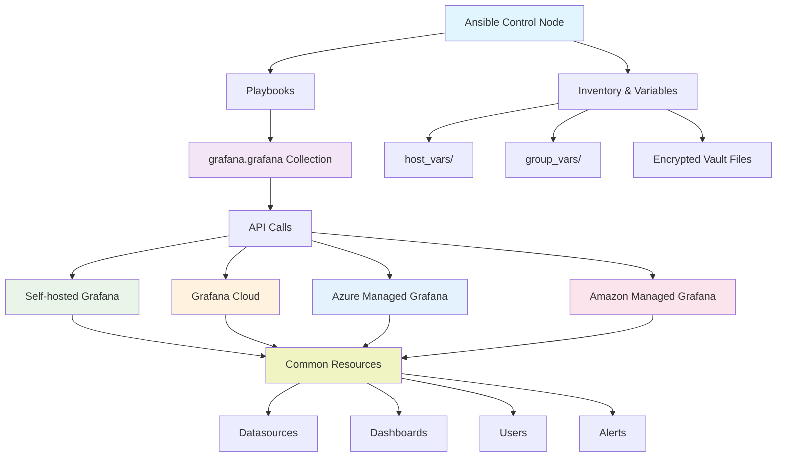

Stop clicking through Grafana's UI for repetitive configuration tasks. This comprehensive guide shows you how to **version-control your entire monitoring stack**, ensure **consistent deployments** across dev/staging/production, and **eliminate configuration drift** using proven automation patterns. Whether you're managing a single Grafana instance or orchestrating dozens across cloud and on-premises environments, you'll master the tools and techniques that DevOps teams rely on for **scalable monitoring operations**.

> **Quick Start**: Jump to [ready-to-use examples](#ready-to-use-examples) for immediate automation or explore our [GitHub repository](https://github.com/sagarnikam123/sagarnikam123-blog-youtube-code-samples/tree/main/grafana-automation) for complete automation suite including Ansible, guides, and documentation.

## Table of Contents

- [Architecture Overview](#architecture-overview)
- [When to Use Ansible for Grafana](#when-to-use-ansible-for-grafana)
- [Prerequisites](#prerequisites)
- [Quick Start (5 Minutes)](#quick-start-5-minutes)
- [Ansible Collection Information](#ansible-collection-information)
- [Platform Compatibility](#platform-compatibility)
- [Configuration & Execution](#configuration--execution)
- [Module Compatibility & Status](#module-compatibility--status)
- [Ready-to-Use Examples](#ready-to-use-examples)
- [Core Modules](#core-modules)
- [Alerting Management](#alerting-management)
- [User Management](#user-management)
- [Cloud Services Management](#cloud-services-management)
- [Best Practices](#best-practices)
- [Frequently Asked Questions (FAQ)](#frequently-asked-questions-faq)
- [Troubleshooting](#troubleshooting)
- [References](#references)

## Architecture Overview

The following diagram shows how Ansible interacts with different Grafana deployments:



## When to Use Ansible for Grafana

**Ideal Use Cases:**
- **Multi-environment deployments** - Consistent setup across dev/staging/prod
- **Infrastructure as Code** - Version-controlled Grafana configurations
- **Bulk operations** - Managing multiple datasources, dashboards, users
- **Standardization** - Enforcing organizational standards and policies
- **Disaster recovery** - Automated recreation of Grafana setups
- **CI/CD integration** - Automated deployment pipelines
- **Team onboarding** - Consistent user and permission setup
- **Compliance** - Auditable configuration management

**Not Recommended For:**
- **One-time manual tasks** - Use Grafana UI instead
- **Frequent dashboard edits** - Use Grafana editor for iterative development
- **Real-time troubleshooting** - Direct API calls are faster
- **Small single-instance setups** - Manual configuration may be simpler

## Prerequisites

```bash
# Install Ansible (2.12.0 or newer)
pip3 install ansible

# Install required Python libraries
pip3 install requests

# Install Grafana collection
ansible-galaxy collection install grafana.grafana

# Verify installation
ansible-galaxy collection list | grep grafana
```

## Quick Start (5 Minutes)

Get your first Grafana automation running in 5 minutes:

**1. Clone and setup**:
```bash
git clone https://github.com/sagarnikam123/sagarnikam123-blog-youtube-code-samples.git
cd sagarnikam123-blog-youtube-code-samples/grafana-automation/
```

**2. Configure your Grafana URL and API key**:
```bash
# Quick setup for local Grafana
echo "grafana_url: http://localhost:3000" > host_vars/grafana-local.yml
echo "grafana_api_key: your-api-key-here" >> host_vars/grafana-local.yml
```

**3. Test and create your first resource**:
```bash
# Test connection
ansible-playbook -i inventory.ini grafana_info.yml --limit grafana-local

# Create a folder
ansible-playbook -i inventory.ini operations/folder/folder_create.yml --limit grafana-local
```

✅ **Success!** Continue to [Configuration & Execution](#configuration--execution) for production setups and advanced examples.

## Ansible Collection Information

- **Collection**: [`grafana.grafana`](https://galaxy.ansible.com/grafana/grafana) v6.0.4+
- **Supported ansible-core**: 2.12.0 or newer (< 3.0.0)
- **Authors**: [Grafana Labs](https://grafana.com/), Ishan Jain, Gerard van Engelen
- **Documentation**: [Official Ansible Collection Docs](https://docs.ansible.com/ansible/latest/collections/grafana/grafana/)
- **Source Code**: [GitHub Repository](https://github.com/grafana/grafana-ansible-collection)
- **Tested With**: [Ansible](https://www.ansible.com/) 2.17.13, [Python](https://www.python.org/) 3.13.5, grafana.grafana 6.0.5

## Platform Compatibility

| Platform                   | Type        | Description                                                                           |
| -------------------------- | ----------- | ------------------------------------------------------------------------------------- |
| **Self-hosted Grafana**    | On-premises | VM installations, Docker, Kubernetes deployments                                      |
| **Grafana Cloud**          | SaaS        | [Grafana Labs managed service](https://grafana.com/products/cloud/)                   |
| **Azure Managed Grafana**  | Cloud       | [Azure's managed service](https://azure.microsoft.com/en-us/products/managed-grafana) |
| **Amazon Managed Grafana** | Cloud       | [AWS's managed service](https://aws.amazon.com/grafana/)                              |

**Setup**: For managed services, update `grafana_url` to your instance endpoint and use appropriate API keys.

## Configuration & Execution

### Method 1: Direct Variables (Testing)
**Config**: Pass variables directly using `-e`
**Use Case**: Development and testing

**Execution**:
```bash
# Test connection and get info
ansible-playbook grafana_info.yml -e "grafana_url=http://localhost:3000" -e "grafana_api_key=token"
```

### Method 2: Development Setup (Recommended)
**Config**: Variables stored in host_vars/group_vars files
**Use Case**: Development and testing (this guide focuses on this approach)

```ini
# inventory.ini - for API-based Grafana management
[grafana_prod]
grafana-prod-1 ansible_host=your-prod-grafana-1.example.com ansible_connection=local
grafana-prod-2 ansible_host=your-prod-grafana-2.example.com ansible_connection=local

[grafana_staging]
grafana-staging-1 ansible_host=your-staging-grafana.example.com ansible_connection=local

[grafana_dev]
grafana-dev-1 ansible_host=your-dev-grafana.example.com ansible_connection=local

[grafana_cloud]
grafana-cloud-1 ansible_host=your-org.grafana.net ansible_connection=local

[grafana_local]
grafana-local ansible_host=localhost ansible_connection=local

[all_grafana:children]
grafana_prod
grafana_staging
grafana_dev
grafana_cloud
grafana_local
```

**Important**: `ansible_connection=local` prevents SSH attempts and runs tasks locally. This is required for Grafana API management since:
- Grafana instances are API endpoints, not SSH servers
- Amazon Managed Grafana/Grafana Cloud don't allow SSH access
- All API calls are made from your local machine to Grafana URLs
- Variables like `grafana_url` and `grafana_api_key` are stored in `host_vars/` or `group_vars/` files

**Execution**: See [Common Execution Options](#common-execution-options-for-both-method-2--method-3) below for detailed examples.

> **💡 Tip**: If you completed the [Quick Start](#quick-start-5-minutes), you're already using Method 2. The examples below show additional configuration options and multi-environment setups.

### Method 3: Production Setup
**Config**: Same structure as Method 2 but with encrypted credentials
**Use Case**: Production environments

```yaml
# group_vars/grafana_prod.yml - shared production settings
grafana_environment: "production"
grafana_admin_name: "<admin_username>"          # Only needed for user management
grafana_admin_password: "<admin_password>"  # Only needed for user management

# host_vars/grafana-prod-1.yml - encrypted in production
grafana_url: "https://<your-prod-grafana-1>.example.com"
grafana_api_key: "<your-prod-1-api-token>"

# host_vars/grafana-prod-2.yml - encrypted in production
grafana_url: "https://<your-prod-grafana-2>.example.com"
grafana_api_key: "<your-prod-2-api-token>"
```

**For production**: Encrypt sensitive files using `ansible-vault encrypt host_vars/grafana-prod-*.yml`

**Note**: `grafana_admin_name` and `grafana_admin_password` are only required for user management operations. Most automation (datasources, dashboards, folders) uses API keys only.

**Execution**: See [Common Execution Options](#common-execution-options-for-both-method-2--method-3) below for detailed examples.

> **🔒 Security**: This method encrypts sensitive data using `ansible-vault`. For development/testing, you can use [Method 2](#method-2-development-setup-recommended) without encryption.

### Common Execution Options (for both Method 2 & Method 3)

```bash
# Note: --check mode not useful for info playbooks (they only read data)
# Use --check mode for playbooks that make changes (create/update/delete)
ansible-playbook -i inventory.ini operations/folder/folder_crud_workflow.yml --check -e target_hosts=grafana_local

# Verbose output levels
ansible-playbook -i inventory.ini grafana_info.yml -v -e target_hosts=grafana_local     # Basic verbose
ansible-playbook -i inventory.ini grafana_info.yml -vv -e target_hosts=grafana_local    # More verbose
ansible-playbook -i inventory.ini grafana_info.yml -vvv -e target_hosts=grafana_local   # Debug level

# Combine with additional variables
ansible-playbook -i inventory.ini grafana_info.yml -e "grafana_timeout=30" -e target_hosts=grafana_local
ansible-playbook -i inventory.ini grafana_info.yml -e "environment=production" -e target_hosts=grafana_prod

# Run against specific hosts/groups
ansible-playbook -i inventory.ini grafana_info.yml --limit grafana_prod -e target_hosts=grafana_prod
ansible-playbook -i inventory.ini grafana_info.yml --limit "grafana-prod-1,grafana-staging-1" -e target_hosts="grafana-prod-1,grafana-staging-1"

# Target single host from group
ansible-playbook -i inventory.ini grafana_info.yml --limit grafana_prod -e target_hosts=grafana-prod-1

# Target multiple specific hosts
ansible-playbook -i inventory.ini grafana_info.yml -e target_hosts="grafana-prod-1,grafana-prod-2"

# Target entire group
ansible-playbook -i inventory.ini grafana_info.yml -e target_hosts=all_grafana

# Target hosts from different groups
ansible-playbook -i inventory.ini grafana_info.yml -e target_hosts="grafana-prod-1,grafana-local"

# For production with encrypted host_vars
ansible-playbook -i inventory.ini grafana_info.yml --ask-vault-pass -e target_hosts=grafana_prod
```

## Module Compatibility & Status

| Module                      | Purpose        | Usage         | Status                                                                              |
| --------------------------- | -------------- | ------------- | ----------------------------------------------------------------------------------- |
| `datasource`                | Data sources   | ⭐⭐⭐ Essential | ✅ Working                                                                           |
| `folder`                    | Folders        | ⭐⭐⭐ Essential | ✅ Working                                                                           |
| `dashboard`                 | Dashboards     | ⭐⭐⭐ Essential | ✅ Working                                                                           |
| `user`                      | Users          | ⭐⭐ Common     | ✅ Working                                                                           |
| `alert_contact_point`       | Alert contacts | ⭐⭐ Common     | ✅ Working                                                                           |
| `alert_notification_policy` | Alert policies | ⭐⭐ Common     | ✅ Working                                                                           |
| `cloud_stack`               | Cloud stacks   | ⭐ Cloud Only  | 🔶 Limited                                                                           |
| `cloud_api_key`             | Cloud API keys | ⭐ Cloud Only  | ❌ Broken                                                                            |
| `cloud_plugin`              | Cloud plugins  | ⭐ Cloud Only  | ❌ Broken ([#453](https://github.com/grafana/grafana-ansible-collection/issues/453)) |

**Important Note**: The `grafana.grafana` collection modules are primarily designed for **managing** (Create/Update/Delete) resources, not for **retrieving** information. However, this guide provides complete **CRUD operations** by adding **READ** functionality using Ansible's `uri` module to interact directly with Grafana's REST API. This combination gives you full control over all Grafana resources with proper Create, Read, Update, and Delete capabilities.

**Status Legend**:
- ✅ **Working**: Module functions correctly for all operations
- 🔶 **Limited**: Module works but has restrictions (tier limits, permissions, etc.)
- ❌ **Broken**: Module has issues preventing normal operation

## Ready-to-Use Examples

The [`grafana-automation/ansible/`](https://github.com/sagarnikam123/sagarnikam123-blog-youtube-code-samples/tree/main/grafana-automation/ansible) folder contains ready-to-use playbooks and configuration files:

```
grafana-automation/ansible/
├── inventory.ini              # Inventory for all environments
├── grafana_info.yml           # Get comprehensive Grafana info
├── README.md                  # Setup and usage documentation
├── host_vars/                 # Host-specific variables
│   ├── grafana-local.yml      # Local development
│   ├── grafana-prod-1.yml     # Production instance 1
│   ├── grafana-prod-2.yml     # Production instance 2
│   ├── grafana-dev-1.yml      # Development instance
│   ├── grafana-staging-1.yml  # Staging instance
│   └── grafana-cloud.yml      # Grafana Cloud instance
├── group_vars/                # Environment-specific shared settings
│   ├── grafana_prod.yml       # Production settings
│   ├── grafana_staging.yml    # Staging settings
│   ├── grafana_dev.yml        # Development settings
│   ├── grafana_cloud.yml      # Cloud settings
│   └── grafana_local.yml      # Local settings
└── operations/                # Management operations
    ├── folder/                # Folder operations
    │   ├── folder_create.yml
    │   ├── folder_read.yml
    │   ├── folder_update.yml
    │   ├── folder_delete.yml
    │   └── folder_crud_workflow.yml
    ├── datasource/            # Datasource operations
    │   ├── datasource_create.yml
    │   ├── datasource_read.yml
    │   ├── datasource_update.yml
    │   ├── datasource_delete.yml
    │   └── datasource_crud_workflow.yml
    ├── dashboard/             # Dashboard operations
    │   ├── dashboard_create.yml
    │   ├── dashboard_read.yml
    │   ├── dashboard_update.yml
    │   ├── dashboard_delete.yml
    │   └── dashboard_crud_workflow.yml
    ├── user/                  # User operations
    │   ├── user_create.yml
    │   ├── user_read.yml
    │   ├── user_update.yml
    │   ├── user_delete.yml
    │   └── user_crud_workflow.yml
    ├── alert_contact_point/   # Alert contact point operations
    │   ├── alert_contact_point_create.yml
    │   ├── alert_contact_point_read.yml
    │   ├── alert_contact_point_update.yml
    │   ├── alert_contact_point_delete.yml
    │   └── alert_contact_point_crud_workflow.yml
    ├── alert_notification_policy/ # Alert notification policy operations
    │   ├── alert_notification_policy_create.yml
    │   ├── alert_notification_policy_read.yml
    │   ├── alert_notification_policy_update.yml
    │   ├── alert_notification_policy_delete.yml
    │   └── alert_notification_policy_crud_workflow.yml
    ├── cloud_api_key/         # Cloud API key operations
    │   ├── cloud_api_key_create.yml
    │   ├── cloud_api_key_read.yml
    │   ├── cloud_api_key_update.yml
    │   ├── cloud_api_key_delete.yml
    │   └── cloud_api_key_crud_workflow.yml
    ├── cloud_plugin/          # Cloud plugin operations
    │   ├── cloud_plugin_create.yml
    │   ├── cloud_plugin_read.yml
    │   ├── cloud_plugin_update.yml
    │   ├── cloud_plugin_delete.yml
    │   └── cloud_plugin_crud_workflow.yml
    └── cloud_stack/           # Cloud stack operations
        ├── cloud_stack_create.yml
        ├── cloud_stack_read.yml
        ├── cloud_stack_update.yml
        ├── cloud_stack_delete.yml
        └── cloud_stack_crud_workflow.yml
```

## Core Modules

### Folder Management

**Files**: `grafana-automation/ansible/operations/folder/` - Individual CRUD operations or `folder_crud_workflow.yml` for complete workflow

**Create Operations** (`operations/folder/folder_create.yml`):
```yaml
- name: Create single folder
  grafana.grafana.folder:
    grafana_url: "{{ grafana_url }}"
    grafana_api_key: "{{ grafana_api_key }}"
    title: "System Monitoring"
    uid: "system-monitoring"
    overwrite: true
    state: present

- name: Create multiple folders
  grafana.grafana.folder:
    grafana_url: "{{ grafana_url }}"
    grafana_api_key: "{{ grafana_api_key }}"
    title: "{{ item.title }}"
    uid: "{{ item.uid }}"
    overwrite: true
    state: present
  loop:
    - { title: "Infrastructure", uid: "infrastructure" }
    - { title: "Applications", uid: "applications" }
    - { title: "Security", uid: "security" }
```

**Read Operations** (`operations/folder/folder_read.yml`):
```yaml
- name: Get all folders
  uri:
    url: "{{ grafana_url }}/api/folders"
    method: GET
    headers:
      Authorization: "Bearer {{ grafana_api_key }}"
    return_content: yes
  register: folders_result

- name: Display all folders
  debug:
    var: folders_result.json

- name: Get specific folder by UID
  uri:
    url: "{{ grafana_url }}/api/folders/{{ folder_uid }}"
    method: GET
    headers:
      Authorization: "Bearer {{ grafana_api_key }}"
    return_content: yes
    status_code: [200, 404]
  vars:
    folder_uid: "system-monitoring"
  register: folder_info

- name: Display specific folder
  debug:
    var: folder_info.json
  when: folder_info.status == 200
```

**Update Operations** (`operations/folder/folder_update.yml`):
```yaml
- name: Update folder title
  grafana.grafana.folder:
    grafana_url: "{{ grafana_url }}"
    grafana_api_key: "{{ grafana_api_key }}"
    title: "Infrastructure Monitoring"  # Updated title
    uid: "infrastructure"
    overwrite: true
    state: present
```

**Delete Operations** (`operations/folder/folder_delete.yml`):
```yaml
- name: Delete single folder
  grafana.grafana.folder:
    grafana_url: "{{ grafana_url }}"
    grafana_api_key: "{{ grafana_api_key }}"
    title: "Security"  # Required even for deletion
    uid: "security"
    state: absent
  ignore_errors: true

- name: Delete multiple folders
  grafana.grafana.folder:
    grafana_url: "{{ grafana_url }}"
    grafana_api_key: "{{ grafana_api_key }}"
    title: "{{ item.title }}"
    uid: "{{ item.uid }}"
    state: absent
  loop:
    - { title: "Infrastructure", uid: "infrastructure" }
    - { title: "Applications", uid: "applications" }
  ignore_errors: true
```

**How to Run:**
```bash
# Create folders
ansible-playbook -i inventory.ini operations/folder/folder_create.yml -e target_hosts=grafana_local

# Read folders
ansible-playbook -i inventory.ini operations/folder/folder_read.yml -e target_hosts=grafana_local

# Update folders
ansible-playbook -i inventory.ini operations/folder/folder_update.yml -e target_hosts=grafana_local

# Delete folders
ansible-playbook -i inventory.ini operations/folder/folder_delete.yml -e target_hosts=grafana_local

# Complete CRUD workflow
ansible-playbook -i inventory.ini operations/folder/folder_crud_workflow.yml -e target_hosts=grafana_local
```

### Datasource Management

**Files**: `grafana-automation/ansible/operations/datasource/` - Individual CRUD operations or `datasource_crud_workflow.yml` for complete workflow

**Create Operations** (`operations/datasource/datasource_create.yml`):
```yaml
- name: Create Prometheus datasource
  grafana.grafana.datasource:
    dataSource: |
      {
        "name": "Prometheus",
        "type": "prometheus",
        "access": "proxy",
        "url": "http://localhost:9090",
        "isDefault": true,
        "jsonData": {
          "httpMethod": "POST",
          "manageAlerts": true,
          "prometheusType": "Prometheus",
          "cacheLevel": "High"
        }
      }
    grafana_url: "{{ grafana_url }}"
    grafana_api_key: "{{ grafana_api_key }}"
    state: present

- name: Create multiple datasources
  grafana.grafana.datasource:
    dataSource: "{{ item }}"
    grafana_url: "{{ grafana_url }}"
    grafana_api_key: "{{ grafana_api_key }}"
    state: present
  loop:
    - name: "Loki"
      type: "loki"
      access: "proxy"
      url: "http://localhost:3100"
      jsonData:
        maxLines: 1000
    - name: "InfluxDB"
      type: "influxdb"
      access: "proxy"
      url: "http://localhost:8086"
      database: "telegraf"
      user: "admin"
      jsonData:
        httpMode: "GET"
    - name: "MySQL"
      type: "mysql"
      access: "proxy"
      url: "localhost:3306"
      database: "grafana"
      user: "grafana_user"
      secureJsonData:
        password: "<grafana_password>"
```

**Read Operations** (`operations/datasource/datasource_read.yml`):
```yaml
- name: Get all datasources
  uri:
    url: "{{ grafana_url }}/api/datasources"
    method: GET
    headers:
      Authorization: "Bearer {{ grafana_api_key }}"
    return_content: yes
  register: datasources_result

- name: Display all datasources
  debug:
    var: datasources_result.json

- name: Get specific datasource by name
  uri:
    url: "{{ grafana_url }}/api/datasources/name/{{ datasource_name }}"
    method: GET
    headers:
      Authorization: "Bearer {{ grafana_api_key }}"
    return_content: yes
    status_code: [200, 404]
  vars:
    datasource_name: "Prometheus"
  register: datasource_info

- name: Display specific datasource
  debug:
    var: datasource_info.json
  when: datasource_info.status == 200
```

**Update Operations** (`operations/datasource/datasource_update.yml`):
```yaml
- name: Update Prometheus datasource configuration
  grafana.grafana.datasource:
    dataSource: |
      {
        "name": "Prometheus",
        "type": "prometheus",
        "access": "proxy",
        "url": "http://prometheus-server:9090",
        "isDefault": true,
        "jsonData": {
          "httpMethod": "GET",
          "manageAlerts": false,
          "prometheusType": "Prometheus",
          "cacheLevel": "Low",
          "timeInterval": "30s"
        }
      }
    grafana_url: "{{ grafana_url }}"
    grafana_api_key: "{{ grafana_api_key }}"
    state: present
```

**Delete Operations** (`operations/datasource/datasource_delete.yml`):
```yaml
- name: Delete datasource by name
  grafana.grafana.datasource:
    dataSource:
      name: "InfluxDB"
    grafana_url: "{{ grafana_url }}"
    grafana_api_key: "{{ grafana_api_key }}"
    state: absent
  ignore_errors: true

- name: Delete multiple datasources
  grafana.grafana.datasource:
    dataSource:
      name: "{{ item }}"
    grafana_url: "{{ grafana_url }}"
    grafana_api_key: "{{ grafana_api_key }}"
    state: absent
  loop:
    - "Loki"
    - "Prometheus"
  ignore_errors: true
```

**How to Run:**
```bash
# Create datasources
ansible-playbook -i inventory.ini operations/datasource/datasource_create.yml -e target_hosts=grafana_local

# Read datasources
ansible-playbook -i inventory.ini operations/datasource/datasource_read.yml -e target_hosts=grafana_local

# Update datasources
ansible-playbook -i inventory.ini operations/datasource/datasource_update.yml -e target_hosts=grafana_local

# Delete datasources
ansible-playbook -i inventory.ini operations/datasource/datasource_delete.yml -e target_hosts=grafana_local

# Complete CRUD workflow
ansible-playbook -i inventory.ini operations/datasource/datasource_crud_workflow.yml -e target_hosts=grafana_local
```

#### Finding jsonData Parameters

**Method 1: Grafana UI (Recommended)**
1. Go to **Configuration → Data Sources**
2. Add datasource manually via UI
3. Configure all settings → **Save & Test**
4. Use browser dev tools → **Network tab**
5. Look for POST request to `/api/datasources`
6. Copy `jsonData` from request payload

**Method 2: Export Existing Datasource**
```bash
# Get by name
curl -X GET "$GRAFANA_URL/api/datasources/name/Prometheus" \
  -H "Authorization: Bearer $GRAFANA_TOKEN" | jq '.jsonData'
```

**Common Parameters:**
- **Prometheus**: `{"httpMethod": "POST", "manageAlerts": true, "prometheusType": "Prometheus", "cacheLevel": "High"}`
- **Loki**: `{"maxLines": 1000, "derivedFields": []}`
- **InfluxDB**: `{"httpMode": "GET", "keepCookies": []}`

### Dashboard Management

**Files**: `grafana-automation/ansible/operations/dashboard/` - Individual CRUD operations or `dashboard_crud_workflow.yml` for complete workflow

**Create Operations** (`operations/dashboard/dashboard_create.yml`):
```yaml
- name: Download Node Exporter dashboard JSON
  uri:
    url: "https://grafana.com/api/dashboards/1860/revisions/37/download"
    method: GET
    return_content: yes
  register: node_exporter_dashboard

- name: Debug downloaded dashboard structure
  debug:
    msg: "Dashboard keys: {{ node_exporter_dashboard.json.keys() | list }}"

- name: Import Node Exporter dashboard
  grafana.grafana.dashboard:
    grafana_url: "{{ grafana_url }}"
    grafana_api_key: "{{ grafana_api_key }}"
    dashboard:
      dashboard: "{{ node_exporter_dashboard.json }}"
      overwrite: true
    state: present

- name: Download and import multiple dashboards
  uri:
    url: "https://grafana.com/api/dashboards/{{ item.id }}/revisions/{{ item.revision }}/download"
    method: GET
    return_content: yes
  register: dashboard_json
  loop:
    - { id: 13639, revision: 2, name: "Loki Dashboard" }     # by Sadlil
    - { id: 12019, revision: 1, name: "Grafana Stats" }      # by eldintest
  loop_control:
    loop_var: item
    label: "{{ item.name }}"

- name: Import downloaded dashboards
  grafana.grafana.dashboard:
    grafana_url: "{{ grafana_url }}"
    grafana_api_key: "{{ grafana_api_key }}"
    dashboard:
      dashboard: "{{ item.json }}"
      overwrite: true
    state: present
  loop: "{{ dashboard_json.results }}"
  loop_control:
    label: "Dashboard import"

- name: Create simple custom dashboard
  grafana.grafana.dashboard:
    grafana_url: "{{ grafana_url }}"
    grafana_api_key: "{{ grafana_api_key }}"
    dashboard:
      dashboard:
        title: "Simple Dashboard"
        uid: "simple-dashboard"
        tags: ["ansible"]
        timezone: "browser"
        panels: []
        time:
          from: "now-6h"
          to: "now"
        refresh: "5s"
      overwrite: true
    state: present
```

**Read Operations** (`operations/dashboard/dashboard_read.yml`):
```yaml
- name: Search all dashboards
  uri:
    url: "{{ grafana_url }}/api/search?type=dash-db"
    method: GET
    headers:
      Authorization: "Bearer {{ grafana_api_key }}"
    return_content: yes
  register: dashboards_search

- name: Display dashboards
  debug:
    var: dashboards_search.json
```

**Update Operations** (`operations/dashboard/dashboard_update.yml`):
```yaml
- name: Update simple dashboard title
  grafana.grafana.dashboard:
    grafana_url: "{{ grafana_url }}"
    grafana_api_key: "{{ grafana_api_key }}"
    dashboard:
      dashboard:
        title: "Simple Dashboard - Updated"
        uid: "simple-dashboard"
        tags: ["ansible", "updated"]
        timezone: "browser"
        panels: []
        time:
          from: "now-12h"
          to: "now"
        refresh: "10s"
      overwrite: true
    state: present
```

**Delete Operations** (`operations/dashboard/dashboard_delete.yml`):
```yaml
- name: Get all dashboards to see what exists
  uri:
    url: "{{ grafana_url }}/api/search?type=dash-db"
    method: GET
    headers:
      Authorization: "Bearer {{ grafana_api_key }}"
    return_content: yes
  register: existing_dashboards

- name: Display existing dashboards
  debug:
    msg: "Found dashboards: {{ existing_dashboards.json | map(attribute='uid') | list }}"

- name: Delete dashboards by UID
  grafana.grafana.dashboard:
    grafana_url: "{{ grafana_url }}"
    grafana_api_key: "{{ grafana_api_key }}"
    dashboard:
      dashboard:
        uid: "{{ item }}"
    state: absent
  loop:
    - "cpu-monitoring"      # CPU Monitoring dashboard
    - "rYdddlPWk"           # Node Exporter dashboard
    - "system-overview"     # System Overview dashboard
  ignore_errors: yes
  loop_control:
    label: "Deleting dashboard {{ item }}"
```

**How to Run:**
```bash
# Create dashboards
ansible-playbook -i inventory.ini operations/dashboard/dashboard_create.yml -e target_hosts=grafana_local

# Read dashboards
ansible-playbook -i inventory.ini operations/dashboard/dashboard_read.yml -e target_hosts=grafana_local

# Update dashboards
ansible-playbook -i inventory.ini operations/dashboard/dashboard_update.yml -e target_hosts=grafana_local

# Delete dashboards
ansible-playbook -i inventory.ini operations/dashboard/dashboard_delete.yml -e target_hosts=grafana_local

# Complete CRUD workflow
ansible-playbook -i inventory.ini operations/dashboard/dashboard_crud_workflow.yml -e target_hosts=grafana_local
```

## Alerting Management

### Alert Contact Point Management

**Files**: `grafana-automation/ansible/operations/alert_contact_point/` - Individual CRUD operations for contact points

**Create Operations** (`operations/alert_contact_point/alert_contact_point_create.yml`):
```yaml
- name: Create email contact point
  grafana.grafana.alert_contact_point:
    grafana_url: "{{ grafana_url }}"
    grafana_api_key: "{{ grafana_api_key }}"
    name: "ops-email"
    uid: "opsemail"
    type: "email"
    settings:
      addresses: "admin@example.com,team@example.com"
      subject: "Grafana Alert"
    disableResolveMessage: false
    state: present

- name: Create slack contact point
  grafana.grafana.alert_contact_point:
    grafana_url: "{{ grafana_url }}"
    grafana_api_key: "{{ grafana_api_key }}"
    name: "ops-slack"
    uid: "opsslack"
    type: "slack"
    settings:
      url: "https://hooks.slack.com/services/YOUR/SLACK/WEBHOOK"
      channel: "#alerts"
      username: "Grafana"
    disableResolveMessage: false
    state: present
```

**Read Operations** (`operations/alert_contact_point/alert_contact_point_read.yml`):
```yaml
- name: Get all contact points
  uri:
    url: "{{ grafana_url }}/api/v1/provisioning/contact-points"
    method: GET
    headers:
      Authorization: "Bearer {{ grafana_api_key }}"
    return_content: yes
  register: contact_points_result

- name: Display contact points
  debug:
    var: contact_points_result.json
```

**Update Operations** (`operations/alert_contact_point/alert_contact_point_update.yml`):
```yaml
- name: Update email contact point settings
  grafana.grafana.alert_contact_point:
    grafana_url: "{{ grafana_url }}"
    grafana_api_key: "{{ grafana_api_key }}"
    name: "ops-email"
    uid: "opsemail-updated"
    type: "email"
    settings:
      addresses: "admin@example.com,team@example.com,oncall@example.com"
      subject: "Grafana Alert - Updated"
    disableResolveMessage: false
    state: present
```

**Delete Operations** (`operations/alert_contact_point/alert_contact_point_delete.yml`):
```yaml
- name: Delete email contact point
  grafana.grafana.alert_contact_point:
    grafana_url: "{{ grafana_url }}"
    grafana_api_key: "{{ grafana_api_key }}"
    name: "ops-email"
    uid: "opsemail"
    type: "email"
    settings:
      addresses: "admin@example.com,team@example.com"
      subject: "Grafana Alert"
    state: absent
  ignore_errors: true

- name: Delete slack contact point
  grafana.grafana.alert_contact_point:
    grafana_url: "{{ grafana_url }}"
    grafana_api_key: "{{ grafana_api_key }}"
    name: "ops-slack"
    uid: "opsslack"
    type: "slack"
    settings:
      url: "https://hooks.slack.com/services/YOUR/SLACK/WEBHOOK"
      channel: "#alerts"
      username: "Grafana"
    state: absent
  ignore_errors: true
```

**How to Run:**
```bash
# Create contact points
ansible-playbook -i inventory.ini operations/alert_contact_point/alert_contact_point_create.yml -e target_hosts=grafana_local

# Read contact points
ansible-playbook -i inventory.ini operations/alert_contact_point/alert_contact_point_read.yml -e target_hosts=grafana_local

# Update contact points
ansible-playbook -i inventory.ini operations/alert_contact_point/alert_contact_point_update.yml -e target_hosts=grafana_local

# Delete contact points
ansible-playbook -i inventory.ini operations/alert_contact_point/alert_contact_point_delete.yml -e target_hosts=grafana_local
```

### Alert Notification Policy Management

**Files**: `grafana-automation/ansible/operations/alert_notification_policy/` - Individual CRUD operations for notification policies

**Create Operations** (`operations/alert_notification_policy/alert_notification_policy_create.yml`):
```yaml
- name: Create basic notification policy
  grafana.grafana.alert_notification_policy:
    grafana_url: "{{ grafana_url }}"
    grafana_api_key: "{{ grafana_api_key }}"
    rootPolicyReceiver: "grafana-default-email"
    groupByStr: ["alertname", "cluster"]
    groupWait: "10s"
    groupInterval: "5m"
    repeatInterval: "12h"
    routes:
      - receiver: "grafana-default-email"
        object_matchers: [["severity", "=", "critical"]]
      - receiver: "grafana-default-email"
        object_matchers: [["env", "=", "production"]]
```

**Read Operations** (`operations/alert_notification_policy/alert_notification_policy_read.yml`):
```yaml
- name: Get notification policies
  uri:
    url: "{{ grafana_url }}/api/v1/provisioning/policies"
    method: GET
    headers:
      Authorization: "Bearer {{ grafana_api_key }}"
    return_content: yes
  register: policies_result

- name: Display notification policies
  debug:
    var: policies_result.json
```

**Update Operations** (`operations/alert_notification_policy/alert_notification_policy_update.yml`):
```yaml
- name: Update notification policy settings
  grafana.grafana.alert_notification_policy:
    grafana_url: "{{ grafana_url }}"
    grafana_api_key: "{{ grafana_api_key }}"
    rootPolicyReceiver: "grafana-default-email"
    groupByStr: ["alertname", "cluster", "severity"]
    groupWait: "15s"
    groupInterval: "10m"
    repeatInterval: "24h"
    routes:
      - receiver: "grafana-default-email"
        object_matchers: [["severity", "=", "critical"]]
      - receiver: "grafana-default-email"
        object_matchers: [["severity", "=", "warning"]]
      - receiver: "grafana-default-email"
        object_matchers: [["team", "=", "infrastructure"]]
```

**Delete Operations** (`operations/alert_notification_policy/alert_notification_policy_delete.yml`):
```yaml
- name: Reset notification policy to default
  grafana.grafana.alert_notification_policy:
    grafana_url: "{{ grafana_url }}"
    grafana_api_key: "{{ grafana_api_key }}"
    rootPolicyReceiver: "grafana-default-email"
    groupByStr: []
    groupWait: "30s"
    groupInterval: "5m"
    repeatInterval: "4h"
    routes: []
  ignore_errors: true
```

**Note**: Notification policies don't have a traditional "delete" operation. Instead, this resets the policy to default configuration since Grafana requires a root notification policy to always exist.

**How to Run:**
```bash
# Create notification policies
ansible-playbook -i inventory.ini operations/alert_notification_policy/alert_notification_policy_create.yml -e target_hosts=grafana_local

# Read notification policies
ansible-playbook -i inventory.ini operations/alert_notification_policy/alert_notification_policy_read.yml -e target_hosts=grafana_local

# Update notification policies
ansible-playbook -i inventory.ini operations/alert_notification_policy/alert_notification_policy_update.yml -e target_hosts=grafana_local

# Reset notification policies to default
ansible-playbook -i inventory.ini operations/alert_notification_policy/alert_notification_policy_delete.yml -e target_hosts=grafana_local

# Complete CRUD workflow
ansible-playbook -i inventory.ini operations/alert_notification_policy/alert_notification_policy_crud_workflow.yml -e target_hosts=grafana_local
```

## User Management

**Files**: `grafana-automation/ansible/operations/user/` - Individual CRUD operations or `user_crud_workflow.yml` for complete workflow

**Important**: User management requires admin username/password authentication, not API keys. This is a Grafana API limitation.

**Create Operations** (`operations/user/user_create.yml`):
```yaml
- name: Create Grafana user
  grafana.grafana.user:
    login: "<username>"
    password: "{{ user_password }}"
    email: "<user@example.com>"
    name: "<Full Name>"
    grafana_url: "{{ grafana_url }}"
    admin_name: "{{ grafana_admin_name }}"
    admin_password: "{{ grafana_admin_password }}"
    state: present

- name: Create multiple users
  grafana.grafana.user:
    login: "{{ item.login }}"
    password: "{{ item.password }}"
    email: "{{ item.email }}"
    name: "{{ item.name }}"
    grafana_url: "{{ grafana_url }}"
    admin_name: "{{ grafana_admin_name }}"
    admin_password: "{{ grafana_admin_password }}"
    state: present
  loop:
    - { login: "<developer1>", password: "<dev_password>", name: "<Developer One>", email: "<dev1@company.com>" }
    - { login: "<operator1>", password: "<ops_password>", name: "<Operator One>", email: "<ops1@company.com>" }
  loop_control:
    label: "Creating user {{ item.login }}"
```

**Read Operations** (`operations/user/user_read.yml`):
```yaml
- name: Get organization users (with Bearer token)
  uri:
    url: "{{ grafana_url }}/api/org/users"
    method: GET
    headers:
      Authorization: "Bearer {{ grafana_api_key }}"
    return_content: yes
    status_code: [200, 403]
  register: users_result

- name: Display organization users
  debug:
    msg: "Found {{ users_result.json | length }} organization users"
  when: users_result.status == 200

- name: Show user details
  debug:
    msg: "User: {{ item.name }} ({{ item.login }}, Role: {{ item.role }}, Email: {{ item.email }})"
  loop: "{{ users_result.json if users_result.status == 200 else [] }}"
  when: users_result.status == 200

- name: Access denied
  debug:
    msg: "Access denied - check service account permissions"
  when: users_result.status == 403

- name: Get current user info
  uri:
    url: "{{ grafana_url }}/api/user"
    method: GET
    headers:
      Authorization: "Bearer {{ grafana_api_key }}"
    return_content: yes
  register: current_user

- name: Display current user
  debug:
    msg: "Current user: {{ current_user.json.name }} ({{ current_user.json.login }})"
```

**Update Operations** (`operations/user/user_update.yml`):
```yaml
- name: Update user information
  grafana.grafana.user:
    grafana_url: "{{ grafana_url }}"
    admin_name: "{{ grafana_admin_name }}"
    admin_password: "{{ grafana_admin_password }}"
    login: "<username>"
    password: "<new_password>"
    name: "<Updated Full Name>"
    email: "<updated_user@example.com>"
    state: present
```

**Delete Operations** (`operations/user/user_delete.yml`):
```yaml
- name: Delete single user
  grafana.grafana.user:
    grafana_url: "{{ grafana_url }}"
    admin_name: "{{ grafana_admin_name }}"
    admin_password: "{{ grafana_admin_password }}"
    login: "<username>"
    state: absent
  ignore_errors: true

- name: Delete multiple users
  grafana.grafana.user:
    grafana_url: "{{ grafana_url }}"
    admin_name: "{{ grafana_admin_name }}"
    admin_password: "{{ grafana_admin_password }}"
    login: "{{ item }}"
    state: absent
  loop:
    - "<developer1>"
    - "<operator1>"
  ignore_errors: true
```

**How to Run:**
```bash
# Create users
ansible-playbook -i inventory.ini operations/user/user_create.yml -e target_hosts=grafana_local

# Read users
ansible-playbook -i inventory.ini operations/user/user_read.yml -e target_hosts=grafana_local

# Update users
ansible-playbook -i inventory.ini operations/user/user_update.yml -e target_hosts=grafana_local

# Delete users
ansible-playbook -i inventory.ini operations/user/user_delete.yml -e target_hosts=grafana_local

# Complete CRUD workflow
ansible-playbook -i inventory.ini operations/user/user_crud_workflow.yml -e target_hosts=grafana_local
```


## Cloud Services Management

### Cloud API Key Management

**Files**: `grafana-automation/ansible/operations/cloud_api_key/` - Individual CRUD operations for Cloud API keys

**⚠️ Status**: Currently **NOT FUNCTIONAL** - Cloud API key management endpoints are not available in Grafana Cloud API

**Create Operations** (`operations/cloud_api_key/cloud_api_key_create.yml`):
```yaml
- name: Create Grafana Cloud API key
  grafana.grafana.cloud_api_key:
    name: "ansible-test-key"
    role: "Editor"
    org_slug: "{{ grafana_cloud_org_slug }}"
    existing_cloud_api_key: "{{ grafana_cloud_access_policy_token }}"
    fail_if_already_created: false
    state: present
  register: api_key_result

- name: Display created API key info
  debug:
    var: api_key_result
```

**Read Operations** (`operations/cloud_api_key/cloud_api_key_read.yml`):
```yaml
- name: Check available Cloud API endpoints
  uri:
    url: "https://grafana.com/api/instances/{{ grafana_cloud_stack_slug }}"
    method: GET
    headers:
      Authorization: "Bearer {{ grafana_cloud_access_policy_token }}"
    return_content: yes
  register: instance_info

- name: Display Cloud API authentication status
  debug:
    msg: "✅ Cloud API Authentication: SUCCESS"

- name: Display available Cloud API endpoints
  debug:
    msg: "{{ item.rel }}: {{ item.href }}"
  loop: "{{ instance_info.json.links }}"

- name: Display API key management limitation
  debug:
    msg: |
      ❌ API Key Management: NOT AVAILABLE via Cloud API

      Note: API keys must be managed through:
      1. Grafana instance UI: {{ grafana_url }}admin/api-keys
      2. Instance API (if available): {{ grafana_url }}api/auth/keys

      Cloud API is for instance-level management, not internal resource management.
```

**Update Operations** (`operations/cloud_api_key/cloud_api_key_update.yml`):
```yaml
- name: Update Grafana Cloud API key (recreate with new role)
  grafana.grafana.cloud_api_key:
    name: "ansible-test-key"
    role: "Admin"
    org_slug: "{{ grafana_cloud_org_slug }}"
    existing_cloud_api_key: "{{ grafana_cloud_access_policy_token }}"
    fail_if_already_created: false
    state: present
  register: updated_api_key_result

- name: Display updated API key info
  debug:
    var: updated_api_key_result
```

**Delete Operations** (`operations/cloud_api_key/cloud_api_key_delete.yml`):
```yaml
- name: Delete Grafana Cloud API key
  grafana.grafana.cloud_api_key:
    name: "ansible-test-key"
    org_slug: "{{ grafana_cloud_org_slug }}"
    existing_cloud_api_key: "{{ grafana_cloud_access_policy_token }}"
    state: absent
  register: delete_result
  ignore_errors: true

- name: Display delete result
  debug:
    var: delete_result
```

**How to Run:**
```bash
# Create API keys
ansible-playbook -i inventory.ini operations/cloud_api_key/cloud_api_key_create.yml -e target_hosts=grafana_cloud
# Status: ❌ FAILED - 404 "/orgs/<your-org-slug>/api-keys does not exist"

# Read API keys
ansible-playbook -i inventory.ini operations/cloud_api_key/cloud_api_key_read.yml -e target_hosts=grafana_cloud
# Status: ✅ SUCCESS - Shows available Cloud API endpoints and explains API key management limitations

# Update API keys
ansible-playbook -i inventory.ini operations/cloud_api_key/cloud_api_key_update.yml -e target_hosts=grafana_cloud
# Status: ❌ FAILED - 404 "/orgs/<your-org-slug>/api-keys does not exist"

# Delete API keys
ansible-playbook -i inventory.ini operations/cloud_api_key/cloud_api_key_delete.yml -e target_hosts=grafana_cloud
# Status: ❌ FAILED - "missing required arguments: role" (module parameter issue)
```

**⚠️ Important Finding**: Cloud API key management endpoints are **not available** in the current Grafana Cloud API. The `/orgs/{org}/api-keys` endpoint returns 404 even though it's listed in the organization's links. This appears to be a limitation or unimplemented feature in Grafana Cloud.

**Alternative**: Manage Cloud API keys through the Grafana Cloud UI at https://grafana.com/

### Cloud Plugin Management

**Files**: `grafana-automation/ansible/operations/cloud_plugin/` - Individual CRUD operations for Cloud plugins

**⚠️ Status**: **PARTIALLY FUNCTIONAL** - Read operations work via instance API, but Ansible module has issues

**Create Operations** (`operations/cloud_plugin/cloud_plugin_create.yml`):
```yaml
- name: Install Grafana Cloud plugin
  grafana.grafana.cloud_plugin:
    name: "grafana-github-datasource"
    version: "1.0.14"
    stack_slug: "{{ grafana_cloud_stack_slug }}"
    cloud_api_key: "{{ grafana_cloud_access_policy_token }}"
    state: present
  register: plugin_result

- name: Display plugin installation result
  debug:
    var: plugin_result
```

**Read Operations** (`operations/cloud_plugin/cloud_plugin_read.yml`):
```yaml
- name: Get plugins from Grafana instance
  uri:
    url: "{{ grafana_url }}api/plugins"
    method: GET
    headers:
      Authorization: "Bearer {{ grafana_api_key }}"
    return_content: yes
  register: plugins_result

- name: Display plugins
  debug:
    var: plugins_result.json
```

**Update Operations** (`operations/cloud_plugin/cloud_plugin_update.yml`):
```yaml
- name: Update Grafana Cloud plugin to specific version
  grafana.grafana.cloud_plugin:
    name: "grafana-github-datasource"
    version: "1.0.14"
    stack_slug: "{{ grafana_cloud_stack_slug }}"
    cloud_api_key: "{{ grafana_cloud_access_policy_token }}"
    state: present
  register: updated_plugin_result

- name: Display plugin update result
  debug:
    var: updated_plugin_result
```

**Delete Operations** (`operations/cloud_plugin/cloud_plugin_delete.yml`):
```yaml
- name: Uninstall Grafana Cloud plugin
  grafana.grafana.cloud_plugin:
    name: "grafana-github-datasource"
    stack_slug: "{{ grafana_cloud_stack_slug }}"
    cloud_api_key: "{{ grafana_cloud_access_policy_token }}"
    state: absent
  register: delete_result
  ignore_errors: true

- name: Display plugin deletion result
  debug:
    var: delete_result
```

**How to Run:**
```bash
# Install plugins
ansible-playbook -i inventory.ini operations/cloud_plugin/cloud_plugin_create.yml -e target_hosts=grafana_cloud
# Status: ❌ FAILED - KeyError: 'grafana_api_key' (module parameter issue)

# Read plugins
ansible-playbook -i inventory.ini operations/cloud_plugin/cloud_plugin_read.yml -e target_hosts=grafana_cloud
# Status: ✅ SUCCESS - Returns comprehensive list of all installed plugins from Grafana instance

# Update plugins
ansible-playbook -i inventory.ini operations/cloud_plugin/cloud_plugin_update.yml -e target_hosts=grafana_cloud
# Status: ❌ FAILED - KeyError: 'grafana_api_key' (module parameter issue)

# Delete plugins
ansible-playbook -i inventory.ini operations/cloud_plugin/cloud_plugin_delete.yml -e target_hosts=grafana_cloud
# Status: ❌ FAILED - 403 "You do not have permission to perform the requested action"
```

**⚠️ Important Findings**:
- **Module Bug**: The `grafana.grafana.cloud_plugin` module has a KeyError bug in `present_cloud_plugin()` function ([Issue #453](https://github.com/grafana/grafana-ansible-collection/issues/453))
- **Affected Operations**: Create and update operations fail with `KeyError: 'grafana_api_key'`
- **Working Operations**: Delete operations work but may have permission issues
- **Read Operations**: Work perfectly using direct instance API calls (`/api/plugins`)
- **Alternative**: Manage plugins through Grafana Cloud UI or direct API calls until bug is fixed

### Cloud Stack Management

**Files**: `grafana-automation/ansible/operations/cloud_stack/` - Individual CRUD operations for Cloud stacks

**⚠️ Status**: **LIMITED BY TIER** - Module works correctly but Free tier restricts operations

**Create Operations** (`operations/cloud_stack/cloud_stack_create.yml`):
```yaml
- name: Create Grafana Cloud stack
  grafana.grafana.cloud_stack:
    name: "ansible-test-stack"
    stack_slug: "ansible-test-stack"
    cloud_api_key: "{{ grafana_cloud_access_policy_token }}"
    org_slug: "{{ grafana_cloud_org_slug }}"
    region: "us"
    delete_protection: true
    state: present
  register: stack_result

- name: Display stack creation result
  debug:
    var: stack_result
```

**Read Operations** (`operations/cloud_stack/cloud_stack_read.yml`):
```yaml
- name: Get Cloud stacks via API
  uri:
    url: "https://grafana.com/api/instances"
    method: GET
    headers:
      Authorization: "Bearer {{ grafana_cloud_access_policy_token }}"
    return_content: yes
  register: stacks_result

- name: Display Cloud stacks
  debug:
    var: stacks_result.json
```

**Update Operations** (`operations/cloud_stack/cloud_stack_update.yml`):
```yaml
- name: Update Grafana Cloud stack with custom URL
  grafana.grafana.cloud_stack:
    name: "ansible-test-stack"
    stack_slug: "ansible-test-stack"
    cloud_api_key: "{{ grafana_cloud_access_policy_token }}"
    org_slug: "{{ grafana_cloud_org_slug }}"
    region: "us"
    url: "https://grafana.company.com"
    delete_protection: false
    state: present
  register: updated_stack_result

- name: Display stack update result
  debug:
    var: updated_stack_result
```

**Delete Operations** (`operations/cloud_stack/cloud_stack_delete.yml`):
```yaml
- name: Delete Grafana Cloud stack
  grafana.grafana.cloud_stack:
    name: "ansible-test-stack"
    stack_slug: "ansible-test-stack"
    cloud_api_key: "{{ grafana_cloud_access_policy_token }}"
    org_slug: "{{ grafana_cloud_org_slug }}"
    delete_protection: false
    state: absent
  register: delete_result
  ignore_errors: true

- name: Display stack deletion result
  debug:
    var: delete_result
```

**How to Run:**
```bash
# Create stacks
ansible-playbook -i inventory.ini operations/cloud_stack/cloud_stack_create.yml -e target_hosts=grafana_cloud
# Status: ❌ FAILED - "You have reached Maximum number of Cloud Stacks in your Org" (Free tier limit)

# Read stacks
ansible-playbook -i inventory.ini operations/cloud_stack/cloud_stack_read.yml -e target_hosts=grafana_cloud
# Status: ✅ SUCCESS - Returns detailed information about existing Cloud stacks

# Update stacks
ansible-playbook -i inventory.ini operations/cloud_stack/cloud_stack_update.yml -e target_hosts=grafana_cloud
# Status: ❌ FAILED - "You have reached Maximum number of Cloud Stacks in your Org" (Free tier limit)

# Delete stacks
ansible-playbook -i inventory.ini operations/cloud_stack/cloud_stack_delete.yml -e target_hosts=grafana_cloud
# Status: ❌ FAILED - 409 "Value must be id or slug: instanceId" (parameter validation issue)
```

**⚠️ Important Findings**:
- **Free Tier Limitations**: Grafana Cloud Free tier allows only 1 stack, preventing create/update operations
- **Read Operations**: Work perfectly and return comprehensive stack information including all service URLs
- **Parameter Issues**: Delete operation has validation issues with instance ID/slug parameters
- **Functional Module**: The `grafana.grafana.cloud_stack` module works correctly within tier limitations

**⚠️ Testing Limitations**:
- **DO NOT TEST** `cloud_stack_create.yml` on Free tier - will fail due to stack limit
- **DO NOT TEST** `cloud_stack_delete.yml` on production - will delete your entire Grafana Cloud stack and all data
- **SAFE TO TEST**: Only `cloud_stack_read.yml` for viewing existing stack information
- **Paid Tiers**: Create/update operations should work on paid tiers with multiple stack allowances
## Best Practices

1. **Use Ansible Vault** for all secrets
2. **Group by environment** (prod/staging/dev) for multiple instances
3. **Test with --check** before applying
4. **Document jsonData sources** in comments
5. **Use meaningful task names** and loop labels
6. **Test on staging first** before production
7. **Version control** playbooks (vault files are safe to commit)

## Frequently Asked Questions (FAQ)

### Q: How do I fix "Authentication Failed" errors?
**A:** Check your API token validity and verify the Grafana URL is accessible. Ensure your API key has the required permissions for the operations you're trying to perform.

### Q: What should I do if I get "Module Not Found" errors?
**A:** Install the Grafana collection using:
```bash
ansible-galaxy collection install grafana.grafana
```

### Q: How do I view encrypted vault files?
**A:** Use these commands:
```bash
# View encrypted vault file (requires password)
ansible-vault view vault.yml

# View with password file
ansible-vault view vault.yml --vault-password-file .vault_pass
```

### Q: I get "vault.yml exists, please use 'edit' instead" - how to fix?
**A:** This means the file already exists. Use:
```bash
# Edit existing vault
ansible-vault edit vault.yml

# Or encrypt existing plain text file
ansible-vault encrypt vault.yml
```

### Q: What does "input is not vault encrypted data" error mean?
**A:** The file is not encrypted. Check if it's plain text and encrypt it:
```bash
# Check if file is plain text
cat vault.yml

# Encrypt existing plain text file
ansible-vault encrypt vault.yml

# If issues persist, recreate the vault
rm vault.yml
ansible-vault create vault.yml
```

### Q: How do I securely delete vault files?
**A:** Use secure deletion methods:
```bash
# Remove encrypted vault file
rm vault.yml

# Or securely delete (overwrite before deletion)
shred -vfz -n 3 vault.yml  # Linux
rm -P vault.yml            # macOS

# Recreate vault with new credentials
ansible-vault create vault.yml
```

### Q: Can I use this with managed Grafana services?
**A:** Yes! This guide works with self-hosted Grafana, Grafana Cloud, Azure Managed Grafana, and Amazon Managed Grafana. Simply update the `grafana_url` to point to your managed instance endpoint.

### Q: Do I need admin credentials for all operations?
**A:** No. Most operations (datasources, dashboards, folders) only require API keys. Admin username/password is only needed for user management operations.

### Q: Which Grafana modules are fully functional?
**A:** The core modules (datasource, folder, dashboard, user, alert_contact_point, alert_notification_policy) are fully working. Cloud modules have limitations due to tier restrictions or API availability.

## Troubleshooting

### Common Issues

1. **Authentication Failed**
   - Check API token validity
   - Verify Grafana URL is accessible

2. **Module Not Found**
   ```bash
   ansible-galaxy collection install grafana.grafana
   ```

3. **Vault File Issues**

   **View Encrypted Vault Content**
   ```bash
   # View encrypted vault file (requires password)
   ansible-vault view vault.yml

   # View with password file
   ansible-vault view vault.yml --vault-password-file .vault_pass
   ```

   **Error: "vault.yml exists, please use 'edit' instead"**
   ```bash
   # Edit existing vault
   ansible-vault edit vault.yml

   # Encrypt existing plain text file (for production use)
   ansible-vault encrypt vault.yml
   ```

   **Error: "input is not vault encrypted data"**
   ```bash
   # Check if file is plain text
   cat vault.yml

   # Encrypt existing plain text file (for production use)
   ansible-vault encrypt vault.yml

   # If above things don't work, then remove and re-create new encrypted vault
   rm vault.yml
   ansible-vault create vault.yml
   ```

   **Delete Vault File Securely**
   ```bash
   # Remove encrypted vault file
   rm vault.yml

   # Or securely delete (overwrite before deletion)
   shred -vfz -n 3 vault.yml  # Linux
   rm -P vault.yml            # macOS

   # Recreate vault with new credentials
   ansible-vault create vault.yml
   ```

## References

- [Grafana Ansible Collection](https://github.com/grafana/grafana-ansible-collection)
- [Ansible Grafana Collection Documentation](https://docs.ansible.com/ansible/latest/collections/grafana/grafana/)
- [Grafana API Documentation](https://grafana.com/docs/grafana/latest/developers/http_api/)
