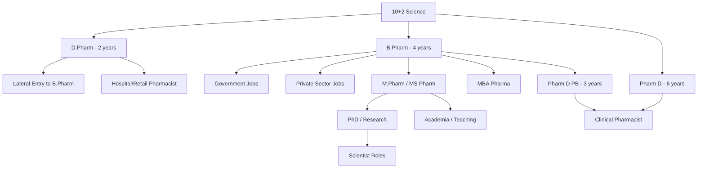
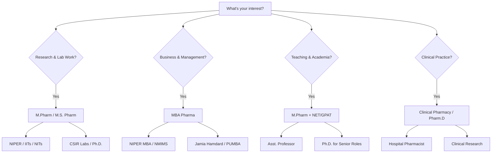

## 🎯 Introduction

Looking for **pharmacy career options in India after B.Pharm or M.Pharm**? You're in the right place. This comprehensive guide covers everything from **government jobs for pharmacists** (Drug Inspector, Railway Pharmacist, ESIC) to **higher education pathways** (NIPER, IITs, NITs, AIIMS, IISERs, CSIR Labs, MBA) with **salary trends** and preparation tips for **GPAT, GATE, and NIPER JEE**.

Pharmacy is one of the most versatile healthcare professions in India, offering diverse career paths across government, private sector, research, and academia. Whether you've completed D.Pharm, B.Pharm, M.Pharm, or Pharm.D, this guide will help you navigate your career options.

## Table of Contents

- [Career Options After B.Pharm](#-career-options-after-bpharm)
  - [Government Jobs After B.Pharm](#government-jobs-after-bpharm)
  - [Maharashtra State Government Jobs](#maharashtra-state-government-jobs)
  - [Private Sector Jobs](#private-sector-jobs-after-bpharm)
  - [Salary Trends](#salary-trends-india)
- [Higher Education After B.Pharm](#-higher-education-after-bpharm)
  - [M.Pharm Specializations](#mpharm-specializations)
  - [MBA After B.Pharm](#mba-after-bpharm)
  - [MUHS Nashik (Public Health)](#muhs-nashik-public-health--healthcare)
  - [Distance & Online Learning](#distance--online-learning)
  - [Law & IPR After B.Pharm](#law--ipr-after-bpharm)
- [Courses at Premier Institutes](#️-courses-at-premier-institutes)
  - [NIPER (7 Centers)](#niper-7-centers)
  - [IITs (23 Institutes)](#iits-23-institutes)
  - [NITs (31 Institutes)](#nits-31-institutes)
  - [AIIMS (23) & INI-CET (4) Institutes](#aiims-23--ini-cet-4-institutes)
  - [GAT-B (Central Universities)](#gat-b-central-universities)
  - [CSIR Labs (37 Institutes)](#csir-labs-37-institutes)
  - [IISc Bangalore](#iisc-bangalore-indian-institute-of-science)
  - [IISERs (7 Institutes)](#iisers-7-institutes)
  - [BARC & DAE (TIFR, BRIT, TMC)](#barc--dae-tifr-brit-tmc)
  - [Other Institutes of National Importance](#other-institutes-of-national-importance)
  - [Other Research Opportunities](#other-research-opportunities)
- [Frequently Asked Questions (FAQ)](#-frequently-asked-questions-faq)
- [Next Steps: Your Action Plan](#-next-steps-your-action-plan)
- [Useful Resources & Links](#-useful-resources--links)

### Quick Career Pathway Overview

> **Key Insight:** India is the 3rd largest pharmaceutical producer globally and the largest provider of generic medicines, creating strong demand for trained pharmacists at all levels.
{: .prompt-info }

---

## 💼 Career Options After B.Pharm

### Government Jobs After B.Pharm

Central and Indian Government jobs for Pharmacy graduates are highly respected and offer stable pay scales ranging from Level 5 to Level 10 of the 7th Pay Commission.

#### 1. Top Regulatory & Administrative Roles

| Job Title                    | Description                                                                                                                               | Eligibility                                                                        | Entry Exam / Recruiter                                       |
| ---------------------------- | ----------------------------------------------------------------------------------------------------------------------------------------- | ---------------------------------------------------------------------------------- | ------------------------------------------------------------ |
| Drug Inspector (Central)     | Inspects manufacturing units and ensures quality standards in the [CDSCO](https://cdsco.gov.in)                                           | B.Pharm or M.Pharm. Some states require 18 months of production/testing experience | [UPSC](https://www.upsc.gov.in) (Central) or State PSC exams |
| Scientific Officer / Analyst | Testing and certifying drug quality in [Central Drug Testing Labs (CDTL)](https://cdsco.gov.in/opencms/opencms/en/About-us/Laboratories/) | M.Pharm (preferred) or B.Pharm with experience                                     | [UPSC](https://www.upsc.gov.in) or Departmental Exams        |

#### 2. Hospital & Clinical Roles (Entry Level)

| Job Title                      | Description                                                                    | Eligibility                                              | Entry Exam / Recruiter                                                  |
| ------------------------------ | ------------------------------------------------------------------------------ | -------------------------------------------------------- | ----------------------------------------------------------------------- |
| Railway Pharmacist             | Working in Indian Railway Hospitals. High perks and travel benefits            | B.Pharm or D.Pharm + State Pharmacy Council Registration | [RRB](https://www.rrbcdg.gov.in) Pharmacist Exam (Computer Based Test)  |
| ESIC/CGHS Pharmacist           | Serving employees in ESI hospitals or Central Govt. Health Scheme dispensaries | B.Pharm or D.Pharm + Registration                        | [ESIC](https://esic.gov.in/) or [SSC](https://ssc.gov.in/)              |
| Pharmacist (Defense)           | Serving in Army, BSF, ITBP, or Navy hospitals                                  | B.Pharm/D.Pharm. May require physical fitness tests      | [SSC](https://ssc.gov.in/) or direct recruitment by Paramilitary forces |
| AIIMS Pharmacist               | Working in premier medical institutes like AIIMS Delhi/Jodhpur                 | B.Pharm + 1-2 years experience is often required         | [AIIMS exams](https://www.aiimsexams.ac.in) Internal Recruitment (CBT)  |
| Government Clinical Pharmacist | Patient counseling, medication review, ADR monitoring in govt. hospitals       | Pharm.D / M.Pharm                                        | State PSC / Direct recruitment                                          |

#### 3. Research & Technical Roles (Mainly for M.Pharm)

| Job Title                       | Description                                                        | Eligibility                                         | Entry Exam / Recruiter                                                                                                                        |
| ------------------------------- | ------------------------------------------------------------------ | --------------------------------------------------- | --------------------------------------------------------------------------------------------------------------------------------------------- |
| Scientist / Research Officer    | High-level research in public health, vaccines, and drug discovery | M.Pharm or Ph.D. with a valid GPAT/GATE score       | [ICMR](https://www.icmr.gov.in), [CSIR](https://www.csir.res.in/en) labs, [DRDO](https://www.drdo.gov.in), or [BARC](https://www.barc.gov.in) |
| Pharmacovigilance Officer       | Monitoring adverse drug reactions in CDSCO centers                 | B.Pharm/M.Pharm. Strong documentation skills needed | [CDSCO](https://cdsco.gov.in) / [IPC (Indian Pharmacopoeia Commission)](https://ipc.gov.in)                                                   |
| Asst. Professor (Govt. College) | Teaching in Government Pharmacy colleges                           | M.Pharm + GPAT/NET or Ph.D.                         | [UPSC](https://www.upsc.gov.in) or State PSC (e.g., UPPSC, [MPSC](https://mpsc.gov.in/home))                                                  |
| Research Scientist (Govt. Labs) | Drug development, formulation research in ICMR, CSIR, NIPER        | M.Pharm / Ph.D.                                     | [ICMR](https://www.icmr.gov.in), [CSIR](https://www.csir.res.in/en), [NIPER](https://www.niper.gov.in/)                                       |

#### 4. Central Drugs Testing Laboratories (CDTLs)

[CDSCO](https://cdsco.gov.in) operates 7 National Drug Testing Laboratories for quality control of drugs, cosmetics, and medical devices:

| Lab                                                                                 | Location         | Specialization                                        |
| ----------------------------------------------------------------------------------- | ---------------- | ----------------------------------------------------- |
| [CDL Kolkata](https://cdsco.gov.in/opencms/opencms/en/Departments/Lab/CDL-Kolkata/) | West Bengal      | Oldest statutory lab for drugs & cosmetics            |
| [CDTL Mumbai](https://cdsco.gov.in/opencms/opencms/en/Departments/Lab/CDTL-Mumbai/) | Maharashtra      | Drug & cosmetics testing                              |
| [CDTL Chennai](https://cdsco.gov.in/opencms/opencms/en/About-us/Laboratories/)      | Tamil Nadu       | Drug & cosmetics research and analysis                |
| [CDTL Hyderabad](https://cdsco.gov.in/opencms/opencms/en/About-us/Laboratories/)    | Telangana        | NABL accredited (ISO/IEC-17025:2017)                  |
| [CDL Kasauli](https://cdsco.gov.in/opencms/opencms/en/Departments/Lab/CDL_Kasauli/) | Himachal Pradesh | National Control Lab for vaccines & immunobiologicals |
| [RDTL Chandigarh](https://cdsco.gov.in/opencms/opencms/en/About-us/Laboratories/)   | Chandigarh       | Testing for North Zone states                         |
| [RDTL Guwahati](https://cdsco.gov.in/opencms/opencms/en/About-us/Laboratories/)     | Assam            | Testing for North Eastern states                      |

**Roles at CDTLs:**
- Scientific Officer / Analyst — Statutory analysis of drug samples
- Quality control testing for imported drugs at ports
- Appellate authority for drug quality disputes

**Recruitment:** [UPSC Online](https://upsconline.nic.in/) or Departmental Exams. M.Pharm preferred, B.Pharm with experience also eligible.

#### 5. Central Public Sector Undertakings (CPSUs) for Pharmacists

The [Department of Pharmaceuticals](https://pharmaceuticals.gov.in), Government of India, has 5 Central Public Sector Enterprises (CPSEs) that recruit pharmacists:

| CPSU                                                                       | Full Name                                       | Location                      | Products                                         |
| -------------------------------------------------------------------------- | ----------------------------------------------- | ----------------------------- | ------------------------------------------------ |
| [KAPL](https://www.kaplindia.com)                                          | Karnataka Antibiotics & Pharmaceuticals Limited | Bangalore                     | Tablets, Capsules, Injectables, Anti-diabetics   |
| [RDPL](https://pharma-dept.gov.in/rajasthan-drugs-pharmaceuticals-limited) | Rajasthan Drugs & Pharmaceuticals Limited       | Jaipur                        | Tablets, Capsules, Liquid Orals, ORS, Ophthalmic |
| [HAL](https://www.hal-india.co.in)                                         | Hindustan Antibiotics Limited                   | Pimpri, Pune                  | Pharmaceutical formulations, Agro-vet products   |
| [BCPL](https://www.bengalchemicals.co.in)                                  | Bengal Chemicals & Pharmaceuticals Limited      | Kolkata, Mumbai, Kanpur       | Industrial chemicals, Drugs, Cosmetics           |
| [IDPL](https://idplindia.in/)                                              | Indian Drugs & Pharmaceuticals Limited          | Rishikesh, Hyderabad, Gurgaon | Generic drugs, ORS, Anti-malarials               |

> **Note:** KAPL is a Joint Sector Company (Govt. of India + Govt. of Karnataka) and has been profit-making for 13+ consecutive years. IDPL played a crucial role during the Plague outbreak (1994) and Malaria epidemics by supplying essential medicines.
{: .prompt-info }

#### 6. Mini Ratna Companies Recruiting Pharmacists

| Company                                             | Category      | Ministry                | Location                   | Products                                                                | Eligibility                    |
| --------------------------------------------------- | ------------- | ----------------------- | -------------------------- | ----------------------------------------------------------------------- | ------------------------------ |
| [HLL Lifecare Limited](https://www.lifecarehll.com) | Mini Ratna I  | Health & Family Welfare | Thiruvananthapuram, Kerala | Contraceptives, surgical sutures, blood bags, medical devices, vaccines | D.Pharm/B.Pharm + Registration |
| [IMPCL](https://impclmohan.nic.in)                  | Mini Ratna II | AYUSH                   | Mohan, Uttarakhand         | Ayurvedic & Unani medicines (656 Ayurvedic, 332 Unani formulations)     | M.Pharm for managerial roles   |

**HLL Lifecare** recruits pharmacists for [AMRIT Pharmacy outlets](https://www.lifecarehll.com/page/render/reference/Amrit_Pharmacies) and Janasanjeevini Drug Stores at government hospitals across India.

**PSU Pharmacist Roles:**
- Production and manufacturing of pharmaceutical formulations
- Quality control and quality assurance
- Regulatory compliance and documentation
- Research and development

**Salary Range:** ₹35,000 – ₹1,10,000 per month (based on grade and experience)

#### 7. ISRO Pharmacist (Space Centers)

[ISRO (Indian Space Research Organisation)](https://www.isro.gov.in) recruits pharmacists for dispensaries and health centers at its space centers. This is a prestigious opportunity to work in India's premier space agency.

| Aspect      | Details                                      |
| ----------- | -------------------------------------------- |
| Post        | Pharmacist-A                                 |
| Eligibility | D.Pharm (First Class) OR B.Pharm             |
| Pay Level   | Level 5 (₹29,200 – ₹92,300)                  |
| Age Limit   | 18-35 years (relaxation for SC/ST/OBC)       |
| Selection   | Written Test (80 MCQs, 90 mins) + Skill Test |

**Recruiting Centers:**
- [VSSC (Vikram Sarabhai Space Centre)](https://www.vssc.gov.in), Thiruvananthapuram
- [SAC (Space Applications Centre)](https://www.sac.gov.in), Ahmedabad
- Other ISRO centers as per vacancy

**Work Profile:** Healthcare services, dispensing medicines, inventory management for ISRO employees at space centers.

> **Note:** ISRO Pharmacist is a support staff position (not Scientist/Engineer). Vacancies are limited (1-2 posts per cycle), but it offers job security and prestige of working in India's space program. Monitor [ISRO Opportunities](https://www.isro.gov.in/ViewAllOpportunities.html) for notifications.
{: .prompt-info }

#### 8. Indian Armed Forces (Army, Navy, Air Force)

Pharmacists can serve in the Indian Armed Forces through various entry routes. The Army and Air Force recruit pharmacists as uniformed personnel, while the Navy recruits them as civilian employees.

**1. Indian Army - Sepoy Pharma (Army Medical Corps)**

| Aspect             | Details                                                                                       |
| ------------------ | --------------------------------------------------------------------------------------------- |
| Post               | Sepoy Pharma (AMC)                                                                            |
| Eligibility        | D.Pharm (55% marks) OR B.Pharm (50% marks) + State Pharmacy Council Registration              |
| Age Limit          | 17.5 - 23 years                                                                               |
| Physical Standards | Height: 157 cm, Chest: 77 cm (min), Weight: proportionate                                     |
| Selection          | Physical Fitness Test → Physical Measurement Test → Medical Test → Common Entrance Exam (CEE) |
| Salary             | Level 3 (₹21,700 – ₹69,100) + allowances                                                      |
| Recruitment        | [joinindianarmy.nic.in](https://joinindianarmy.nic.in)                                        |

**2. Indian Navy - Pharmacist (Civilian)**

| Aspect      | Details                                                                   |
| ----------- | ------------------------------------------------------------------------- |
| Post        | Pharmacist (Group C, Civilian)                                            |
| Eligibility | 12th (Science) + D.Pharm + 2 years experience + Pharmacy Act Registration |
| Desirable   | B.Pharm, Computer proficiency                                             |
| Age Limit   | 18-27 years                                                               |
| Pay Level   | Level 5 (₹29,200 – ₹92,300)                                               |
| Selection   | CBT (100 MCQs, 90 mins) → Document Verification → Medical Exam            |
| Locations   | Western Naval Command, Southern Naval Command, A&N Command                |
| Recruitment | [joinindiannavy.gov.in](https://www.joinindiannavy.gov.in)                |

**3. Indian Air Force - Airmen Group Y (Medical Assistant)**

| Aspect          | Details                                                                             |
| --------------- | ----------------------------------------------------------------------------------- |
| Post            | Airmen Group Y - Medical Assistant (Pharmacist)                                     |
| Eligibility     | 10+2 (PCB, 50%) + D.Pharm/B.Sc Pharmacy (50%) + State Pharmacy Council Registration |
| Age Limit       | Up to 24 years (for Diploma/B.Sc Pharmacy holders)                                  |
| Gender          | Male only (unmarried)                                                               |
| Selection       | Online STAR Exam → Physical Fitness Test → Adaptability Test → Medical Exam         |
| Training Period | 20 years initial tenure (extendable to 57 years)                                    |
| Salary          | ₹26,900/month (after training) + DA, HRA, allowances                                |
| Recruitment     | [airmenselection.cdac.in](https://airmenselection.cdac.in)                          |

> **Key Points:** Army & Air Force recruit pharmacists as uniformed personnel (soldiers/airmen) with physical fitness requirements. Navy recruits as civilian employees. M.Pharm is NOT required — D.Pharm/B.Pharm is sufficient. State Pharmacy Council registration is mandatory for all.
{: .prompt-tip }

#### 9. Non-Pharma Government Jobs for B.Pharm Graduates

| Job Role                                                         | 2025 Salary (₹/month) | 2030 Projection (₹/month) | 2035 Projection (₹/month) | Recruitment                                                             |
| ---------------------------------------------------------------- | --------------------- | ------------------------- | ------------------------- | ----------------------------------------------------------------------- |
| [Food Safety Officer (FSO)](https://fssai.gov.in/jobs@fssai.php) | ₹45,000 – ₹70,000     | ₹65,000 – ₹1,00,000       | ₹90,000 – ₹1,35,000       | [FSSAI](https://www.fssai.gov.in) / State PSC                           |
| Tax/Excise/Customs Inspector                                     | ₹45,000 – ₹75,000     | ₹65,000 – ₹1,05,000       | ₹90,000 – ₹1,35,000       | [SSC CGL](https://ssc.gov.in/)                                          |
| Scientific Analyst / Lab Assistant                               | ₹35,000 – ₹65,000     | ₹50,000 – ₹90,000         | ₹70,000 – ₹1,20,000       | Govt. Labs                                                              |
| Health/Sanitary Inspector                                        | ₹30,000 – ₹60,000     | ₹45,000 – ₹80,000         | ₹60,000 – ₹1,00,000       | Municipal Corps                                                         |
| Bank PO/Clerk                                                    | ₹30,000 – ₹60,000     | ₹45,000 – ₹85,000         | ₹65,000 – ₹1,10,000       | [IBPS](https://www.ibps.in)/[SBI](https://sbi.co.in/web/careers)        |
| Insurance Officer (AAO/ADO)                                      | ₹35,000 – ₹70,000     | ₹50,000 – ₹1,00,000       | ₹70,000 – ₹1,30,000       | [LIC](https://licindia.in/careers), [NIACL](https://www.newindia.co.in) |
| Teaching (Govt. Polytechnic)                                     | ₹30,000 – ₹60,000     | ₹45,000 – ₹90,000         | ₹65,000 – ₹1,25,000       | State PSC                                                               |
| State Civil Services                                             | ₹40,000 – ₹1,00,000   | ₹60,000 – ₹1,40,000       | ₹90,000 – ₹2,00,000       | State PSC                                                               |
| UPSC Civil Services (IAS, IPS)                                   | ₹56,100 – ₹2,50,000   | ₹80,000 – ₹3,00,000+      | ₹1,00,000 – ₹3,50,000+    | [UPSC](https://www.upsc.gov.in)                                         |

> **Did you know?** B.Pharm graduates are eligible for [SSC CGL (Staff Selection Commission Combined Graduate Level)](https://ssc.gov.in/) exam, which opens doors to Tax Inspector, Excise Inspector, and various Central Government positions!
{: .prompt-tip }

#### Eligibility Checklist & Exam Pattern

- **Mandatory Registration:** You must be a Registered Pharmacist with a State Pharmacy Council to apply for almost all pharmacy-specific government jobs
- **Age Limit:** Generally 21 to 30 years for Drug Inspector roles and 18 to 35 years for Pharmacist roles. Age relaxations apply for SC/ST (5 yrs) and OBC (3 yrs)

**Exam Structure:** Most exams follow MCQ pattern with Pharmacy (70-80%) and General Aptitude (20-30%).

| Exam             | Duration | Pharmacy Marks | General/Aptitude | Negative Marking |
| ---------------- | -------- | -------------- | ---------------- | ---------------- |
| Drug Inspector   | Varies   | Paper 1        | Paper 2 (GK/GS)  | Varies by PSC    |
| ESIC Pharmacist  | 120 mins | ~80%           | ~20%             | Yes              |
| AIIMS Pharmacist | 90 mins  | 80 marks       | 20 marks         | Yes              |
| RRB Pharmacist   | 90 mins  | 100 MCQs       | Included         | Yes (1/3rd)      |

**Government Job Benefits:**
- Job security and pension
- House Rent Allowance (HRA) and Dearness Allowance (DA)
- Medical benefits for self and family
- Leave Travel Concession (LTC)
- Structured promotions and pay revisions

> **Pro-Tip:** If you are a B.Pharm student, qualifying for GPAT is highly recommended even for government jobs, as it provides an edge in interviews and is mandatory for research-based roles in labs like CSIR or ICMR.
{: .prompt-tip }

### Maharashtra State Government Jobs

In Maharashtra, government jobs for Pharmacy graduates and diploma holders are primarily offered through the [Maharashtra Public Service Commission (MPSC)](https://mpsc.gov.in/home), Zilla Parishad (ZP), and the Directorate of Medical Education and Research [(DMER)](https://dmer.maharashtra.gov.in/english/).

#### 1. MPSC Drug Inspector (Group B)

This is a prestigious regulatory role within the [Food and Drug Administration (FDA) Maharashtra](https://fdamfg.maharashtra.gov.in). B.Pharm/Pharmaceutical Science + Marathi proficiency + 18 months experience in drug manufacture/testing required.

#### 2. Zilla Parishad (ZP) Pharmacist

Zilla Parishads conduct recruitment for pharmacists to work in rural health centers and district hospitals. D.Pharm or B.Pharm + [MSPC](https://www.mspcindia.org) registration required.

**Salary:** Pay Level S-10 (₹29,200 – ₹92,300)

#### 3. DMER Pharmacist (Medical Education & Research)

These roles are in government medical colleges and attached hospitals across Maharashtra. 10+2 (Science) + D.Pharm or B.Pharm with valid MSPC registration.

#### 4. Other Key State Roles

- **Arogya Vibhag (Public Health Dept):** Recruits "Oshadh Nirman Adhikari" (Pharmaceutical Officers) for state hospitals. Eligibility is D.Pharm/B.Pharm
- **Municipal Corporations (BMC, PMC, NMMC, etc.):** Large cities like Mumbai and Pune conduct their own recruitment exams. They often require 2 years of work experience in addition to a degree/diploma
- **[Haffkine Institute](https://www.haffkineinstitute.org), Parel, Mumbai:** One of India's oldest biomedical research institutes (est. 1899). Offers research positions in vaccine development, drug resistance studies. M.Pharm (Pharmacology) graduates can apply for Project Assistant/Research Associate roles. [Haffkine Bio-Pharmaceutical Corporation](https://www.vaccinehaffkine.com) on the same campus manufactures vaccines

#### Summary of Common Requirements (Maharashtra)

| Requirement      | Detail                                                                                                 |
| ---------------- | ------------------------------------------------------------------------------------------------------ |
| Registration     | Mandatory registration with the [Maharashtra State Pharmacy Council (MSPC)](https://www.mspcindia.org) |
| Domicile         | Most permanent state roles require a Maharashtra Domicile Certificate                                  |
| Marathi Language | Compulsory to have passed Marathi in 10th/12th grade or pass a state language proficiency test         |
| Age Relaxation   | Standard relaxations: SC/ST/OBC (+5 years), Sportspersons (+5 years), PWD (+7 years)                   |

### Private Sector Jobs After B.Pharm

| Role                          | Description                                         |
| ----------------------------- | --------------------------------------------------- |
| Clinical Pharmacist           | Patient care and medication management in hospitals |
| Research Scientist            | Drug discovery and development                      |
| Quality Analyst / QA Officer  | Quality control and assurance in manufacturing      |
| Regulatory Affairs Specialist | Drug registration and compliance                    |
| Medical Representative        | Pharmaceutical sales and marketing                  |
| Pharmacovigilance Associate   | Drug safety monitoring and adverse event reporting  |
| Clinical Research Associate   | Managing clinical trials                            |
| Production/Manufacturing      | Drug formulation and production                     |

### Salary Trends (India)

| Job Role                              | Fresher (₹/year) | Mid-Level 3-5 yrs (₹/year) | Senior 5+ yrs (₹/year) |
| ------------------------------------- | ---------------- | -------------------------- | ---------------------- |
| Clinical Pharmacist                   | 2.5–4.0 L        | 4.5–6.0 L                  | 6.5–9.0 L              |
| Research Scientist                    | 3.0–4.5 L        | 5.0–7.0 L                  | 8.0–12.0 L             |
| Quality Analyst / QA Officer          | 2.5–4.0 L        | 4.5–6.5 L                  | 7.0–10.0 L             |
| Regulatory Affairs Specialist         | 3.0–5.0 L        | 5.5–8.0 L                  | 8.0–12.0 L             |
| Medical Representative                | 2.5–4.0 L        | 4.5–7.0 L                  | 7.0–10.0 L             |
| Pharmacovigilance / Clinical Research | 3.0–4.5 L        | 5.0–7.5 L                  | 8.0–12.0 L             |
| Hospital Pharmacist (Govt.)           | 2.5–3.5 L        | 4.0–5.5 L                  | 6.0–8.0 L              |

### Top Recruiters

- **Pharmaceutical Companies:** [Sun Pharma](https://www.sunpharma.com), [Cipla](https://www.cipla.com), [Dr. Reddy's Laboratories](https://www.drreddys.com), [Abbott India](https://www.abbott.co.in), [Lupin](https://www.lupin.com), [Glenmark](https://www.glenmarkpharma.com), [Aurobindo Pharma](https://www.aurobindo.com), [Biocon](https://www.biocon.com), [Torrent Pharmaceuticals](https://www.torrentpharma.com)
- **Healthcare Sector:** Hospitals, Diagnostic Labs, Clinical Research Organizations
- **Government:** Drug Control departments, Public Hospitals, PSUs

## 🎓 Higher Education After B.Pharm

### Which Path is Right for You?

| Your Interest             | Recommended Path            | Key Exam              | Top Institutes                                        |
| ------------------------- | --------------------------- | --------------------- | ----------------------------------------------------- |
| Research & Drug Discovery | M.Pharm / M.S. (Pharm.)     | GPAT / NIPER JEE      | NIPER, IIT BHU, CSIR Labs                             |
| Business & Corporate      | MBA (Pharma)                | CAT / CMAT / NMAT     | [NMIMS](https://www.nmims.edu/), Jamia Hamdard, NIPER |
| Teaching & Academia       | M.Pharm + Ph.D.             | GPAT + NET            | Central Universities, NITs                            |
| Clinical Practice         | Pharm.D / Clinical Pharmacy | GPAT                  | NIPER, Hospital Training                              |
| Government Jobs           | B.Pharm sufficient          | RRB / SSC / State PSC | Direct recruitment                                    |

### M.Pharm Specializations

Leads to careers in research, academia, regulatory affairs, and advanced industry roles. Common specializations include:
- Pharmacology
- Pharmaceutics
- Pharmaceutical Chemistry
- Clinical Pharmacy
- Pharmacognosy

### MBA After B.Pharm

After completing a B.Pharm, pursuing an MBA in Pharmaceutical Management or Biotechnology is a popular choice for those looking to enter the corporate side of healthcare, such as product management, marketing, or regulatory affairs.

#### 1. IIMs (Indian Institutes of Management) - Healthcare/Pharma Electives

IIMs do not offer a dedicated "MBA in Pharmaceutical Management" program. However, B.Pharm graduates can pursue their flagship MBA (PGP) program and specialize in healthcare/pharma through electives.

**Complete List of IIMs (21) in India**

**IIMs with Strong Healthcare/Pharma Focus (6)**

| IIM                                                   | Healthcare/Pharma Offering                    | Top Recruiters                  |
| ----------------------------------------------------- | --------------------------------------------- | ------------------------------- |
| [IIM Ahmedabad](https://www.iima.ac.in), Gujarat      | Healthcare Management electives, case studies | McKinsey, BCG, IQVIA, Deloitte  |
| [IIM Bangalore](https://www.iimb.ac.in), Karnataka    | Healthcare sector electives                   | Consulting firms, Pharma MNCs   |
| [IIM Calcutta](https://www.iimcal.ac.in), West Bengal | Healthcare Management electives               | Strategy consulting, Healthcare |
| [IIM Lucknow](https://www.iiml.ac.in), UP             | Healthcare electives                          | Pharma consulting, Hospitals    |
| [IIM Kozhikode](https://www.iimk.ac.in), Kerala       | Healthcare Management electives               | Pharma, Healthcare consulting   |
| [IIM Jammu](https://www.iimj.ac.in), J&K              | Healthcare & Pharma Management electives      | McKinsey, BCG, IQVIA            |

**Other IIMs (15)**

| IIM                                                     | IIM                                                      | IIM                                                        | IIM                                                   |
| ------------------------------------------------------- | -------------------------------------------------------- | ---------------------------------------------------------- | ----------------------------------------------------- |
| [IIM Indore](https://www.iimidr.ac.in), MP              | [IIM Shillong](https://www.iimshillong.ac.in), Meghalaya | [IIM Rohtak](https://www.iimrohtak.ac.in), Haryana         | [IIM Ranchi](https://www.iimranchi.ac.in), Jharkhand  |
| [IIM Raipur](https://www.iimraipur.ac.in), Chhattisgarh | [IIM Trichy](https://www.iimtrichy.ac.in), Tamil Nadu    | [IIM Kashipur](https://www.iimkashipur.ac.in), Uttarakhand | [IIM Udaipur](https://www.iimu.ac.in), Rajasthan      |
| [IIM Nagpur](https://www.iimnagpur.ac.in), Maharashtra  | [IIM Visakhapatnam](https://www.iimv.ac.in), AP          | [IIM Bodh Gaya](https://www.iimbg.ac.in), Bihar            | [IIM Amritsar](https://www.iimamritsar.ac.in), Punjab |
| [IIM Sambalpur](https://www.iimsambalpur.ac.in), Odisha | [IIM Sirmaur](https://www.iimsirmaur.ac.in), HP          | [IIM Mumbai](https://www.iimmumbai.ac.in), Maharashtra     |                                                       |

**Admission Requirements:**
- **Entrance Exam:** [CAT](https://iimcat.ac.in) (99+ percentile for top IIMs)
- **Eligibility:** Any Bachelor's degree (B.Pharm eligible) with 50% marks
- **Selection:** CAT Score + WAT (Written Ability Test)/GD + Personal Interview

**Career Paths after IIM:**
- Pharma Strategy Consulting (McKinsey, BCG, Bain)
- Healthcare Consulting (IQVIA, ZS Associates, Deloitte)
- Product Management in Pharma MNCs
- Hospital Administration & Healthcare Management

> **IIM vs Dedicated Pharma MBA:** IIMs offer broader management exposure with healthcare as elective. For focused pharma careers, NIPER, [NMIMS](https://glcconlinemba.in/), or [IIHMR](https://iihmr.edu.in/) may be better. IIMs are ideal for consulting and leadership roles in pharma strategy.
{: .prompt-info }

#### 2. Top Institutes for MBA in Pharma/Biotech

**Government & Semi-Government Institutes**

| Institute                                                  | Course                | Entrance Exam                                                                                                                                                                                                         | Eligibility                                             |
| ---------------------------------------------------------- | --------------------- | --------------------------------------------------------------------------------------------------------------------------------------------------------------------------------------------------------------------- | ------------------------------------------------------- |
| [NIPER (7 centers)](https://www.niper.gov.in)              | MBA (Pharm.)          | [GPAT](https://natboard.edu.in/viewnbeexam?exam=gpat) + [NIPER JEE](https://www.niper.gov.in)                                                                                                                         | B.Pharm with 60% marks                                  |
| [Jamia Hamdard](https://www.jamiahamdard.ac.in), New Delhi | MBA Pharma            | [CAT](https://iimcat.ac.in)/[CMAT](https://cmat.nta.nic.in)/[MAT](https://mat.aima.in)/[XAT](https://xatonline.in)                                                                                                    | Graduation with 55%                                     |
| [DPSRU](https://dpsru.edu.in), Delhi                       | MBA Pharma Management | [GPAT](https://gpat.nta.nic.in)                                                                                                                                                                                       | B.Pharm with 55%                                        |
| [IIHMR University](https://www.iihmr.edu.in), Jaipur       | MBA Pharma Management | [CAT](https://iimcat.ac.in)/[MAT](https://mat.aima.in)/[CMAT](https://cmat.nta.nic.in)/[ATMA](https://www.atmaaims.com)/[XAT](https://xatonline.in)/[GPAT](https://natboard.edu.in/viewnbeexam?exam=gpat)/IIHMR-U MAT | Graduation with 50% (Pharmacy/Science/Biotech/Medicine) |
| [PUMBA](https://www.pumba.in), Pune                        | MBA Pharma-Biotech    | [ATMA](https://www.atmaaims.com) only                                                                                                                                                                                 | B.Pharm with 50% (45% for reserved from Maharashtra)    |
| [JMI (Jamia Millia Islamia)](https://www.jmi.ac.in), Delhi | MBA                   | [CAT](https://iimcat.ac.in)/[CMAT](https://cmat.nta.nic.in)                                                                                                                                                           | Graduation with 50%                                     |

**Private Institutes**

| Institute                                                             | Course                    | Entrance Exam                                                                                                      | Eligibility         |
| --------------------------------------------------------------------- | ------------------------- | ------------------------------------------------------------------------------------------------------------------ | ------------------- |
| [NMIMS](https://www.nmims.edu/), Mumbai                               | MBA Pharma Management     | [NMAT](https://www.nmat.org)                                                                                       | Graduation with 50% |
| [SIES College](https://www.siescoms.edu), Navi Mumbai                 | PGDM Pharma/Biotech       | [CAT](https://iimcat.ac.in)/[CMAT](https://cmat.nta.nic.in)/[MAT](https://mat.aima.in)/[XAT](https://xatonline.in) | Graduation with 50% |
| [Shoolini University](https://www.shooliniuniversity.com), Himachal   | MBA Pharma                | [MAT](https://mat.aima.in)/[CAT](https://iimcat.ac.in)/HPCET                                                       | Graduation with 50% |
| [Chitkara University](https://www.chitkarauniversity.edu.in/), Punjab | MBA Pharma Management     | [CAT](https://iimcat.ac.in)/[MAT](https://mat.aima.in)                                                             | Graduation with 50% |
| [SIHS (Symbiosis)](https://www.sihspune.org), Pune                    | MBA Hospital & Healthcare | [SNAP](https://www.snaptest.org)                                                                                   | Graduation with 50% |
| [Amity University](https://www.amity.edu), Noida                      | MBA Biotechnology         | [CAT](https://iimcat.ac.in)/[MAT](https://mat.aima.in)                                                             | Graduation with 50% |

> **Top Recruiters for MBA Pharma:** [Abbott](https://www.abbott.co.in), [Cipla](https://www.cipla.com), [Sun Pharma](https://www.sunpharma.com), [Dr. Reddy's](https://www.drreddys.com), [Glenmark](https://www.glenmarkpharma.com), Accenture, Deloitte, PwC, ZS Associates, Fortis
{: .prompt-info }

#### 3. Admission Procedure & Entrance Exams

The admission process generally involves three stages: **Entrance Exam → Group Discussion (GD)/Case Study → Personal Interview (PI)**

**Specialized Pharma Entrance Exams**

- **[NIPER JEE](https://www.niper.gov.in):** Required for all NIPER institutes. You must qualify [GPAT](https://gpat.nta.nic.in) first to be eligible
- **[NMAT](https://www.nmat.org):** Required specifically for NMIMS (Mumbai/Hyderabad)
- **[IIHMR-U MAT](https://www.iihmr.edu.in):** Institute-specific test for candidates without other scores

**Common Management Entrance Tests (CETs)**

| Exam                                       | Full Form                            | Accepted By                                     |
| ------------------------------------------ | ------------------------------------ | ----------------------------------------------- |
| [CAT](https://iimcat.ac.in)                | Common Admission Test                | Jamia Hamdard, IIHMR, JMI, most institutes      |
| [CMAT](https://cmat.nta.nic.in)            | Common Management Admission Test     | Jamia Hamdard, IIHMR, SIES, most AICTE colleges |
| [MAT](https://mat.aima.in)                 | Management Aptitude Test             | IIHMR, Chitkara, Shoolini, private B-schools    |
| [XAT](https://xatonline.in)                | Xavier Aptitude Test                 | Jamia Hamdard, IIHMR, SIES                      |
| [ATMA](https://www.atmaaims.com)           | AIMS Test for Management Admissions  | PUMBA (mandatory), IIHMR                        |
| [MAH MBA CET](https://cetcell.mahacet.org) | Maharashtra MBA Common Entrance Test | SIES, Maharashtra institutes                    |
| [GPAT](https://gpat.nta.nic.in)            | Graduate Pharmacy Aptitude Test      | NIPER (mandatory), DPSRU, IIHMR                 |

#### 4. Eligibility Criteria

- **Degree:** Bachelor's degree in Pharmacy (B.Pharm), Science (B.Sc Biotech), Medicine, or related fields
- **Minimum Marks:** Usually 50% to 60% aggregate in graduation (45-50% for reserved categories)
- **GPAT Qualification:** Mandatory for NIPER and DPSRU; adds advantage at other institutes

#### 5. Quick Reference: Which Exam for Which Institute?

| Path                    | Primary Exam     | Top Target Institute     |
| ----------------------- | ---------------- | ------------------------ |
| Pure Pharma Management  | GPAT + NIPER JEE | NIPER Mohali / Ahmedabad |
| High Corporate Exposure | NMAT             | NMIMS Mumbai             |
| Government (Delhi)      | GPAT             | DPSRU                    |
| Pharma-Biotech (Pune)   | ATMA             | PUMBA                    |
| Health Management       | CAT/MAT/GPAT     | IIHMR Jaipur             |
| Affordable & Reputed    | CAT/CMAT         | Jamia Hamdard, JMI       |
| Private B-Schools       | CAT/MAT/XAT      | SIES, Shoolini, Chitkara |

### MUHS Nashik (Public Health & Healthcare)

[Maharashtra University of Health Sciences (MUHS)](https://www.muhs.ac.in), Nashik offers specialized courses in public health and healthcare management where B.Pharm and life science graduates are eligible.

#### Courses for B.Pharm/Life Science Graduates

| Course                                        | Duration | Eligibility                                                                                                                                                                                 | Location                   |
| --------------------------------------------- | -------- | ------------------------------------------------------------------------------------------------------------------------------------------------------------------------------------------- | -------------------------- |
| M.Sc. Pharmaceutical Medicine                 | 2 years  | **B.Pharm eligible** + Health Science Graduates (MBBS/BDS/BAMS/BHMS/BUMS/BPTh/BOTh/B.Sc. Nursing/Paramedical) + B.Sc. (Biochemistry/Microbiology/Botany/Zoology/Pharmacology/Biotechnology) | KEM Hospital, Mumbai       |
| MBA (Healthcare Administration)               | 2 years  | All Health Science Graduates including **B.Pharm** + Health Science Degree from any Statutory University                                                                                    | MUHS Regional Centre, Pune |
| Master of Public Health (MPH)                 | 2 years  | All Health Science Graduates including **B.Pharm** + B.Sc. (Paramedical Technology) + Health Science Degree from any Statutory University                                                   | MUHS Regional Centre, Pune |
| MPH (Nutrition)                               | 2 years  | Health Science Graduates including **B.Pharm** + B.Sc. with relevant subjects                                                                                                               | MUHS Regional Centre, Pune |
| Master of Health Professions Education (MHPE) | 2 years  | Health Science Graduates                                                                                                                                                                    | MUHS Nashik                |

**Admission:** Based on MUHS entrance exam + Interview. Apply online at [muhs.ac.in](https://www.muhs.ac.in)

**Career Opportunities:**
- Pharmaceutical Medicine Specialist (Drug Safety, Clinical Trials)
- Hospital Administrator
- Public Health Officer
- Healthcare Consultant
- Health Policy Analyst
- Clinical Research Manager

> **Good News for B.Pharm Graduates:** All three major MUHS courses — M.Sc. Pharmaceutical Medicine, MBA (Healthcare Administration), and MPH — accept B.Pharm graduates! M.Sc. Pharmaceutical Medicine is particularly relevant as it focuses on drug development, clinical trials, and pharmacovigilance.
{: .prompt-tip }

### Distance & Online Learning

For working professionals or those who cannot pursue full-time education, several UGC-DEB approved universities offer distance and online courses relevant to pharmacy graduates.

#### Top Government/Open Universities

| University                                                                              | Location  | Courses for B.Pharm Graduates                               |
| --------------------------------------------------------------------------------------- | --------- | ----------------------------------------------------------- |
| [IGNOU (Indira Gandhi National Open University)](https://ignouadmission.samarth.edu.in) | New Delhi | MBA, PG Diploma in Clinical Research, PG Diploma in IPR, MA |
| [YCMOU (Yashwantrao Chavan Maharashtra Open University)](https://www.ycmou.ac.in)       | Nashik    | MBA, MCA, MA, B.Ed                                          |
| [Dr. B.R. Ambedkar Open University](https://www.braouonline.in)                         | Hyderabad | MBA, MCA, MA                                                |
| [Karnataka State Open University (KSOU)](https://ksoumysuru.ac.in)                      | Mysore    | MBA, MA, M.Com                                              |
| [University of Mysore Online](https://online.mysore.university)                         | Mysore    | MBA, BBA, M.Com                                             |
| [Tamil Nadu Open University (TNOU)](https://www.tnou.ac.in)                             | Chennai   | MBA, MCA, MA                                                |

#### Top Private Universities (UGC-DEB Approved Online)

| University                                                                       | Location   | Courses for B.Pharm Graduates    |
| -------------------------------------------------------------------------------- | ---------- | -------------------------------- |
| [SCDL (Symbiosis Centre for Distance Learning)](https://onlineprograms.scdl.net) | Pune       | PGDBA, PG Diploma in IPR, PGDHRM |
| [NMIMS Global Access (NGA-SCE)](https://admissions.igniteonline.in)              | Mumbai     | MBA, BBA, B.Com                  |
| [Jamia Hamdard Online](https://jamiahamdardonline.in/)                           | New Delhi  | MBA, BBA, B.Com                  |
| [Amity University Online](https://www.amityonline.com)                           | Noida      | MBA, MCA, BBA                    |
| [Manipal University Online](https://www.onlinemanipal.com)                       | Jaipur     | MBA, MCA, M.Com                  |
| [LPU Online](https://www.lpuonline.com)                                          | Punjab     | MBA, MCA, MA                     |
| [Chandigarh University Online](https://www.onlinecu.in)                          | Chandigarh | MBA, MCA, BBA                    |
| [Sikkim Manipal University (SMU-DE)](https://www.smude.edu.in)                   | Sikkim     | MBA, MCA, BBA                    |
| [Jain University Online](https://www.onlinejain.com)                             | Bangalore  | MBA, MCA, M.Com                  |

#### Popular Distance Courses for B.Pharm Graduates

| Course                             | Duration | Best Universities            |
| ---------------------------------- | -------- | ---------------------------- |
| MBA (Healthcare/Pharma Management) | 2 years  | IGNOU, NMIMS, Amity, Manipal |
| PG Diploma in Clinical Research    | 1 year   | IGNOU                        |
| PG Diploma in IPR                  | 1 year   | SCDL, IGNOU                  |
| PG Diploma in Hospital Management  | 1 year   | IGNOU, SCDL                  |
| MBA (General)                      | 2 years  | IGNOU, SCDL, NMIMS, Amity    |

> **Tip:** Distance/Online MBA is ideal for working pharmacists who want to upskill without leaving their jobs. Ensure the university is UGC-DEB approved before enrolling.
{: .prompt-tip }

### Professional Certifications

Short-term programmes in:
- Clinical Research
- Pharmacovigilance
- Regulatory Affairs
- Hospital Pharmacy
- Digital Healthcare

[IGMPI (Indo-German Training Centre)](https://www.igmpi.ac.in), Greater Noida offers PG Diploma/Executive Diploma courses (6-24 months) for graduates in any discipline:

| Course                             | Focus Area                                                 |
| ---------------------------------- | ---------------------------------------------------------- |
| Pharmaceutical GMP                 | Quality assurance, regulatory compliance, validation       |
| Pharmaceutical API Manufacturing   | API synthesis, process controls, scale-up                  |
| Pharmacoinformatics                | AI/ML in drug discovery, molecular docking, bioinformatics |
| Pharmacovigilance                  | Drug safety, adverse event reporting                       |
| Pharmaceutical Business Management | Pharma marketing, sales, strategy                          |
| Regulatory Affairs                 | Drug registration, compliance, submissions                 |

### Law & IPR After B.Pharm

B.Pharm graduates have unique opportunities in pharmaceutical law, patent rights, and regulatory compliance. This is a niche field with high demand as pharma companies need legal experts who understand drug development.

#### 1. LLB (Bachelor of Laws) - 3 Years

B.Pharm graduates can pursue a 3-year LLB from any recognized law college.

**Entrance Exams:**
- [CLAT (Common Law Admission Test)](https://consortiumofnlus.ac.in) — For 25 National Law Universities
- [AILET](https://nludelhi.ac.in) — For NLU Delhi
- [LSAT India](https://www.lsac.org/lsat) — For private law schools
- State-level Law CETs

**Career Options after B.Pharm + LLB:**
- Pharmaceutical Patent Lawyer
- Drug Regulatory Affairs Consultant
- Legal Advisor to Pharma Companies
- IPR (Intellectual Property Rights) Specialist
- Corporate Lawyer (Pharma sector)
- Legal Compliance Officer

#### 2. Patent Agent (Without LLB)

B.Pharm graduates are directly eligible to become Patent Agents without needing an LLB degree — this is a major advantage!

**Eligibility:** B.Pharm/M.Pharm degree from recognized university + Indian citizenship

**Exam:** [Indian Patent Agent Examination](https://ipindia.gov.in) (conducted by Indian Patent Office)
- Paper 1: Patents Act, Rules, PCT (Patent Cooperation Treaty)
- Paper 2: Drafting & Interpretation of Patent Specifications
- Viva Voce

**Career Roles:** Patent Agent, Patent Analyst, IP Associate in law firms/pharma companies

> **Why Patent Agent?** India's pharma industry files thousands of patents annually. Patent Agents with pharmacy background are highly valued as they understand both the science and legal aspects of drug patents.
{: .prompt-tip }

#### 3. Top Institutes for IPR & Patent Law

**National Law Universities (NLUs) - LLM in IPR**

| Institute                                                                   | Location    | Course                            |
| --------------------------------------------------------------------------- | ----------- | --------------------------------- |
| [NLSIU (National Law School of India University)](https://www.nls.ac.in)    | Bangalore   | PG Diploma in IPR Law, LLM in IPR |
| [NALSAR University of Law](https://www.nalsar.ac.in)                        | Hyderabad   | LLM in IPR, Certificate courses   |
| [NUJS (WB National University of Juridical Sciences)](https://www.nujs.edu) | Kolkata     | LLM in IPR                        |
| [GNLU (Gujarat National Law University)](https://www.gnlu.ac.in)            | Gandhinagar | LLM in IPR                        |
| [NLIU (National Law Institute University)](https://www.nliu.ac.in)          | Bhopal      | LLM in IPR                        |

**IITs & Technical Institutes**

| Institute                                           | Location    | Course                        |
| --------------------------------------------------- | ----------- | ----------------------------- |
| [IIT Kharagpur (RGSOIPL)](https://www.iitkgp.ac.in) | West Bengal | M.Sc. in IP Law & Management  |
| [IIT Madras](https://www.iitm.ac.in)                | Chennai     | Certificate in IPR            |
| [NPTEL](https://nptel.ac.in)                        | Online      | Free IPR Course (Certificate) |

**Specialized IPR Institutes**

| Institute                                                                                        | Location      | Course                               |
| ------------------------------------------------------------------------------------------------ | ------------- | ------------------------------------ |
| [RGNIIPM (Rajiv Gandhi National Institute of IP Management)](https://ipindia.gov.in/rgniipm.htm) | Nagpur        | PG Diploma in IPR, Training programs |
| [IGMPI (Indo-German Training Centre)](https://www.igmpi.ac.in)                                   | Greater Noida | PG Diploma in IPR (PGDIPR)           |
| [TIFAC](https://www.tifac.org.in)                                                                | Delhi         | IPR Training, Patent Search          |
| [IPAI (Institute of Patent Attorneys India)](https://www.ipaindia.co.in)                         | Delhi         | Patent Agent Exam Preparation        |

**Distance/Online IPR Courses**

| Institute                                                 | Course                         | Duration   |
| --------------------------------------------------------- | ------------------------------ | ---------- |
| [WIPO Academy](https://www.wipo.int/portal/en/index.html) | DL courses in IP (Free)        | 2-10 weeks |
| [NLSIU PACE](https://pace.nls.ac.in)                      | PG Diploma in IPR Law (Online) | 1 year     |
| [SCDL Pune](https://symbiosisonlinemba.ssodl.edu.in/)     | Certificate in IPR             | 6 months   |
| [IGNOU](https://ignouadmission.samarth.edu.in)            | PG Diploma in IPR              | 1 year     |

**Patent Agent Exam Preparation Institutes**

| Institute                                                                | Institute                                                               | Institute                                             |
| ------------------------------------------------------------------------ | ----------------------------------------------------------------------- | ----------------------------------------------------- |
| [IPAI (Institute of Patent Attorneys India)](https://www.ipaindia.co.in) | [IIPRD (Indian Institute of Patent & Trademark)](https://www.iiprd.com) | [GIIP (Global Institute of IP)](https://giipinfo.com) |

> **Best for B.Pharm:** IIT Kharagpur, IGMPI, RGNIIPM focus on technical IP. WIPO Academy and NPTEL offer free online courses. Patent Agent Exam doesn't require LLB — B.Pharm is directly eligible!
{: .prompt-tip }

#### 4. Regulatory Affairs & Drug Law

**Roles:**
- Drug Regulatory Affairs Officer
- [CDSCO](https://cdsco.gov.in) Compliance Specialist
- Medical Device Regulatory Specialist
- Pharmacovigilance & Legal Compliance Officer

**Courses:**
- PG Diploma in Regulatory Affairs — [NIPER](https://www.niper.gov.in), [IGMPI](https://www.igmpi.ac.in)
- M.Pharm in Regulatory Affairs

#### 5. Career Paths in Law & IPR

| Career Path              | Required Qualification       | Top Recruiters                                                                    |
| ------------------------ | ---------------------------- | --------------------------------------------------------------------------------- |
| Patent Agent             | B.Pharm + Patent Agent Exam  | Law firms, Pharma R&D, IP consultancies                                           |
| Pharma Lawyer            | B.Pharm + LLB                | Pharma companies, Corporate law firms                                             |
| IPR Specialist           | B.Pharm + IPR Diploma/LLM    | [Cipla](https://www.cipla.com), [Sun Pharma](https://www.sunpharma.com), IP firms |
| Regulatory Affairs       | B.Pharm + PG Diploma/M.Pharm | [CDSCO](https://cdsco.gov.in), Pharma MNCs                                        |
| Drug Inspector           | B.Pharm + UPSC/State PSC     | [FDA](https://fdamfg.maharashtra.gov.in), State Drug Control                      |
| Legal Compliance Officer | B.Pharm + LLB/IPR course     | Pharma companies, CROs                                                            |

> **Unique Advantage:** Very few lawyers understand pharmaceutical science. B.Pharm + Law/IPR is a rare combination that commands premium salaries in the pharma industry.
{: .prompt-info }

## 🏛️ Courses at Premier Institutes

### Quick Comparison: Which Institute is Right for You?

| Factor                | NIPER                          | IITs                        | NITs                           | AIIMS                             | Central Universities (GAT-B)  | CSIR Labs                    | IISERs                         | DAE (BARC/TIFR)               |
| --------------------- | ------------------------------ | --------------------------- | ------------------------------ | --------------------------------- | ----------------------------- | ---------------------------- | ------------------------------ | ----------------------------- |
| **Focus**             | Pure Pharmacy                  | Engineering + Pharma        | Biotechnology                  | Medical Sciences                  | Biotechnology / Life Sciences | Drug Discovery, Toxicology   | Basic Sciences Research        | Nuclear Science, Biology      |
| **Best For**          | Drug Research, Pharma Industry | Biomedical Engineering, R&D | Bioprocess, Industrial Biotech | Clinical Research, Medical Pharma | Research, Academia            | Pharma R&D, Drug Development | Fundamental Research, Academia | Radiopharmacy, Neuroscience   |
| **Entrance Exam**     | GPAT + NIPER JEE               | GATE (BT/XL)                | GATE (BT/XL)                   | INI-CET / AIIMS Exam              | GAT-B                         | CSIR-NET / GATE              | JAM/GATE/IISER Test            | OCES/TIFR-GS/JGEEBILS         |
| **B.Pharm Eligible?** | Yes                            | Yes (some programs)         | Yes (some programs)            | Yes                               | Yes                           | Yes (JRF/Project)            | Yes                            | Limited (TIFR: Yes, BARC: No) |
| **Stipend**           | ₹12,400/month                  | ₹12,400/month               | ₹12,400/month                  | ₹31,000/month (JRF)               | Varies                        | ₹37,000/month (JRF)          | ₹37,000/month (JRF)            | ₹37,000-74,000/month          |
| **Fees (approx.)**    | ₹30,000-50,000/year            | ₹20,000-50,000/year         | ₹20,000-40,000/year            | Minimal                           | ₹10,000-30,000/year           | Minimal                      | Minimal                        | Minimal/Free                  |
| **Placement**         | 85-95%                         | 90%+                        | 80-90%                         | Hospital/Research                 | Academia/Research             | Research/Academia            | Academia/Research              | Govt. Scientific Officer      |
| **No. of Institutes** | 7                              | 23 (6 relevant)             | 31 (5 relevant)                | 23                                | 15+                           | 37 (7 pharma-relevant)       | 7                              | 6 DAE + 8 TIFR centers        |

> **Which exam should you prioritize?**
> - **[GPAT](https://gpat.nta.nic.in)** — Required for NIPER, some IITs, and many private colleges
> - **[GATE (BT/XL)](https://gate.iitk.ac.in)** — Required for IITs, NITs, IISERs, BARC OCES, and provides better stipend options
> - **[GAT-B](https://rcb.res.in/DBTPG/)** — For Central Universities offering M.Sc. Biotechnology
> - **[INI-CET](https://aiimsexams.ac.in)** — For AIIMS and other medical institutes
> - **[JAM-BT](https://jam.iitd.ac.in)** — For IISc, IISERs Integrated PhD programs
> - **[JGEEBILS](https://jgeebils.ncbs.res.in)** — For NCBS, InStem, TIFR (Biology)
> - **[BARC OCES](https://barcocesexam.in)** — For DAE Scientific Officer (requires M.Sc. after B.Pharm)
{: .prompt-tip }

### NIPER (7 Centers)

[NIPER JEE](https://www.niper.gov.in/niperjee2025/) (Joint Entrance Examination) is a national-level entrance exam conducted by the National Institutes of Pharmaceutical Education and Research (NIPERs). These are "Institutes of National Importance" under the Ministry of Chemicals and Fertilizers, specifically designed to provide high-level education and research in pharmaceutical sciences.

#### NIPER Centers in India

There are currently 7 NIPER centers across India:

| NIPER                                                       | NIPER                                                         | NIPER                                                  | NIPER                                                    |
| ----------------------------------------------------------- | ------------------------------------------------------------- | ------------------------------------------------------ | -------------------------------------------------------- |
| [NIPER Mohali](https://www.niper.gov.in), Punjab (Flagship) | [NIPER Hyderabad](https://www.niperhyd.ac.in), Telangana      | [NIPER Ahmedabad](https://www.niperahm.ac.in), Gujarat | [NIPER Raebareli](https://www.niperraebareli.edu.in), UP |
| [NIPER Guwahati](https://www.niperguwahati.ac.in), Assam    | [NIPER Kolkata](https://www.niperkolkata.edu.in), West Bengal | [NIPER Hajipur](https://www.niperhajipur.ac.in), Bihar |                                                          |

#### Courses Offered After D.Pharm, B.Pharm, or M.Pharm

The eligibility and course structure at NIPER are strictly hierarchical.

**1. After D.Pharm (Diploma in Pharmacy)**

- **Direct Entry:** There are no courses at NIPER for D.Pharm holders
- **Path:** You must first complete a B.Pharm degree (often via lateral entry to the 2nd year). NIPER only offers postgraduate (Master's) and doctoral (Ph.D.) levels of education

**2. After B.Pharm (Bachelor of Pharmacy)**

B.Pharm graduates are the primary applicants for NIPER JEE. You must have a valid GPAT score to be eligible for these 2-year programs:

- **M.S. (Pharm.):** Offered in various specializations like Medicinal Chemistry, Pharmaceutics, Pharmacology & Toxicology, Pharmaceutical Analysis, Biotechnology, Pharmacoinformatics, and Regulatory Affairs
- **M.Pharm.:** Traditional Pharmacy degrees like Pharmaceutical Technology (Formulations) or Clinical Research
- **M.Tech. (Pharm.):** Specialized technology courses like Process Chemistry or Medical Devices
- **MBA (Pharm.):** A highly sought-after 2-year program in Pharmaceutical Management

**3. After M.Pharm (Master of Pharmacy)**

If you already hold a Master's degree (M.S. Pharm, M.Pharm, or M.Tech Pharm), you are eligible for:

- **Ph.D. (Doctor of Philosophy):** Research-based doctoral programs in all the specializations mentioned above. Admission is based on the NIPER JEE (Ph.D.) entrance exam and a subsequent interview

#### Eligibility & Admission Procedure

- **Qualification:** For Masters, you need a B.Pharm with at least 60% marks (55% for SC/ST)
- **Mandatory Exam:** A valid GPAT/GATE/NET score is required for most programs (except for MBBS/B.V.Sc. candidates applying for specific M.S. branches)

**NIPER JEE Exam Pattern:**

| Aspect    | Details                                                                            |
| --------- | ---------------------------------------------------------------------------------- |
| Format    | Computer-based test (CBT)                                                          |
| Questions | 200 Multiple Choice Questions (MCQs)                                               |
| Duration  | 2 Hours                                                                            |
| Syllabus  | 75% from B.Pharm core subjects, 25% from General Aptitude (English, Reasoning, GK) |

#### Why Choose NIPER?

NIPER institutes are known for their high placement standards (averaging 85–95%) and stipends. Most Master's students receive a stipend of ₹12,400 per month, while Ph.D. scholars receive significantly higher research fellowships.

### IITs (23 Institutes)

As a Pharmacy student (B.Pharm or M.Pharm), you have several specialized pathways within the Indian Institutes of Technology (IITs). While IITs are primarily engineering-focused, they have evolved into multidisciplinary hubs for Biomedical Engineering, Biotechnology, and Pharmaceutical Technology.

#### Complete List of IITs in India

There are 23 IITs across India. The 6 IITs offering B.Pharm-relevant courses are listed separately below. Here are the remaining 17 IITs:

| IIT                                       | IIT                                           | IIT                                         | IIT                                      |
| ----------------------------------------- | --------------------------------------------- | ------------------------------------------- | ---------------------------------------- |
| [IIT Kharagpur](https://www.iitkgp.ac.in) | [IIT Kanpur](https://www.iitk.ac.in)          | [IIT Guwahati](https://www.iitg.ac.in)      | [IIT Roorkee](https://www.iitr.ac.in)    |
| [IIT Jodhpur](https://www.iitj.ac.in)     | [IIT Patna](https://www.iitp.ac.in)           | [IIT Bhubaneswar](https://www.iitbbs.ac.in) | [IIT Ropar](https://www.iitrpr.ac.in)    |
| [IIT Indore](https://www.iiti.ac.in)      | [IIT Mandi](https://www.iitmandi.ac.in)       | [IIT Gandhinagar](https://www.iitgn.ac.in)  | [IIT Palakkad](https://www.iitpkd.ac.in) |
| [IIT Tirupati](https://www.iittp.ac.in)   | [IIT Dhanbad (ISM)](https://www.iitism.ac.in) | [IIT Goa](https://www.iitgoa.ac.in)         | [IIT Jammu](https://www.iitjammu.ac.in)  |
| [IIT Dharwad](https://www.iitdh.ac.in)    |                                               |                                             |                                          |

Source: [IIT Council](https://iitsystem.ac.in/)

#### 1. Courses after B.Pharm (Undergraduate to Masters)

B.Pharm graduates can apply for M.Tech programs, which are usually 2 years. Most IITs require a valid GATE score (usually in Biotechnology - BT or Life Sciences - XL) or sometimes a GPAT score.

| IIT Institute                                           | Course Name                        | Eligibility / Special Note                                                                                                            |
| ------------------------------------------------------- | ---------------------------------- | ------------------------------------------------------------------------------------------------------------------------------------- |
| [IIT BHU (Varanasi)](https://www.iitbhu.ac.in/dept/phe) | M.Pharm (Multiple Specializations) | The only IIT that offers a traditional M.Pharm. Specializations: Pharmaceutics, Pharmaceutical Chemistry, Pharmacology, Pharmacognosy |
| [IIT Bombay](https://www.iitb.ac.in)                    | M.Tech Biomedical Engineering      | Open to B.Pharm graduates with a valid GATE score. Requires 60% marks in B.Pharm                                                      |
| [IIT Delhi](https://www.iitd.ac.in)                     | M.Tech Biomedical Engineering      | Eligibility includes B.Pharm. Admission is often based on GATE/GPAT scores + interview                                                |
| [IIT Hyderabad](https://www.iith.ac.in)                 | M.Tech Medical Biotechnology       | Specifically lists B.Pharm as an eligible degree. Focuses on therapeutics and clinical genomics                                       |
| [IIT Madras](https://www.iitm.ac.in)                    | M.Tech Bioprocess Engineering      | Interdisciplinary course accepting B.Pharm candidates with GATE (BT/XL) scores                                                        |
| [IIT Bhilai](https://www.iitbhilai.ac.in)               | M.Tech Bioengineering              | Lists B.Pharm (4 years) with 60% marks as a qualifying degree                                                                         |

#### 2. Courses after M.Pharm (Masters to Doctorate)

If you have an M.Pharm, your primary path in an IIT is a Ph.D., which allows you to conduct high-end research in drug delivery, drug discovery, or medical devices.

- **Ph.D. in Pharmaceutical Engineering & Technology ([IIT BHU](https://www.iitbhu.ac.in/dept/phe)):** Direct research in core pharmacy areas
- **Ph.D. in Biosciences & Bioengineering:** Available at [IIT Bombay](https://www.iitb.ac.in), [IIT Kanpur](https://www.iitk.ac.in), [IIT Guwahati](https://www.iitg.ac.in), and [IIT Roorkee](https://www.iitr.ac.in). Topics include cancer research, nanotechnology, and bioinformatics
- **Ph.D. in Chemistry (Medicinal Chemistry):** Many M.Pharm (Pharmaceutical Chemistry) students join the Chemistry departments for drug synthesis research
- **M.S. (Research):** Some IITs (like [IIT Delhi](https://www.iitd.ac.in)) offer M.S. (R) in Biological Sciences, which is a research-intensive master's degree often leading to a Ph.D.

#### 3. Strategic Career Paths

- **Biomedical Engineering:** The most popular pivot for pharmacy students. Combines pharmacy knowledge (how drugs work) with engineering (how to deliver them using implants or nanodevices)
- **Computational Biology:** If you have an interest in IT/Coding, explore M.Tech in Computational Biology (offered by IIT Hyderabad or IIT Gandhinagar), useful for "In-silico" drug design

#### Admission Requirements Checklist

- **GATE / GPAT:** Most M.Tech programs require a GATE score. While some IITs (like IIT Delhi/IIT BHU) have historically accepted GPAT, GATE (Biotechnology or Life Sciences) is more widely recognized across all IITs
- **Mathematics:** Some IITs (like IIT Bombay) may require you to have had Mathematics in your 10+2 (Higher Secondary) to be eligible for M.Tech programs
- **Minimum Marks:** Usually 60% (or 6.5 CGPA) for General/OBC and 55% (or 6.0 CGPA) for SC/ST

### NITs (31 Institutes)

While National Institutes of Technology (NITs) are primarily technical and engineering-centric, they offer several strategic pathways for Pharmacy students. Unlike IIT BHU (which has a dedicated Pharmacy department), most NITs integrate Pharmacy graduates into Biotechnology, Biomedical Engineering, or Life Sciences departments.

#### Complete List of NITs in India

There are 31 NITs across India (plus IIEST Shibpur under NIT Council). The 5 NITs offering B.Pharm-relevant courses are listed separately below. Here are the remaining 27 NITs:

| NIT                                                            | NIT                                                             | NIT                                                            | NIT                                                           |
| -------------------------------------------------------------- | --------------------------------------------------------------- | -------------------------------------------------------------- | ------------------------------------------------------------- |
| [NIT Karnataka (NITK)](https://www.nitk.ac.in), Surathkal      | [NIT Bhopal (MANIT)](https://www.manit.ac.in), MP               | [IIEST Shibpur](https://www.iiests.ac.in), West Bengal         | [NIT Nagpur (VNIT)](https://www.vnit.ac.in), Maharashtra      |
| [NIT Jamshedpur (NITJSR)](https://www.nitjsr.ac.in), Jharkhand | [NIT Srinagar (NITSRI)](https://www.nitsri.ac.in), J&K          | [NIT Surat (SVNIT)](https://www.svnit.ac.in), Gujarat          | [NIT Jaipur (MNIT)](https://www.mnit.ac.in), Rajasthan        |
| [NIT Kurukshetra (NITKKR)](https://www.nitkkr.ac.in), Haryana  | [NIT Trichy (NITT)](https://www.nitt.edu), Tamil Nadu           | [NIT Silchar (NITS)](https://www.nits.ac.in), Assam            | [NIT Hamirpur (NITH)](https://www.nith.ac.in), HP             |
| [NIT Jalandhar (NITJ)](https://www.nitj.ac.in), Punjab         | [NIT Patna (NITP)](https://www.nitp.ac.in), Bihar               | [NIT Raipur (NITRR)](https://www.nitrr.ac.in), Chhattisgarh    | [NIT Agartala (NITA)](https://www.nita.ac.in), Tripura        |
| [NIT Arunachal (NITAP)](https://www.nitap.ac.in), Arunachal    | [NIT Delhi (NITD)](https://www.nitdelhi.ac.in), Delhi           | [NIT Goa (NITG)](https://www.nitgoa.ac.in), Goa                | [NIT Manipur (NITMN)](https://www.nitmanipur.ac.in), Manipur  |
| [NIT Meghalaya (NITM)](https://www.nitm.ac.in), Meghalaya      | [NIT Mizoram (NITMZ)](https://www.nitmz.ac.in), Mizoram         | [NIT Nagaland (NITN)](https://www.nitnagaland.ac.in), Nagaland | [NIT Puducherry (NITPY)](https://www.nitpy.ac.in), Puducherry |
| [NIT Sikkim (NITSKM)](https://www.nitsikkim.ac.in), Sikkim     | [NIT Uttarakhand (NITUK)](https://www.nituk.ac.in), Uttarakhand | [NIT Andhra (NITANP)](https://www.nitandhra.ac.in), AP         |                                                               |

Source: [NIT Council](https://nitcouncil.org.in/)

#### 1. Courses after B.Pharm (Masters level)

B.Pharm graduates can transition into engineering and technology roles through M.Tech programs. Most NITs require a valid GATE score (in Biotechnology - BT or Life Sciences - XL) for admission through [CCMT (Centralized Counseling for M.Tech)](https://ccmt.admissions.nic.in).

| NIT Institute                                    | Course Name          | Eligibility / Remarks                                                                               |
| ------------------------------------------------ | -------------------- | --------------------------------------------------------------------------------------------------- |
| [NIT Rourkela](https://www.nitrkl.ac.in/BM)      | M.Tech Biotechnology | Explicitly lists B.Pharm as an eligible degree. Requires 60% (Gen) or 55% (SC/ST)                   |
| [NIT Warangal](https://www.nitw.ac.in)           | M.Tech Biotechnology | Admits B.Pharm graduates with a valid GATE score. Focuses on Bioprocess Engineering                 |
| [NIT Calicut](https://www.nitc.ac.in)            | M.Tech Biotechnology | Eligible for students with B.Pharm/Bio-sciences background. Focuses on medical practice innovations |
| [NIT Allahabad (MNNIT)](https://www.mnnit.ac.in) | M.Tech Biotechnology | Accepts Pharmacy graduates into their interdisciplinary biotech program                             |
| [NIT Durgapur](https://nitdgp.ac.in/)            | M.Tech Biotechnology | Offers specializations in Environmental and Industrial Biotech relevant to Pharma                   |

> **Note:** D.Pharm graduates are generally not eligible for NIT programs directly as these institutes offer degree-level and postgraduate-level courses only. D.Pharm holders usually need to complete a B.Pharm first (often via lateral entry).
{: .prompt-warning }

#### 2. Courses after M.Pharm (Doctoral level)

M.Pharm graduates are highly sought after in NITs for Ph.D. programs because of their strong background in drug chemistry and pharmacology.

- **Ph.D. in Biotechnology/Bio-Engineering:** Available at [NIT Rourkela](https://www.nitrkl.ac.in), [NIT Warangal](https://www.nitw.ac.in), and [NIT Bhopal (MANIT)](https://www.manit.ac.in). Research areas include Targeted Drug Delivery, Bio-materials, and Tissue Engineering
- **Ph.D. in Life Sciences:** Offered at [NIT Rourkela](https://www.nitrkl.ac.in/LS). Ideal for those with M.Pharm in Pharmacology or Pharmacognosy
- **Ph.D. in Chemistry:** Many M.Pharm (Pharmaceutical Chemistry) students pursue research in NIT Chemistry departments for Medicinal Chemistry or Natural Product Synthesis

#### 3. Strategic Career Pathways for Pharmacy Students in NITs

Pharmacy students in NITs usually specialize in the following high-growth areas:

- **Biomedical Engineering:** Designing medical devices, diagnostic kits, and prosthetic materials
- **Bioprocess Technology:** Learning the industrial-scale production of vaccines, antibiotics, and biological drugs
- **Bioinformatics:** Using computational tools for drug discovery (In-silico docking)

#### Key Requirements for Admission

- **GATE vs GPAT:** Most NITs prioritize GATE (BT/XL) for M.Tech admissions. While some may consider GPAT for Ph.D. admissions, it is not universally accepted for M.Tech stipends through CCMT
- **Mathematics:** A few NITs require you to have had Mathematics at the 10+2 level for certain M.Tech specializations
- **Minimum Marks:** Usually a CGPA of 6.5/10 or 60% aggregate is required in your Bachelor's/Master's degree

### AIIMS (23) & INI-CET (4) Institutes

After completing B.Pharm, you are eligible for several postgraduate courses at AIIMS and other Institutes of National Importance (INIs). Admissions are conducted through INI-CET (Institute of National Importance Combined Entrance Test) organized by AIIMS New Delhi.

#### Complete List of AIIMS in India

There are 23 AIIMS across India:

| AIIMS                                                       | AIIMS                                                         | AIIMS                                                                         | AIIMS                                                             |
| ----------------------------------------------------------- | ------------------------------------------------------------- | ----------------------------------------------------------------------------- | ----------------------------------------------------------------- |
| [AIIMS New Delhi](https://www.aiims.edu), Delhi             | [AIIMS Bhopal](https://www.aiimsbhopal.edu.in), MP            | [AIIMS Bhubaneswar](https://aiimsbhubaneswar.nic.in), Odisha                  | [AIIMS Jodhpur](https://www.aiimsjodhpur.edu.in), Rajasthan       |
| [AIIMS Nagpur](https://aiimsnagpur.edu.in), Maharashtra     | [AIIMS Patna](https://www.aiimspatna.edu.in), Bihar           | [AIIMS Raipur](https://www.aiimsraipur.edu.in), Chhattisgarh                  | [AIIMS Rishikesh](https://www.aiimsrishikesh.edu.in), Uttarakhand |
| [AIIMS Bibinagar](https://aiimsbibinagar.edu.in), Telangana | [AIIMS Bathinda](https://www.aiimsbathinda.edu.in), Punjab    | [AIIMS Deoghar](https://www.aiimsdeoghar.edu.in), Jharkhand                   | [AIIMS Mangalagiri](https://www.aiimsmangalagiri.edu.in), AP      |
| [AIIMS Raebareli](https://www.aiimsrbl.edu.in), UP          | [AIIMS Kalyani](https://www.aiimskalyani.edu.in), West Bengal | [AIIMS Bilaspur](https://www.aiimsbilaspur.edu.in), HP                        | [AIIMS Gorakhpur](https://aiimsgorakhpur.edu.in), UP              |
| [AIIMS Guwahati](https://www.aiimsguwahati.ac.in), Assam    | [AIIMS Rajkot](https://www.aiimsrajkot.edu.in), Gujarat       | [AIIMS Jammu](https://www.aiimsjammu.edu.in), J&K                             | [AIIMS Madurai](https://www.aiimsmadurai.edu.in), Tamil Nadu      |
| [AIIMS Darbhanga](https://www.aiimsdarbhanga.edu.in), Bihar | [AIIMS Vijaypur](https://www.aiimsvijaypur.edu.in), J&K       | [AIIMS Awantipora](https://www.aiimsawantipora.edu.in), Kashmir (no site yet) |                                                                   |

#### Other INI-CET Participating Institutes

| Institute                                      | Institute                                      | Institute                                      | Institute                                       |
| ---------------------------------------------- | ---------------------------------------------- | ---------------------------------------------- | ----------------------------------------------- |
| [JIPMER Puducherry](https://www.jipmer.edu.in) | [NIMHANS Bengaluru](https://www.nimhans.ac.in) | [PGIMER Chandigarh](https://www.pgimer.edu.in) | [SCTIMST Trivandrum](https://www.sctimst.ac.in) |

Source: [AIIMS Exams Portal](https://aiimsexams.ac.in/)

#### Eligible Courses for B.Pharm Students

| Course Type           | Specific Specializations                                                                    |
| --------------------- | ------------------------------------------------------------------------------------------- |
| Medical M.Sc. Courses | Medical Pharmacology, Medical Biochemistry, Medical Anatomy, Medical Physiology, Biophysics |
| Biotechnology         | M.Biotechnology (Highly popular among Pharmacy students)                                    |
| Other Specializations | Reproductive Biology and Clinical Embryology (in some years/locations)                      |

#### Eligibility Criteria

- **Degree:** Must possess a B.Pharmacy degree from a recognized university
- **Minimum Marks:**
  - General/OBC/EWS: 60% aggregate marks in the qualifying exam
  - SC/ST: 55% aggregate marks in the qualifying exam
- **Entrance Exam:** Must qualify for the AIIMS M.Sc. Entrance Exam — an objective-type test consisting of 90 MCQs to be solved in 90 minutes

#### Why Medical Pharmacology is a Top Choice?

For B.Pharm graduates, M.Sc. Medical Pharmacology is the most relevant course at AIIMS.

- **Scope:** Focuses on drug discovery, clinical research, toxicology, and pharmacokinetics
- **Duration:** 2 years (AIIMS New Delhi) or 3 years (at some other AIIMS institutes like Rishikesh)
- **Seats:** Competitive (e.g., AIIMS New Delhi typically has around 6 seats for this specialization)

> **Note on M.Pharm:** If you have already completed an M.Pharm, you are eligible to apply for Ph.D. programs at various AIIMS in fields like Pharmacology, Biotechnology, or Molecular Biology, provided you meet the minimum percentage requirement (usually 60%) in your Master's degree.
{: .prompt-tip }

Check the official [AIIMS Exams portal](https://aiimsexams.ac.in/) for the latest Prospectus, as seat counts and specific participating institutes can vary each academic year.

### GAT-B (Central Universities)

Based on the DBT-supported programs for the 2025-2027 academic session, many courses explicitly list Bachelor of Pharmacy (B.Pharm) as a qualifying degree. Below are the courses you can pursue through GAT-B 2025 after completing a degree in Pharmacy.

Source: [RCB DBT PG Admission](https://rcb.res.in/DBTPG/)

#### 1. M.Sc. Biotechnology & Allied Sciences

B.Pharm graduates are eligible for several M.Sc. programs across India. Notable institutes include:

- **[Jawaharlal Nehru University (JNU)](https://www.jnu.ac.in/sbt), New Delhi**:[M.Sc. Biotechnology](https://www.jnu.ac.in/sbt_MScprog)
- **[Banaras Hindu University (BHU)](https://www.bhu.ac.in), Uttar Pradesh:** M.Sc. Biotechnology
- **[Savitribai Phule Pune University](https://www.unipune.ac.in), Maharashtra:** [M.Sc. Bioinformatics](https://bioinfo.net.in/)
- **[University of Hyderabad](https://www.uohyd.ac.in), Telangana:** [M.Sc. Biotechnology-Bioinformatics](https://sls.uohyd.ac.in/biotechnology-bioinformatics/)
- **[Pondicherry University](https://www.pondiuni.edu.in), Puducherry:** [M.Sc. Biotechnology](https://www.pondiuni.edu.in/programs/m-sc-biotechnology)
- **[Madurai Kamaraj University](https://mkuniversity.ac.in/new), Tamil Nadu:** [M.Sc. Biotechnology](https://mkuniversity.ac.in/new/school/sbt/index)
- **[Jamia Millia Islamia](https://www.jmi.ac.in), New Delhi:** [M.Sc. Biotechnology](https://jmi.ac.in/ACADEMICS/Departments/Department-Of-Biotechnology/Programmes/Courses/177/5871/Admission)
- **Other Central Universities:** [Central University of Jammu](https://www.cujammu.ac.in), [Central University of Rajasthan](https://www.curaj.ac.in), and [Central University of South Bihar (Gaya)](https://www.cusb.ac.in) all include Pharmacy in their eligibility for M.Sc. Biotechnology

#### 2. M.Tech. Programs (Advanced Technology)

These courses are highly relevant for Pharmacy students interested in industrial applications and drug development:

- **[Institute of Chemical Technology (ICT), Mumbai](https://www.ictmumbai.edu.in):**
  - M.Tech. Bioprocess Technology
  - M.Tech. Pharmaceutical Biotechnology: Specifically notes that 50% of seats are reserved for candidates with a Pharmaceutical Sciences background (B.Pharm)
  - M.Tech. Food Biotechnology
- **[Indraprastha Institute of Information Technology Delhi (IIIT-D)](https://www.iiitd.ac.in):** M.Tech. Computational Biology
- **[Guru Gobind Singh Indraprastha University (GGSIPU)](https://ipu.ac.in), New Delhi:** M.Tech. in Industrial Biotechnology
- **[Maulana Abul Kalam Azad University of Technology (MAKAUT)](https://www.makautwb.ac.in), West Bengal:** M.Tech. Biotechnology
- **[Pondicherry University](https://www.pondiuni.edu.in):** M.Tech. Computational Biology

#### 3. Specialized Medical & Research Courses

- **[Postgraduate Institute of Medical Education and Research (PGIMER)](https://www.pgimer.edu.in), Chandigarh:** M.Sc. Medical Biotechnology
- **[Savitribai Phule Pune University](https://www.unipune.ac.in):** [M.Sc. Bioinformatics](https://bioinfo.net.in/) (Eligibility includes B.Pharm with minimum 60% for UR/OBC)
- **[Osmania University](https://www.osmania.ac.in), Telangana:** M.Sc. Molecular & Human Genetics

#### Important Eligibility Notes for Pharmacy Students

- **General Percentage:** Most institutes require a minimum of 55% marks in B.Pharm for general/OBC candidates and 50% for SC/ST
- **Specific Criteria:** Some M.Tech programs (like IIIT-D) require you to have completed at least one computer programming course and two mathematics courses during your qualifying degree
- **Entrance Exam:** Admission to all these seats is strictly through the GAT-B score

### CSIR Labs (37 Institutes)

The [Council of Scientific & Industrial Research (CSIR)](https://www.csir.res.in/en) is India's premier R&D organization, operating total of ** 37 national laboratories **. For Pharmacy students (B.Pharm and M.Pharm), CSIR labs are major hubs for drug discovery, toxicology, and pharmaceutical technology.

#### 1. Key CSIR Labs for Pharmacy & Biotech (7 Labs)

Several labs focus specifically on "Biological Sciences" and "Chemical Sciences," which are highly relevant to Pharma:

| CSIR Lab                                 | Full Name                                | Location   | Focus Area                             |
| ---------------------------------------- | ---------------------------------------- | ---------- | -------------------------------------- |
| [CSIR-CDRI](https://www.cdri.res.in)     | Central Drug Research Institute          | Lucknow    | Drug Discovery & Development           |
| [CSIR-IIIM](https://www.iiim.res.in)     | Indian Institute of Integrative Medicine | Jammu      | Natural Products, Medicinal Plants     |
| [CSIR-IICT](https://www.iict.res.in)     | Indian Institute of Chemical Technology  | Hyderabad  | Medicinal Chemistry, Organic Synthesis |
| [CSIR-IITR](https://iitr.res.in)         | Indian Institute of Toxicology Research  | Lucknow    | Toxicology, Drug Safety                |
| [CSIR-CCMB](https://www.ccmb.res.in)     | Centre for Cellular & Molecular Biology  | Hyderabad  | Biotechnology, Genomics                |
| [CSIR-IMTECH](https://www.imtech.res.in) | Institute of Microbial Technology        | Chandigarh | Microbial Biotechnology                |
| [CSIR-NCL](https://www.ncl-india.org)    | National Chemical Laboratory             | Pune       | Chemical Engineering, Polymers         |

**Other CSIR Labs (30 Labs)**

| CSIR Lab                                            | CSIR Lab                                         | CSIR Lab                                           | CSIR Lab                                          |
| --------------------------------------------------- | ------------------------------------------------ | -------------------------------------------------- | ------------------------------------------------- |
| [CSIR-4PI](https://www.csir4pi.in), Bangalore       | [CSIR-AMPRI](https://www.ampri.res.in), Bhopal   | [CSIR-CBRI](https://www.cbri.res.in), Roorkee      | [CSIR-CECRI](https://www.cecri.res.in), Karaikudi |
| [CSIR-CEERI](https://www.ceeri.res.in), Pilani      | [CSIR-CFTRI](https://www.cftri.res.in), Mysore   | [CSIR-CGCRI](https://www.cgcri.res.in), Kolkata    | [CSIR-CIMAP](https://www.cimap.res.in), Lucknow   |
| [CSIR-CLRI](https://www.clri.org), Chennai          | [CSIR-CMERI](https://www.cmeri.res.in), Durgapur | [CSIR-CRRI](https://www.crridom.gov.in), Delhi     | [CSIR-CSIO](https://www.csio.res.in), Chandigarh  |
| [CSIR-CSMCRI](https://www.csmcri.res.in), Bhavnagar | [CSIR-HRDC](https://www.hrdccsir.in), Ghaziabad  | [CSIR-IGIB](https://www.igib.res.in), Delhi        | [CSIR-IHBT](https://www.ihbt.res.in), Palampur    |
| [CSIR-IIP](https://www.iip.res.in), Dehradun        | [CSIR-NAL](https://www.nal.res.in), Bangalore    | [CSIR-NBRI](https://www.nbri.res.in), Lucknow      | [CSIR-NEERI](https://www.neeri.res.in), Nagpur    |
| [CSIR-NEIST](https://www.neist.res.in), Jorhat      | [CSIR-NGRI](https://www.ngri.res.in), Hyderabad  | [CSIR-NIIST](https://www.niist.res.in), Trivandrum | [CSIR-NIO](https://www.nio.res.in), Goa           |
| [CSIR-NISCPR](https://www.niscpr.res.in), Delhi     | [CSIR-NML](https://www.nmlindia.org), Jamshedpur | [CSIR-NPL](https://www.nplindia.org), Delhi        | [CSIR-SERC](https://www.serc.res.in), Chennai     |
| [CSIR-UGC](https://www.csirhrdg.res.in), Delhi      | [CSIR-URSC](https://www.urdip.res.in), Pune      |                                                    |                                                   |

Source: [CSIR](https://www.csir.res.in)

#### 2. Courses & Training for B.Pharm/M.Pharm

CSIR labs do not offer traditional degrees like "M.Pharm," but they offer specialized training, dissertation, and certificate courses that are highly valued in the industry:

- **Skill Development Programs ([CDRI](https://www.cdri.res.in)):** Offers certificate courses in Advanced Spectroscopic Techniques (NMR, HPLC, LC-MS) and Computational Drug Design. B.Pharm and M.Pharm students are eligible
- **Dissertation Training:** Labs like [CSIR-IIIM](https://www.iiim.res.in), [CSIR-CCMB](https://www.ccmb.res.in), and [CSIR-IICT](https://www.iict.res.in) offer 2-to-6-month research training/internships for final-year B.Pharm/M.Pharm students as part of their degree requirements
- **Ph.D. Programs:** Through the [Academy of Scientific and Innovative Research (AcSIR)](https://acsir.res.in), M.Pharm students can enroll for a Ph.D. in Biological or Chemical Sciences within these labs

#### 3. Research Roles: JRF, RA, and Scientist

Pharmacy students can join CSIR labs in various research capacities.

**Junior Research Fellow (JRF)**

- **Entry via CSIR-UGC NET:** B.Pharm and M.Pharm students can appear for the CSIR-NET in Life Sciences or Chemical Sciences. If you qualify with a JRF rank, you receive a stipend (approx. ₹37,000 + HRA) to pursue research
- **Entry via JRF-GATE/GPAT:** CSIR has a special scheme where GPAT-qualified B.Pharm students can be appointed as JRFs in CSIR labs for a Ph.D. program
- **Project JRF/Fellow:** Many labs advertise "Project Assistant" or "Project Associate" positions for specific sponsored projects. These often accept B.Pharm/M.Pharm candidates via walk-in interviews

**Research Associate (RA)**

- **Eligibility:** Generally for those with a Ph.D. or M.Pharm with 3 years of research experience and at least one publication in a peer-reviewed journal
- **Stipend:** Ranges from ₹47,000 to ₹54,000 + HRA depending on experience level

**Scientist / Junior Scientist**

- **Eligibility:** Typically requires an M.Pharm + Ph.D. or a highly specialized M.Tech/M.Pharm with significant experience
- **Selection:** These are permanent "Group IV" government positions advertised on the CSIR or individual lab websites

#### How to Apply?

- **Check Individual Lab Websites:** Visit the "Career" or "Recruitment" section of labs like CDRI, IIIM, or IICT. They frequently post walk-in interview notices for Project Associates
- **CSIR-HRDG:** Monitor the [CSIR Human Resource Development Group](https://csirhrdg.res.in/) for national-level fellowship notifications (NET, RA-ships)
- **AcSIR:** If you want to pursue a Ph.D., apply through the [AcSIR website](https://acsir.res.in/) during their August or January intake cycles

### IISc Bangalore (Indian Institute of Science)

[IISc Bangalore](https://www.iisc.ac.in) is India's premier research institute, established in 1909. Ranked #1 in India for research, it offers excellent opportunities for B.Pharm graduates in Biological and Chemical Sciences.

#### Courses for B.Pharm Graduates

**1. M.Sc. Life Sciences (2 years)**

| Aspect         | Details                                                                                                   |
| -------------- | --------------------------------------------------------------------------------------------------------- |
| Eligibility    | First class in B.Pharm or equivalent degree in Biological/Pharmaceutical/Veterinary/Agricultural Sciences |
| Entrance Exam  | JAM (BT/CY/MA/PH) or GATE (BT/BM/EC/EY/MA/PH/XL)                                                          |
| Selection      | Shortlisting based on JAM/GATE score + Interview                                                          |
| Research Areas | Biochemistry, Cell Biology, Neuroscience, Genetics, Microbiology, Ecology                                 |
| Intake         | 40 seats                                                                                                  |

**2. Integrated Ph.D. in Biological Sciences (5-6 years)**

| Aspect         | Details                                                                                             |
| -------------- | --------------------------------------------------------------------------------------------------- |
| Eligibility    | First class in B.Pharm or equivalent degree in Physical/Chemical/Biological/Pharmaceutical Sciences |
| Entrance Exam  | JAM in Biotechnology (BT), Chemistry (CY), Mathematics (MA), or Physics (PH)                        |
| Selection      | JAM rank-based shortlisting + Interview                                                             |
| Research Areas | Molecular Biology, Structural Biology, Immunology, Neuroscience, Genetics, Protein Chemistry        |
| Intake         | 15-23 seats per year                                                                                |

#### Courses for M.Pharm / Pharm.D Graduates

**Direct Ph.D. (4-5 years)**

| Aspect        | Details                                                        |
| ------------- | -------------------------------------------------------------- |
| Eligibility   | M.Pharm/M.Sc. with first class; Pharm.D candidates eligible    |
| Entrance Exam | GATE/CSIR-NET/JAM score + Interview                            |
| Departments   | Biochemistry, Molecular Biophysics, Microbiology, Cell Biology |
| Note          | CFTI graduates with CGPA ≥8.0 can apply without GATE           |

#### Stipend & Benefits

| Stage                     | Amount (₹/month) |
| ------------------------- | ---------------- |
| M.Sc. Students            | No stipend       |
| Ph.D. JRF                 | ₹37,000 + HRA    |
| Ph.D. SRF (after 2 years) | ₹42,000 + HRA    |

> **Why IISc for Pharmacy Graduates?** IISc is India's top-ranked research institute with world-class facilities. B.Pharm graduates interested in cutting-edge research in drug discovery, molecular biology, or neuroscience can pursue M.Sc. or Integrated Ph.D. programs here.
{: .prompt-tip }

Source: [IISc Admissions Portal](https://admissions.iisc.ac.in/)

### IISERs (7 Institutes)

IISERs are premier research institutes established by the Ministry of Education, focusing on high-quality science education and research. For B.Pharm and life science graduates, IISERs offer excellent opportunities for research-oriented careers.

#### Complete List of IISERs in India

There are 7 IISERs across India:

| IISER                                                          | IISER                                                    | IISER                                                 | IISER                                        |
| -------------------------------------------------------------- | -------------------------------------------------------- | ----------------------------------------------------- | -------------------------------------------- |
| [IISER Pune](https://www.iiserpune.ac.in), Maharashtra         | [IISER Kolkata](https://www.iiserkol.ac.in), West Bengal | [IISER Mohali](https://www.iisermohali.ac.in), Punjab | [IISER Bhopal](https://www.iiserb.ac.in), MP |
| [IISER Thiruvananthapuram](https://www.iisertvm.ac.in), Kerala | [IISER Tirupati](https://www.iisertirupati.ac.in), AP    | [IISER Berhampur](https://www.iiserbpr.ac.in), Odisha |                                              |

#### Courses for B.Pharm / Life Science Graduates

**1. Integrated PhD (5 years)**

B.Pharm graduates can directly apply for Integrated PhD programs:

| Discipline          | Research Areas                                                      |
| ------------------- | ------------------------------------------------------------------- |
| Biological Sciences | Molecular Biology, Biochemistry, Neuroscience, Genetics, Immunology |
| Chemical Sciences   | Organic Chemistry, Medicinal Chemistry, Chemical Biology            |
| Interdisciplinary   | Drug Discovery, Computational Biology, Biophysics                   |

**Eligibility:**
- Bachelor's degree (B.Pharm/B.Sc.) with minimum 60% marks
- Valid JAM-BT/JGEEBILS (TIFR-GS)/GATE score, OR qualify IISER entrance test

**2. Direct PhD (4-5 years)**

For M.Pharm/M.Sc. graduates:

**Eligibility:**
- M.Pharm/M.Sc./M.Tech with 60% marks or CGPA 7.0/10
- Valid CSIR-NET/GATE/GPAT qualification required

#### Stipend & Benefits

| Fellowship                   | Amount (₹/month) |
| ---------------------------- | ---------------- |
| JRF (Junior Research Fellow) | ₹37,000 + HRA    |
| SRF (Senior Research Fellow) | ₹42,000 + HRA    |

> **Why IISER for Pharmacy Graduates?** IISERs offer world-class research facilities, international collaborations, and interdisciplinary research opportunities. B.Pharm graduates with interest in drug discovery, molecular biology, or chemical biology can pursue cutting-edge research here.
{: .prompt-tip }

### BARC & DAE (TIFR, BRIT, TMC)

The [Department of Atomic Energy (DAE)](https://dae.gov.in) is a premier government department under the Prime Minister's Office, responsible for India's nuclear power program, research, and development. DAE includes several research institutes relevant to pharmacy graduates, including TIFR (Tata Institute of Fundamental Research). While DAE primarily recruits engineers and science postgraduates, there are some pathways for pharmacy graduates.

#### DAE Research Centers

DAE comprises 6 research centers across India:

| Research Center                                                             | Research Center                                                                                   | Research Center                                                                               |
| --------------------------------------------------------------------------- | ------------------------------------------------------------------------------------------------- | --------------------------------------------------------------------------------------------- |
| [BARC (Bhabha Atomic Research Centre)](https://www.barc.gov.in), Mumbai     | [IGCAR (Indira Gandhi Centre for Atomic Research)](https://www.igcar.gov.in), Kalpakkam, TN       | [RRCAT (Raja Ramanna Centre for Advanced Technology)](https://www.rrcat.gov.in), Indore, MP   |
| [VECC (Variable Energy Cyclotron Centre)](https://www.vecc.gov.in), Kolkata | [AMD (Atomic Minerals Directorate for Exploration & Research)](https://www.amd.gov.in), Hyderabad | [GCNEP (Global Centre for Nuclear Energy Partnership)](https://www.gcnep.gov.in), Bahadurgarh |

#### Other DAE Units Relevant to Pharmacy

| Unit                                                                          | Location    | Relevance to Pharmacy                                            |
| ----------------------------------------------------------------------------- | ----------- | ---------------------------------------------------------------- |
| [BRIT (Board of Radiation & Isotope Technology)](https://www.britatom.gov.in) | Navi Mumbai | Radiopharmaceuticals, isotopes for medical diagnostics & therapy |
| [TMC (Tata Memorial Centre)](https://tmc.gov.in)                              | Mumbai      | Cancer hospital, clinical pharmacy, oncology research            |
| [BARC Hospital](https://www.barc.gov.in)                                      | Mumbai      | Hospital pharmacy services for DAE employees                     |
| [AERB (Atomic Energy Regulatory Board)](https://www.aerb.gov.in)              | Mumbai      | Regulatory compliance for radiation safety                       |

#### Opportunities for B.Pharm Graduates

**1. BARC Hospital Pharmacist (Locum/Contract)**

BARC Hospital in Mumbai periodically recruits pharmacists on locum basis:

| Aspect      | Details                                                  |
| ----------- | -------------------------------------------------------- |
| Eligibility | D.Pharm or B.Pharm + State Pharmacy Council Registration |
| Selection   | Walk-in Interview                                        |
| Nature      | Locum/Contract basis (not permanent)                     |
| Work        | Hospital pharmacy, dispensing, inventory management      |

**2. OCES/DGFS Programs (Limited Eligibility)**

The OCES (Orientation Course for Engineering Graduates and Science Postgraduates) and DGFS (DAE Graduate Fellowship Scheme) are the main recruitment pathways for Scientific Officers at BARC.

| Program | Full Form                                                  | Eligibility                                                          |
| ------- | ---------------------------------------------------------- | -------------------------------------------------------------------- |
| OCES    | Orientation Course for Engineering Graduates & Science PGs | B.E./B.Tech. OR M.Sc. (Physics/Chemistry/Biosciences) with 60% marks |
| DGFS    | DAE Graduate Fellowship Scheme                             | Sponsored M.Tech. at IITs/NITs for engineering graduates             |
| DDFS    | DAE Doctoral Fellowship Scheme                             | M.E./M.Tech. with 60% marks for Ph.D. at HBNI                        |

> **Important for B.Pharm Graduates:** OCES/DGFS programs do NOT directly accept B.Pharm as a qualifying degree. However, if you pursue M.Sc. in Chemistry, Biosciences, or Biochemistry after B.Pharm, you become eligible for OCES recruitment.
{: .prompt-warning }

**3. Alternative Pathways for Pharmacy Graduates**

| Pathway                  | How to Qualify                                                                          |
| ------------------------ | --------------------------------------------------------------------------------------- |
| M.Sc. → OCES             | Complete M.Sc. in Chemistry/Biosciences/Biochemistry after B.Pharm, then apply for OCES |
| BRIT Radiopharmacy       | Apply for positions at BRIT for radiopharmaceutical production and quality control      |
| Tata Memorial Centre     | Apply for clinical pharmacist/research positions at TMC (cancer hospital under DAE)     |
| BARC Hospital (Contract) | Apply for locum pharmacist positions when advertised                                    |

#### OCES/DGFS Selection Process

| Stage       | Details                                                            |
| ----------- | ------------------------------------------------------------------ |
| Application | Online at [barcocesexam.in](https://barcocesexam.in)               |
| Screening   | BARC Online Exam OR Valid GATE Score (2024/2025/2026)              |
| Interview   | Technical interview at BARC Mumbai                                 |
| Training    | 1-year training at BARC Training School                            |
| Posting     | Scientific Officer at BARC, IGCAR, RRCAT, VECC, or other DAE units |

#### Stipend & Salary

| Stage                | Amount                                                         |
| -------------------- | -------------------------------------------------------------- |
| During OCES Training | ₹74,000/month + Book Allowance ₹30,000 (one-time)              |
| After Appointment    | Level 10 (₹56,100 basic) + DA + HRA ≈ ₹1,35,000/month (Mumbai) |

> **Career Tip for Pharmacy Graduates:** If you're interested in nuclear/radiation-related careers, consider pursuing M.Sc. in Chemistry or Biosciences after B.Pharm. This opens doors to BARC OCES recruitment. Alternatively, explore radiopharmacy opportunities at BRIT or clinical pharmacy roles at Tata Memorial Centre.
{: .prompt-tip }

Source: [DAE](https://dae.gov.in), [BARC Careers](https://www.barc.gov.in/careers/)

#### TIFR (Tata Institute of Fundamental Research)

TIFR is a premier research institute and deemed university under the Department of Atomic Energy, Government of India. Founded in 1945 by Dr. Homi Bhabha, it conducts basic research in physics, chemistry, biology, mathematics, and computer science.

**TIFR Centers & Affiliated Institutes**

| Center                                                                    | Center                                                           | Center                                                             | Center                                                                |
| ------------------------------------------------------------------------- | ---------------------------------------------------------------- | ------------------------------------------------------------------ | --------------------------------------------------------------------- |
| [TIFR Mumbai](https://www.tifr.res.in), Maharashtra (Main Campus)         | [NCBS](https://www.ncbs.res.in), Bangalore (Biological Sciences) | [ICTS](https://www.icts.res.in), Bangalore (Theoretical Sciences)  | [TIFR-CAM](https://www.math.tifrbng.res.in), Bangalore (Applied Math) |
| [TIFR Hyderabad](https://www.tifrh.res.in), Telangana (Interdisciplinary) | [NCRA](https://www.ncra.tifr.res.in), Pune (Radio Astrophysics)  | [HBCSE](https://www.hbcse.tifr.res.in), Mumbai (Science Education) | [InStem](https://www.instem.res.in), Bangalore (Stem Cell Research)   |

Source: [TIFR](https://www.tifr.res.in)

**Courses for B.Pharm / Life Science Graduates**

**1. Integrated PhD (5-6 years)** - After B.Pharm/B.Sc.

| Institute                                     | Research Areas                                              |
| --------------------------------------------- | ----------------------------------------------------------- |
| [NCBS Bangalore](https://www.ncbs.res.in)     | Neuroscience, Cell Biology, Genetics, Ecology, Biochemistry |
| [TIFR Mumbai](https://www.tifr.res.in)        | Chemical Sciences, Biological Sciences                      |
| [TIFR Hyderabad](https://www.tifrh.res.in)    | Chemistry, Physics, Biology (Interdisciplinary)             |
| [InStem Bangalore](https://www.instem.res.in) | Stem Cell Biology, Regenerative Medicine                    |

**2. Direct PhD (4-5 years)** - After M.Pharm/M.Sc.
- Biological Sciences, Chemical Sciences, Interdisciplinary Sciences

**Entrance Exams**

| Exam     | Full Form                                                                  | For Admission To                       | Website                                              |
| -------- | -------------------------------------------------------------------------- | -------------------------------------- | ---------------------------------------------------- |
| TIFR-GS  | TIFR Graduate School Exam                                                  | TIFR Mumbai, TIFR Hyderabad, ICTS, CAM | [univ.tifr.res.in](https://univ.tifr.res.in)         |
| JGEEBILS | Joint Graduate Entrance Exam for Biology & Interdisciplinary Life Sciences | NCBS, InStem, TIFR Mumbai (Biology)    | [jgeebils.ncbs.res.in](https://jgeebils.ncbs.res.in) |

**Eligibility:**
- **Integrated PhD:** B.Pharm/B.Sc. with 55-60% marks
- **Direct PhD:** M.Pharm/M.Sc. with 55-60% marks
- Valid GATE/CSIR-NET/JAM score may exempt written test at some centers

**Stipend:** ₹37,000/month (JRF) + HRA, ₹42,000/month (SRF) + HRA

> **Why TIFR/DAE for Pharmacy Graduates?** NCBS and InStem are among India's best institutes for biological research. B.Pharm graduates interested in neuroscience, cell biology, stem cell research, or radiopharmacy can pursue world-class research with excellent funding and international exposure. For nuclear/radiation careers, consider M.Sc. after B.Pharm to become eligible for BARC OCES.
{: .prompt-tip }

### Other Institutes of National Importance

#### NFSU (National Forensic Sciences University), Gandhinagar

[NFSU](https://www.nfsu.ac.in) is India's first and only university dedicated to forensic sciences, recognized as an Institution of National Importance under the Ministry of Home Affairs. It offers unique programs for pharmacy graduates interested in forensic pharmacy and toxicology.

**Courses for B.Pharm Graduates**

| Course                               | Duration  | Eligibility                          | Entrance Exam |
| ------------------------------------ | --------- | ------------------------------------ | ------------- |
| M.Pharm (Forensic Pharmacy)          | 2 years   | B.Pharm with 55% (50% for SC/ST/PwD) | NFAT / GPAT   |
| M.Sc. Forensic Science (Toxicology)  | 2 years   | B.Pharm/B.Sc. with 55%               | NFAT          |
| Ph.D. (Forensic Pharmacy/Toxicology) | 3-5 years | M.Pharm/M.Sc. with 55%               | NFSU Entrance |

**Career Opportunities:** Forensic Toxicologist, Drug Analyst (FSL), Poison Detection Expert, Forensic Pharmacist, Crime Lab Scientist

#### NIFTEM (National Institute of Food Technology, Entrepreneurship & Management)

[NIFTEM](https://www.niftem.ac.in) is an Institute of National Importance under the Ministry of Food Processing Industries, with campuses at Kundli (Haryana) and Thanjavur (Tamil Nadu). It offers programs at the intersection of food science and pharmaceutical technology.

**Courses for B.Pharm Graduates**

| Course                   | Duration  | Eligibility                                   | Entrance Exam   |
| ------------------------ | --------- | --------------------------------------------- | --------------- |
| M.Tech (Food Technology) | 2 years   | B.Tech/B.Pharm/B.Sc. in relevant field + GATE | GATE + CCMT     |
| MBA (Food Business)      | 2 years   | Graduation with 50%                           | CAT/MAT/CMAT    |
| Ph.D. (Food Science)     | 3-5 years | M.Tech/M.Pharm/M.Sc. in relevant field        | NIFTEM Entrance |

**Career Opportunities:** Food Safety Officer, Quality Control Manager (Food Industry), Nutraceutical Product Developer, Food Regulatory Affairs

> **Note:** B.Pharm graduates may need to complete deficiency courses in food technology subjects as per NIFTEM curriculum.
{: .prompt-info }

#### ITRA (Institute of Teaching and Research in Ayurveda), Jamnagar

[ITRA](https://itra.ac.in) is an Institute of National Importance under the Ministry of Ayush, dedicated to Ayurvedic education and research. It offers specialized programs in Ayurvedic pharmacy.

**Courses for Pharmacy Graduates**

| Course                    | Duration  | Eligibility                               | Entrance Exam |
| ------------------------- | --------- | ----------------------------------------- | ------------- |
| B.Pharm (Ayurveda)        | 4 years   | 10+2 (PCB) with 50%                       | NEET UG       |
| Ph.D. (Ayurveda Pharmacy) | 3-5 years | M.Pharm (Ayurveda)/PG in Medicinal Plants | ITRA Entrance |
| Ph.D. (Medicinal Plants)  | 3-5 years | M.Pharm/M.Sc. in relevant field           | ITRA Entrance |

**Career Opportunities:** Ayurvedic Drug Formulation, Herbal Product Development, Quality Control (Ayush Industry), Regulatory Affairs (AYUSH)

> **Niche Opportunity:** ITRA is ideal for pharmacy graduates interested in traditional medicine, herbal drug research, and the growing AYUSH industry in India.
{: .prompt-tip }

### Other Research Opportunities

#### BioCyTiH (BITS Pilani Technology Innovation Hub)

[BioCyTiH](https://biocytih.co.in) is a Technology Innovation Hub at BITS Pilani, funded by DST under the National Mission on Interdisciplinary Cyber-Physical Systems (NM-ICPS). It offers research positions (not formal courses) for pharmacy graduates.

| Position                      | Eligibility                             | Stipend              |
| ----------------------------- | --------------------------------------- | -------------------- |
| Junior Research Fellow (JRF)  | M.Tech/M.Pharm/M.Sc. in relevant fields | ₹31,000-37,000/month |
| Project Associate             | B.Tech/B.Pharm/M.Sc.                    | ₹20,000-25,000/month |
| Research Associate (Post-doc) | Ph.D. in relevant fields                | ₹47,000-54,000/month |

**Research Areas:** Biological Cyber-Physical Systems, Bio-Engineering, Biomedical Devices, Sensors, Computational Biology

**How to Apply:** Check [BioCyTiH website](https://biocytih.co.in) or [BITS Pilani Careers](https://www.bits-pilani.ac.in/careers/) for project-based openings.

#### ICMR (Indian Council of Medical Research)

[ICMR](https://www.icmr.gov.in) is India's apex body for biomedical research under the Ministry of Health & Family Welfare. It operates 27+ research institutes across India and offers excellent opportunities for pharmacy graduates.

**Scientist Positions (Permanent)**

| Position      | Pay Level                   | Eligibility             | Experience |
| ------------- | --------------------------- | ----------------------- | ---------- |
| Scientist-B   | Level 10 (₹56,100-1,77,500) | M.Pharm/M.Sc.           | Freshers   |
| Scientist-C   | Level 11 (₹67,700-2,08,700) | M.Pharm/M.Sc./Ph.D.     | 4 years    |
| Scientist-D   | Level 12 (₹78,800-2,09,200) | M.Pharm/Ph.D.           | 8 years    |
| Scientist-E/F | Level 13/13A                | Ph.D. with publications | 10+ years  |

**Project Positions (Temporary)**

| Position                     | Eligibility                | Stipend                  |
| ---------------------------- | -------------------------- | ------------------------ |
| Junior Research Fellow (JRF) | M.Pharm/M.Sc. + NET/GATE   | ₹31,000-37,000/month     |
| Project Associate            | B.Pharm/M.Pharm            | ₹25,000-35,000/month     |
| Young Professional           | M.Pharm/M.Sc. + 1 year exp | ₹40,000-50,000/month     |
| Consultant (Non-Medical)     | M.Pharm + 10 years exp     | ₹1,00,000-1,50,000/month |

**Key ICMR Institutes for Pharmacy Graduates**

| Institute                        | Location  | Research Focus                        |
| -------------------------------- | --------- | ------------------------------------- |
| [NIRRH](https://nirrh.res.in)    | Mumbai    | Reproductive Health, Drug Development |
| [NARI](https://nari.icmr.org.in) | Pune      | HIV/AIDS Research, Vaccines           |
| [NIV](https://www.niv.co.in)     | Pune      | Virology, Vaccine Development         |
| [NIMR](https://nimr.icmr.org.in) | Delhi     | Malaria Research, Drug Resistance     |
| [NCDIR](https://ncdirindia.org)  | Bengaluru | Cancer Registry, Disease Informatics  |
| [NIRT](https://nirt.res.in)      | Chennai   | Tuberculosis Research                 |

**Related ICMR Portals**

| Portal                                                               | Purpose                                                                     |
| -------------------------------------------------------------------- | --------------------------------------------------------------------------- |
| [CTRI](https://ctri.nic.in)                                          | Clinical Trials Registry India - mandatory registration for clinical trials |
| [IAMRSN](https://iamrsn.icmr.org.in)                                 | Antimicrobial Resistance Surveillance Network                               |
| [ICMR Recruitment](https://www.icmr.gov.in/employment-opportunities) | Job notifications and applications                                          |

**How to Apply:** Monitor [ICMR Employment Portal](https://www.icmr.gov.in/employment-opportunities) and individual institute websites for vacancies. Project positions are often filled through walk-in interviews.

#### DBT (Department of Biotechnology) Institutes

[DBT](https://dbtindia.gov.in) under the Ministry of Science & Technology funds several autonomous institutes offering research opportunities for pharmacy graduates.

**Key DBT Institutes for Pharmacy Graduates**

| Institute                                                                           | Location    | Research Focus                                                | B.Pharm/M.Pharm Eligibility            |
| ----------------------------------------------------------------------------------- | ----------- | ------------------------------------------------------------- | -------------------------------------- |
| [RCB (Regional Centre for Biotechnology)](https://www.rcb.res.in)                   | Faridabad   | Structural Biology, Infectious Diseases, Agricultural Biotech | M.Pharm eligible for Ph.D.             |
| [NIBMG (National Institute of Biomedical Genomics)](https://www.nibmg.ac.in)        | Kalyani, WB | Genomics, Cancer Research, Bioinformatics                     | M.Sc./M.Pharm + NET/GATE for JRF       |
| [InStem (Institute for Stem Cell Science)](https://www.instem.res.in)               | Bangalore   | Stem Cell Biology, Regenerative Medicine                      | M.Pharm eligible for Project positions |
| [NIAB (National Institute of Animal Biotechnology)](https://www.niab.res.in)        | Hyderabad   | Vaccine Development, Animal Health                            | B.Pharm/M.Pharm eligible               |
| [THSTI (Translational Health Science & Technology Institute)](https://thsti.res.in) | Faridabad   | Translational Research, Vaccines, Diagnostics                 | M.Pharm eligible                       |

**Courses & Positions at DBT Institutes**

| Program                   | Eligibility                          | Stipend/Salary       |
| ------------------------- | ------------------------------------ | -------------------- |
| Ph.D. (RCB, NIBMG, THSTI) | M.Pharm/M.Sc. + 60% + GAT-B/GATE/NET | ₹37,000/month (JRF)  |
| Project Associate         | M.Pharm/M.Sc. + NET/GATE             | ₹31,000-35,000/month |
| Research Scientist        | M.Pharm + 5 years exp                | ₹50,000-80,000/month |
| Technical Assistant       | B.Pharm + 3 years exp                | ₹25,000-35,000/month |

#### DST (Department of Science & Technology) Institutes

[DST](https://dst.gov.in) funds several research institutes relevant for pharmacy graduates.

**Key DST Institutes**

| Institute                                                | Location   | Research Focus                          | Pharmacy Eligibility                                            |
| -------------------------------------------------------- | ---------- | --------------------------------------- | --------------------------------------------------------------- |
| [JNCASR](https://www.jncasr.ac.in)                       | Bangalore  | Chemistry, Biology, Materials Science   | B.Pharm for Integrated Ph.D., M.Pharm for Ph.D. (GPAT accepted) |
| [ARI (Agharkar Research Institute)](https://aripune.org) | Pune       | Biodiversity, Genetics, Nanobioscience  | M.Pharm + NET/GATE for JRF                                      |
| [SCTIMST](https://www.sctimst.ac.in)                     | Trivandrum | Biomedical Engineering, Medical Devices | B.E./B.Tech for M.Tech; Ph.D. for M.Pharm                       |

**JNCASR (Jawaharlal Nehru Centre for Advanced Scientific Research)**

JNCASR is a premier research institute (ranked #7 globally by Nature) that accepts GPAT for Ph.D. admission.

| Program                      | Eligibility      | Entrance                    |
| ---------------------------- | ---------------- | --------------------------- |
| Integrated Ph.D. (5-6 years) | B.Pharm with 55% | JAM/JNCASR Test + Interview |
| Ph.D. (4-5 years)            | M.Pharm with 55% | GPAT/GATE/NET + Interview   |
| MS by Research               | M.Pharm with 55% | GPAT/GATE/NET + Interview   |

**Research Areas:** Drug Discovery, Chemical Biology, Molecular Medicine, Neuroscience, Materials for Healthcare

> **Key Advantage:** JNCASR is one of the few premier institutes that explicitly accepts GPAT for Ph.D. admission, making it highly accessible for pharmacy graduates.
{: .prompt-tip }

**How to Apply:** Check individual institute websites for Ph.D. admissions (usually twice a year) and project positions (advertised throughout the year).

---

## ❓ Frequently Asked Questions (FAQ)

### General Questions

**Q: Can D.Pharm holders directly apply to NIPER or IITs?**

No. D.Pharm is a diploma, and NIPER/IITs require a Bachelor's degree (B.Pharm). D.Pharm holders must first complete B.Pharm (often via lateral entry to 2nd year) before applying.

**Q: Is GPAT mandatory for all M.Pharm admissions?**

Not always. GPAT is mandatory for:
- NIPER (along with NIPER JEE)
- Government college M.Pharm seats
- Stipend eligibility in most colleges

Private colleges may admit without GPAT but won't provide stipends.

**Q: Which is better after B.Pharm: M.Pharm or MBA?**

| Factor          | M.Pharm                                 | MBA (Pharma)                    |
| --------------- | --------------------------------------- | ------------------------------- |
| Career Focus    | Research, R&D, QA/QC, Academia          | Marketing, Sales, Management    |
| Starting Salary | ₹3-5 LPA                                | ₹5-8 LPA                        |
| Growth Path     | Scientist → Senior Scientist → Director | Executive → Manager → VP        |
| Best For        | Lab lovers, researchers                 | Business-minded, people persons |

**Q: Can B.Pharm students apply for GATE?**

Yes! B.Pharm students can appear for GATE in:
- **Biotechnology (BT)** — Most relevant for pharma
- **Life Sciences (XL)** — Broader scope

GATE score is valid for 3 years and opens doors to IITs, NITs, and PSU jobs.

### Exam-Specific Questions

**Q: What's the difference between GPAT and NIPER JEE?**

| Aspect       | GPAT                    | NIPER JEE            |
| ------------ | ----------------------- | -------------------- |
| Purpose      | Eligibility for M.Pharm | Admission to NIPER   |
| Conducted By | NTA                     | NIPER Mohali         |
| Validity     | 3 years                 | 1 year               |
| Required For | Most M.Pharm programs   | Only NIPER admission |

You need to qualify GPAT first, then appear for NIPER JEE.

**Q: Is Mathematics required for IIT/NIT admission?**

Some IITs (like IIT Bombay) require Mathematics at 10+2 level for M.Tech programs. Check individual institute requirements before applying.

---

## ✅ Next Steps: Your Action Plan

Based on your current status, here's what you should do:

### If you're a Final Year B.Pharm Student

1. **Immediately:** Start GPAT preparation (6-8 months before exam)
2. **Decide:** Research vs Industry vs Government — choose your path
3. **Register:** Create accounts on NTA, GATE GOAPS portals
4. **Apply:** Government jobs (RRB, SSC) alongside exam prep

### If you're an M.Pharm Student

1. **Research:** Identify Ph.D. opportunities at CSIR labs, IITs
2. **Publish:** Work on research papers for better Ph.D. applications
3. **NET:** Appear for CSIR-NET for JRF and lectureship eligibility
4. **Industry:** Explore R&D roles in pharma companies

### If you're a D.Pharm Holder

1. **Upgrade:** Enroll in B.Pharm via lateral entry (join 2nd year directly)
2. **Work:** Gain experience as hospital/retail pharmacist meanwhile
3. **Plan:** Use work experience for better job prospects later

---

## 🔗 Useful Resources & Links

| Category                  | Organization / Portal                                                                                                                                                                                                                                                                                          |
| ------------------------- | -------------------------------------------------------------------------------------------------------------------------------------------------------------------------------------------------------------------------------------------------------------------------------------------------------------- |
| **Exam Portals**          | [GPAT](https://gpat.nta.nic.in), [GATE](https://gate.iitk.ac.in), [NIPER JEE](https://www.niper.gov.in), [INI-CET](https://aiimsexams.ac.in), [GAT-B](https://rcb.res.in), [CSIR-NET](https://csirnet.nta.nic.in), [CAT](https://iimcat.ac.in), [CMAT](https://cmat.nta.nic.in), [JAM](https://jam.iitd.ac.in) |
| **Government Jobs**       | [RRB](https://rrbcdg.gov.in), [SSC](https://ssc.gov.in/), [UPSC](https://upsc.gov.in), [MPSC](https://mpsc.gov.in/home), [ESIC](https://esic.gov.in/), [FSSAI](https://www.fssai.gov.in)                                                                                                                       |
| **Research & Fellowship** | [CSIR-HRDG](https://csirhrdg.res.in), [AcSIR](https://acsir.res.in), [DBT](https://dbtindia.gov.in), [ICMR](https://icmr.gov.in), [DRDO](https://www.drdo.gov.in), [BARC](https://www.barc.gov.in), [DAE](https://dae.gov.in), [BRIT](https://www.britatom.gov.in), [TMC](https://tmc.gov.in)                  |
| **Regulatory Bodies**     | [CDSCO](https://cdsco.gov.in), [IPC](https://ipc.gov.in), [PCI](https://www.pci.nic.in), [Dept. of Pharmaceuticals](https://pharmaceuticals.gov.in)                                                                                                                                                            |
| **Counselling Portals**   | [CCMT](https://ccmt.admissions.nic.in), [NTA](https://www.nta.ac.in)                                                                                                                                                                                                                                           |

---

> **Disclaimer:** Information in this article is for guidance purposes. Always verify eligibility criteria, exam dates, and admission requirements from official sources before applying.
{: .prompt-warning }
