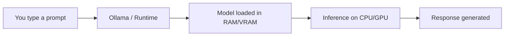
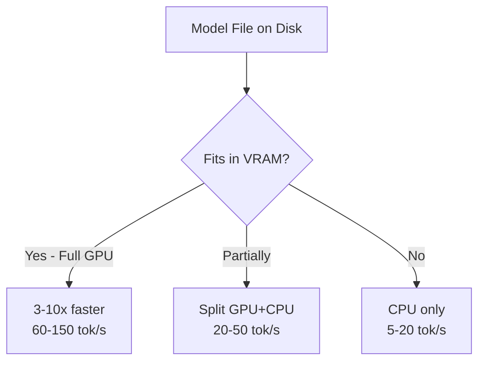
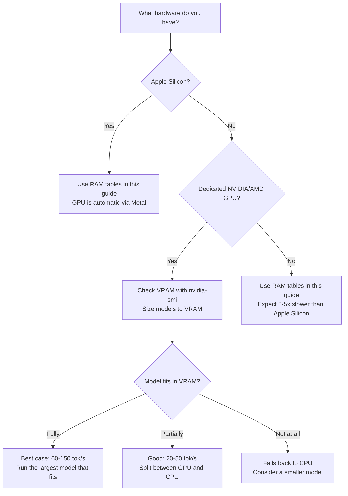

You don't need a cloud subscription or an expensive GPU to use AI in your daily workflow. Open-source models have matured to the point where a regular laptop can run capable AI for coding, writing, image generation, audio transcription, and more — completely free, completely private.

This guide covers everything: how to pick the right model for your hardware, how to set it up, and how to integrate it into your actual workflow.

---

## Table of Contents

- [Why Run AI Locally?](#why-run-ai-locally)
- [Quick Decision: Pick Your Tools](#quick-decision-pick-your-tools)
- [How Local AI Models Work](#how-local-ai-models-work-quick-primer)
- [The RAM Budget Rule](#the-ram-budget-rule)
- [Got a GPU? How It Changes Everything](#got-a-gpu-how-it-changes-everything)
- [Context Window: Why It Matters](#context-window-why-it-matters)
- [Model Recommendations by RAM and Use Case](#model-recommendations-by-ram-and-use-case)
- [Setup Guide: Ollama](#setup-guide-ollama-text-code-vision-models)
- [Beyond Ollama: Other Free Tools](#beyond-ollama-other-free-tools-to-run-local-ai)
- [Setup Guide: Whisper.cpp (Audio)](#setup-guide-whispercpp-audio-transcription)
- [Setup Guide: Piper (Text-to-Speech)](#setup-guide-piper-text-to-speech)
- [Setup Guide: Image Generation](#setup-guide-image-generation-stable-diffusion)
- [Customizing Models with Modelfile](#customizing-models-with-modelfile)
- [Integrate with Your Editor & Workflow](#integrate-with-your-editor--workflow)
- [Ollama Integrations](#ollama-integrations-where-you-can-use-local-models)
- [Speed Benchmarks](#speed-benchmarks-what-to-expect-on-apple-silicon)
- [Local vs Cloud: Honest Comparison](#local-vs-cloud-honest-comparison)
- [How to Evaluate a Model Yourself](#how-to-evaluate-a-model-yourself)
- [Daily Workflow Examples](#daily-workflow-examples)
- [Quick Reference Table](#quick-reference-best-model-for-each-task)
- [Tips for the Best Experience](#tips-for-the-best-experience)
- [Frequently Asked Questions](#frequently-asked-questions)
- [References](#references)

---

## Why Run AI Locally?

Before diving into models and setup, here's why local AI is worth your time:

- **Zero cost** — no API fees, no subscriptions, no token limits
- **Full privacy** — your code, documents, and data never leave your machine
- **Works offline** — airports, trains, remote locations — no internet needed
- **No rate limits** — run as many queries as your hardware allows
- **Customizable** — fine-tune models, adjust parameters, create custom system prompts

The trade-off is straightforward: local models are smaller and less capable than cloud giants like GPT-4o or Claude. But for 80% of daily tasks — code completions, explaining errors, summarizing documents, generating images — they're more than enough.

---

## Quick Decision: Pick Your Tools

Before diving into the technical details, here's the big picture. Running AI locally requires two things:

1. **A runtime** — software that loads and serves models on your machine
2. **A workflow tool** — the interface you actually interact with (editor extension, terminal command, chat UI)

Pick one from each table, install them, then scroll to [your RAM tier](#model-recommendations-by-ram-and-use-case) to choose the right model.

> **Don't know where to start?** Install [Ollama](https://ollama.com) + the [Continue](https://marketplace.visualstudio.com/items?itemName=Continue.continue) VS Code extension. You'll be up and running in 5 minutes.

### Runtimes: How You Load & Serve Models

<div style="overflow-x: auto;" markdown="1">

| Tool | Type | Best For | Platform | Open Source | Install |
| ------ | ------ | ---------- | ---------- | ------------- | --------- |
| [**Ollama**](https://ollama.com) | CLI + API server | Most users — simplest setup, massive ecosystem | Mac, Linux, Windows | ✅ | `brew install ollama` or [download](https://ollama.com/download) |
| [**LM Studio**](https://lmstudio.ai) | Desktop GUI | Beginners, model browsing, "Chat with Docs" | Mac, Linux, Windows | ❌ (free) | [Download app](https://lmstudio.ai) |
| [**oMLX**](https://omlx.ai) | CLI server | Apple Silicon speed demons, coding agents (5x TTFT) | Mac only | ✅ (Apache 2.0) | [GitHub](https://omlx.ai) |
| [**Unsloth Studio**](https://unsloth.ai/docs/new/studio) | Web GUI | Model comparison arena, fine-tuning, observability | Mac, Linux, Windows | ✅ (AGPL-3.0) | [GitHub](https://github.com/unslothai/unsloth) |
| [**Pinokio**](https://pinokio.co) | App store | Non-technical — one-click install for 160+ AI tools | Mac, Linux, Windows | ✅ | [Download](https://pinokio.co) |
| [**LocalAI**](https://localai.io) | API server | Multi-modal (text, image, audio, embeddings) in one API | Mac, Linux, Windows | ✅ | [Docs](https://localai.io/basics/getting_started/) |

</div>

> **Start here:** If you're unsure, install **Ollama**. It's the most widely supported runtime — nearly every tool in the next table connects to it.

### Workflow Tools: How You Use the Models

#### Terminal / CLI Tools

<div style="overflow-x: auto;" markdown="1">

| Tool | Best For | Key Feature | Install | Connects To |
| ------ | ---------- | ------------- | --------- | ------------- |
| [**Aider**](https://aider.chat/) | AI pair programming | Edits files directly, auto-commits with git | `pipx install aider-chat` | Ollama, LM Studio, cloud |
| [**Fabric**](https://github.com/danielmiessler/fabric) | Prompt patterns (summarize, extract, write) | 100+ crowdsourced prompt templates, pipe anything | `go install github.com/danielmiessler/fabric@latest` | Ollama |
| [**ShellGPT**](https://github.com/TheR1D/shell_gpt) | Shell command generation | Forgot a `ffmpeg` flag? Just ask | `pip install shell-gpt` | Ollama (OpenAI-compat) |
| [**Mods**](https://github.com/charmbracelet/mods) | Pipe stdin → LLM → formatted output | Unix philosophy — compose with any CLI | `brew install charmbracelet/tap/mods` | Ollama |
| [**Chatblade**](https://github.com/npiv/chatblade) | Scripting & JSON output | Chain prompts in bash, structured responses | `pip install chatblade` | Ollama (OpenAI-compat) |

</div>

#### Editor Extensions

<div style="overflow-x: auto;" markdown="1">

| Tool | Editor | Best For | Key Feature | Install |
| ------ | -------- | ---------- | ------------- | --------- |
| [**Continue**](https://github.com/continuedev/continue) | VS Code | Code chat + tab autocomplete | @file context, inline edits, multi-model | [Marketplace](https://marketplace.visualstudio.com/items?itemName=Continue.continue) |
| [**Cline**](https://github.com/cline/cline) | VS Code | Agentic coding (creates/edits files autonomously) | Runs terminal, iterates on errors | [Marketplace](https://marketplace.visualstudio.com/items?itemName=saoudrizwan.claude-dev) |
| [**Roo Code**](https://github.com/RooVetGit/Roo-Code) | VS Code | Cline fork with extra features | Same workflow, community-driven | [Marketplace](https://marketplace.visualstudio.com/items?itemName=RooVet.roo-code) |

</div>

#### GUI / Chat Apps

<div style="overflow-x: auto;" markdown="1">

| Tool | Best For | Key Feature | Install | Connects To |
| ------ | ---------- | ------------- | --------- | ------------- |
| [**Open WebUI**](https://github.com/open-webui/open-webui) | ChatGPT-like UI, PDF/doc upload | Multi-model, history, RAG built-in | `docker run` ([docs](https://docs.openwebui.com)) | Ollama |
| [**Goose**](https://goose-docs.ai) | Autonomous agent, MCP extensions | Desktop + CLI, 70+ extensions, subagents | [Download](https://goose-docs.ai) | Ollama |
| [**Joanium**](https://www.joanium.com) | File-aware automations, scheduling | Reads project files, GitHub/Gmail/Calendar integrations | [Download](https://www.joanium.com) | Ollama + 10 providers |
| [**Jan**](https://jan.ai) | Simple offline ChatGPT alternative | Clean chat UI, zero cloud dependency | [Download](https://jan.ai) | Built-in + Ollama |
| [**GPT4All**](https://gpt4all.io) | One-click local chat + document Q&A | Minimal setup, non-technical friendly | [Download](https://gpt4all.io) | Built-in |
| [**Enchanted**](https://github.com/gluonfield/enchanted) | iOS/macOS native chat | Free on App Store, smooth native UX | [App Store](https://apps.apple.com/app/enchanted-llm/id6474268307) | Ollama |

</div>

#### Coding Agents (Autonomous)

> **Note:** Coding agents work best with 14B+ parameter models (16 GB RAM minimum). On 8 GB, they'll be limited to simple tasks.

<div style="overflow-x: auto;" markdown="1">

| Tool | Best For | Key Feature | Install | Connects To |
| ------ | ---------- | ------------- | --------- | ------------- |
| [**OpenCode**](https://opencode.ai) | Terminal + VS Code + desktop agent | 75+ providers, MIT license, 153k+ stars | `curl -fsSL https://opencode.ai/install.sh \| bash` | Ollama |
| [**OpenHands**](https://www.all-hands.dev) | Sandboxed autonomous coding | Reads repos, edits files, runs tests, iterates | `pip install openhands` or Docker | Ollama |
| [**OpenHuman**](https://www.openhuman.dev) | Personal AI with memory + app integrations | Gmail, Slack, Notion, GitHub — desktop app (Rust) | [Download](https://www.openhuman.dev) | Ollama, LM Studio |
| [**Hermes Agent**](https://github.com/NousResearch/hermes-agent) | Self-improving personal AI | Learns from experience, persistent memory, scheduling | [Install script](https://github.com/NousResearch/hermes-agent) | Ollama |

</div>

### Non-Text Tools (Audio, Image, TTS)

<div style="overflow-x: auto;" markdown="1">

| Task | Tool | Type | Install | Notes |
| ------ | ------ | ------ | --------- | ------- |
| Speech-to-text | [**Whisper.cpp**](https://github.com/ggerganov/whisper.cpp) | CLI | `brew install whisper-cpp` | Best local transcription |
| Text-to-speech | [**Piper**](https://github.com/OHF-Voice/piper1-gpl) | CLI | `pip install piper-tts` | 30+ languages, runs on CPU |
| Image generation | [**Draw Things**](https://drawthings.ai) | macOS app | Mac App Store (free) | Native Metal acceleration |
| Image generation | [**ComfyUI**](https://github.com/comfyanonymous/ComfyUI) | Web UI | `git clone` + `pip install` | Linux/Windows, node-based |
| Image generation | [**Stability Matrix**](https://lykos.ai) | Desktop | [Download](https://lykos.ai) | One-click SD installer |

</div>

> **Typical setup for a developer:** Ollama (runtime) + Continue (editor) + Aider or Mods (terminal). Total install time: ~10 minutes. Then pick a model from [your RAM tier](#model-recommendations-by-ram-and-use-case) below.

---

## How Local AI Models Work (Quick Primer)



When you run a model locally:

1. The **model weights** (a large file, typically 2-20 GB) are loaded into your RAM or GPU memory
2. A **runtime** like [Ollama](https://ollama.com) manages the model, accepts prompts via an API, and returns responses
3. **Inference** (generating the response) happens on your CPU or GPU — Apple Silicon Macs use the unified memory GPU, which is efficient for this

### Key Concept: Quantization

Quantization is compressing a model's weights from high-precision numbers (16-bit floats) to lower-precision ones (4-bit integers). Think of it like reducing image quality from PNG to JPEG — the file gets much smaller, you lose some detail, but it's usually good enough. Without quantization, a 14B model would be ~28 GB (won't fit on most laptops). Quantized to Q4, it's ~9 GB — fits comfortably on 16 GB RAM.

Models come in different **quantization levels** that trade quality for size:

<div style="overflow-x: auto;" markdown="1">

| Quantization | Quality | Size Reduction | When to Use |
| ------------- | --------- | --------------- | ------------- |
| **F16** (full) | Best | None (baseline) | Only if you have massive RAM |
| **Q8** | Near-perfect | ~50% smaller | Best quality-to-size ratio |
| **Q6_K** | Excellent | ~58% smaller | Sweet spot for most users |
| **Q4_K_M** | Good | ~70% smaller | Default for most Ollama models |
| **Q3_K** | Acceptable | ~75% smaller | When RAM is very tight |
| **Q2_K** | Degraded | ~80% smaller | Last resort |

</div>

Most models on Ollama default to **Q4_K_M** — a good balance. You don't need to worry about this unless you're optimizing for a specific RAM budget.

> **Pro tip**: A bigger model at lower quantization (e.g., 14B at Q3) often outperforms a smaller model at higher quantization (e.g., 7B at Q8). When a model barely fits your RAM, try the next smaller quantization rather than dropping to a smaller model.

> **Look for "Unsloth Dynamic" GGUFs**: When downloading models from Hugging Face, you'll often see versions uploaded by [Unsloth](https://unsloth.ai). Their "Dynamic 2.0" quantization intelligently varies precision per layer — giving important layers higher precision and less critical ones lower. The result: better quality at the same file size (benchmarks show +1% accuracy while being 2 GB smaller than standard quants). If you see both a regular GGUF and an Unsloth GGUF for the same model, prefer the Unsloth version.

---

## The RAM Budget Rule

Not all your RAM is available for AI models. Here's the realistic breakdown:

<div style="overflow-x: auto;" markdown="1">

| Total RAM | OS + Apps Overhead | Available for Models | Practical Model Size Limit |
| ----------- | ------------------- | --------------------- | -------------------------- |
| **8 GB** | ~4 GB | ~4 GB | Up to 3B-7B parameter models |
| **16 GB** | ~5 GB | ~11 GB | Up to 7B-14B parameter models |
| **24 GB** | ~6 GB | ~18 GB | Up to 14B-22B parameter models |
| **32 GB** | ~8 GB | ~24 GB | Up to 22B-35B parameter models |
| **64 GB** | ~10 GB | ~54 GB | Up to 70B-80B parameter models (MoE) |

</div>

> **Rule of thumb**: The model file size (shown by `ollama list`) should be **at most 80%** of your available RAM. Going beyond that causes memory swapping, which makes inference painfully slow.

> **Got 36-48 GB?** MacBook Pros with M4 Pro/Max chips come in 36, 48, 64, and 128 GB configurations. At 36-48 GB, follow the 32 GB recommendations with more headroom — you can use larger context windows or keep two models loaded simultaneously. At 64 GB, use the [64 GB section](#64-gb-ram--cloud-killer-territory). At 128 GB+, you can run truly massive models like Llama 3.1 70B at full Q8 quality or Qwen3-Coder-Next with large context.

---

## Got a GPU? How It Changes Everything

The rest of this guide is organized by RAM because that's the universal constraint — everyone has RAM, not everyone has a dedicated GPU. But if you **do** have a GPU, it fundamentally changes what you can run and how fast.

### Why GPU Matters for AI

GPUs have hundreds of parallel cores optimized for the matrix math that drives AI inference. A model loaded into GPU memory (VRAM) runs **3-10x faster** than the same model on CPU. The key constraint shifts from total RAM to **VRAM** — your GPU's dedicated memory.

> **What is VRAM?** VRAM (Video RAM) is memory physically built into your graphics card — separate from your system RAM. It's ultra-fast memory that only the GPU can access directly. When people say "my RTX 4070 has 12 GB," they mean 12 GB of VRAM. Your system RAM (16/32 GB) and VRAM (8/12/24 GB) are independent pools — a model loaded into VRAM runs dramatically faster because the GPU doesn't need to fetch data over the slower system bus.



### Step 1: Identify Your GPU

#### macOS (Apple Silicon)

Apple Silicon (M1/M2/M3/M4) uses **unified memory** — the GPU and CPU share the same RAM pool. There's no separate VRAM. This is actually an advantage: your entire RAM is available to the GPU.

```bash
# Check your chip and memory
system_profiler SPHardwareDataType | grep -E "Chip|Memory"

# Example output:
# Chip: Apple M2 Pro
# Memory: 16 GB
```

Your "GPU memory" = your total RAM. Ollama and llama.cpp automatically use the Metal GPU on Apple Silicon — no setup needed.

> **What is Metal?** Metal is Apple's GPU programming framework — the equivalent of NVIDIA's CUDA. It lets software (like Ollama, llama.cpp, Whisper.cpp) run AI computations directly on Apple Silicon's built-in GPU cores. You don't install it separately — it's part of macOS. When you see "Metal acceleration," it simply means the tool is using your Mac's GPU instead of just the CPU, which makes inference 2-4x faster.

#### Linux (NVIDIA)

```bash
# Check if NVIDIA GPU is detected
nvidia-smi

# Example output shows:
# GPU Name: NVIDIA GeForce RTX 4070 Ti
# Memory: 12288 MiB (12 GB VRAM)
# Driver Version: 560.35.03
# CUDA Version: 12.6
```

If `nvidia-smi` is not found, you need to install NVIDIA drivers:

```bash
# Ubuntu/Debian
sudo apt install nvidia-driver-560

# Or use the NVIDIA CUDA toolkit
# See: https://docs.ollama.com/gpu
```

#### Linux (AMD)

```bash
# Check for AMD GPU
rocminfo | grep -E "Name|Marketing"

# Or simpler
lspci | grep -i "vga\|3d"

# Check VRAM
rocm-smi --showmeminfo vram
```

AMD GPU support requires ROCm. Supported cards: RX 6000/7000 series, Radeon PRO, Instinct. See [Ollama AMD docs](https://docs.ollama.com/gpu).

#### Windows (NVIDIA/AMD/Intel)

```powershell
# PowerShell — check GPU name and VRAM
Get-CimInstance Win32_VideoController | Select-Object Name, AdapterRAM

# Or open Task Manager → Performance → GPU
# Shows GPU name, dedicated memory (VRAM), and utilization
```

For NVIDIA specifically:

```powershell
nvidia-smi
```

### Step 2: Understand VRAM vs RAM

| Scenario | What Determines Model Size | Speed |
| ---------- | --------------------------- | ------- |
| **Apple Silicon** (M1-M4) | Total unified RAM (shared between CPU & GPU) | Fast — GPU uses all available memory |
| **Dedicated NVIDIA GPU** | VRAM is primary; system RAM is backup for overflow | Fastest when model fits fully in VRAM |
| **AMD GPU (ROCm)** | VRAM (same as NVIDIA, but Linux-only) | Fast when supported |
| **Intel Arc GPU** | VRAM (limited Ollama support) | Moderate |
| **No dedicated GPU** | System RAM only, CPU inference | Slowest |

> **Key insight**: On a system with 32 GB RAM + 12 GB VRAM (e.g., RTX 4070 Ti), the VRAM is what matters most for speed. A 7B model fits entirely in 12 GB VRAM and runs at 60-100+ tok/s. The 32 GB RAM becomes relevant only for models that exceed your VRAM.

### Step 3: Model Selection by VRAM

If you have a dedicated NVIDIA/AMD GPU, choose models based on **VRAM**, not system RAM:

<div style="overflow-x: auto;" markdown="1">

| VRAM | Best Model Size | Examples | Expected Speed |
| ------ | ---------------- | --------- | ---------------- |
| **6 GB** | 3B-7B (Q4) | Qwen2.5-Coder 3B, Gemma 3 4B, Llama 3.2 3B | 40-80 tok/s |
| **8 GB** | 7B (Q4) | Llama 3.1 8B, Mistral 7B, Qwen2.5-Coder 7B | 50-100 tok/s |
| **12 GB** | 7B (Q8) or 14B (Q4) | Qwen2.5-Coder 14B, Phi-4 14B, Gemma 4 E4B | 30-70 tok/s |
| **16 GB** | 14B (Q6) or 22B (Q4) | Codestral 22B, Mistral Small 24B | 25-50 tok/s |
| **24 GB** | 22B (Q6) or 30B (Q4) | Qwen3 30B-A3B, Gemma 4 26B, Qwen3-Coder 30B | 20-45 tok/s |
| **48 GB** | 70B (Q4) | Llama 3.1 70B, Qwen3 32B (full precision) | 15-30 tok/s |

</div>

*Speeds approximate for NVIDIA RTX 4000-series. Older cards (RTX 3000) are ~20-30% slower.*

> **Compared to CPU-only**: A 7B model on CPU might give you 10-20 tok/s. The same model fully loaded in 8 GB VRAM gives 60-100 tok/s. That's the difference between "usable" and "feels instant."

### Step 4: How GPU Offloading Works

Ollama (and llama.cpp) automatically handles GPU offloading:

- **Full offload**: Model fits entirely in VRAM → maximum speed
- **Partial offload**: Model is split — some layers on GPU, rest on CPU → faster than CPU-only, slower than full GPU
- **No offload**: No compatible GPU or VRAM too small → CPU-only

You can control this with environment variables:

```bash
# Force specific number of GPU layers (advanced)
OLLAMA_NUM_GPU_LAYERS=35 ollama run qwen2.5-coder:14b

# Disable GPU entirely (useful for testing)
OLLAMA_NO_GPU=1 ollama run llama3.1
```

To check what Ollama is actually using:

```bash
# See GPU utilization while a model is running
ollama ps

# NVIDIA: watch GPU memory and utilization in real-time
watch -n 1 nvidia-smi

# macOS: check GPU usage in Activity Monitor → GPU History
```

### Practical Decision Tree



### Summary: How GPU Changes the Rules

| Without GPU (CPU-only) | With GPU |
| ---------------------- | ---------- |
| Model size limited by RAM | Model size limited by VRAM (for full speed) |
| 5-25 tok/s typical | 30-150 tok/s typical |
| All RAM recommendations in this guide apply directly | Use VRAM table above for model sizing |
| Larger context windows eat into available RAM | Context window uses VRAM too — budget accordingly |
| One model at a time on ≤16 GB | Can keep model in VRAM + run apps normally (system RAM stays free) |

> **Apple Silicon users**: You already have the GPU advantage built-in — Metal acceleration is automatic. The RAM-based tables in this guide already account for GPU usage via unified memory. No extra setup needed.

> **No GPU? No problem.** Every model in this guide runs on CPU. A GPU makes things faster, but it's not required. If you're on an Intel/AMD laptop without a discrete GPU, follow the RAM-based recommendations and expect slower speeds.

---

## Context Window: Why It Matters

The **context window** is how much text a model can "see" at once — your prompt, the conversation history, and the response all share this window. For coding, this is critical:

| Context Size | What It Means | Good For |
| ------------- | --------------- | ---------- |
| **4K tokens** | ~3,000 words | Short Q&A, simple completions |
| **8K tokens** | ~6,000 words | Single-file code review, short conversations |
| **32K tokens** | ~24,000 words | Multi-file context, longer conversations |
| **128K tokens** | ~96,000 words | Entire codebase context, long documents |
| **256K tokens** | ~192,000 words | Very large documents, extensive code analysis |

**Important**: [Ollama often defaults to a conservative 2048 tokens](https://docs.ollama.com/context-length) (or the model's minimum) to save RAM. You usually need to explicitly set a larger context:

```bash
# To set context window, use the API or a Modelfile
# Or interactively in the prompt type: /set parameter num_ctx 32768

# Or in API calls
curl http://localhost:11434/api/generate -d '{
  "model": "qwen3:30b-a3b",
  "prompt": "your prompt here",
  "options": { "num_ctx": 32768 }
}'
```

> **RAM impact**: Larger context windows consume more RAM. On 16 GB, stick to 8K-16K context. On 32 GB, you can comfortably use 32K-64K.

### Context Windows of Popular Models

| Model | Max Context | Default on Ollama |
| ------- | ------------ | ------------------- |
| Gemma 4 (all sizes) | 128K-256K | 2048 |
| Qwen3 (all sizes) | 32K-128K | 2048 |
| Qwen3-Coder 30B | 128K | 2048 |
| Llama 3.1 8B | 128K | 2048 |
| Codestral 22B | 32K | 2048 |
| Mistral Small 24B | 128K | 2048 |

Always override the default if you need more context for coding or document analysis.

---

## Model Recommendations by RAM and Use Case

> **Audio & TTS (all RAM tiers):** For speech-to-text, use [Whisper.cpp](#setup-guide-whispercpp-audio-transcription) — the `large-v3-turbo q5` model (~0.57 GB) is the best value at any RAM tier. On 8 GB use `small` (~0.5 GB) if RAM is tight. For text-to-speech, use [Piper](#setup-guide-piper-text-to-speech) (~60-100 MB per voice, runs on CPU). Both are lightweight and run alongside any LLM without conflict.

### 8 GB RAM — The Essentials

With 8 GB, you can run one small model at a time. Close unnecessary apps (especially browsers with many tabs) to free up memory.

#### Text & Chat

<div style="overflow-x: auto;" markdown="1">

| Model | Size | Command | Context | Strengths |
| ------- | ------ | --------- | --------- | ----------- |
| **Gemma 4 E2B** | ~7.2 GB | `ollama pull gemma4:e2b` | 128K | Google's latest, vision built-in. ⚠️ Tight fit — requires closing all apps, will use swap on 8 GB |
| **Gemma 3 4B** | ~3.3 GB | `ollama pull gemma3:4b` | 128K | Efficient small model, good general knowledge |
| **Phi-4 Mini 3.8B** | ~2.5 GB | `ollama pull phi4-mini` | 16K | Microsoft's small model, strong reasoning for its size |
| **Llama 3.2 3B** | ~2 GB | `ollama pull llama3.2:3b` | 128K | Meta's compact model, fast and capable |

</div>

#### Coding

<div style="overflow-x: auto;" markdown="1">

| Model | Size | Command | Context | Strengths |
|-------|------|---------|---------|-----------|
| **Qwen2.5-Coder 3B** | ~2 GB | `ollama pull qwen2.5-coder:3b` | 32K | Best small coding model, fill-in-the-middle support |
| **DeepSeek-Coder 1.3B** | ~0.8 GB | `ollama pull deepseek-coder:1.3b` | 16K | Ultra-light, good for autocomplete only |

</div>

#### Image Understanding (Vision)

<div style="overflow-x: auto;" markdown="1">

| Model | Size | Command | Strengths |
|-------|------|---------|-----------|
| **Gemma 4 E2B** | ~7.2 GB | `ollama pull gemma4:e2b` | Vision built-in — describe images, read diagrams |
| **MiniCPM-V 3B** | ~2 GB | `ollama pull minicpm-v` | Lighter vision model, works better on 8 GB |

</div>

> **8 GB verdict**: You can do basic chat, simple code completions, light image understanding, and audio transcription. Don't expect multi-turn complex reasoning or large codebase analysis. Gemma 4 E2B is the most capable option but leaves almost no headroom.

---

### 16 GB RAM — The Sweet Spot for Most Developers

This is where local AI becomes genuinely useful. You can run 7B-14B models comfortably.

#### Text & Chat

<div style="overflow-x: auto;" markdown="1">

| Model | Size | Command | Context | Strengths |
| ------- | ------ | --------- | --------- | ----------- |
| **Gemma 4 E4B** | ~9.6 GB | `ollama pull gemma4` | 128K | Google's latest, vision + text, excellent quality |
| **Gemma 3 12B** | ~8.1 GB | `ollama pull gemma3:12b` | 128K | Excellent general-purpose, multimodal |
| **Llama 3.1 8B** | ~4.7 GB | `ollama pull llama3.1` | 128K | Meta's workhorse, great instruction following |
| **Mistral 7B** | ~4.1 GB | `ollama pull mistral` | 32K | Fast, good at structured output and summarization |
| **Phi-4 14B** | ~9 GB | `ollama pull phi4` | 16K | Microsoft's reasoning model, punches above its weight |

</div>

#### Coding

<div style="overflow-x: auto;" markdown="1">

| Model | Size | Command | Context | Strengths |
| ------- | ------ | --------- | --------- | ----------- |
| **Qwen2.5-Coder 7B** | ~4.7 GB | `ollama pull qwen2.5-coder:7b` | 32K | Best coding model at this size, excellent completions |
| **Qwen2.5-Coder 14B** | ~9 GB | `ollama pull qwen2.5-coder:14b` | 32K | Stronger code generation, fits tight on 16 GB |
| **DeepSeek-Coder-V2 Lite 16B** | ~9 GB | `ollama pull deepseek-coder-v2:16b` | 128K | MoE architecture, good at code generation |

</div>

#### Image Understanding (Vision)

<div style="overflow-x: auto;" markdown="1">

| Model | Size | Command | Strengths |
| ------- | ------ | --------- | ----------- |
| **Gemma 4 E4B** | ~9.6 GB | `ollama pull gemma4` | Built-in vision — handles text + images in one model |
| **Gemma 3 12B** | ~8.1 GB | `ollama pull gemma3:12b` | Built-in vision, slightly older but proven |
| **LLaVA 13B** | ~8 GB | `ollama pull llava:13b` | Dedicated vision model, good image analysis |

</div>

> **16 GB verdict**: This is where local AI becomes a real productivity tool. You get solid coding assistance, good chat, image understanding, and audio transcription. Run one model at a time for best performance.

---

### 24 GB RAM — Power User Territory

You can run larger models and even keep two smaller models loaded simultaneously.

#### Text & Chat

<div style="overflow-x: auto;" markdown="1">

| Model | Size | Command | Context | Strengths |
| ------- | ------ | --------- | --------- | ----------- |
| **Gemma 4 26B (MoE)** | ~18 GB | `ollama pull gemma4:26b` | 256K | Google's latest MoE, vision + text, 256K context |
| **Qwen3 14B** | ~9 GB | `ollama pull qwen3:14b` | 128K | Strong reasoning, supports thinking mode |
| **Gemma 3 27B** | ~17 GB | `ollama pull gemma3:27b` | 128K | Excellent quality, proven multimodal |
| **Mistral Small 24B** | ~14 GB | `ollama pull mistral-small` | 128K | Great at structured tasks, function calling |

</div>

#### Coding

<div style="overflow-x: auto;" markdown="1">

| Model | Size | Command | Context | Strengths |
| ------- | ------ | --------- | --------- | ----------- |
| **Codestral 22B** | ~13 GB | `ollama pull codestral` | 32K | Mistral's dedicated coding model, 80+ languages |
| **Qwen2.5-Coder 14B** | ~9 GB | `ollama pull qwen2.5-coder:14b` | 32K | Best dedicated coding model at this tier |
| **DeepSeek-Coder-V2 16B** | ~9 GB | `ollama pull deepseek-coder-v2:16b` | 128K | Good at code generation and explanation |

</div>

#### Image Understanding (Vision)

<div style="overflow-x: auto;" markdown="1">

| Model | Size | Command | Strengths |
|-------|------|---------|-----------|
| **Gemma 4 26B** | ~18 GB | `ollama pull gemma4:26b` | Best vision at this tier, 256K context |
| **Gemma 3 27B** | ~17 GB | `ollama pull gemma3:27b` | Built-in vision, excellent quality |

</div>

#### Recommended Dual-Model Setup

With 24 GB, you can run a chat model + a small autocomplete model simultaneously:

```bash
# Chat/reasoning model (~14 GB)
ollama pull mistral-small

# Tab-autocomplete model (~4.7 GB)
ollama pull qwen2.5-coder:7b
```

> **24 GB verdict**: You get near-cloud-quality responses for most tasks. The dual-model setup (reasoning + autocomplete) is a game-changer for coding workflows. Gemma 4 26B is the standout pick if you run one model at a time.

---

### 32 GB RAM — Maximum Local AI Experience

This is the best consumer-level experience. You can run the largest open models and multi-model setups.

#### Text & Chat

<div style="overflow-x: auto;" markdown="1">

| Model | Size | Command | Context | Strengths |
| ------- | ------ | --------- | --------- | ----------- |
| **Qwen3.6 35B-A3B** | ~24 GB | `ollama pull qwen3.6:35b` | 256K | 2026 MoE — 3B active, 256K context, agentic coding + vision |
| **Qwen3 30B-A3B** | ~18 GB | `ollama pull qwen3:30b-a3b` | 128K | MoE — 30B knowledge, 3B inference speed. Best value |
| **Gemma 4 26B (MoE)** | ~18 GB | `ollama pull gemma4:26b` | 256K | Google's latest, vision + text, 256K context |
| **Gemma 4 31B (Dense)** | ~20 GB | `ollama pull gemma4:31b` | 256K | Dense model, highest quality Gemma 4 |
| **Command-R 35B** | ~20 GB | `ollama pull command-r` | 128K | Cohere's model, excellent at RAG and tool use |

</div>

#### Coding

<div style="overflow-x: auto;" markdown="1">

| Model               | Size   | Command                       | Context | Strengths                                             |
| ---------------------| --------| -------------------------------| ---------| -------------------------------------------------------|
| **Qwen3-Coder 30B** | ~19 GB | `ollama pull qwen3-coder:30b` | 128K    | Purpose-built for code, agentic workflows, Apache 2.0 |
| **Qwen3.6 35B-A3B** | ~24 GB | `ollama pull qwen3.6:35b-a3b` | 256K    | Newer, stronger reasoning, 256K context               |
| **Qwen3 30B-A3B**   | ~18 GB | `ollama pull qwen3:30b-a3b`   | 128K    | Fast MoE with strong code abilities                   |
| **Codestral 22B**   | ~13 GB | `ollama pull codestral:22b`       | 32K     | Dedicated coding model, 80+ languages                 |

</div>

#### Image Understanding (Vision)

<div style="overflow-x: auto;" markdown="1">

| Model | Size | Command | Strengths |
| ------- | ------ | --------- | ----------- |
| **Gemma 4 31B** | ~20 GB | `ollama pull gemma4:31b` | Best local vision model, 256K context |
| **Gemma 4 26B** | ~18 GB | `ollama pull gemma4:26b` | MoE variant, faster inference |
| **Llama 3.2 Vision 11B** | ~7 GB | `ollama pull llama3.2-vision` | Good vision, leaves room for other models |

</div>

#### Recommended Multi-Model Setup

```bash
# Primary reasoning/chat (~18 GB)
ollama pull qwen3:30b-a3b

# Tab-autocomplete for coding (~4.7 GB)
ollama pull qwen2.5-coder:7b

# Keep ~9 GB free for OS + apps
```

> **32 GB verdict**: You get a genuinely powerful local AI setup. Qwen3.6 35B-A3B is the new standout (256K context, agentic-ready). Qwen3 30B-A3B remains the fastest value pick. For dedicated coding, Qwen3-Coder 30B is the king.

---

### 64 GB RAM — Cloud-Killer Territory

With 64 GB of unified memory (M4 Max, M3 Ultra) or system RAM + VRAM, you can run the largest MoE models that rival cloud coding APIs. This is where local AI truly competes with Claude and GPT for agentic coding.

#### Text & Chat

<div style="overflow-x: auto;" markdown="1">

| Model | Size | Command | Context | Strengths |
| ------- | ------ | --------- | --------- | ----------- |
| **Qwen3-Coder-Next** | ~46 GB | `ollama pull qwen3-coder-next` | 131K | 80B total / 3B active — best local coding agent model of 2026 |
| **Llama 3.1 70B** | ~40 GB | `ollama pull llama3.1:70b` | 128K | Meta's flagship, excellent instruction following |
| **Qwen3.6 35B-A3B (Q8)** | ~36 GB | `ollama pull qwen3.6:35b-a3b-q8_0` | 256K | Full-quality Qwen3.6 without quantization loss |
| **Qwen3 32B (Dense)** | ~20 GB | `ollama pull qwen3:32b` | 128K | Dense model, leaves headroom for large context |

</div>

#### Coding

<div style="overflow-x: auto;" markdown="1">

| Model | Size | Command | Context | Strengths |
| ------- | ------ | --------- | --------- | ----------- |
| **Qwen3-Coder-Next** | ~46 GB | `ollama pull qwen3-coder-next` | 131K | Purpose-built for coding agents. 80B MoE, 3B active — SWE-Bench ~70% |
| **Qwen3-Coder 30B (Q8)** | ~32 GB | `ollama pull qwen3-coder:30b-q8_0` | 128K | Full-quality Qwen3-Coder without quantization loss |
| **Qwen3.6 35B-A3B** | ~24 GB | `ollama pull qwen3.6:35b` | 256K | Fast agentic model, 256K context for large repos |
| **DeepSeek-V2.5 236B (Q2)** | ~50 GB | Community GGUF | 128K | MoE giant at aggressive quantization, experimental |

</div>

#### Image Understanding (Vision)

<div style="overflow-x: auto;" markdown="1">

| Model | Size | Command | Strengths |
|-------|------|---------|-----------|
| **Gemma 4 31B (Q8)** | ~33 GB | `ollama pull gemma4:31b-q8_0` | Best vision, full quality, 256K context |
| **Llama 3.2 Vision 90B** | ~55 GB | `ollama pull llama3.2-vision:90b` | Meta's largest vision model |

</div>

#### Recommended Multi-Model Setup

```bash
# Primary coding agent (~46 GB)
ollama pull qwen3-coder-next

# Lightweight autocomplete (~4.7 GB) — runs alongside
ollama pull qwen2.5-coder:7b

# Keep ~13 GB free for OS + apps + context
```

Or for a versatile non-coding setup:

```bash
# Reasoning + general purpose (~40 GB)
ollama pull llama3.1:70b

# Vision model when needed (~24 GB) — swap with llama3.1
ollama pull qwen3.6:35b
```

> **64 GB verdict**: This is cloud-killer territory. Qwen3-Coder-Next (80B MoE, 3B active) matches paid coding APIs for agentic workflows — file edits, test runs, multi-step debugging — completely free and private. If you're buying a Mac for local AI coding, 64 GB unified memory is the sweet spot.

---

## Setup Guide: Ollama (Text, Code, Vision Models)

[Ollama](https://ollama.com) is the easiest way to run LLMs locally. It handles model downloading, quantization, and serves an API — all in one tool.

### Step 1: Install Ollama

| Platform | Install Command / Method | Requirements |
| ---------- | ------------------------ | -------------- |
| **macOS** | Download from [ollama.com/download/mac](https://ollama.com/download/mac) or `brew install ollama` | macOS Sonoma 14+, Apple M-series or Intel |
| **Linux** | `curl -fsSL https://ollama.com/install.sh \| sh` | Any modern distro. [GPU setup](https://docs.ollama.com/linux) optional |
| **Windows** | Download from [ollama.com/download/windows](https://ollama.com/download/windows) | Windows 10 22H2+. No admin needed |

After install, verify with `ollama --version`. The API runs at `http://localhost:11434`.

> **Storage**: Models live in `~/.ollama/models/` (macOS/Linux) or `%HOMEPATH%\.ollama\models` (Windows). Budget 20-50 GB free disk space. On Windows, set the `OLLAMA_MODELS` env var to move models to another drive. See platform-specific docs for [macOS](https://docs.ollama.com/macos), [Linux](https://docs.ollama.com/linux), [Windows](https://docs.ollama.com/windows).

### Step 2: Pull a Model

```bash
# Example: pull Gemma 4 (default E4B, ~9.6 GB)
ollama pull gemma4

# Example: pull a coding model
ollama pull qwen2.5-coder:7b

# List downloaded models
ollama list
```

### Step 3: Run and Chat

```bash
# Interactive chat
ollama run gemma4

# Ask a coding question
ollama run qwen2.5-coder:7b "Write a Python function to merge two sorted lists"

# To run with larger context window, create a Modelfile with PARAMETER num_ctx 32768
# Or use the interactive prompt: /set parameter num_ctx 32768
```

### Step 4: Verify the API

Ollama exposes a local API at `http://localhost:11434`:

```bash
# Check downloaded models
curl http://localhost:11434/api/tags

# Send a prompt via API
curl http://localhost:11434/api/generate -d '{
  "model": "gemma4",
  "prompt": "Explain Docker networking in 3 sentences",
  "stream": false
}'
```

### Useful Ollama Commands

```bash
ollama list              # Show downloaded models with sizes
ollama ps                # Show currently loaded models in memory
ollama rm <model>        # Delete a model to free disk space
ollama show <model>      # Show model details (size, quantization, context, license)
ollama cp <src> <dest>   # Copy a model (useful for custom Modelfile configs)
ollama pull <model>      # Download or update a model
```

> **Prefer a visual API explorer?** The [Ollama REST API Postman Collection](https://www.postman.com/postman-student-programs/ollama-api/documentation/suc47x8/ollama-rest-api) has pre-built requests for generate, chat, structured output, JSON mode, and model management — great for testing before writing code. For programmatic use, see the official [Python](https://github.com/ollama/ollama-python) and [JavaScript](https://github.com/ollama/ollama-js) client libraries.

---

## Beyond Ollama: Other Free Tools to Run Local AI

The [Quick Decision table](#quick-decision-pick-your-tools) above covers the most popular options. This section lists specialized tools for users who need lower-level control, production serving, or platform-specific hardware.

### Low-Level Inference Engines

<div style="overflow-x: auto;" markdown="1">

| Tool | What It Is | Best For | Open Source |
| ------ | ----------- | ---------- | ------------- |
| [**llama.cpp**](https://github.com/ggml-org/llama.cpp) | The C/C++ inference engine Ollama is built on | Maximum control over quantization, context, and parameters | ✅ Yes |
| [**MLX / mlx-lm**](https://github.com/ml-explore/mlx) | Apple's native framework for Apple Silicon | Fastest inference on Macs — up to 4x faster than llama.cpp for some models | ✅ Yes |

</div>

### Production & High-Throughput Serving

<div style="overflow-x: auto;" markdown="1">

| Tool | What It Is | Best For | Open Source |
| ------ | ----------- | ---------- | ------------- |
| [**vLLM**](https://github.com/vllm-project/vllm) | Production inference server with continuous batching and PagedAttention | Multi-user serving, high concurrency. V1 engine supports text, audio, embeddings, multimodal | ✅ Yes |
| [**SGLang**](https://github.com/sgl-project/sglang) | High-throughput serving framework from UC Berkeley | Structured output, constrained decoding, production API serving | ✅ Yes |
| [**TGI**](https://github.com/huggingface/text-generation-inference) | Hugging Face's inference server with built-in observability | Teams already in the HF ecosystem, metrics-heavy deployments | ✅ Yes |

</div>

### Platform-Specific & Niche

<div style="overflow-x: auto;" markdown="1">

| Tool | What It Is | Best For | Open Source |
| ------ | ----------- | ---------- | ------------- |
| [**Docker Model Runner**](https://docs.docker.com) | Run GGUF models directly from Docker Desktop | Teams already in container workflows — pull models like Docker images | Partial |
| [**Lemonade**](https://github.com/amd/lemonade) | AMD's tool for Ryzen AI NPU hardware | AMD laptop users with dedicated NPUs — includes MCP tool calling | ✅ Yes |

</div>

---

## Setup Guide: Whisper.cpp (Audio Transcription)

[Whisper.cpp](https://github.com/ggerganov/whisper.cpp) runs OpenAI's Whisper speech-to-text model locally using optimized C++ code. It's fast on Apple Silicon and modern CPUs.

### Step 1: Install via Homebrew

```bash
# Install whisper-cpp (macOS)
brew install whisper-cpp

# Verify — the CLI binary is called whisper-cli
whisper-cli --help
```

> **Note**: The Homebrew package installs the binary as `whisper-cli`, not `whisper-cpp`. It does **not** include a model download script — you need to download GGML model files manually.

### Step 2: Download a Model

Models are hosted at [huggingface.co/ggerganov/whisper.cpp](https://huggingface.co/ggerganov/whisper.cpp/tree/main). Download the `.bin` file that matches your RAM budget:

```bash
# Create a directory for models
mkdir -p ~/.local/share/whisper-cpp

# Recommended: large-v3-turbo quantized (574 MB) — best speed/quality ratio
curl -L -o ~/.local/share/whisper-cpp/ggml-large-v3-turbo-q5_0.bin \
  https://huggingface.co/ggerganov/whisper.cpp/resolve/main/ggml-large-v3-turbo-q5_0.bin
```

#### Which Model to Choose?

<div style="overflow-x: auto;" markdown="1">

| Model File | Size | Speed | Accuracy | Best For |
| ----------- | ------ | ------- | ---------- | ---------- |
| `ggml-tiny.bin` | 78 MB | Fastest | Basic | Quick tests |
| `ggml-base.bin` | 148 MB | Very fast | Decent | Clear speech, low RAM |
| `ggml-small.bin` | 488 MB | Fast | Good | Meetings, podcasts |
| `ggml-medium.bin` | 1.53 GB | Moderate | Very good | Accented speech, noisy audio |
| `ggml-large-v3-turbo-q5_0.bin` | 574 MB | Fast | Excellent | **Best pick — large quality at medium speed** |
| `ggml-large-v3.bin` | 3.1 GB | Slow | Best | Professional transcription |

</div>

> **Pro tip**: The `large-v3-turbo` model is a distilled version of large-v3 — nearly the same accuracy but ~4x faster. The `q5_0` quantized variant (574 MB) is the sweet spot for most users.

**Multilingual vs English-only**: Files with `.en` in the name (e.g., `ggml-medium.en.bin`) are English-only and slightly more accurate for English. Files without `.en` support all languages. The `large-v3-turbo` is multilingual only.

To download a different model, swap the filename in the URL:

```bash
# Example: download small model (488 MB)
curl -L -o ~/.local/share/whisper-cpp/ggml-small.bin \
  https://huggingface.co/ggerganov/whisper.cpp/resolve/main/ggml-small.bin

# Example: download medium English-only (1.53 GB)
curl -L -o ~/.local/share/whisper-cpp/ggml-medium.en.bin \
  https://huggingface.co/ggerganov/whisper.cpp/resolve/main/ggml-medium.en.bin
```

### Step 3: Transcribe

```bash
# Basic transcription
whisper-cli -m ~/.local/share/whisper-cpp/ggml-large-v3-turbo-q5_0.bin -f recording.wav

# Output as SRT subtitles
whisper-cli -m ~/.local/share/whisper-cpp/ggml-large-v3-turbo-q5_0.bin -f meeting.wav --output-srt

# Output with timestamps (plain text)
whisper-cli -m ~/.local/share/whisper-cpp/ggml-large-v3-turbo-q5_0.bin -f meeting.wav --output-txt
```

### Supported Audio Formats

Whisper.cpp works best with **16-bit WAV at 16 kHz**. Convert other formats first:

```bash
# Convert MP3 to WAV using ffmpeg
ffmpeg -i input.mp3 -ar 16000 -ac 1 -c:a pcm_s16le output.wav

# Convert M4A (iPhone recording) to WAV
ffmpeg -i voice-memo.m4a -ar 16000 -ac 1 -c:a pcm_s16le output.wav
```

*Speed estimates on Apple M2, will vary by hardware.*

---

## Setup Guide: Piper (Text-to-Speech)

[Piper](https://github.com/OHF-Voice/piper1-gpl) is a fast, local neural text-to-speech engine. It runs entirely on CPU, needs minimal RAM (~60-100 MB per voice), and supports 30+ languages.

### Install

```bash
# Install via pip
pip install piper-tts
```

### Download a Voice Model

Piper requires a model file (`.onnx`) and its config (`.onnx.json`). Browse available voices at [huggingface.co/rhasspy/piper-voices](https://huggingface.co/rhasspy/piper-voices/tree/main).

```bash
# Create a directory for voice models
mkdir -p ~/.local/share/piper-voices

# Download a US English voice (medium quality, ~60 MB)
curl -L -o ~/.local/share/piper-voices/en_US-lessac-medium.onnx \
  https://huggingface.co/rhasspy/piper-voices/resolve/main/en/en_US/lessac/medium/en_US-lessac-medium.onnx

curl -L -o ~/.local/share/piper-voices/en_US-lessac-medium.onnx.json \
  https://huggingface.co/rhasspy/piper-voices/resolve/main/en/en_US/lessac/medium/en_US-lessac-medium.onnx.json
```

### Generate Speech

```bash
# Generate speech to a WAV file
echo "Hello, this is a test of local text to speech." | \
  piper -m ~/.local/share/piper-voices/en_US-lessac-medium.onnx -f output.wav

# Play directly (macOS)
echo "The build failed with 3 errors." | \
  piper -m ~/.local/share/piper-voices/en_US-lessac-medium.onnx -f temp.wav && afplay temp.wav && rm temp.wav

# Pipe from a file
cat notes.txt | \
  piper -m ~/.local/share/piper-voices/en_US-lessac-medium.onnx -f notes-audio.wav
```

> **Note**: Piper does not have a `--list-voices` flag. You choose a voice by downloading its `.onnx` + `.onnx.json` files and passing the path via `-m`. Browse voices with audio samples at [rhasspy.github.io/piper-samples](https://rhasspy.github.io/piper-samples/).

### Use Cases for Local TTS

- **Accessibility** — screen reader alternative for your own tools
- **Content creation** — narrate blog posts or documentation
- **Notifications** — audio alerts from CI/CD pipelines or monitoring
- **Language learning** — hear pronunciation in 30+ languages
- **Proofreading** — hearing your writing read aloud catches errors your eyes miss

---

## Setup Guide: Image Generation (Stable Diffusion)

For generating images locally, use **Stable Diffusion** via tools optimized for your hardware.

### On macOS (Apple Silicon)

[Draw Things](https://drawthings.ai) is a free, native macOS/iOS app that runs Stable Diffusion models efficiently on Apple Silicon:

- Download from the Mac App Store (free)
- Built-in model browser — download SDXL, SD 1.5, or FLUX models
- Uses Metal GPU acceleration — fast on M1/M2/M3/M4 chips
- No terminal setup needed

### On Linux/Windows

Use [ComfyUI](https://github.com/comfyanonymous/ComfyUI) or [Stable Diffusion WebUI (Automatic1111)](https://github.com/AUTOMATIC1111/stable-diffusion-webui):

```bash
# ComfyUI (recommended — node-based, flexible)
git clone https://github.com/comfyanonymous/ComfyUI.git
cd ComfyUI
pip install -r requirements.txt
python main.py
# Open http://localhost:8188 in your browser
```

### Easiest Install: Stability Matrix or Pinokio

If you don't want to deal with Python environments and git clones:

- [**Stability Matrix (Lykos AI)**](https://lykos.ai) — Multi-platform package manager for Stable Diffusion. One-click install of ComfyUI, A1111, Forge. Manages Python environments, models, and extensions automatically. Open-source.
- [**Pinokio**](https://pinokio.co) — App store-like launcher for 160+ local AI tools including ComfyUI, Whisper, TTS, and more. Browse, click install, run. No terminal needed.

### Image Model Recommendations by RAM

<div style="overflow-x: auto;" markdown="1">

| RAM | Model | Size | Quality | Generation Time |
| ----- | ------- | ------ | --------- | ---------------- |
| **8 GB** | SD 1.5 | ~2 GB | Basic, 512x512 | ~10-20 sec |
| **16 GB** | SDXL | ~6.5 GB | Good, 1024x1024 | ~15-30 sec |
| **24 GB** | SDXL + refiner | ~12 GB | High quality with refinement | ~30-60 sec |
| **32 GB** | FLUX.1-dev | ~12 GB | State-of-the-art, best prompt adherence | ~20-40 sec |

</div>

*Times estimated on Apple M2 Pro. NVIDIA GPUs are typically 2-3x faster for image generation.*

---

## Customizing Models with Modelfile

Ollama's [Modelfile](https://github.com/ollama/ollama/blob/main/docs/modelfile.md) lets you create custom model configurations — set system prompts, adjust temperature, change context length, and more. This is powerful for creating specialized assistants.

### Example: Custom Coding Assistant

Create a file called `Modelfile.coding`:

```dockerfile
FROM qwen2.5-coder:14b

# Set a larger context window for code
PARAMETER num_ctx 32768

# Lower temperature for more deterministic code output
PARAMETER temperature 0.3

# System prompt for coding assistance
SYSTEM """You are an expert software engineer. You write clean, well-documented,
production-ready code. You follow best practices for the language being used.
When reviewing code, you focus on bugs, security issues, and performance.
Always explain your reasoning briefly."""
```

Build and run it:

```bash
# Create the custom model
ollama create coding-assistant -f Modelfile.coding

# Use it
ollama run coding-assistant "Review this function for bugs: ..."
```

### Example: Document Summarizer

```dockerfile
FROM gemma4

PARAMETER num_ctx 65536
PARAMETER temperature 0.2

SYSTEM """You are a document analysis assistant. When given text, you:
1. Provide a concise summary (3-5 sentences)
2. List key points as bullet points
3. Identify any action items or decisions
Be concise and factual. Never add information not present in the source."""
```

### Example: Creative Writing Helper

```dockerfile
FROM qwen3:30b-a3b

PARAMETER temperature 0.8
PARAMETER top_p 0.9
PARAMETER num_ctx 16384

SYSTEM """You are a creative writing assistant. You help with brainstorming,
drafting, and editing. Your suggestions are vivid and original. You match
the tone and style the user is going for."""
```

---

## Integrate with Your Editor & Workflow

Already picked your tools from the [Quick Decision table](#quick-decision-pick-your-tools)? Here's how to configure each one. The real power of local AI comes when it's integrated into your editor and terminal — below are detailed setup instructions.

### Option 1: Continue (Recommended)

[Continue](https://github.com/continuedev/continue) is the most popular open-source AI coding extension. It supports Ollama natively.

**Install:**

1. Open VS Code → Extensions → Search "Continue" → Install
2. Click the Continue icon in the sidebar → Settings (gear icon)
3. Edit the config:

```yaml
models:
  - name: Gemma 4
    provider: ollama
    model: gemma4
    apiBase: http://localhost:11434

  - name: Qwen3-Coder 30B
    provider: ollama
    model: qwen3-coder
    apiBase: http://localhost:11434

  - name: Qwen2.5 Coder 14B
    provider: ollama
    model: qwen2.5-coder:14b
    apiBase: http://localhost:11434

tabAutocompleteModel:
  provider: ollama
  model: qwen2.5-coder:7b
  apiBase: http://localhost:11434
```

**What you get:**

- **Sidebar chat** — ask questions about your code, get explanations, generate functions
- **Inline editing** — select code, press `Ctrl+I` / `Cmd+I`, describe the change
- **Tab autocomplete** — code completions as you type (uses the smaller model)
- **Context awareness** — reference files with `@file`, codebase with `@codebase`
- **Document analysis** — drag PDFs or docs into the chat for summarization and Q&A

### Option 2: Cline (Agentic Coding)

[Cline](https://github.com/cline/cline) is an open-source VS Code extension that acts as an autonomous coding agent — it can create files, run terminal commands, and iterate on code with your approval:

1. Install the Cline extension from VS Code Marketplace
2. In settings, set provider to "Ollama"
3. Set the endpoint to `http://localhost:11434`
4. Select your model (recommend 32K+ context for best results)

### Option 3: Open WebUI (Browser-Based Chat)

For a ChatGPT-like interface that connects to your local models:

```bash
# Run with Docker
docker run -d -p 3000:8080 \
  --add-host=host.docker.internal:host-gateway \
  -v open-webui:/app/backend/data \
  --name open-webui \
  ghcr.io/open-webui/open-webui:main
```

Open `http://localhost:3000` — it auto-detects all your Ollama models. Great for:

- Longer conversations with full chat history
- **Document analysis** — upload PDFs, Word docs, or text files and ask questions about them
- Sharing with team members on your local network
- Comparing responses from different models side-by-side

### Option 4: Aider (AI Pair Programming in Terminal)

[Aider](https://aider.chat/) is an open-source terminal-based AI pair programming tool (44k+ GitHub stars, 6.8M+ installs). It edits files directly in your codebase, auto-commits changes with sensible messages, and works with local Ollama models — completely free, completely private.

**Why Aider stands out for local AI:**

- Works directly on your existing codebase (not a sandbox)
- Auto-commits changes with git — easy to diff, undo, or review
- Maps your entire repo for context-aware edits
- Supports 100+ programming languages
- Voice-to-code, linting, testing integration

**Install Aider:**

```bash
# One-liner (installs aider + python 3.12 if needed)
curl -LsSf https://aider.chat/install.sh | sh

# Or via pipx
pipx install aider-chat

# Or via uv
uv tool install --force --python python3.12 aider-chat@latest
```

**Connect Aider to Ollama:**

```bash
# Set the Ollama endpoint (default, usually already correct)
export OLLAMA_API_BASE=http://127.0.0.1:11434

# Pull a good coding model
ollama pull qwen2.5-coder:14b

# Start aider with your local model
cd /path/to/your/project
aider --model ollama_chat/qwen2.5-coder:14b
```

> Use `ollama_chat/` prefix (not `ollama/`) for chat-optimized interactions.

**Recommended local models for Aider:**

| RAM | Model | Command |
| ----- | ------- | --------- |
| 8 GB | Qwen2.5 Coder 7B | `aider --model ollama_chat/qwen2.5-coder:7b` |
| 16 GB | Qwen2.5 Coder 14B | `aider --model ollama_chat/qwen2.5-coder:14b` |
| 24 GB+ | Codestral 22B | `aider --model ollama_chat/codestral:22b` |
| 32 GB+ | Qwen2.5 Coder 32B | `aider --model ollama_chat/qwen2.5-coder:32b` |

**Context window note:** Ollama defaults to a 2K context window, which is too small for real coding. Aider auto-adjusts this for each request, but you can also fix it with a `.aider.model.settings.yml` file in your project:

```yaml
- name: ollama_chat/qwen2.5-coder:14b
  extra_params:
    num_ctx: 32768
```

**Example session:**

```bash
$ cd ~/projects/my-app
$ aider --model ollama_chat/qwen2.5-coder:14b

Aider v0.82.0
Model: ollama_chat/qwen2.5-coder:14b

> Add pagination to the /users API endpoint

# Aider edits your files, shows the diff, and auto-commits with:
# "feat: add pagination to /users endpoint with limit/offset params"
```

**Aider also works with cloud models** (DeepSeek, Claude, GPT-4o) if you want to mix local and cloud:

```bash
aider --model deepseek --api-key deepseek=<key>
aider --model sonnet --api-key anthropic=<key>
```

### Option 5: Fabric (AI Prompt Patterns from Terminal)

[Fabric](https://github.com/danielmiessler/fabric) is a CLI framework with 100+ crowdsourced AI prompt "patterns" — highly optimized prompts for tasks like summarizing articles, extracting wisdom from videos, writing essays, or analyzing security reports. You pipe any text through it.

**Install:**

```bash
go install github.com/danielmiessler/fabric@latest
fabric --setup   # select Ollama as your provider
```

> Requires Go — install with `brew install go` if you don't have it.

**Usage with local models:**

```bash
# Summarize an article
cat article.txt | fabric --pattern summarize --model llama3

# Extract key insights from a YouTube transcript
yt --transcript "https://youtube.com/watch?v=..." | fabric --pattern extract_wisdom --model qwen2.5

# Write a blog post from notes
cat notes.md | fabric --pattern write_essay --model llama3
```

### Option 6: ShellGPT (sgpt)

[ShellGPT](https://github.com/TheR1D/shell_gpt) is a command-line productivity tool for generating shell commands, code snippets, and general text. Forget a complex `ffmpeg` or `tar` command? Just ask.

**Install:**

```bash
pip install shell-gpt
```

**Connect to local models** — edit `~/.config/shell_gpt/.sgptrc`:

```
OPENAI_API_HOST=http://localhost:11434/v1
OPENAI_API_KEY=not-needed
DEFAULT_MODEL=qwen2.5-coder:14b
```

**Usage:**

```bash
# Generate a shell command
sgpt --shell "find all markdown files modified in the last 2 days"

# Generate code
sgpt --code "python function to merge two sorted lists"

# General questions
sgpt "explain the difference between TCP and UDP"
```

### Option 7: Mods (by Charmbracelet)

[Mods](https://github.com/charmbracelet/mods) is built for piping — take stdin, process it with an LLM, get beautifully formatted Markdown output.

**Install:**

```bash
brew install charmbracelet/tap/mods
```

**Connect to local models** — edit `~/.config/mods/mods.yml`:

```yaml
apis:
  ollama:
    base-url: http://localhost:11434/v1
    models:
      llama3:
        max-input-chars: 32000
```

**Usage:**

```bash
# Summarize git commits into release notes
git log --oneline -20 | mods "Summarize these into release notes"

# Explain error output
npm test 2>&1 | mods "What went wrong and how to fix it?"

# Review a diff
git diff | mods "Review this code change for bugs"
```

### Option 8: Chatblade

[Chatblade](https://github.com/npiv/chatblade) is a versatile CLI for LLM interactions — pipe output, format as JSON, and create complex prompt chains in bash.

**Install:**

```bash
pip install chatblade
```

**Connect to local models:**

```bash
export OPENAI_API_BASE=http://localhost:11434/v1
export OPENAI_API_KEY=not-needed
```

**Usage:**

```bash
# Pipe and process
cat error.log | chatblade "What's the root cause?"

# JSON output for scripting
chatblade -e "list 5 python testing libraries" | jq .
```

### Connecting Any CLI Tool to Local Models

Most terminal AI tools support OpenAI's API format. Since Ollama is compatible at `http://localhost:11434/v1`, add this to `~/.zshrc`:

```bash
export OPENAI_API_BASE=http://localhost:11434/v1
export OPENAI_API_KEY=not-needed
```

This covers sgpt, chatblade, and most other tools that accept `OPENAI_API_BASE` or `OPENAI_BASE_URL`. LM Studio uses port 1234 instead.

### Upgrade & Uninstall Terminal AI Tools

Keep your tools current or remove them cleanly:

| Tool | Upgrade | Uninstall |
| ------ | --------- | ----------- |
| **Ollama** | `brew upgrade ollama` | `brew uninstall ollama && rm -rf ~/.ollama` |
| **Aider** | `aider --upgrade` or `pipx upgrade aider-chat` | `pipx uninstall aider-chat` |
| **Fabric** | `go install github.com/danielmiessler/fabric@latest` | `rm $(which fabric)` |
| **ShellGPT** | `pip install --upgrade shell-gpt` | `pip uninstall shell-gpt` |
| **Mods** | `brew upgrade charmbracelet/tap/mods` | `brew uninstall mods` |
| **Chatblade** | `pip install --upgrade chatblade` | `pip uninstall chatblade` |
| **Continue (VS Code)** | Auto-updates via VS Code Marketplace | Uninstall from Extensions panel |
| **Cline (VS Code)** | Auto-updates via VS Code Marketplace | Uninstall from Extensions panel |
| **Open WebUI** | `docker pull ghcr.io/open-webui/open-webui:main && docker restart open-webui` | `docker rm -f open-webui && docker volume rm open-webui` |

> **Tip:** Models are the biggest disk consumers (8-20 GB each). Run `ollama list` periodically and `ollama rm <model>` for ones you're not using.

---

## Ollama Integrations: Where You Can Use Local Models

Beyond the tools covered in the [Quick Decision table](#quick-decision-pick-your-tools) and [setup guides above](#integrate-with-your-editor--workflow), here are additional integrations worth knowing about. Ollama exposes an OpenAI-compatible API at `http://localhost:11434/v1` — any tool that supports a custom OpenAI endpoint can connect to it.

### IDEs & Editors (Beyond VS Code)

| Tool | What It Does | Setup |
| ------ | ------------- | ------- |
| [**VS Code (native)**](https://docs.ollama.com/integrations/vscode) | Models in Copilot Chat picker (VS Code 1.113+) | `ollama launch vscode` |
| [**JetBrains**](https://docs.ollama.com/integrations/jetbrains) | IntelliJ, PyCharm, WebStorm — needs JetBrains AI subscription | Settings → AI → Ollama |
| [**Xcode**](https://docs.ollama.com/integrations/xcode) | Xcode 26+ with Apple Intelligence | Settings → Locally Hosted |
| [**Zed**](https://docs.ollama.com/integrations/zed) | Native Ollama provider | Configure → Ollama |
| [**marimo**](https://docs.ollama.com/integrations/marimo) | Python notebook with AI chat + code completion | Settings → AI → Ollama |

### Coding Agents (Additional)

| Tool | What It Does | Setup |
| ------ | ------------- | ------- |
| [**Pi**](https://pi.dev) | Minimal terminal coding agent. TypeScript skills, prompt templates, themes | `npm install -g @anthropic-ai/pi` → configure local model |
| [**Claude Code**](https://docs.anthropic.com/en/docs/agents-and-tools/claude-code/overview) | Anthropic's terminal agent | Requires API key or OpenAI-compatible proxy |

### Chat, RAG & Automation

| Tool | What It Does | Setup |
| ------ | ------------- | ------- |
| [**Onyx**](https://docs.ollama.com/integrations/onyx) | Self-hosted chat with RAG, web search, agents, connectors (Drive, Slack, Email) | Docker → Ollama provider |
| [**Kotaemon**](https://github.com/Cinnamon/kotaemon) | RAG tool for chatting with documents — clean UI, citation support | `pip install kotaemon` or Docker → set Ollama endpoint |
| [**PrivateGPT**](https://github.com/zylon-ai/private-gpt) | Ingest document collections into vector space, 100% local RAG | Docker or pip → configure Ollama |
| [**Khoj**](https://khoj.dev) | Self-hosted "AI second brain" — docs, web search, scheduled automations | `pip install khoj` or Docker → Ollama in admin settings |
| [**AnythingLLM**](https://anythingllm.com/) | Desktop app with built-in RAG and document chat | Select Ollama as LLM provider |
| [**n8n**](https://docs.ollama.com/integrations/n8n) | Visual workflow automation with Ollama nodes | Credential → Ollama |

### Other Chat Clients

| Tool | What It Does | Setup |
| ------ | ------------- | ------- |
| [**Msty**](https://msty.app/) | Clean multi-model chat interface | Auto-detects local Ollama |
| [**Chatbox**](https://chatboxai.app/) | Cross-platform desktop client for multiple AI APIs | Set provider to Ollama |
| [**OpenClaw**](https://openclaw.ai) | Personal AI assistant via WhatsApp/Telegram/Discord. Note: cloud APIs work more reliably than local | `curl -fsSL https://openclaw.ai/install.sh \| bash` |

---

## Speed Benchmarks: What to Expect on Apple Silicon

Speed is measured in **tokens per second (tok/s)**. For reference, comfortable reading speed is about 4-5 tok/s, and fast typing speed is about 2 tok/s. Anything above 10 tok/s feels instant.

### Approximate Generation Speed (tok/s)

<div style="overflow-x: auto;" markdown="1">

| Model | M1 (8 GB) | M1 Pro (16 GB) | M2 Pro (16 GB) | M3 Pro (18 GB) | M4 Pro (24 GB) | M4 Max (32 GB) | M4 Max (64 GB) |
| ------- | ----------- | ---------------- | ---------------- | ---------------- | ---------------- | ---------------- | ---------------- |
| **Gemma 3 4B** | ~25 | ~35 | ~40 | ~45 | ~55 | ~70 | ~70 |
| **Llama 3.1 8B** | — | ~20 | ~25 | ~30 | ~40 | ~50 | ~50 |
| **Gemma 4 E4B** | — | ~15 | ~20 | ~25 | ~35 | ~45 | ~45 |
| **Qwen2.5-Coder 14B** | — | ~8 | ~12 | ~15 | ~22 | ~30 | ~30 |
| **Qwen3.6 35B-A3B (MoE)** | — | — | — | — | ~15 | ~25 | ~35 |
| **Qwen3-Coder-Next (MoE)** | — | — | — | — | — | — | ~25 |
| **Llama 3.1 70B** | — | — | — | — | — | — | ~12 |

</div>

*"—" means the model doesn't fit comfortably in that RAM tier. Values are approximate and vary by prompt length, context size, and quantization. Based on community benchmarks from [tps.sh](https://tps.sh) and various Apple Silicon LLM benchmark reports.*

> **Key insight**: MoE models (Qwen3 30B-A3B, Gemma 4 26B) are significantly faster than dense models of similar total parameter count because they only activate a fraction of parameters per token. A 30B MoE model can be faster than a 14B dense model.

### Intel/AMD & NVIDIA Comparison

- **Intel/AMD (no GPU)**: Expect roughly **3-5x slower** speeds than Apple Silicon with the same RAM.
- **NVIDIA GPU**: Closes the gap entirely — see the [GPU section](#got-a-gpu-how-it-changes-everything) for VRAM-based model selection and expected speeds.

---

## Local vs Cloud: Honest Comparison

| Factor | Local (Ollama) | Cloud (ChatGPT, Claude, etc.) |
| -------- | --------------- | ------------------------------- |
| **Cost** | Free forever | $20-200/month or per-token |
| **Privacy** | 100% local | Data sent to provider |
| **Speed** | 10-50 tok/s | 50-150 tok/s |
| **Quality (routine tasks)** | 90-95% of cloud | Baseline |
| **Quality (complex reasoning)** | 60-75% of cloud | Baseline |
| **Context window** | 8K-64K (RAM-limited) | 128K-200K |
| **Offline** | ✅ | ❌ |
| **Setup** | 10-30 minutes | Sign up and go |

**Use local for**: routine coding, completions, Q&A, summarization, privacy-sensitive work, offline.

**Use cloud for**: complex multi-step reasoning, large refactors, cutting-edge capabilities.

---

## How to Evaluate a Model Yourself

Don't just trust benchmarks — test against your actual use cases:

1. **Create 5 test prompts** from your real work (code review, generation, explanation, debugging, summarization)
2. **Run the same prompts** on 2-3 candidate models: `ollama run <model> "your prompt"`
3. **Rate each on**: correctness, speed, code quality, instruction following
4. **Check resources**: `ollama ps` shows memory usage — ensure you have headroom

> **Practical tip**: The "best" model is the one that gives good-enough results at a comfortable speed. A model that responds in 2 seconds often beats a better model that takes 10 seconds. Use Open WebUI to compare responses side-by-side.

---

## Daily Workflow Examples

Here's how local AI fits into a real developer's day:

### Morning: Code Review Help

In VS Code with Continue, select a function and press `Cmd+I`:

> "Review this for bugs, edge cases, and potential null pointer issues"

Or in the sidebar chat:

> "Explain what this function does and suggest improvements. @file:src/utils/auth.ts"

### Midday: Write Documentation

```bash
ollama run qwen3:30b-a3b "Write a README section explaining how to set up
the development environment for a Next.js project with Supabase"
```

### Afternoon: Debug an Error

Paste the error in Continue's sidebar chat:

> "I'm getting this error: TypeError: Cannot read properties of undefined (reading 'map'). Here's the relevant code: @file:components/RecipeList.tsx"

### Late Afternoon: Summarize a PDF

Open [Open WebUI](http://localhost:3000), upload a PDF specification document, and ask:

> "Summarize the key requirements from this document. List any breaking changes from the previous version."

### Evening: Transcribe a Meeting

```bash
# Convert the recording
ffmpeg -i meeting.m4a -ar 16000 -ac 1 -c:a pcm_s16le meeting.wav

# Transcribe with timestamps
whisper-cli -m ~/.local/share/whisper-cpp/ggml-large-v3-turbo-q5_0.bin \
  -f meeting.wav --output-srt
```

### Weekend: Generate Blog Post Images

Open Draw Things (macOS) or ComfyUI → type a prompt → get an image for your blog post. No cloud API costs.

---

## Quick Reference: Best Model for Each Task

<div style="overflow-x: auto;" markdown="1">

| Task | 8 GB | 16 GB | 24 GB | 32 GB | 64 GB |
| ------ | ------ | ------- | ------- | ------- | ------- |
| **General chat** | Gemma 3 4B | Gemma 4 E4B | Gemma 4 26B | Qwen3.6 35B-A3B | Llama 3.1 70B |
| **Coding (chat)** | Qwen2.5-Coder 3B | Qwen2.5-Coder 7B | Codestral 22B | Qwen3-Coder 30B | Qwen3-Coder-Next |
| **Tab autocomplete** | DeepSeek-Coder 1.3B | Qwen2.5-Coder 7B | Qwen2.5-Coder 7B | Qwen2.5-Coder 7B | Qwen2.5-Coder 7B |
| **Image understanding** | MiniCPM-V 3B | Gemma 4 E4B | Gemma 4 26B | Gemma 4 31B | Gemma 4 31B (Q8) |
| **Audio transcription** | Whisper small | Whisper large-v3-turbo q5 | Whisper large-v3-turbo q5 | Whisper large-v3 | Whisper large-v3 |
| **Text-to-speech** | Piper medium | Piper medium | Piper high | Piper high | Piper high |
| **Image generation** | SD 1.5 | SDXL | SDXL + refiner | FLUX.1-dev | FLUX.1-dev |
| **Summarization** | Phi-4 Mini | Mistral 7B | Mistral Small 24B | Qwen3.6 35B-A3B | Llama 3.1 70B |
| **Coding agents** | — | — | Codestral 22B | Qwen3-Coder 30B | Qwen3-Coder-Next |
| **Document/PDF analysis** | — | Gemma 4 E4B + Open WebUI | Gemma 4 26B + Open WebUI | Qwen3.6 35B + Open WebUI | Llama 3.1 70B + Open WebUI |

</div>

---

## Tips for the Best Experience

1. **Close unnecessary apps** before running models — browsers with many tabs are RAM-hungry
2. **Use one model at a time** on 8-16 GB RAM
3. **Unload models explicitly** — `ollama stop <model>` frees RAM immediately, or set `OLLAMA_KEEP_ALIVE=0`
4. **Override the default context** — Ollama defaults to 2048 tokens. Set `num_ctx` to 16384+ for coding tasks
5. **Check model size before pulling** — `ollama show <model>` shows size, quantization, and license
6. **SSD matters** — models load from disk on first use. SSD = near-instant, HDD = minutes
7. **Create custom Modelfiles** — a coding assistant with the right system prompt and temperature is noticeably better than defaults
8. **Keep Ollama updated** — `brew upgrade ollama` for regular performance improvements

---

## Frequently Asked Questions

### Can local models replace ChatGPT/Claude?

For routine tasks (code completions, explanations, summaries) — yes. For complex multi-step reasoning or large codebase analysis — cloud models still have an edge. Best approach: local for routine, cloud for complex.

### Is Apple Silicon better than Intel/AMD for local AI?

Yes, significantly. Unified memory lets the GPU access all RAM directly. An M1 with 16 GB outperforms most Intel laptops with 32 GB for AI inference. See [GPU section](#got-a-gpu-how-it-changes-everything) for details.

### How much disk space do I need?

Budget 5-30 GB per model. A typical 2-3 model setup needs 20-50 GB free. Models live in `~/.ollama/models/`.

### Can I use these models commercially?

Most have permissive licenses:

- **Gemma 4**: [Gemma license](https://ai.google.dev/gemma/terms) — commercial use OK
- **Qwen3 / Qwen3-Coder**: Apache 2.0 — fully open
- **Llama models**: Meta community license — free under 700M MAU
- **Codestral**: Mistral Non-Production License — check before commercial use
- **FLUX.1-dev**: Non-commercial (use FLUX.1-schnell for commercial)
- **Whisper**: MIT — fully open
- **Piper**: GPL 3.0

Always verify on the model's [Ollama library page](https://ollama.com/library) or Hugging Face page.

### Do I need a GPU?

No. All models run on CPU. Apple Silicon and NVIDIA GPUs make it 2-5x faster. See [GPU section](#got-a-gpu-how-it-changes-everything).

### How do I use local AI for PDF/document analysis?

Use [Open WebUI](https://github.com/open-webui/open-webui) (simplest — Docker, upload files in chat), [Kotaemon](https://github.com/Cinnamon/kotaemon) or [PrivateGPT](https://github.com/zylon-ai/private-gpt) (large document collections), or [AnythingLLM](https://anythingllm.com) (desktop RAG). All connect to Ollama.

---

## References

- [Ollama Official Site & Model Library](https://ollama.com/library) — Browse models with sizes, context windows, and licenses
- [Ollama Documentation](https://docs.ollama.com) — Context length, GPU setup, integrations, platform guides
- [Ollama Modelfile Docs](https://github.com/ollama/ollama/blob/main/docs/modelfile.md) — Custom model configuration
- [Hugging Face Open LLM Leaderboard](https://huggingface.co/spaces/open-llm-leaderboard/open_llm_leaderboard) — Model benchmarks
- [tps.sh](https://tps.sh) — Community tokens-per-second benchmarks for Apple Silicon
- [Apple Silicon LLM Inference Research](https://arxiv.org/html/2601.19139v1) — Native inference performance
- [Whisper.cpp](https://github.com/ggerganov/whisper.cpp) — Local speech-to-text
- [Piper TTS](https://github.com/OHF-Voice/piper1-gpl) — Local neural text-to-speech
- [llama.cpp](https://github.com/ggml-org/llama.cpp) — The C/C++ inference engine behind Ollama
- [MLX](https://github.com/ml-explore/mlx) — Apple's native array framework for Apple Silicon
