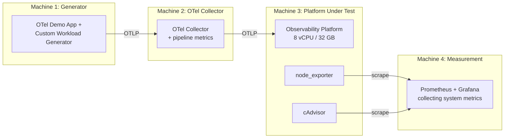

How do open-source observability platforms actually perform under identical conditions? We deploy SigNoz, OpenObserve, ClickStack, Parseable, Grafana LGTM, VictoriaMetrics, Uptrace, and more on the same 8 vCPU / 32 GB hardware, send the same OpenTelemetry workloads, and measure ingestion throughput, storage efficiency, query latency, and signal correlation UX. For architectural classification and full capability matrices across all candidates, see our companion guide [Open-Source Observability Platforms Compared](). To understand the cost impact of these hardware requirements versus commercial SaaS bills, consult our [paid observability pricing analysis]().

> Feature tables tell you what exists. Benchmarks tell you what works.

**The rule:** Same hardware, same OTel Collector, same telemetry dataset, same retention config. No marketing. No trust. Just numbers.

### TL;DR — What We Measure

| Benchmark category | What it answers | Benchmarks |
| :--- | :--- | :--- |
| **Resource usage** | How much does it cost to run? | Idle footprint, CPU/RAM under load |
| **Ingestion** | How fast can it swallow data? | Logs, traces, metrics cardinality |
| **Storage** | How efficiently does it compress? | Bytes per datapoint after compaction |
| **Query speed** | How fast can you get answers? | Log, metric, trace query latency |
| **Correlation UX** | How many clicks to root-cause? | Metric → trace → log navigation |
| **Operational** | What's the day-2 experience? | Failure recovery, upgrades, TTFT |

> Results pending Phase 1 execution. Jump to [The 15 Benchmarks](#the-15-benchmarks) for methodology or [Results](#results) for the data.

---

## Table of Contents

- [Methodology](#methodology)
  - [Infrastructure](#infrastructure)
  - [Isolation Rules](#isolation-rules)
  - [Open-Source Benchmark Tools & Frameworks](#open-source-benchmark-tools--frameworks)
  - [Telemetry Generator](#telemetry-generator)
  - [Measurement Stack](#measurement-stack)
- [Benchmark Phases](#benchmark-phases)
- [The 15 Benchmarks](#the-15-benchmarks)
  - [Benchmark 1 — Idle Footprint](#benchmark-1--idle-footprint)
  - [Benchmark 2 — Log Ingestion Throughput](#benchmark-2--log-ingestion-throughput)
  - [Benchmark 3 — Trace Ingestion](#benchmark-3--trace-ingestion)
  - [Benchmark 4 — Metrics Cardinality](#benchmark-4--metrics-cardinality)
  - [Benchmark 5 — Storage Efficiency](#benchmark-5--storage-efficiency)
  - [Benchmark 6 — Log Query Latency](#benchmark-6--log-query-latency)
  - [Benchmark 7 — Metrics Queries](#benchmark-7--metrics-queries)
  - [Benchmark 8 — Trace Queries](#benchmark-8--trace-queries)
  - [Benchmark 9 — Signal Correlation (Qualitative)](#benchmark-9--signal-correlation-qualitative)
  - [Benchmark 10 — Failure / Backpressure](#benchmark-10--failure--backpressure)
  - [Benchmark 11 — Retention / Deletion](#benchmark-11--retention--deletion)
  - [Benchmark 12 — TTFT (Time To First Telemetry)](#benchmark-12--ttft-time-to-first-telemetry)
  - [Benchmark 13 — Upgrade Challenge](#benchmark-13--upgrade-challenge)
  - [Benchmark 14 — Restart / Recovery](#benchmark-14--restart--recovery)
  - [Benchmark 15 — Noisy-Neighbor Query](#benchmark-15--noisy-neighbor-query)
- [What These Benchmarks Don't Cover](#what-these-benchmarks-dont-cover)
- [Results](#results)
  - [Hero Table](#hero-table)
  - [Detailed Results per Benchmark](#detailed-results-per-benchmark)
- [Category Winners](#category-winners)
- [Scoring (25 Criteria)](#scoring-25-criteria)
- [Conclusion](#conclusion)
- [FAQ](#faq)
- [Reproducibility](#reproducibility)
- [References](#references)

---

## Methodology

### Infrastructure

**Phase 1 — Single-node (primary comparison):**

```text
CPU:        8 vCPU (dedicated, not burstable)
RAM:        32 GB
Disk:       500 GB NVMe (~200k random IOPS, ~3 GB/s sequential)
OS:         Ubuntu 24.04 LTS
Filesystem: ext4
Docker:     27.x (same version for all runs)
Kernel:     6.8.x
Network:    10 Gbps between all machines (same availability zone)
```

**Phase 2 — Scale test:**

```text
CPU:        16 vCPU
RAM:        64 GB
Disk:       1 TB NVMe
```

**Deployment mode:**

- **Phase 1:** Docker Compose on bare VM (no Kubernetes). This isolates platform performance from K8s overhead and is the simplest reproducible setup.
- **Phase 2:** Kubernetes (k3s single-node) for platforms that require it (Coroot's eBPF node agent, operators that need K8s APIs). Platforms that don't require K8s still run via Docker Compose for consistency with Phase 1 results.

### Isolation Rules

1. **Never run platforms simultaneously** — CPU cache/IO contention invalidates results
2. **Clean VM per run** — clone base image → deploy → benchmark → destroy
3. **Generator on separate machine** — prevent workload CPU from being attributed to platform
4. **Independent measurement** — never use the product being benchmarked to measure itself



**Execution pattern:**

```bash
# For each platform:
terraform apply -var="platform=signoz"    # Provision clean VM
ansible-playbook deploy.yml               # Deploy platform
./run-benchmarks.sh                       # Execute all benchmarks
./collect-results.sh                      # Export measurements
terraform destroy                         # Clean slate for next
```

### Open-Source Benchmark Tools & Frameworks

Rather than reinventing synthetic load from scratch, our benchmarking harness builds upon established open-source tools, load generators, and sizing specifications:

| Category | Open-Source Tool / Library | Primary Role & Strength |
| :--- | :--- | :--- |
| **Telemetry & Load Generation** | **[telemetrygen](https://github.com/open-telemetry/opentelemetry-collector-contrib/tree/main/cmd/telemetrygen)** | Official OpenTelemetry CLI for generating high-rate synthetic OTLP logs, metrics, and traces over HTTP/gRPC. |
| | **[OpenTelemetry Astronomy Shop](https://github.com/open-telemetry/opentelemetry-demo)** | Multi-service enterprise demo simulating realistic trace waterfalls, span links, and cross-service error propagation. |
| | **[TSBS (Time Series Benchmark Suite)](https://github.com/timescale/tsbs)** | Standardized suite for benchmarking time-series databases across varied ingestion volumes and queries. |
| | **[flog](https://github.com/mingrammer/flog)** / **[logbench](https://github.com/openobserve/logbench)** | High-throughput fake log generators for RFC5424, Common Log Format, and arbitrary JSON schemas. |
| | **[k6](https://github.com/grafana/k6)** + **[xk6-distributed-tracing](https://github.com/grafana/xk6-distributed-tracing)** | Programmable HTTP/gRPC load testing tool with native distributed trace context propagation. |
| | **[ghz](https://github.com/bojand/ghz)** | High-performance gRPC benchmarking tool tailored for saturated OTLP/gRPC ingestion tests. |
| **Storage & Query Engines** | **[Rally (esrally / opensearch-benchmark)](https://github.com/elastic/rally)** | Macrobenchmarking framework with standardized logging and metrics tracks (e.g., `http_logs`, `metricbeat`). |
| | **[clickhouse-benchmark](https://clickhouse.com/docs/en/operations/utilities/clickhouse-benchmark)** | Built-in ClickHouse utility for executing concurrent analytical queries and measuring p50/p95/p99 query latencies. |
| | **[prombench](https://github.com/prometheus/prombench)** | Official automated Prometheus benchmarking harness designed to stress-test PromQL query engines at scale. |
| **Chaos & Resilience** | **[Chaos Mesh](https://github.com/chaos-mesh/chaos-mesh)** / **[Litmus](https://github.com/litmuschaos/litmus)** | Kubernetes-native chaos engineering platforms to automate process kills, CPU spikes, and node draining during ingestion. |
| | **[Toxiproxy](https://github.com/Shopify/toxiproxy)** | TCP proxy used to inject network latency, bandwidth limits, and connection drops between OTel Collector and platforms. |
| **Profiling & System Metrics** | **[cAdvisor](https://github.com/google/cadvisor)**, **[node_exporter](https://github.com/prometheus/node_exporter)**, **[pidstat](https://man7.org/linux/man-pages/man1/pidstat.1.html)** | Non-intrusive container and OS resource utilization collectors. |
| | **[py-spy](https://github.com/benfred/py-spy)** / **[pprof](https://github.com/google/pprof)** | Sampling profilers to pinpoint GC pauses, lock contention, and memory leaks during saturation runs. |

#### Official Sizing & Benchmarking Guides

- **[OpenTelemetry Collector Sizing Guide](https://github.com/open-telemetry/opentelemetry-collector/blob/main/docs/performance.md):** Official memory/CPU formulas for buffering, batching, and queueing under backpressure.
- **[VictoriaMetrics Benchmark Methodology](https://docs.victoriametrics.com/articles/):** Guidance on measuring TSDB write amplification and RAM per active time series.
- **[Elasticsearch / OpenSearch Sizing Principles](https://www.elastic.co/guide/en/elasticsearch/reference/current/tune-for-indexing-speed.html):** Recommended segment merge policies, refresh intervals, and bulk sizing for log ingestion.
- **[ClickHouse Observability Schemas Guide](https://clickhouse.com/blog/storing-log-data-in-clickhouse-fluent-bit-vector):** Optimal codecs (`ZSTD`, `DoubleDelta`), sorting keys, and partitioning schemes for telemetry tables.

> **Why not ClickBench?** [ClickBench](https://benchmark.clickhouse.com/) measures analytical DBMS query performance on structured tabular data. Our benchmark tests end-to-end observability workflows — OTLP ingestion, cross-signal correlation, and real-world query patterns — which ClickBench does not cover.

### Telemetry Generator

**Primary workload:** [OpenTelemetry Astronomy Shop (Demo)](https://github.com/open-telemetry/opentelemetry-demo) — produces realistic logs, metrics, and traces across multiple microservices.

**Supplementary generators:**

- Custom log generator using `telemetrygen` and `flog` (structured JSON, configurable rate)
- Custom metrics generator using `tsbs` and `telemetrygen` (configurable cardinality, histogram support)
- Custom trace generator using `xk6-distributed-tracing` and `telemetrygen` (configurable depth, service count, error rate)

All generators use standard OTLP export — no vendor-specific integrations.

### Measurement Stack

System-level metrics captured externally:

| Metric | Source |
| :--- | :--- |
| CPU (per-process) | pidstat / cAdvisor |
| Memory (RSS, working set) | cAdvisor / docker stats |
| Disk I/O (read/write throughput, IOPS) | iostat / node_exporter |
| Network (RX/TX bytes) | node_exporter |
| Container restarts / OOMs | Docker events / cAdvisor |

Application-level metrics:

| Metric | Source |
| :--- | :--- |
| Records ingested/sec | OTel Collector pipeline metrics |
| Records dropped | OTel Collector exporter metrics |
| Backpressure events | OTel Collector queue metrics |
| Query latency | Custom query runner (p50/p95/p99) |

### Platform Versions

All platforms pinned to the latest stable release as of the benchmark run date. Exact versions recorded per run:

| Platform | Version | Image/Chart |
| :--- | :--- | :--- |
| SigNoz | <!-- TODO: e.g. v0.50 --> | `signoz/signoz:` |
| OpenObserve | <!-- TODO: e.g. v0.13 --> | `openobserve/openobserve:` |
| ClickStack | <!-- TODO --> | `clickhouse/clickstack:` |
| Parseable | <!-- TODO --> | `parseable/parseable:` |
| OneUptime | <!-- TODO --> | `oneuptime/oneuptime:` |
| Uptrace | <!-- TODO --> | `uptrace/uptrace:` |
| Coroot | <!-- TODO --> | `coroot/coroot:` |
| Grafana LGTM | <!-- TODO --> | Loki / Mimir / Tempo / Grafana individual versions |
| Apache SkyWalking | <!-- TODO --> | `apache/skywalking-oap-server:` |
| OpenSearch | <!-- TODO --> | `opensearchproject/opensearch:` |
| VictoriaMetrics | <!-- TODO --> | VM / VL / VT individual versions |
| Highlight.io | <!-- TODO --> | `highlight/highlight:` |
| Elastic Observability | <!-- TODO --> | `elasticsearch:` + `kibana:` |

> Versions will be filled at benchmark execution time and frozen for the entire run. No mid-benchmark upgrades.

### OTel Collector Configuration

All platforms receive telemetry through a shared [OpenTelemetry Collector](https://github.com/open-telemetry/opentelemetry-collector-contrib) (version: `0.108.x` or latest stable at run time).

Key pipeline settings (identical across all platform tests):

```yaml
# Shared batch/queue config — not tuned per platform
processors:
  batch:
    send_batch_size: 8192
    timeout: 200ms
  memory_limiter:
    check_interval: 1s
    limit_mib: 1024
    spike_limit_mib: 256

exporters:
  otlphttp:
    endpoint: "http://<platform>:4318"
    retry_on_failure:
      enabled: true
      max_elapsed_time: 300s
```

Full configuration available in the [benchmark repository](https://github.com/sagarnikam123/observability-benchmark/tree/main/collector).

### Statistical Methodology

- **Ingestion benchmarks:** Measured over 25 minutes (after 5-minute warm-up) per rate tier. Reported as mean sustained rate with standard deviation.
- **Query benchmarks:** Each query executed 20 times; first 2 discarded (cold cache warm-up). Results reported as p50, p95, p99 from the remaining 18 iterations. With 18 samples, p95 confidence intervals are wide — we note when differences between platforms are within measurement noise.
- **Resource metrics:** Sampled at 10-second intervals via cAdvisor/node_exporter. Reported as mean and peak during the measurement window.

> **Limitation:** 18 query samples per data point provides directional signal, not statistical proof. Where platforms are within 20% of each other, we call it "comparable" rather than declaring a winner.

---

## Benchmark Phases

Not all 13 platforms are benchmarked simultaneously. We run in two phases to keep the project manageable while covering the clearest architectural comparisons first.

**Phase 1 (primary — Docker Compose on bare VM):**

| Platform | Why included |
| :--- | :--- |
| SigNoz | Unified ClickHouse observability |
| OpenObserve | Unified Rust / object-storage platform |
| ClickStack | ClickHouse-native observability |
| Grafana LGTM | Composable best-of-breed stack |
| VictoriaMetrics stack | Specialized signal-specific databases |
| Uptrace | Lightweight OTel / ClickHouse APM |
| Parseable | Object-storage-first, Rust / Parquet data lake |

**Phase 2 (extended — includes K8s where required):**

| Platform | Why separate |
| :--- | :--- |
| Coroot | eBPF node agent requires Linux kernel 4.16+ (basic) / 5.8+ (TLS tracing) and benefits from K8s; ingestion model differs |
| OneUptime | Broader reliability platform evaluation (incidents, on-call, status pages) |
| Highlight.io | Developer-first / frontend-focused; different signal emphasis |
| Elastic Observability | Search-centric architecture; JVM tuning differs |
| Apache SkyWalking | APM-first; JVM-based OAP server |
| OpenSearch Observability | Search-centric; Data Prepper pipeline adds setup complexity |

> Phase 1 results are published first. Phase 2 extends the comparison tables once complete.

---

## The 15 Benchmarks

### Benchmark 1 — Idle Footprint

**Goal:** What does it cost to run with zero incoming telemetry?

**Procedure:** Deploy platform, wait for all services healthy, measure for 10 minutes with no data flowing.

**Result table:**

| Platform | Containers | Idle RAM | Idle CPU % | Initial Disk | Ready Time |
| :--- | ---: | ---: | ---: | ---: | ---: |
| SigNoz | | | | | |
| OpenObserve | | | | | |
| ClickStack | | | | | |
| OneUptime | | | | | |
| Uptrace | | | | | |
| Parseable | | | | | |
| Coroot | | | | | |
| Grafana LGTM | | | | | |
| Apache SkyWalking | | | | | |
| OpenSearch Observability | | | | | |
| VictoriaMetrics stack | | | | | |
| Highlight.io | | | | | |
| Elastic Observability | | | | | |

<!-- TODO: Fill after running benchmarks -->

> **Results pending.** Will be populated after benchmark execution.

---

### Benchmark 2 — Log Ingestion Throughput

*(For architecture comparisons between stream-based indexless storage like Loki/VictoriaLogs and columnar Parquet lakes like Parseable, see our companion [Open-Source Log Management Tools Guide]().)*

**Workload:** Structured JSON logs via OTLP

```json
{
  "timestamp": "2026-08-20T10:00:00.123456Z",
  "service.name": "checkout-service",
  "severity": "INFO",
  "trace_id": "abc123def456789...",
  "span_id": "span789...",
  "attributes": {
    "http.method": "POST",
    "http.route": "/api/v1/checkout",
    "http.status_code": 200,
    "user_id": "usr_7f3a2b1c-...",
    "cart.items": 3,
    "region": "us-east-1"
  },
  "body": "Checkout completed successfully for order #12345"
}
```

**Ramp schedule (30 minutes each):**

| Rate | Duration | Total Records |
| ---: | :--- | ---: |
| 1,000 logs/sec | 30 min | ~1.8M |
| 10,000 logs/sec | 30 min | ~18M |
| 25,000 logs/sec | 30 min | ~45M |
| 50,000 logs/sec | 30 min | ~90M |

**Stabilization protocol:** 5-minute warm-up at each rate before measurement begins. Measurements taken from minutes 5–30. 2-minute cool-down between rate changes to let queues drain and compaction settle. This same warm-up/cool-down protocol applies to all ingestion and query benchmarks (3, 4, 7, 8) unless stated otherwise.

**Captured metrics per rate:**

- Actual records/sec ingested (sustained)
- Dropped/rejected records
- OTel Collector backpressure events
- Platform CPU / RAM / disk write / network
- Storage consumed after settling

**Result table:**

| Platform | 1k/s | 10k/s | 25k/s | 50k/s | Saturation point | CPU at 10k/s | RAM at 10k/s |
| :--- | :---: | :---: | :---: | :---: | ---: | ---: | ---: |
| SigNoz | | | | | | | |
| OpenObserve | | | | | | | |
| ClickStack | | | | | | | |
| OneUptime | | | | | | | |
| Uptrace | | | | | | | |
| Parseable | | | | | | | |
| Coroot | | | | | | | |
| Grafana LGTM | | | | | | | |
| Apache SkyWalking | | | | | | | |
| OpenSearch Observability | | | | | | | |
| VictoriaMetrics stack | | | | | | | |
| Highlight.io | | | | | | | |
| Elastic Observability | | | | | | | |

<!-- TODO: Fill after running benchmarks -->

> **Results pending.** Will be populated after benchmark execution.

---

### Benchmark 3 — Trace Ingestion

*(For dedicated trace storage engines like Jaeger v2, Tempo, and Zipkin along with tail-sampling strategies, see our [Open-Source Distributed Tracing Tools Comparison]().)*

**Workload:**

- 1,000 root traces/sec
- 8 services in trace path
- ~10 spans per trace average = **10,000 spans/sec**
- Span types: HTTP, gRPC, PostgreSQL, Redis, Kafka
- Error rate: 5%
- Slow spans (>1s): 2%

**Metrics:**

- Sustained spans/sec ingested
- Missing/dropped spans (trace completeness check)
- Trace ID lookup latency under load
- Service map accuracy (all services visible?)
- CPU / RAM during ingestion

**Result table:**

| Platform | Spans/s sustained | Trace completeness | Lookup latency (p95) | Service map accurate | CPU | RAM |
| :--- | ---: | ---: | ---: | :---: | ---: | ---: |
| SigNoz | | | | | | |
| OpenObserve | | | | | | |
| ClickStack | | | | | | |
| OneUptime | | | | | | |
| Uptrace | | | | | | |
| Parseable | | | | | | |
| Coroot | | | | | | |
| Grafana LGTM | | | | | | |
| Apache SkyWalking | | | | | | |
| OpenSearch Observability | | | | | | |
| VictoriaMetrics stack | | | | | | |
| Highlight.io | | | | | | |
| Elastic Observability | | | | | | |

<!-- TODO: Fill after running benchmarks -->

> **Results pending.** Will be populated after benchmark execution.

---

### Benchmark 4 — Metrics Cardinality

*(For time-series chunking, downsampling, and high-cardinality behavior across Prometheus, VictoriaMetrics, and Mimir, see our [Open-Source Metrics & Time-Series DBs Comparison]().)*

**Ramp active time series:**

| Phase | Active Series | Labels |
| :--- | ---: | :--- |
| Baseline | 100,000 | service, namespace, pod, container, region, method, status |
| Scale 1 | 500,000 | + http.route |
| Scale 2 | 1,000,000 | + customer_id (bounded) |
| Scale 3 | 2,000,000 | higher churn |
| Pathological | 5,000,000+ | + user_id = random UUID (cardinality explosion) |

**Metrics per phase:**

- Ingest CPU / memory
- Disk growth rate
- Simple query latency (`rate(metric[5m])`)
- Compaction CPU
- OOM events / restarts

**Key question:** How gracefully does each platform degrade under cardinality explosion? Hard crash vs slow degradation vs explicit rejection.

> **Expected:** Most platforms will fail or severely degrade at the Pathological tier (5M+ series on 8 vCPU / 32 GB). The test measures *how* they fail — OOM kill, graceful rejection with backpressure, silent data loss, or gradual slowdown.

---

### Benchmark 5 — Storage Efficiency

**Procedure:** Ingest identical telemetry across all platforms, wait for compaction to settle, measure stored bytes.

**Target ingestion:**

- Logs: ~100 GB raw (calculated from record size × count)
- Traces: ~50 GB raw
- Metrics: 500 million datapoints at 100,000 active time series (matching Benchmark 4 baseline)

**Formula:**

```text
compression_factor = raw_input_bytes / stored_bytes_after_compaction
```

> A factor of 5x means the platform stores data at 1/5th the raw size. Higher is better.

**Result table:**

| Platform | Raw Input | Stored | Compression Ratio | Time to compact |
| :--- | ---: | ---: | ---: | ---: |
| SigNoz | 150 GB | | | |
| OpenObserve | 150 GB | | | |
| ClickStack | 150 GB | | | |
| OneUptime | 150 GB | | | |
| Uptrace | 150 GB | | | |
| Parseable | 150 GB | | | |
| Coroot | 150 GB | | | |
| Grafana LGTM | 150 GB | | | |
| Apache SkyWalking | 150 GB | | | |
| OpenSearch Observability | 150 GB | | | |
| VictoriaMetrics stack | 150 GB | | | |
| Highlight.io | 150 GB | | | |
| Elastic Observability | 150 GB | | | |

<!-- TODO: Fill after running benchmarks -->

> **Results pending.** Will be populated after benchmark execution.

---

### Benchmark 6 — Log Query Latency

**Fixed query suite (easy → brutal):**

| ID | Query | Complexity |
| :--- | :--- | :--- |
| Q1 | `service=checkout`, last 15 min, limit 100 | Simple recent filter |
| Q2 | Full-text `"connection refused"`, last 24h | Text search |
| Q3 | `service=checkout AND status>=500`, last 24h | Structured filter |
| Q4 | Count errors group by service, last 24h | Aggregation |
| Q5 | `user_id=<specific-uuid>`, last 7 days | High-cardinality lookup |
| Q6 | Rare token (1 in 10M logs), full retention | Needle in haystack |

**Report p50, p95, p99 latency** — run each query 20 times, discard first 2 (cold cache).

**Result table:**

| Platform | Q1 p95 | Q2 p95 | Q3 p95 | Q4 p95 | Q5 p95 | Q6 p95 |
| :--- | ---: | ---: | ---: | ---: | ---: | ---: |
| SigNoz | | | | | | |
| OpenObserve | | | | | | |
| ClickStack | | | | | | |
| OneUptime | | | | | | |
| Uptrace | | | | | | |
| Parseable | | | | | | |
| Coroot | | | | | | |
| Grafana LGTM | | | | | | |
| Apache SkyWalking | | | | | | |
| OpenSearch Observability | | | | | | |
| VictoriaMetrics stack | | | | | | |
| Highlight.io | | | | | | |
| Elastic Observability | | | | | | |

<!-- TODO: Fill after running benchmarks -->

> **Results pending.** Will be populated after benchmark execution.

---

### Benchmark 7 — Metrics Queries

**Query suite (PromQL or equivalent):**

| ID | Query | Range |
| :--- | :--- | :--- |
| M1 | `rate(http_requests_total[5m])` | 15 min |
| M2 | `sum by (service)(rate(http_requests_total{status=~"5.."}[5m]))` | 6h |
| M3 | `histogram_quantile(0.99, sum by (le,service)(rate(http_request_duration_seconds_bucket[5m])))` | 24h |
| M4 | M3 repeated | 7 days |
| M5 | M3 repeated | 30 days |

**Report:** p50/p95/p99 latency, CPU during query, memory spike during query. Each query run 20 times (first 2 discarded for cache warm-up).

---

### Benchmark 8 — Trace Queries

| ID | Query | Type |
| :--- | :--- | :--- |
| T1 | Lookup by known trace ID | Point lookup |
| T2 | `service=checkout AND duration>2s` | Filter by latency |
| T3 | `service=checkout AND error=true AND db.system=postgresql` | Multi-attribute filter |
| T4 | Find slow traces without knowing trace ID | Real APM discovery |

**Report:** Latency, result completeness, waterfall render time (for UI-based queries). Each query run 20 times (first 2 discarded).

---

### Benchmark 9 — Signal Correlation (Qualitative)

**The most valuable benchmark in this article.**

**Setup:** Inject a known failure — 3-second PostgreSQL query in payment-service causing:

```text
Frontend → checkout-service → payment-service → PostgreSQL (3s delay)
```

This produces:

- Latency metric spike on payment-service
- Slow distributed trace (3+ seconds)
- Slow DB span in trace waterfall
- Application error/warning log from checkout-service (timeout)

**Test scenarios:**

| Scenario | Start from | Goal | Measure |
| :--- | :--- | :--- | :--- |
| **A** | Metric alert / dashboard spike | Find the slow SQL query | Clicks, time, queries needed |
| **B** | Error log in log viewer | Find the distributed trace | Clicks, time, context preserved |
| **C** | Slow trace in trace explorer | Find related application logs | Clicks, time, filtering UX |

**Captured:**

- Time-to-root-cause (stopwatch)
- Number of UI interactions (clicks, page navigations)
- Manual queries required (typed vs click-through)
- Context lost during navigation (did you lose the time window? service filter?)

**Scoring:** 1-5 scale per scenario, with notes on friction points.

| Score | Meaning |
| :---: | :--- |
| 5 | Single-click navigation, context fully preserved (time window, service filter) |
| 4 | 2-3 clicks, context mostly preserved, minimal manual filtering |
| 3 | Requires manual query or filter adjustment, but achievable in the same UI |
| 2 | Requires switching tools/tabs, copy-pasting IDs, or rebuilding context |
| 1 | Not achievable without external tools or scripting |

> **Note on platforms without built-in UI:** VictoriaMetrics stack and Coroot (for log/trace exploration) rely on Grafana as their visualization layer. For these platforms, we test the Grafana + datasource plugin experience and note the additional setup required. The "clicks to root-cause" metric includes any context switches between Grafana panels or datasources.

---

### Benchmark 10 — Failure / Backpressure

**Procedure:** Kill the backend for 5 minutes while telemetry generator continues at 10k logs/sec + 1k traces/sec.

**Measure:**

| Metric | What we're checking |
| :--- | :--- |
| Telemetry lost | Records that never appear after recovery |
| Recovery duration | Time from backend-up to caught-up |
| Collector memory | Growth during outage (OOM risk?) |
| Duplicate data | Does replay cause duplicates? |
| Ingest spike | Backend overwhelmed by catchup? |
| UI timeline gaps | Visible gaps in dashboards/explorer? |

---

### Benchmark 11 — Retention / Deletion

**Config:** Logs = 7 days, Metrics = 30 days, Traces = 3 days.

**Verify:**

- Data deleted automatically (no manual intervention)
- Disk space actually reclaimed (not just marked)
- CPU spikes during deletion/compaction
- Different retention per signal supported
- Query behavior at retention boundary (graceful error vs hang)

---

### Benchmark 12 — TTFT (Time To First Telemetry)

**Scenario:** Fresh Ubuntu VM, engineer follows official docs.

**Timer starts at:** First command (`git clone` / `docker compose pull` for Phase 1; `helm repo add` for Phase 2 K8s platforms)

**Timer stops when:**

- Logs visible in UI
- Metrics visible in UI
- Traces visible in UI
- Log → trace navigation works (click trace_id in log, see trace)

**Captured:**

| Metric | What |
| :--- | :--- |
| Total time | Minutes from start to all-signals-working |
| Commands executed | Shell history line count |
| YAML/config LOC | Lines of configuration written |
| Containers/pods | Runtime footprint |
| Documentation errors | Steps that didn't work as documented |
| Manual fixes | Workarounds needed beyond docs |

**Result table:**

| Platform | TTFT (min) | Commands | Config LOC | Containers | Doc errors | Fixes needed |
| :--- | ---: | ---: | ---: | ---: | ---: | ---: |
| SigNoz | | | | | | |
| OpenObserve | | | | | | |
| ClickStack | | | | | | |
| OneUptime | | | | | | |
| Uptrace | | | | | | |
| Parseable | | | | | | |
| Coroot | | | | | | |
| Grafana LGTM | | | | | | |
| Apache SkyWalking | | | | | | |
| OpenSearch Observability | | | | | | |
| VictoriaMetrics stack | | | | | | |
| Highlight.io | | | | | | |
| Elastic Observability | | | | | | |

<!-- TODO: Fill after running benchmarks -->

> **Results pending.** Will be populated after benchmark execution.

---

### Benchmark 13 — Upgrade Challenge

**Procedure:**

1. Deploy version N-1
2. Ingest 24 hours of telemetry
3. Upgrade to current version (following official upgrade docs)

**Measure:**

| Metric | What |
| :--- | :--- |
| Upgrade duration | Time from start to fully operational |
| Downtime | Period where ingestion or queries don't work |
| Manual steps | Beyond `helm upgrade` or `docker compose pull` |
| Data loss | Any telemetry missing post-upgrade? |
| Config changes | Breaking config format changes? |
| Rollback success | Can you go back if upgrade fails? |

---

### Benchmark 14 — Restart / Recovery

**Procedure:** With 7 days of stored telemetry, `kill -9` the main backend process (or `kubectl delete pod --force`).

**Measure:**

| Metric | What |
| :--- | :--- |
| Restart time | Seconds until process healthy |
| Ingestion resume | Seconds until new data accepted |
| Query resume | Seconds until queries return results |
| Corruption | Any data corruption / recovery process needed? |
| CPU spike | Startup CPU usage vs steady-state |

---

### Benchmark 15 — Noisy-Neighbor Query

**Procedure:** Run continuous ingestion (10k logs/sec, 1k traces/sec) while simultaneously executing a massive analytical query:

```text
Last 30 days, count logs group by service, http.route, status
```

**Measure:**

| Metric | Impact |
| :--- | :--- |
| Ingestion latency | Does it increase during heavy query? |
| Data dropped | Any records lost during query? |
| Dashboard latency | Do simple dashboard queries slow down? |
| CPU saturation | Does the system max out? |
| Memory spike | Dangerous memory growth? |
| Query isolation | Does the platform have workload separation? |

---

## What These Benchmarks Don't Cover

These benchmarks are designed for single-node, short-duration evaluation. They do not measure:

- **Multi-tenant isolation** — all tests run a single tenant; noisy-neighbor between tenants is untested
- **Long-term stability** — 30-minute ingestion windows don't expose memory leaks or compaction debt that appears after weeks
- **Production traffic patterns** — real workloads have bursty, diurnal patterns; our generators produce steady-state load
- **Geo-distributed deployments** — all tests run in a single region/machine
- **Mixed-version upgrades** — we test N-1 → N only, not rolling upgrades across a cluster
- **Security/auth overhead** — SSO, RBAC, and TLS are disabled to isolate performance from auth latency
- **Cost modeling** — we measure resource usage but don't convert to cloud pricing (too variable across providers)

> If any of these gaps are critical to your decision, extend the benchmark suite or run a focused POC in your actual environment.

---

## Results

### Hero Table

> **Score columns explained:**
>
> - **Correlation** = Benchmark 9 average score (1-5 scale across scenarios A/B/C)
> - **Ops Score** = weighted average of Benchmarks 10–15 (failure recovery, retention, TTFT, upgrade, restart, noisy-neighbor) normalized to 1-10
> - **OSS Score** = criteria #1–2 (free completeness + license friendliness from our [platforms comparison]()) normalized to 1-10
> - **Total** = weighted sum across all 25 criteria from the Scoring table below

<!-- TODO: Fill after all benchmarks complete -->

> **Results pending.** This table will be populated after Phase 1 benchmark execution.

<div style="overflow-x: auto;" markdown="1">

| Platform | TTFT | Idle RAM | Max Logs/s | Max Spans/s | Storage Factor[^sf] | Log Q5 p95 | Trace T1 | Correlation | Ops Score | OSS Score | **Total** |
| :--- | ---: | ---: | ---: | ---: | ---: | ---: | ---: | ---: | ---: | ---: | ---: |
| SigNoz | | | | | | | | | | | |
| OpenObserve | | | | | | | | | | | |
| ClickStack | | | | | | | | | | | |
| OneUptime | | | | | | | | | | | |
| Uptrace | | | | | | | | | | | |
| Parseable | | | | | | | | | | | |
| Coroot | | | | | | | | | | | |
| Grafana LGTM | | | | | | | | | | | |
| Apache SkyWalking | | | | | | | | | | | |
| OpenSearch Observability | | | | | | | | | | | |
| VictoriaMetrics stack | | | | | | | | | | | |
| Highlight.io | | | | | | | | | | | |
| Elastic Observability | | | | | | | | | | | |

</div>

[^sf]: Storage Factor = raw_input_bytes / stored_bytes_after_compaction. Higher means better compression. 150 GB raw input (100 GB logs + 50 GB traces) ingested identically across all platforms.

### Detailed Results per Benchmark

<!-- TODO: Link to or embed detailed results per benchmark -->

> **Detailed breakdowns per benchmark will be added here after Phase 1 execution.**

---

## Category Winners

<!-- TODO: Fill after benchmarks -->

> **Category winners will be declared after all Phase 1 benchmarks complete.**

| Category | Winner | Runner-up | Notes |
| :--- | :--- | :--- | :--- |
| **Best overall OSS observability** | | | |
| **Best for OpenTelemetry** | | | |
| **Best for logs at scale** | | | |
| **Best storage efficiency** | | | |
| **Best query performance** | | | |
| **Best for Kubernetes** | | | |
| **Best zero-code/eBPF** | | | |
| **Best APM experience** | | | |
| **Best signal correlation** | | | |
| **Lowest operational overhead** | | | |
| **Lowest hardware requirements** | | | |
| **Best for Prometheus/Grafana users** | | | |
| **Best reliability platform** | | | |

---

## Scoring (25 Criteria)

Weighted scores from our [25-criteria evaluation framework](#the-25-scored-criteria), populated with both documentation-based and benchmark-based evidence.

<!-- TODO: Fill with weighted scores after benchmarks -->

> **Phase 1 results pending.** Scores will be populated after benchmark execution. Phase 2 platforms will be added in a subsequent update.

<div style="overflow-x: auto;" markdown="1">

| # | Criterion | Weight | SigNoz | OpenObserve | ClickStack | Parseable | OneUptime | Uptrace | Coroot | LGTM | SkyWalking | OpenSearch | Victoria | Highlight | Elastic |
| ---: | :--- | ---: | ---: | ---: | ---: | ---: | ---: | ---: | ---: | ---: | ---: | ---: | ---: | ---: | ---: |
| 1 | Free completeness | **7%** | | | | | | | | | | | | | |
| 2 | License friendliness | 4% | | | | | | | | | | | | | |
| 3 | Logs | **5%** | | | | | | | | | | | | | |
| 4 | Metrics | **5%** | | | | | | | | | | | | | |
| 5 | Traces | **5%** | | | | | | | | | | | | | |
| 6 | OTel native | **5%** | | | | | | | | | | | | | |
| 7 | Prometheus compat | 3% | | | | | | | | | | | | | |
| 8 | Signal correlation | **5%** | | | | | | | | | | | | | |
| 9 | APM | 4% | | | | | | | | | | | | | |
| 10 | K8s monitoring | 4% | | | | | | | | | | | | | |
| 11 | Infra monitoring | 3% | | | | | | | | | | | | | |
| 12 | eBPF | 3% | | | | | | | | | | | | | |
| 13 | Profiling | 2% | | | | | | | | | | | | | |
| 14 | Dashboards/UX | 4% | | | | | | | | | | | | | |
| 15 | Alerting/SLO | 4% | | | | | | | | | | | | | |
| 16 | Query UX | 4% | | | | | | | | | | | | | |
| 17 | Install complexity | 3% | | | | | | | | | | | | | |
| 18 | Ops complexity | **5%** | | | | | | | | | | | | | |
| 19 | Ingestion throughput | **5%** | | | | | | | | | | | | | |
| 20 | Query performance | **5%** | | | | | | | | | | | | | |
| 21 | Storage efficiency | **5%** | | | | | | | | | | | | | |
| 22 | CPU efficiency | 3% | | | | | | | | | | | | | |
| 23 | Memory efficiency | 3% | | | | | | | | | | | | | |
| 24 | High-cardinality | 3% | | | | | | | | | | | | | |
| 25 | HA/scalability | 3% | | | | | | | | | | | | | |
| | **Weighted Total** | **100%** | | | | | | | | | | | | | |

</div>

---

## Conclusion

> **Conclusion will be written after all benchmark data is collected and analyzed.**

---

## FAQ

**How do you prevent one platform from getting an unfair advantage?**
Every platform runs on a freshly cloned VM image — never simultaneously. The OTel Collector config, telemetry workload, and retention settings are identical. The platform under test never measures itself; all resource metrics come from an external Prometheus + cAdvisor stack.

**Why Docker Compose instead of Kubernetes?**
Docker Compose isolates platform performance from K8s scheduling overhead and is the simplest reproducible setup. Phase 2 adds K8s for platforms that require it (Coroot's eBPF agent, operators needing K8s APIs).

**Are these benchmarks representative of production?**
They test single-node, steady-state performance on standardized hardware. Production adds diurnal patterns, multi-tenancy, network partitions, and months of accumulated data. Use these results to shortlist, then run a focused POC in your environment.

**Why not benchmark all 13 platforms at once?**
Phase 1 covers the 7 most architecturally comparable platforms (all accept OTLP, all run in Docker Compose). Phase 2 adds platforms with different ingestion models (eBPF), heavier JVM requirements, or broader scope (incident management).

**Can I reproduce these benchmarks?**
Yes. All code, Docker Compose files, OTel Collector configs, generator scripts, and query suites are in the [benchmark repository](https://github.com/sagarnikam123/observability-benchmark). Run `make benchmark PLATFORM=<name>` to reproduce any result.

---

## Reproducibility

All benchmark code, configurations, and raw results are available:

- **Repository:** [github.com/sagarnikam123/observability-benchmark](https://github.com/sagarnikam123/observability-benchmark)
- **Docker Compose files:** One per platform, pinned versions
- **OTel Collector config:** Single shared configuration
- **Generator scripts:** Configurable rate, duration, cardinality
- **Query suites:** Exact queries used for each benchmark
- **Result CSVs:** Raw measurements for independent analysis
- **Terraform/Ansible:** Infrastructure provisioning for reproducible environments

To reproduce:

```bash
git clone https://github.com/sagarnikam123/observability-benchmark
cd observability-benchmark
make benchmark PLATFORM=signoz    # Deploy + benchmark + collect
make benchmark PLATFORM=openobserve
# ... repeat for each platform
make report                       # Generate comparison tables
```

> ### 🧭 The Complete Observability Guide & Comparison Series
>
> - **Unified Platforms:** [Open-Source Observability Platforms Compared]()
> - **Hands-On Testing:** [Benchmarking Open-Source Observability: Real Hardware & Ingestion Numbers]()
> - **Cost & Licensing Analysis:** [Paid Observability Platforms & Enterprise Pricing Comparison]()
> - **Deep-Dive Specialized Signal Guides:**
>   - **Logging:** [Open-Source Log Management Tools Compared (Loki, VictoriaLogs, Parseable, CLP)]()
>   - **Metrics & TSDBs:** [Open-Source Metrics Tools & Time-Series DBs Compared]()
>   - **Distributed Tracing:** [Open-Source Distributed Tracing Tools Compared (Jaeger, Tempo, Zipkin)]()
>   - **Continuous Profiling:** [Open-Source Continuous Profiling Tools Compared (Pyroscope, Parca, Perforator)]()
{: .prompt-info }

---

## References

### Observability Platforms

- [SigNoz Documentation](https://signoz.io/docs/)
- [OpenObserve Documentation](https://openobserve.ai/docs/)
- [ClickStack Documentation](https://clickhouse.com/docs/use-cases/observability/clickstack)
- [OneUptime Documentation](https://oneuptime.com/docs)
- [Uptrace Documentation](https://uptrace.dev/get/overview.html)
- [Coroot Documentation](https://docs.coroot.com/)
- [Grafana LGTM Stack](https://grafana.com/oss/)
- [Apache SkyWalking Documentation](https://skywalking.apache.org/docs/)
- [OpenSearch Observability](https://docs.opensearch.org/latest/observing-your-data/)
- [VictoriaMetrics Documentation](https://docs.victoriametrics.com/)
- [VictoriaLogs](https://docs.victoriametrics.com/victorialogs/)
- [VictoriaTraces](https://docs.victoriametrics.com/victoriatraces/)
- [Highlight.io Documentation](https://www.highlight.io/docs)
- [Elastic Observability Documentation](https://www.elastic.co/docs/current/observability)

### Benchmarking Tools & Generators

- [OpenTelemetry Demo (Astronomy Shop)](https://github.com/open-telemetry/opentelemetry-demo)
- [OpenTelemetry telemetrygen CLI](https://github.com/open-telemetry/opentelemetry-collector-contrib/tree/main/cmd/telemetrygen)
- [Time Series Benchmark Suite (TSBS)](https://github.com/timescale/tsbs)
- [Elastic Rally (esrally)](https://github.com/elastic/rally)
- [OpenSearch Benchmark](https://github.com/opensearch-project/opensearch-benchmark)
- [ClickHouse Benchmark Utility](https://clickhouse.com/docs/en/operations/utilities/clickhouse-benchmark)
- [Prometheus Prombench](https://github.com/prometheus/prombench)
- [flog Log Generator](https://github.com/mingrammer/flog)
- [xk6-distributed-tracing](https://github.com/grafana/xk6-distributed-tracing)
- [Chaos Mesh](https://chaos-mesh.org/)
- [Shopify Toxiproxy](https://github.com/Shopify/toxiproxy)
- [OpenTelemetry Collector Performance Guide](https://github.com/open-telemetry/opentelemetry-collector/blob/main/docs/performance.md)

---

*Benchmarks run: August 2026. Platform versions: see [Platform Versions table](#platform-versions). Hardware: 8 vCPU / 32 GB RAM / 500 GB NVMe / Ubuntu 24.04.*
