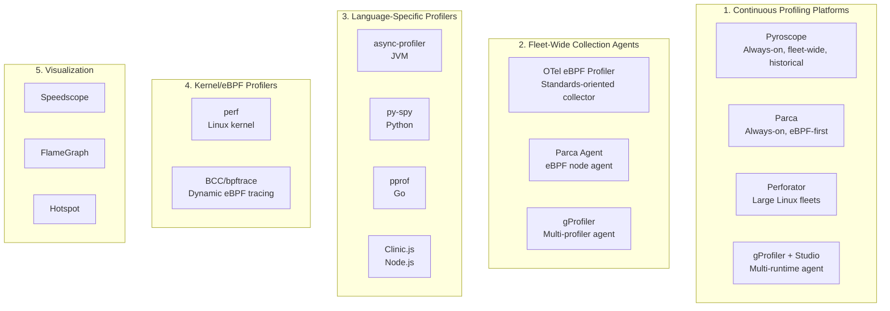
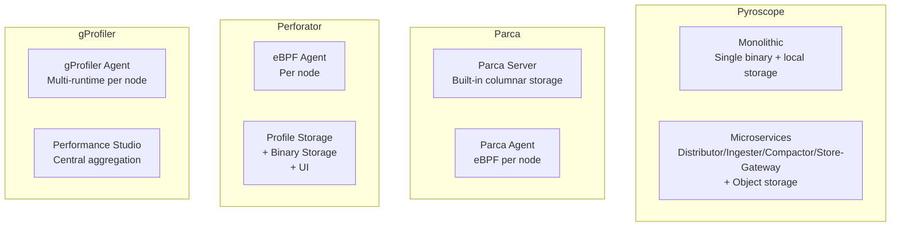

Which open-source continuous profiling tool should you self-host in 2026? This article compares dedicated profiling platforms (Grafana Pyroscope, Parca, Yandex Perforator, Intel gProfiler), fleet-wide eBPF agents (OpenTelemetry eBPF Profiler), language-specific profilers (async-profiler, py-spy, pprof, Clinic.js), kernel/eBPF tools (perf, BCC, bpftrace), and visualization utilities (Speedscope, FlameGraph) — covering architecture, language coverage, overhead, storage, and operational complexity.

> [Metrics]() tell you WHEN something is slow. [Traces]() tell you WHERE in the call chain. Profiles tell you WHY — which function, which allocation, which lock. (On commercial APM suites, adding continuous profiling carries steep host surcharges; see our [paid observability pricing review]()).

### TL;DR — Quick Recommendations

| Use case | Best fit | Runner-up |
| :--- | :--- | :--- |
| **Full profiling platform, Grafana ecosystem** | Pyroscope | Parca |
| **eBPF-first, zero-code, Apache 2.0** | Parca | OTel eBPF Profiler + Pyroscope |
| **Large Linux C/C++/Go/Rust fleets** | Perforator | Parca |
| **Multi-runtime detection (Java + Python + native)** | gProfiler | Pyroscope |
| **Standards-oriented OTel collection** | OTel eBPF Profiler | Parca Agent |
| **Java/Kotlin production profiling** | async-profiler → Pyroscope | JFR → Pyroscope |
| **Python production profiling** | py-spy → Pyroscope | gProfiler |
| **Go production profiling** | pprof → Pyroscope | Parca |
| **AGPL license unacceptable** | Parca / Perforator | gProfiler |

> Jump to [Section 1](#section-1-open-source-continuous-profiling-platforms) for platform comparison or [When to Use What](#when-to-use-what) for the full decision table.

This article focuses exclusively on **open-source, self-hostable profiling tools** — no mandatory commercial licenses, no mandatory SaaS accounts. The profiling ecosystem spans continuous profiling platforms, fleet-wide agents, language-specific profilers, kernel/eBPF tools, and visualization utilities.

**Excluded from the primary benchmark:** Multi-signal observability platforms (SigNoz, Coroot, SkyWalking, Elastic, OneUptime) — these support profiling but are broader APM/observability systems. For full-platform comparisons, see our companion guide [Open-Source Observability Platforms Compared](). For empirical CPU/RAM collector and agent overhead benchmarks under stress, see [Benchmarking Open-Source Observability]().

---

## Table of Contents

- [Scope & Selection Criteria](#scope--selection-criteria)
- [Legend](#legend)
- [Taxonomy](#taxonomy)
- [Section 1: Open-Source Continuous Profiling Platforms](#section-1-open-source-continuous-profiling-platforms)
  - [The Candidates](#the-candidates)
  - [High-Level Feature Comparison](#high-level-feature-comparison)
  - [Architecture Classification](#architecture-classification)
  - [Collection Mechanisms](#collection-mechanisms)
  - [Language & Runtime Coverage](#language--runtime-coverage)
  - [Storage & Retention](#storage--retention)
  - [Query & Visualization](#query--visualization)
  - [Operational Complexity](#operational-complexity)
  - [When to Use What](#when-to-use-what)
  - [Known Limitations](#known-limitations)
- [Section 2: Java and JVM Profilers](#section-2-java-and-jvm-profilers)
  - [The Candidates](#the-candidates-1)
  - [Recommended Java/Kotlin Stack](#recommended-javakotlin-stack)
- [Section 3: Python Profilers](#section-3-python-profilers)
  - [The Candidates](#the-candidates-2)
  - [Recommended Python Stack](#recommended-python-stack)
- [Section 4: Go Profilers](#section-4-go-profilers)
- [Section 5: Node.js and Browser/UI Profilers](#section-5-nodejs-and-browserui-profilers)
  - [Node.js](#nodejs)
  - [Browser/Frontend](#browserfrontend)
- [Section 6: Linux, Native and eBPF Profiling Tools](#section-6-linux-native-and-ebpf-profiling-tools)
- [Section 7: Profile Formats and Visualization](#section-7-profile-formats-and-visualization)
- [Recommended Evaluation Scope](#recommended-evaluation-scope)
- [FAQ](#faq)
- [References](#references)

---

## Scope & Selection Criteria

| Criterion | Requirement |
| :--- | :--- |
| **Open-source** | OSI-approved license or well-known open license |
| **Self-hostable** | Runs entirely on your infrastructure |
| **No mandatory commercial license** | Free edition covers primary profiling functionality |
| **No mandatory SaaS account** | No phone-home, no cloud signup required |
| **Primarily designed for profiling** | Not a multi-signal platform that also does profiling |

---

## Legend

| Symbol | Meaning |
| :---: | :--- |
| ✅ | Supported / available |
| ◐ | Partial support or requires additional setup |
| ⭐ | Particular strength or best-in-class |
| 🧪 | Experimental / early support |
| — | Not supported or not applicable |

---

## Taxonomy

The profiling ecosystem is broader than "Pyroscope alternatives." Only the first category is a direct Pyroscope comparison.



| Category | What it is | Direct Pyroscope comparison? |
| :--- | :--- | :---: |
| **Continuous profiling platforms** | Always-on, stores profiles over time, fleet-wide, query historical data | Yes |
| **Fleet-wide collection agents** | Collect profiles from nodes; require a backend for storage/query | Partial (agent only) |
| **Language-specific profilers** | Deep runtime insight for one language; often feed into platforms | No |
| **Kernel/eBPF profilers** | System-level tools; on-demand or scripted | No |
| **Visualization** | Render/analyze profiles; no collection or storage | No |

---

## Section 1: Open-Source Continuous Profiling Platforms

These are the closest equivalents to Grafana Pyroscope — always-on, fleet-wide, historical continuous profiling with storage, query, and visualization.

### The Candidates

<div style="overflow-x: auto;" markdown="1">

| Platform | License | Collection | Backend/Storage | UI | Language Coverage | Positioning |
| :--- | :--- | :--- | :--- | ---: | :--- | :--- |
| **[Grafana Pyroscope](https://github.com/grafana/pyroscope)** | AGPLv3 (server); mostly Apache 2.0 (agents) | SDKs, pprof, JFR, eBPF, OTLP profiles | Built-in, scalable architecture | Grafana | Broad | Industry standard, Grafana-native (⭐ 10k · 👥 200+ · Since 2020) |
| **[Parca](https://github.com/parca-dev/parca)** | Apache 2.0 | Parca Agent, eBPF, pprof | Built-in columnar storage | Built-in / Grafana | Native + several runtimes | eBPF-first, Apache licensed (⭐ 4k · 👥 60+ · Since 2021) |
| **[Yandex Perforator](https://github.com/yandex/perforator)** | Apache 2.0; some GPLv2 components | eBPF agent | Scalable profile and binary storage | Built-in | C/C++, Go, Rust; experimental Java/Python | Large native-code fleets (⭐ 800+ · Since 2024) |
| **[Intel gProfiler](https://github.com/intel/gprofiler)** | Apache 2.0 | Multiple runtime profilers + perf/eBPF | Local files or Performance Studio | Flamegraphs / Studio | Broad | Multi-runtime detection agent (⭐ 750+ · 👥 20+ · Since 2021) |
| **[gProfiler Performance Studio](https://github.com/intel/gprofiler-performance-studio)** | Open-source | Receives gProfiler data | Central aggregation | Yes | Depends on gProfiler | Central aggregation for gProfiler (⭐ 50+ · Since 2022) |
| **[OpenTelemetry eBPF Profiler](https://github.com/open-telemetry/opentelemetry-ebpf-profiler)** | Apache 2.0; eBPF GPLv2 | System-wide eBPF | Requires a backend (Pyroscope/Parca) | No | Broad Linux runtime coverage | Standards-oriented collector agent (⭐ 800+ · Since 2023 · **CNCF**) |
| **[KubeFlame](https://github.com/pyroscope-io/kubeflame)** | Apache 2.0 | Kubernetes perf collection | Temporary / local | Flamegraphs | Native Linux workloads | Historical / niche (⭐ 200+ · Since 2021) |
| **[Prodfiler](https://prodfiler.com/)** | Unclear OSS status | Whole-system agent | Hosted | Yes | Broad | Do not prioritize |

</div>

> **Primary shortlist:** Grafana Pyroscope, Parca, Yandex Perforator, Intel gProfiler + Performance Studio, OpenTelemetry eBPF Profiler (as collection agent).

> **Parca acquisition note:** Parca remains open source and maintained following Polar Signals' August 2026 acquisition by Dash0. [Polar Signals announcement](https://www.polarsignals.com/blog/posts/2026/08/17/polar-signals-is-joining-dash0).

### High-Level Feature Comparison

<div style="overflow-x: auto;" markdown="1">

| Capability | Pyroscope | Parca | Perforator | gProfiler | OTel eBPF Profiler |
| :--- | ---: | ---: | ---: | ---: | ---: |
| **Complete backend** | Yes | Yes | Yes | With Performance Studio | No |
| **Built-in UI** | Through Grafana | Yes | Yes | Local flamegraph / Studio | No |
| **Kubernetes deployment** | Yes | Yes | Yes | Yes | Yes |
| **eBPF collection** | Yes | Yes | Yes | Partially | Yes |
| **Application SDKs** | Yes | Limited; accepts standard formats | Limited | No SDK required | No |
| **pprof ingestion** | Yes | Yes | Limited | Generates collapsed profiles | Generates OTLP profiles |
| **OTLP Profiles** | Emerging / experimental | Standards-oriented | Check version | No primary OTLP path | Native goal |
| **CPU profiling** | Yes | Yes | Yes | Yes | Yes |
| **Memory/allocation profiles** | Yes | Yes | Limited | Some runtimes | Developing |
| **Wall-clock profiles** | Runtime-dependent | Agent/profile dependent | Primarily CPU | Java/runtime dependent | Primarily CPU |
| **Mutex/block/goroutine profiles** | Go/Pyroscope integrations | Through pprof | Limited | Limited | No |
| **Kernel stack visibility** | eBPF collector | Yes | Yes | Yes | Yes |
| **Non-Linux support** | Some language agents | Server yes; eBPF agent Linux | Primarily Linux | Primarily Linux | Linux |
| **Object-storage architecture** | Yes (scalable mode) | Deployment-dependent | Scalable profile storage | Studio-dependent | Backend-dependent |
| **Diff/flamegraph comparison** | Yes | Yes | Yes | Limited / Studio | Backend-dependent |

</div>

### Architecture Classification



| Architecture | Trade-off |
| :--- | :--- |
| **Pyroscope monolithic** | Simple; single binary; good for small-medium |
| **Pyroscope microservices** | Scales horizontally; object storage; more components |
| **Parca** | Single server binary + per-node eBPF agent; columnar storage |
| **Perforator** | Scalable backend with binary storage (for symbol resolution); eBPF agent |
| **gProfiler** | Agent-only or agent + Performance Studio; simpler backend story |

### Collection Mechanisms

<div style="overflow-x: auto;" markdown="1">

| Mechanism | How it works | Overhead | Symbol quality | Code changes required |
| :--- | :--- | :--- | :--- | :--- | :---: |
| **eBPF (kernel perf_events)** | Kernel-level stack sampling via BPF programs | Very low (<1%) | Depends on debug symbols / frame pointers | No |
| **SDK / library instrumentation** | Language runtime hooks (pprof endpoint, JFR) | Low (1–3%) | ⭐ (runtime-aware) | Yes (import SDK) |
| **Process sampling (external)** | External process reads target stack periodically | Low (1–5%) | Good (DWARF / frame pointers) | No |
| **Multi-profiler agent** | Detects runtimes, attaches appropriate profiler | Low (1–3%) | ⭐ (runtime-specific) | No |

</div>

<div style="overflow-x: auto;" markdown="1">

| Platform | Primary mechanism | Secondary mechanism |
| :--- | :--- | :--- |
| Pyroscope | SDK (Go/Java/Python/.NET/Ruby/Node) | eBPF (via Alloy/OTel eBPF Profiler) |
| Parca | eBPF (Parca Agent) | pprof pull |
| Perforator | eBPF agent | — |
| gProfiler | Multi-profiler agent (async-profiler, perf, py-spy, etc.) | — |
| OTel eBPF Profiler | eBPF (system-wide) | — |

</div>

### Language & Runtime Coverage

<div style="overflow-x: auto;" markdown="1">

| Platform | Java/JVM | Go | Python | Rust | Node.js | .NET | C/C++ | Ruby |
| :--- | :---: | :---: | :---: | :---: | :---: | :---: | :---: | :---: |
| Pyroscope | ⭐ (JFR/async-profiler) | ⭐ (native pprof) | ✅ (py-spy) | ✅ (eBPF) | ✅ | ✅ | ✅ (eBPF) | ✅ |
| Parca | ✅ (eBPF + JVMTI) | ✅ (eBPF + pprof) | ✅ (eBPF) | ✅ (eBPF) | ✅ (eBPF) | ✅ (eBPF) | ✅ (eBPF) | ✅ (eBPF) |
| Perforator | 🧪 (experimental) | ⭐ | 🧪 (experimental) | ⭐ | ◐ | ◐ | ⭐ | ◐ |
| gProfiler | ⭐ (async-profiler) | ✅ (perf/eBPF) | ⭐ (py-spy) | ✅ (perf) | ✅ | ◐ | ✅ (perf) | ✅ |
| OTel eBPF Profiler | ✅ | ✅ | ✅ | ✅ | ✅ | ✅ | ✅ | ✅ |

</div>

**Key insight:** eBPF-based profilers (Parca, Perforator, OTel eBPF) are language-agnostic at the kernel level but depend on debug symbols / frame pointers for quality. SDK-based profilers (Pyroscope agents, async-profiler) give richer runtime-specific data (allocations, goroutines, locks) but require per-language integration.

### Storage & Retention

<div style="overflow-x: auto;" markdown="1">

| Platform | Storage backend | Object storage | Compression | Typical retention | Estimated storage (per node/day) |
| :--- | :--- | :---: | :--- | :--- | :--- |
| Pyroscope | Custom + object storage (S3/GCS/MinIO) | ⭐ (scalable mode) | ZSTD, deduplication | 14–90 days | 10–100 MB |
| Parca | Built-in columnar (Parquet-oriented) | Deployment-dependent | Columnar compression | 14–30 days | 10–50 MB |
| Perforator | Scalable profile storage + binary store | ✅ | Custom | Configurable | 10–50 MB |
| gProfiler + Studio | Performance Studio aggregation | Studio-dependent | — | Configurable | 5–50 MB |
| OTel eBPF Profiler | N/A (requires backend) | Backend-dependent | — | — | — |

### Query & Visualization

<div style="overflow-x: auto;" markdown="1">

| Platform | Flamegraph | Icicle graph | Diff view (before/after) | Time-series selection | Tag/label filtering | Trace → profile linking |
| :--- | :---: | :---: | :---: | :---: | :---: | :---: |
| Pyroscope | ⭐ | ⭐ | ⭐ | ⭐ | ⭐ | ✅ (span → flamegraph) |
| Parca | ⭐ | ⭐ | ⭐ | ✅ | ✅ | ◐ |
| Perforator | ⭐ | ✅ | ✅ | ✅ | ✅ | ◐ |
| gProfiler + Studio | ✅ | ✅ | ◐ | ✅ | ◐ | — |
| OTel eBPF Profiler | — (backend-dependent) | — | — | — | — | — |

</div>

### Operational Complexity

| Platform | Min RAM (server) | Components to run | External dependencies | Upgrade path | Team size needed |
| :--- | :--- | :--- | :--- | :--- | :--- |
| Pyroscope (monolithic) | 2 GB | 1 binary + agents | None (or object storage for scale) | Simple | 1 |
| Pyroscope (microservices) | 4 GB+ | 5+ + agents | Object storage | Schema versioned | 1–2 |
| Parca | 2 GB | 1 server + per-node agent | None | Simple | 1 |
| Perforator | 4 GB+ | Backend + per-node agent | Binary storage component | Deployment-dependent | 1–2 |
| gProfiler + Studio | 2 GB | Agent + Studio server | Studio dependencies | Simple | 1 |
| OTel eBPF Profiler | — | Per-node agent only | Requires Pyroscope/Parca backend | Simple | 0 (agent) |

### When to Use What

| If you need... | Best fit | Runner-up |
| :--- | :--- | :--- |
| **Full profiling platform, multi-language, Grafana ecosystem** | Pyroscope | Parca |
| **Apache 2.0 license, zero-instrumentation eBPF** | Parca | Perforator |
| **Large Linux fleets, C/C++/Go/Rust native workloads** | Perforator | Parca |
| **Multi-runtime agent (Java + Python + native on same hosts)** | gProfiler | Pyroscope (with eBPF) |
| **Standards-oriented collection (OTel Profiles)** | OTel eBPF Profiler → Pyroscope/Parca | Parca |
| **Trace-correlated profiling (span → flamegraph)** | Pyroscope | — |
| **Cost attribution (which function costs $$)** | Pyroscope | Parca |
| **Simplest deployment (single server + agents)** | Parca | Pyroscope (monolithic) |
| **AGPL license unacceptable** | Parca / Perforator | gProfiler |
| **Existing Grafana investment** | Pyroscope | Parca (Grafana plugin) |

### Known Limitations

| Platform | Key limitation |
| :--- | :--- |
| **Pyroscope** | AGPLv3 server license may be problematic; microservices mode adds complexity; eBPF collection delegates to external agent |
| **Parca** | Allocation/heap profiling limited (eBPF sees CPU, not runtime allocations); younger project; UI less polished than Grafana |
| **Perforator** | Primarily Linux/native focused; JVM/Python support experimental; newer project with smaller community |
| **gProfiler** | Backend story (Performance Studio) less mature than Pyroscope/Parca; no OTLP path; less historical query power |
| **OTel eBPF Profiler** | Agent only — requires separate backend; OTel Profiles spec still stabilizing; memory/allocation profiles developing |

---

## Section 2: Java and JVM Profilers

These are not centralized continuous profiling platforms, but they collect high-quality JVM profiles and often integrate with Pyroscope.

### The Candidates {#the-candidates-1}

| Tool | License | Profile types | Continuous production use |
| :--- | :--- | :--- | ---: |
| **[async-profiler](https://github.com/async-profiler/async-profiler)** | Apache 2.0 | CPU, allocation, wall clock, locks, native stacks | Excellent (⭐ 9.5k · Since 2017) |
| **[Java Flight Recorder (JFR)](https://openjdk.org/jeps/328)** | Included in OpenJDK | CPU, allocation, GC, locks, I/O, runtime events | Excellent (Since JDK 11) |
| **[JDK Mission Control](https://github.com/openjdk/jmc)** | Open-source | JFR analysis and visualization | Analysis tool (⭐ 400+ · Since 2018) |
| **[Pyroscope Java Agent](https://github.com/grafana/pyroscope-java)** | Apache 2.0 | CPU, wall, allocation, JFR-based profiles | Excellent (with Pyroscope) (⭐ 500+ · Since 2021) |
| **[Honest Profiler](https://github.com/jvm-profiling-tools/honest-profiler)** | GPLv2 | Low-overhead CPU profiling | Suitable (⭐ 1.2k · Since 2014) |
| **[VisualVM](https://github.com/oracle/visualvm)** | GPLv2 + Classpath exception | CPU, memory, threads, heap | Usually on-demand (⭐ 3.7k · Since 2016) |
| **[Eclipse Memory Analyzer (MAT)](https://eclipse.dev/mat/)** | EPL | Heap-dump analysis | Offline (Since 2006) |
| **[JOL](https://openjdk.org/projects/code-tools/jol/)** | GPLv2 | Java object layout | Specialized |
| **[JITWatch](https://github.com/AdoptOpenJDK/jitwatch)** | Apache 2.0 | JIT compilation analysis | Specialized (⭐ 3k · Since 2013) |

> Commercial (not open-source): JProfiler, YourKit — excluded from this comparison.

### Recommended Java/Kotlin Stack

```text
async-profiler or JFR
        ↓
Pyroscope Java Agent
        ↓
Grafana Pyroscope
```

Parca's eBPF agent can profile JVM processes, but runtime-aware Java profiling through async-profiler/JFR generally produces more reliable Java method names, allocation information, and lock data.

---

## Section 3: Python Profilers

### The Candidates {#the-candidates-2}

| Tool | License | CPU | Memory | Native extensions | Mode |
| :--- | :--- | ---: | ---: | ---: | :--- |
| **[py-spy](https://github.com/benfred/py-spy)** | MIT | Yes | No | Optional native mode | Sampling, attach without code changes (⭐ 13k · Since 2018) |
| **[Scalene](https://github.com/plasma-umass/scalene)** | Apache 2.0 | Yes | Yes | Separates Python/native time | Application profiler (⭐ 12k · Since 2019) |
| **[Austin](https://github.com/P403n1x87/austin)** | GPLv3 | Yes | Limited | Yes | Sampling (⭐ 1.5k · Since 2018) |
| **[Pyinstrument](https://github.com/joerick/pyinstrument)** | BSD | Yes | No | Limited | Statistical profiler (⭐ 6.5k · Since 2014) |
| **[Memray](https://github.com/bloomberg/memray)** | Apache 2.0 | No | Excellent | Yes | Allocation/memory profiler (⭐ 13.5k · Since 2022) |
| **[Fil](https://github.com/pythonspeed/filprofiler)** | Apache 2.0 | No | Yes | Some native tracking | Peak-memory profiler (⭐ 800+ · Since 2020) |
| **[Yappi](https://github.com/sumerc/yappi)** | MIT | Yes | No | Threads and asyncio | Deterministic/statistical (⭐ 1.4k · Since 2011) |
| **[cProfile](https://docs.python.org/3/library/profile.html)** | Python standard library | Yes | No | Limited | Deterministic (built-in) |
| **[line_profiler](https://github.com/pyutils/line_profiler)** | BSD | Line-level | No | No | Instrumented (⭐ 2.5k · Since 2008) |
| **[memory_profiler](https://github.com/pythonprofilers/memory_profiler)** | BSD | No | Line-level memory | No | On-demand (⭐ 4.3k · Since 2011) |
| **[Pyroscope Python](https://github.com/grafana/pyroscope)** | Open-source | Yes | Depending on integration | Runtime-dependent | Continuous (part of Pyroscope) |

### Recommended Python Stack

- **CPU profiling (production):** py-spy → Pyroscope
- **Memory/allocation investigations:** Memray
- **Fleet-wide continuous profiles:** Pyroscope Python SDK or gProfiler agent
- **Multi-runtime hosts (Java + Python + native):** gProfiler

---

## Section 4: Go Profilers

| Tool | License | Purpose |
| :--- | :--- | :--- |
| **[pprof](https://github.com/google/pprof)** | Apache 2.0 | CPU, heap, allocation, mutex, block, goroutine profiles (⭐ 8k · Since 2016) |
| **Go `net/http/pprof`** | BSD-style Go license | Exposes application profiles over HTTP (built-in since Go 1.0) |
| **[Pyroscope Go client](https://github.com/grafana/pyroscope-go)** | Apache 2.0 | Continuously sends Go profiles to Pyroscope (⭐ 200+ · Since 2021) |
| **[fgprof](https://github.com/felixge/fgprof)** | MIT | Combined on-CPU and off-CPU profiling (⭐ 3k · Since 2020) |
| **[go-torch](https://github.com/uber-archive/go-torch)** | MIT | Flamegraphs from Go profiles; archived (⭐ 4.6k · Since 2015 · Archived) |
| **[go tool trace](https://go.dev/blog/trace)** | Go license | Scheduler, goroutine, GC, runtime tracing (built-in) |

> Go has the best native integration with Pyroscope and Parca — both understand the pprof format natively.

---

## Section 5: Node.js and Browser/UI Profilers

### Node.js

| Tool | License | Purpose |
| :--- | :--- | :--- |
| **[Clinic.js](https://clinicjs.org/)** | Apache 2.0 | CPU, event-loop, async, I/O diagnosis |
| **[0x](https://github.com/davidmarkclements/0x)** | MIT | V8 flamegraphs |
| **Node.js `--prof`** | Node.js license | Built-in V8 CPU profiler |
| **Node.js Inspector** | Node.js license | CPU and heap profiling |
| **[Pyroscope Node.js agent](https://github.com/grafana/pyroscope-nodejs)** | Open-source | Continuous CPU and wall profiles |
| **[pprof for Node.js](https://github.com/google/pprof-nodejs)** | Apache 2.0 | pprof-compatible profiles |
| **[heapdump](https://github.com/bnoordhuis/node-heapdump)** | MIT | V8 heap snapshots |

### Browser/Frontend

| Tool | Availability | Purpose |
| :--- | :--- | :--- |
| **[Firefox Profiler](https://profiler.firefox.com/)** | Open-source | Browser CPU, rendering, JavaScript, networking profiles |
| **[Chromium DevTools](https://chromium.googlesource.com/devtools/devtools-frontend/)** | Open-source (Chromium component) | Performance timeline, CPU and heap profiling |
| **[Perfetto](https://perfetto.dev/)** | Apache 2.0 | Browser, Android, system trace analysis |
| **[Speedscope](https://www.speedscope.app/)** | MIT | Interactive flamegraph viewer |
| **[Lighthouse](https://github.com/GoogleChrome/lighthouse)** | Apache 2.0 | Web-performance auditing (not continuous profiling) |
| **[WebPageTest](https://github.com/WPO-Foundation/webpagetest)** | Polyform Shield / source-available | Browser performance testing |

> Continuous production profiling of browser code is uncommon due to privacy, overhead, and browser security restrictions. Browser profiling uses sampled RUM, traces, and lab tools rather than an always-on Pyroscope-style agent.

---

## Section 6: Linux, Native and eBPF Profiling Tools

| Tool | License | Primary capability |
| :--- | :--- | :--- |
| **[perf](https://perf.wiki.kernel.org/)** | GPLv2 | CPU, hardware counters, call stacks, kernel profiling (Linux kernel, Since 2009) |
| **[BCC](https://github.com/iovisor/bcc)** | Apache 2.0 | Collection of eBPF performance tools (⭐ 21k · Since 2015) |
| **[bpftrace](https://github.com/bpftrace/bpftrace)** | Apache 2.0 | High-level dynamic eBPF tracing (⭐ 8.9k · Since 2018) |
| **[Valgrind](https://valgrind.org/)** | GPLv2 | Memory errors, heap, CPU simulation (Since 2000) |
| **[Callgrind](https://valgrind.org/docs/manual/cl-manual.html)** | GPLv2 | Call-graph profiling (part of Valgrind) |
| **[gperftools](https://github.com/gperftools/gperftools)** | BSD | CPU and heap profiling (⭐ 8.5k · Since 2005) |
| **[Heaptrack](https://github.com/KDE/heaptrack)** | LGPL | Native heap-allocation profiling (⭐ 1.5k · Since 2014) |
| **[Hotspot](https://github.com/KDAB/hotspot)** | GPLv2 | GUI for Linux perf data (⭐ 4.2k · Since 2016) |
| **[FlameGraph](https://github.com/brendangregg/FlameGraph)** | CDDL | Flamegraph-generation scripts (⭐ 17.5k · Since 2011) |
| **[uftrace](https://github.com/namhyung/uftrace)** | GPLv2 | Function call tracing and profiling (⭐ 3.2k · Since 2014) |
| **[Tracy](https://github.com/wolfpld/tracy)** | BSD | Real-time frame and application profiler (⭐ 10k · Since 2017) |
| **[Orbit](https://github.com/google/orbit)** | BSD-2-Clause | Native application profiler (⭐ 4.1k · Since 2019) |
| **[coz](https://github.com/plasma-umass/coz)** | BSD | Causal profiling (⭐ 4.1k · Since 2015) |
| **[OProfile](https://oprofile.sourceforge.io/)** | GPL | System-wide statistical profiling (Since 2002) |
| **[Sysprof](https://gitlab.gnome.org/GNOME/sysprof)** | GPL | Linux system profiler (Since 2004) |
| **[Samply](https://github.com/mstange/samply)** | MIT / Apache 2.0 | Sampling profiler with Firefox Profiler UI (⭐ 2.5k · Since 2022) |

---

## Section 7: Profile Formats and Visualization

| Tool / Specification | Purpose |
| :--- | :--- |
| **[pprof](https://github.com/google/pprof)** | Widely supported profile format and visualization tool |
| **[OpenTelemetry Profiles](https://opentelemetry.io/docs/specs/otel/profiles/)** | Emerging vendor-neutral profile signal (stabilizing) |
| **[JFR](https://openjdk.org/jeps/328)** | JVM recording format |
| **[Speedscope](https://www.speedscope.app/)** | Interactive profile viewer and JSON format |
| **[FlameGraph](https://github.com/brendangregg/FlameGraph)** | Folded-stack flamegraph generation |
| **[Inferno](https://github.com/jonhoo/inferno)** | Rust flamegraph-generation library |
| **[d3-flame-graph](https://github.com/nicedoc/d3-flame-graph)** | D3.js flamegraph visualization |

---

## Recommended Evaluation Scope

### Continuous profiling platforms (primary benchmark)

- Grafana Pyroscope
- Parca
- Yandex Perforator
- Intel gProfiler + Performance Studio

**Benchmark dimensions:** Collection overhead, symbol resolution quality, storage efficiency, query latency (time-range flamegraph), diff comparison, Kubernetes resource usage, retention cost, multi-language coverage accuracy, horizontal scaling, failure recovery.

### Collection agents (separate evaluation)

- Pyroscope language agents (Java, Go, Python, Node, .NET, Ruby)
- Parca Agent
- OpenTelemetry eBPF Profiler
- gProfiler agent

### Runtime-specific profilers (per-language evaluation)

- **Java/Kotlin:** async-profiler, JFR, JDK Mission Control
- **Python:** py-spy, Scalene, Memray
- **Go:** pprof, fgprof
- **Node.js:** Clinic.js, 0x
- **Native/Linux:** perf, BCC, bpftrace, Valgrind

### Visualization tools

- Speedscope
- FlameGraph scripts
- Hotspot (perf data GUI)
- Grafana (Pyroscope datasource)

---

## FAQ

**What is continuous profiling and why do I need it?**
Continuous profiling samples your application's CPU, memory, and lock usage in production at all times (with <1–3% overhead). Unlike on-demand profiling, you can look back at *any* time window to understand why latency spiked — without needing to reproduce the issue.

**What is the best open-source alternative to Datadog Continuous Profiler?**
**Grafana Pyroscope** — it covers the same languages (Java, Go, Python, .NET, Ruby, Node.js), supports flame graphs, diff views, time-range selection, and integrates with Grafana for trace-to-profile linking. **Parca** is the runner-up with a simpler eBPF-first approach.

**Should I use Pyroscope or Parca?**
Use **Pyroscope** if you want the broadest language coverage via runtime-aware SDKs (async-profiler for Java, py-spy for Python), Grafana integration, and a mature scalable backend. Use **Parca** if you want zero-code eBPF profiling with an Apache 2.0 license and simpler deployment (single binary + agent).

**What overhead does continuous profiling add?**
eBPF-based profilers (Parca, OTel eBPF Profiler) typically add <1% CPU overhead. SDK-based profilers (Pyroscope agents using async-profiler or py-spy) add 1–3%. Both are safe for production.

**Can I link traces to profiles (span-level profiling)?**
Yes — Pyroscope supports linking a specific trace span to the corresponding flame graph, showing exactly which functions consumed time during that request. This requires the Pyroscope SDK or OTel integration with span profiling enabled.

**What is the OpenTelemetry Profiling signal?**
OpenTelemetry is standardizing a Profiles signal (alongside Metrics, Logs, Traces). The OTel eBPF Profiler generates profiles in this format. As of 2026, the specification is stabilizing — Pyroscope and Parca are adding OTLP Profiles ingestion support.

> ### 🧭 The Complete Observability Guide & Comparison Series
>
> - **Unified Platforms:** [Open-Source Observability Platforms Compared]()
> - **Hands-On Testing:** [Benchmarking Open-Source Observability: Real Hardware & Ingestion Numbers]()
> - **Cost & Licensing Analysis:** [Paid Observability Platforms & Enterprise Pricing Comparison]()
> - **Deep-Dive Specialized Signal Guides:**
>   - **Logging:** [Open-Source Log Management Tools Compared (Loki, VictoriaLogs, Parseable, CLP)]()
>   - **Metrics & TSDBs:** [Open-Source Metrics Tools & Time-Series DBs Compared]()
>   - **Distributed Tracing:** [Open-Source Distributed Tracing Tools Compared (Jaeger, Tempo, Zipkin)]()
>   - **Continuous Profiling:** [Open-Source Continuous Profiling Tools Compared (Pyroscope, Parca, Perforator)]()
{: .prompt-info }

---

## References

### Continuous Profiling Platforms

- [Grafana Pyroscope Documentation](https://grafana.com/docs/pyroscope/latest/)
- [Parca Documentation](https://www.parca.dev/docs/overview)
- [Yandex Perforator](https://github.com/yandex/perforator)
- [Intel gProfiler](https://github.com/intel/gprofiler)
- [gProfiler Performance Studio](https://github.com/intel/gprofiler-performance-studio)
- [OpenTelemetry eBPF Profiler](https://github.com/open-telemetry/opentelemetry-ebpf-profiler)
- [OpenTelemetry Profiling (specification)](https://opentelemetry.io/docs/specs/otel/profiles/)

### Java/JVM

- [async-profiler](https://github.com/async-profiler/async-profiler)
- [Java Flight Recorder (JEP 328)](https://openjdk.org/jeps/328)
- [JDK Mission Control](https://github.com/openjdk/jmc)
- [Pyroscope Java Agent](https://github.com/grafana/pyroscope-java)
- [VisualVM](https://visualvm.github.io/)

### Python

- [py-spy](https://github.com/benfred/py-spy)
- [Scalene](https://github.com/plasma-umass/scalene)
- [Memray](https://github.com/bloomberg/memray)
- [Austin](https://github.com/P403n1x87/austin)

### Go

- [pprof](https://github.com/google/pprof)
- [Pyroscope Go client](https://github.com/grafana/pyroscope-go)
- [fgprof](https://github.com/felixge/fgprof)

### Node.js

- [Clinic.js](https://clinicjs.org/)
- [0x](https://github.com/davidmarkclements/0x)
- [Pyroscope Node.js](https://github.com/grafana/pyroscope-nodejs)

### Linux/eBPF

- [perf wiki](https://perf.wiki.kernel.org/)
- [BCC](https://github.com/iovisor/bcc)
- [bpftrace](https://github.com/bpftrace/bpftrace)
- [FlameGraph](https://github.com/brendangregg/FlameGraph)
- [Hotspot](https://github.com/KDAB/hotspot)
- [Tracy](https://github.com/wolfpld/tracy)

### Visualization & Formats

- [Speedscope](https://www.speedscope.app/)
- [Inferno](https://github.com/jonhoo/inferno)
- [pprof format](https://github.com/google/pprof)

---

*Last verified: September 2026. Features, licensing, and performance characteristics change — always check official sources.*
