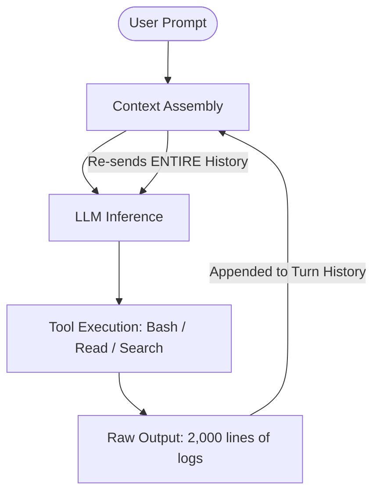
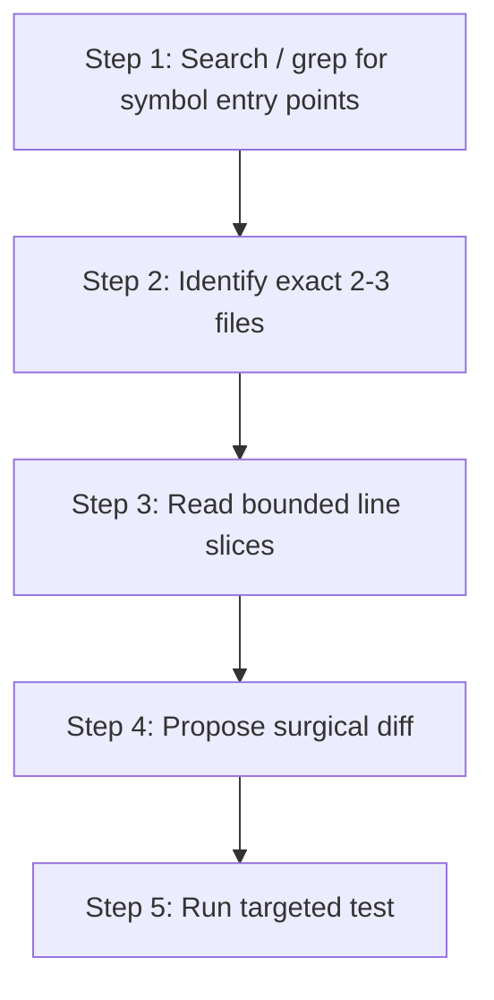
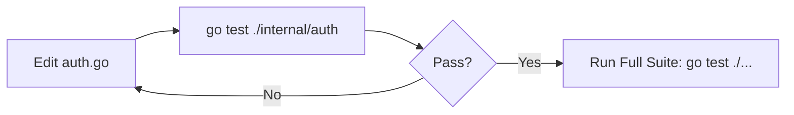
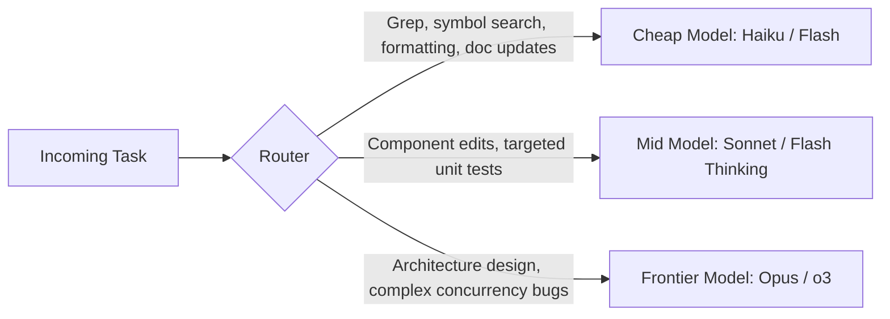
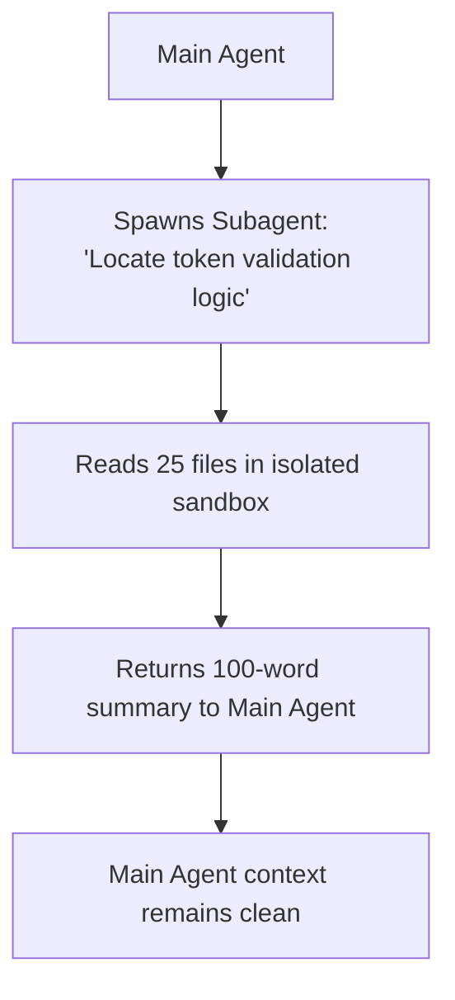

Autonomous AI coding agents—including **Claude Code, Gemini CLI, Cursor, Kiro, Codex, Cline, Continue, and Antigravity**—have become standard tools in professional software development. But they consume tokens at an alarming rate. If you want to **reduce token usage** without sacrificing code quality, the key isn't shorter prompts — it's controlling what enters the context window in the first place. In practice, a single multi-turn refactoring, bug hunt, or infrastructure debugging session can burn **hundreds of thousands of tokens**—sometimes approaching **1,000,000+**—within about twenty minutes, depending on repo size and tool verbosity.

Across all agent frameworks, the biggest savings do **not** come from shaving five words off your prompt. They come from systematically controlling **what gets sent to the model on every single agent turn** — the discipline increasingly known as **context engineering**.

This article is **Part 1** of our 2-part guide to agent efficiency:

* **Part 1 (This Guide):** *The Techniques* — 25 practical, tool-agnostic methods to eliminate context bloat.
* **[Part 2: The Tools]()** — A standardized catalog of open-source tools (RTK, Headroom, LeanCTX, Graphify, Serena, etc.).

## Quick Summary (TL;DR)

* Optimize **what enters context each turn**, not prompt word count.
* Highest leverage: ignore rules, small `AGENTS.md`, fresh sessions, model routing, MCP pruning.
* Filter shell/logs locally; use progressive disclosure instead of full-repo dumps.
* Keep prompt-cache prefixes byte-stable; compact only at task milestones.
* Measure tokens per successful task — then automate filters with tools in [Part 2]().

---

## The Agent Token Loop Problem

> **What is context engineering in AI coding agents?**
> **Context engineering** is the practice of controlling what data enters an AI agent's context window on each execution turn. Unlike standard one-off chat prompts, autonomous coding agents run in an iterative feedback loop where every command output, full file read, and MCP tool schema is re-sent on every subsequent turn, causing cumulative billed tokens to grow roughly with the square of session length.

In standard chat prompts, cost is roughly static per reply. In an autonomous agent loop, **cumulative billed tokens grow roughly with the square of session length** (each turn re-sends growing history), so per-turn cost rises linearly while total session cost compounds:



Every command output, full file read, and MCP JSON schema remains in working memory for all subsequent turns. An agent reading a 1,000-line file on Turn 2 pays for those 1,000 lines on Turns 3, 4, 5... all the way to Turn 30.

> **A note on tokenizers:** Token counts are not universal. Claude (BPE), GPT (tiktoken), and Gemini (SentencePiece) use different tokenizers — the same source file can be 1,200 tokens in one model and 1,400 in another. The techniques in this guide apply regardless of tokenizer, but when comparing costs across providers, measure in dollars rather than raw token counts.
>
> **When NOT to optimize:** Context reduction has diminishing returns. Starving a model of relevant context causes hallucinations, wrong assumptions, and wasted retry loops that burn *more* tokens than reading the file would have. The goal is eliminating *irrelevant* context (build artifacts, verbose logs, unchanged files), not withholding information the model actually needs to do its job. If you find the agent asking the same question repeatedly or making wrong assumptions, you've likely over-pruned.
{: .prompt-warning }

---

## The Token Optimization Hierarchy

Prioritize token reduction in this order for maximum cost savings without hurting code quality. Savings ranges below are **illustrative observations from practitioner reports and vendor cache discounts**—not controlled benchmarks. Your results vary with repo size, agent, and workload:

| Rank | Strategy | Potential Savings | Applies To | Core Impact |
| :--- | :--- | :--- | :--- | :--- |
| **1** | **Context Hygiene & Ignore Rules** | ⭐⭐⭐⭐⭐ (50–90%) | All Agents | Stops massive generated directories from entering context |
| **2** | **Instruction Sizing (`AGENTS.md`)** | ⭐⭐⭐⭐⭐ (40–70%) | All Agents | Shrinks static system prompt billed on every turn |
| **3** | **Fresh Sessions Between Tasks** | ⭐⭐⭐⭐⭐ (50–80%) | All Agents | Eliminates carrying stale context into new jobs |
| **4** | **Model Routing (Cheap vs Frontier)** | ⭐⭐⭐⭐⭐ (60–85% $) | All Agents | Uses fast/cheap models for grep, formatting, and edits |
| **5** | **MCP Pruning & Deferred Loading** | ⭐⭐⭐⭐⭐ (30–60%) | MCP Agents | Prevents 50+ tool schemas from injecting thousands of tokens |
| **6** | **Search / Index Before Reading** | ⭐⭐⭐⭐ (40–80%) | All Agents | Replaces full file dumps with targeted line slices |
| **7** | **Tool & Terminal Output Filtering** | ⭐⭐⭐⭐ (60–95% shell) | CLI Agents | Filters noise from `kubectl`, tests, `git`, and logs |
| **8** | **Prompt Caching Prefix Stability** | ⭐⭐⭐⭐ (up to ~90% on *cached* tokens) | Anthropic / Gemini / OpenAI | Keeps static prefixes byte-stable for provider cache discounts |
| **9** | **Targeted Session Compaction** | ⭐⭐⭐⭐ (40–70%) | Long sessions | Summarizes history at natural task milestones |
| **10** | **Terse Output Formatting** | ⭐⭐⭐⭐ (60–80% output) | All Agents | Eliminates expensive conversational pleasantries |

---

## 1. Context Hygiene & Ignore Files

The number one mistake is allowing the agent to scan or index the entire repository indiscriminately.

```text
Bad Flow:
Agent ──> Scans Repo ──> Reads node_modules/, dist/, coverage/, .terraform/ ──> Massive Context Blowup
```

### Aggressive Exclusions

Configure your tool-specific ignore files (`.gitignore`, `.aiignore`, `.clineignore`, `.cursorignore`, `.geminiignore`):

```gitignore
node_modules/
.git/
dist/
build/
coverage/
vendor/
target/
.terraform/
*.log
*.min.js
*.map
tmp/
cache/
generated/
```

> **Note on Lock Files:** Do **not** put `*.lock` in the default ignore list—agents often need lockfiles to resolve dependency conflicts. Exclude a specific lockfile only if it is huge and irrelevant to the task, and allow manual reads when debugging versions.
{: .prompt-info }

---

## 2. Keeping Instruction Files Small & Lazy-Loaded

System instructions—such as `AGENTS.md`, `CLAUDE.md`, `GEMINI.md`, or `.cursorrules`—are part of the system prompt injected on **every single turn**.

### Bad (800+ lines of static docs)

```markdown
# Company Architecture
Our system was created in 2019 using a microservices pattern... [800 lines of history, standards, and tutorials]
```

### Good (Compact, actionable rules ~50 lines)

```markdown
# Project: Go 1.24 + Terraform

## Rules
- Modify only files relevant to the current task.
- Search symbols before reading entire files.
- Never scan vendor/, dist/, or .terraform/ directories.
- Run targeted unit tests before invoking full test suites.
- For deep architecture context, read `docs/architecture.md` on demand.
```

Keeping documentation in `docs/architecture.md` creates **lazy-loaded context**: the agent only pays for it when it actually needs to read it.

> **Gemini Tip:** Gemini CLI supports reusable `SKILL.md` files and scripts that the agent triggers automatically. Package your workflow instructions, testing rules, and environment setup into skills rather than repeating them in every prompt. This is the Gemini equivalent of Claude's `CLAUDE.md` or a shared `AGENTS.md`—the principle is the same: encode once, load on demand. ([Source](https://cloud.google.com/blog/topics/developers-practitioners/guide-to-ai-tokenomics-eleven-principles-for-token-efficient-software-engineering){:target="_blank" rel="noopener"})
{: .prompt-tip }

---

## 3. Progressive Context Disclosure

Instead of letting the agent read entire subdirectories upfront, guide it to discover context in stages:



* **Bad prompt:** `"Read the repository and fix authentication."`
* **Good prompt:** `"Investigate authentication failure. First search for token validation entry points, identify the relevant file, read only that section, and propose a minimal fix."`

> **Pro Tip — Inline Annotations:** Leave breadcrumb comments directly in source code (`// TODO: agent fix this` or `// SHOULD BE X, NOT Y`) to point the agent at the exact location. This eliminates open-ended searches through large files and gives the agent a precise anchor point.
{: .prompt-tip }

---

## 4. Search Before Cat (Local Filtering First)

For CLI-based agents, printing entire files or logs into stdout is disastrous.

| Instead of Running... | Use Targeted Filtering... | Context Saved |
| :--- | :--- | :--- |
| `cat huge.log` | `grep -n "ERROR" huge.log \| tail -50` | 99% |
| `cat package-lock.json` | `grep -n '"react"' package-lock.json` | 98% |
| `kubectl logs my-pod` | `kubectl logs my-pod --tail=100` | 95% |
| `kubectl get pods -A -o yaml` | `kubectl get pod foo -n bar -o jsonpath='{.status.containerStatuses}'` | 97% |
| `terraform plan` | Run targeted plan on the changed module | 90% |

The core philosophy: **filter locally on the host machine → send the small result → reason with the LLM**.

---

## 5. Targeted Testing Over Full Test Suites

Autonomous agents frequently execute full test suites (`npm test`, `pytest`, `go test ./...`, `mvn test`) after every single 2-line edit.

Teach the agent the **targeted testing loop**:



```markdown
<!-- Add to AGENTS.md -->
- When verifying changes, always run the smallest relevant unit test first.
- Only run the full integration test suite once targeted tests pass.
```

> **Shift Verification Left:** Order your verification steps cheapest-first. Run local builds and unit tests immediately after edits. Save expensive E2E, browser, or integration tests for the very end of a milestone. Each failed expensive test burns far more tokens than a failed unit test.
{: .prompt-tip }

---

## 6. Aggressive Session Resets

When working across multiple tasks, continuing in the same conversation forces subsequent tasks to carry all previous context history.

```text
Task 1: Terraform config  ──> Context: 40k tokens
Task 2: Kubernetes pods   ──> Context: 40k + 25k = 65k tokens
Task 3: Python API fix    ──> Context: 65k + 30k = 95k tokens (paying for Terraform & K8s!)
```

Both Claude Code and Gemini CLI expose `/clear` (or equivalent) so you can start a fresh session when switching topics:

```text
# Claude Code:
/clear

# Gemini CLI:
/clear
```

---

## 7. Targeted Session Compaction

When a task requires continuity over 30+ turns, periodically compact the conversation.

In Claude Code, you can pass custom instructions to `/compact`:

```text
/compact Preserve:
- Current objective
- Files modified so far
- Unresolved errors and test failures
- Key architectural decisions

Discard:
- Exploratory search outputs
- Verbose terminal logs
- Abandoned hypotheses
```

> **Prompt Caching Note:** Compaction rewrites the conversation prefix, which temporarily creates a cache miss. Compact at natural task milestones, not after every turn.
>
> **Advanced: Autonomous Context Compression.** Rather than compacting at a fixed token threshold (which can interrupt the agent mid-subtask and corrupt in-flight reasoning), emerging approaches let the agent *itself* decide when to compress — typically between tasks or before consuming large inputs. This avoids the failure mode where reactive-at-limit compaction breaks reasoning continuity. Tools like [context-mode](https://github.com/mksglu/context-mode){:target="_blank" rel="noopener"} implement this by sandboxing bulky data outside the context window and retrieving only relevant fragments on demand.
{: .prompt-info }

---

## 8. Model Routing: Cheap vs Frontier Models

Never use the most expensive frontier model for mechanical or exploratory tasks:



Routing exploration and formatting to Claude Haiku or Gemini Flash can cut **API spend dramatically** (often the majority of exploration cost) before a frontier model touches the task—exact savings depend on current price cards and how much of the session is mechanical work.

**When to skip routing:** One-shot trivial edits in an already-open frontier session may cost more in context-switching overhead than you save. Route when exploration is long, multi-file, or repetitive.

---

## 9. Tuning Reasoning & Effort Levels

For models supporting dynamic reasoning effort (e.g. Claude Sonnet with extended thinking, Gemini Flash Thinking, o3-mini):

* **Low Effort / Thinking Off:** Variable renames, formatting JSON, writing standard boilerplate, updating READMEs.
* **Medium Effort:** Typical feature development and unit testing.
* **High Effort:** Complex race conditions, distributed system debugging, cryptographic code, architecture design.

High reasoning modes burn large *output* (and sometimes hidden) token budgets. Default to low/medium; escalate only when the agent stalls or the failure mode is clearly algorithmic. Encode the preference in `AGENTS.md` so the agent does not turn thinking on for every README typo.

**When to skip:** If your agent UI does not expose effort controls, rely on model routing (§8) instead of fake "think harder" prompt padding.

---

## 10. MCP Server Pruning & Profile Splitting

Every MCP server you attach injects its JSON tool schemas into every prompt. Having 10 MCP servers active can easily consume **thousands of prompt tokens per turn** (commonly on the order of **3,000–6,000**, depending on schema verbosity) **before any code is read**.

### Solution: Split into Workload Profiles

* **Coding Profile:** Filesystem, Git, GitHub
* **DevOps Profile:** Kubernetes, AWS, Terraform
* **Incident Profile:** Datadog, Sentry, PagerDuty

Disable servers you are not actively using for the current task.

---

## 11. Deferred / Lazy MCP Tool Loading

Modern MCP specifications support **Tool Discovery / Tool Search**. Instead of injecting 50 schemas upfront:

1. The client exposes a single meta-tool: `search_tools(query: "kubernetes")`.
2. When the model needs Kubernetes functionality, it calls `search_tools` and dynamically loads the 3 required schemas into context.
3. Schemas for unused tools never enter the conversation at all.

This is still an emerging pattern — not all agent frameworks support it yet. Claude Code and Cursor currently load all configured MCP tools at session start. However, MCP middleware that compresses tool descriptions (e.g. community **caveman-shrink**-style shrinkers) and profile splitting (§10) serve as interim solutions until lazy loading becomes standard. Tool catalogs and setup are covered in [Part 2]().

---

## 12. Prompt Caching & Prefix Stability (Claude, Gemini, OpenAI)

Modern APIs (Anthropic, Google Gemini, OpenAI) offer **Prompt Caching** (up to [90% discount on cached tokens](https://docs.anthropic.com/en/docs/build-with-claude/prompt-caching){:target="_blank" rel="noopener"}).

Note that caching behavior differs across providers (verify against current docs—APIs change):

* **Anthropic:** Prompt caching is **opt-in** via `cache_control`—either a top-level automatic breakpoint or explicit per-block breakpoints. Matching prefixes then reuse the cache. ([Docs](https://docs.anthropic.com/en/docs/build-with-claude/prompt-caching){:target="_blank" rel="noopener"})
* **OpenAI:** Prompt caching is **enabled by default** for supported models when prefixes meet the minimum cacheable length; optional explicit breakpoints refine what is reused. ([Docs](https://platform.openai.com/docs/guides/prompt-caching){:target="_blank" rel="noopener"})
* **Google Gemini:** Implicit caching can discount repeated prefixes; Vertex AI / Gemini also support **explicit** context caching with configurable TTL. ([Docs](https://ai.google.dev/gemini-api/docs/caching){:target="_blank" rel="noopener"})

To maintain high cache hit rates:

1. **Never Put Timestamps or Random UUIDs in System Prompts:** Any dynamic variable at the top of the prompt invalidates the entire cache downstream.
2. **Order Static Blocks First:** Place system instructions, MCP schemas, and project specs before the dynamic conversation history.
3. **Avoid Mid-Session Config Changes:** Reconnecting MCP servers or switching model flags mid-chat invalidates the cache prefix.

> **Advanced: Prefix-Cache as a Loop Invariant.** The [DeepSeek-Reasonix harness](https://github.com/esengine/DeepSeek-Reasonix){:target="_blank" rel="noopener"} demonstrates structuring the entire agent loop around cache stability: an immutable prefix (system prompt + tool schemas), an append-only log (conversation turns), and a volatile scratch area (current tool output). That project reports 99.8%+ cache-hit rates and roughly ~5× lower long-session cost—treat those figures as **author-reported**, not independent benchmarks. The pattern applies to any provider with prefix caching — structure your context as `[static | append-only | volatile]` rather than randomly interleaving content.
{: .prompt-info }

---

## 13. Tool & Terminal Output Throttling

Sections §4 and §14 cover *what* to filter. This section covers *how to instruct the agent* to self-throttle when you can't intercept outputs externally (e.g., no CLI filter wrapper such as **RTK**—covered in [Part 2]()—or when MCP tool calls return large structured JSON):

```markdown
<!-- Global Instruction -->
When running shell commands:
- Always pipe verbose commands through head/tail or grep.
- Never print entire JSON blobs when only one field is needed.
- Strip ANSI colors and progress spinners from tool outputs.
- When MCP tools return large payloads, summarize before reasoning.
- If a command produces >100 lines, re-run with filtering flags.
```

> **Content Negotiation for Agents:** If your agent fetches web documentation or internal pages, serve `text/markdown` when agents request it via `Accept: text/markdown`, while preserving the same human-facing HTML at the same URL. This removes HTML boilerplate before it ever enters the context window. [Vercel's implementation guide](https://vercel.com/blog/making-agent-friendly-pages-with-content-negotiation){:target="_blank" rel="noopener"} demonstrates this pattern — agents get cleaner, cheaper inputs without custom scrapers.
{: .prompt-tip }

---

## 14. Local Preprocessing (jq, awk, ripgrep)

This extends the principle from §4 to heavier payloads. Before sending 50 MB of raw logs or JSON payloads to an LLM, process them locally:

```bash
# Instead of dumping a 10 MB AWS API response:
aws ec2 describe-instances | jq '.Reservations[].Instances[] | {Id: .InstanceId, State: .State.Name}'
```

`jq`, `awk`, and `ripgrep` shrink multi-megabyte payloads down to 5 KB of clean JSON before they reach the model.

> **"Think in Code" Paradigm:** Instead of the agent making 10 sequential tool calls (each adding output to context), have it write a single script that performs all 10 operations and returns only the final result. One code-execution call replaces 10 file-read calls, collapsing intermediate outputs that would otherwise bloat the context window. Tools like [context-mode](https://github.com/mksglu/context-mode){:target="_blank" rel="noopener"} formalize this pattern at the MCP layer.
{: .prompt-tip }

---

## 15. Repository Maps vs Raw Dumps

A lightweight repository map provides structural awareness at a fraction of the cost:

```text
repo/
├── cmd/
│   └── api/ (main.go)
├── internal/
│   ├── auth/ (service.go, jwt.go) [Authenticate, ValidateToken, ParseJWT]
│   ├── database/ (pool.go, migrations.go)
│   └── billing/ (stripe.go, webhook.go)
```

The agent uses the map to pick exact files rather than opening 20 directories blind.

Generate maps with `tree -L 3` (respecting ignore rules), language-aware indexers, or agent-native "repo map" features. Prefer symbol names on hot paths over dumping every file path.

**When to skip:** Tiny repos (<20 source files) gain little—point the agent at the two relevant paths instead.

---

## 16. Semantic Code Indexing & AST Retrieval

For large codebases, use AST-based knowledge graphs (**Graphify**, covered in [Part 2]()) or LSP symbol indexes (**Serena**, also Part 2):

* **AST Graphs:** Answer questions like *"Where does UserService interact with billing?"* in 1 graph query (often ~hundreds of tokens) instead of reading many files (often tens of thousands of tokens). Exact ratios are illustrative.
* **LSP Indexing:** Queries exact function signatures and callers without reading whole file bodies.

Wire the index into the agent as a tool so it *asks* the graph/LSP before opening files. Rebuild the index when major refactors land.

**When to skip:** Greenfield projects and single-package scripts—grep + progressive disclosure (§3) is enough.

---

## 17. Subagent Isolation & Stopping Conditions

When an agent needs to explore 30 files, spawn an **isolated subagent**:



> **Warning:** Subagents multiply token costs if spawned carelessly. Limit subagent delegation to independent, read-heavy exploratory tasks.
{: .prompt-warning }

---

## 18. Loop Guards & Failure Backoffs

Autonomous agents can get stuck in endless retry loops:

```text
Edit ──> Test Fails ──> Edit ──> Test Fails ──> (Repeats 15 times = 300k tokens burned)
```

### Prevention Rules

* *"If the same approach fails twice, stop and explain the blocker to the user."*
* *"Do not retry an identical command unless inputs have changed."*
* *"Cap debugging iterations at 3 attempts before asking for guidance."*
* *"If the agent drifts, revert files (`git checkout`, IDE undo) and restart from clean state—do not pile corrective prompts on top of a broken context, which only poisons subsequent turns further."*

---

## 19. Preventing Redundant File Re-Reads

Agents often re-read the same large configuration file on Turns 3, 7, 12, and 18—paying again for content already in history.

```markdown
<!-- Add to Agent Rules -->
- Do not re-read files already inspected in this session unless their contents were modified.
- Rely on your previous turn history for unchanged source files.
- If unsure whether a file changed, check `git status` / mtime before a full re-read.
```

This pairs with session resets (§6): after `/clear`, the agent *should* re-read what it needs. Within one long session, re-reads are pure waste.

**When to skip:** After you (or the agent) edited the file, or when compaction (§7) dropped the earlier read from summarized history.

---

## 20. Terse Output Rules (Caveman Formatting)

Output tokens are often billed at a **higher rate than input tokens** (commonly ~3–5× on frontier chat models—check current price cards; some Flash-class models are nearer 1:1). Eliminate prose bloat:

```text
Verbose Agent (1,200 tokens):
"Sure! I'd be glad to help you fix this issue. After analyzing your authentication service, 
I noticed that the token expiration check was missing a timezone offset. Here is an explanation 
of how JWT tokens work and why this was causing an error... [3 pages of text] ... I have updated the file."

Terse Agent (45 tokens):
Done.
- Fixed timezone offset in `internal/auth/jwt.go:42`.
- Added regression test in `jwt_test.go`.
- `go test ./internal/auth` passed.
```

---

## 21. Skipping Planning Overhead on Trivial Edits

Do not demand multi-step implementation plans for simple 5-line fixes:

* **Complex Task:** *"Explore codebase, create implementation plan, request review, then execute."*
* **Trivial Task:** *"Fix typo in README directly with targeted edit."*

Planning modes spawn extra turns, tool calls, and sometimes subagents (§17). Reserve them for multi-file design work. For typos, renames, and single-function fixes, a one-shot instruction is cheaper and usually better.

**When a short plan is worth it:** Ambiguous bugs where the wrong 5-line fix would trigger expensive retry loops—then planning pays for itself.

---

## 22. Separating Exploration from Implementation

For large refactors, split the workflow into two distinct user turns:

1. **Turn 1 (Exploration):** *"Search only. Locate relevant files and summarize the root cause. Do NOT modify any code."*
2. **Turn 2 (Execution):** *"Implement the agreed fix on `src/auth.ts`."*

This prevents the agent from generating speculative code edits while it is still searching.

> **The Elephant & Goldfish Pattern:** Google's David Rensin describes using a high-reasoning, long-context session (the "Elephant") to generate a detailed execution plan, then executing that plan in a clean, low-token session (the "Goldfish"). Checkpoint progress with commits or artifacts so you can restart from a clean state when context fills up. This formalizes the explore/implement split into a repeatable two-session workflow. ([Source](https://cloud.google.com/blog/topics/developers-practitioners/guide-to-ai-tokenomics-eleven-principles-for-token-efficient-software-engineering){:target="_blank" rel="noopener"})
{: .prompt-info }

---

## 23. Local Model Offloading (Ollama / LM Studio)

Use local models (Qwen Coder, Llama, DeepSeek — latest available) for routine offline workloads:

* Generating vector embeddings for local codebase search.
* Summarizing test run logs.
* Formatting git commit messages and PR descriptions.

Keep cloud agents for high-stakes reasoning; offload high-volume, low-risk text jobs so they never touch billed API context. Hardware sizing and tooling options are covered in our [local AI models guide]().

**When to skip:** If local hardware cannot run a capable coder model, local offload may waste more time than API tokens—measure once before committing the workflow.

---

## 24. Measuring Tokens per Successful Task

Track efficiency using metrics that matter:

```text
Efficiency = Total Tokens Billed / Successful Tasks Completed
```

Without a denominator (successful tasks), raw token charts reward under-scoped work. Log tokens alongside whether the PR landed or the bug closed.

Use built-in agent commands and (optionally) tool-side meters from [Part 2]():

* **Claude Code:** `/usage`
* **Gemini CLI:** `/stats`
* **Dollar rollups:** `npx ccusage` (or your provider's usage dashboard)
* **CLI filter savings (RTK):** `rtk gain` when that tool is installed
* **Proxy stacks (Headroom / LeanCTX):** their `perf` / savings reports when deployed

Re-check command names in current CLI help—agent surfaces evolve quickly.

---

## 25. Universal AGENTS.md Blueprint

Standardize this concise `AGENTS.md` across all your repositories:

```markdown
# Agent Guidelines

## Context Efficiency
- Search symbols/grep before reading full files.
- Read only lines relevant to the active task.
- Never scan vendor/, dist/, .terraform/, or node_modules/ directories.
- Do not re-read unchanged files already in history.
- Prefer targeted command outputs (pipe through head/grep/jq).
- Run targeted unit tests before running full test suites.

## Workflow
1. Locate relevant symbols and entry points.
2. Read the minimum necessary code slices.
3. Make surgical, minimal changes (YAGNI).
4. Run targeted unit tests.
5. Provide a concise summary (<=5 bullet points, no conversational filler).

## Loop Guards
- Stop and ask for input if the same test fails twice.
- Do not retry identical failed commands without modifying arguments.
- Do not create subagents for trivial tasks.
```

---

## Frequently Asked Questions

**How much can I realistically save on token costs?**
Results vary widely by repo and agent. In practice, teams often see meaningful cuts from technique-only changes alone: ignore rules + smaller instruction files + fresh sessions + local shell filtering + terse outputs. Larger reductions usually require automating those patterns with tooling (CLI filters, code intelligence, or proxy stacks—catalogued in [Part 2]()). Treat any headline percentage as a hypothesis until you measure tokens per successful task (§24) on *your* workload.

**Does reducing context hurt code quality?**
Removing *irrelevant* context (build artifacts, verbose logs, unchanged files) improves quality — models suffer less attention degradation. However, aggressively withholding *relevant* context causes hallucinations. The goal is precision, not starvation.

**Do these techniques work with all AI coding agents?**
The core principles (context hygiene, progressive disclosure, session resets, terse output) apply universally. Specific implementations vary — MCP-based tools require MCP support, prompt caching behavior differs by provider, and some agents have built-in features (Claude Code's `/compact`, Gemini CLI's `/stats`).

**What's the single highest-impact change I can make today?**
Configure your ignore files (`.aiignore`, `.cursorignore`, `.geminiignore`) to exclude `node_modules/`, `dist/`, `.terraform/`, and other generated directories. This prevents the agent from scanning thousands of irrelevant files on every session start.

**Is prompt caching free?**
Cached tokens are significantly discounted versus uncached input (often on the order of provider list discounts up to ~90%—check current price cards), but not free. The key benefit is cost reduction on repeated prefixes — system prompts, MCP schemas, and instruction files that appear on every turn.

**How do I measure my current token consumption?**
Use `/usage` in Claude Code, `/stats` in Gemini CLI, or `npx ccusage` for detailed dollar tracking. If you install CLI filtering tools such as RTK (Part 2), their savings commands (e.g. `rtk gain`) show filter-specific impact.

---

## Next in the Series

Now that you have the complete playbook of techniques:

**Continue to [Part 2: Open-Source Tools to Reduce Token Usage in AI Coding Agents]()** — A detailed catalog and breakdown of top tools (RTK, Headroom, LeanCTX, Graphify, Serena, Ponytail, Caveman, and more).

---

*Last verified: September 2026. Agent capabilities and pricing change rapidly — always check official provider documentation.*
