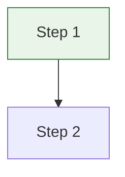

# Jekyll Chirpy Blog Development Guide

Complete documentation for Jekyll blog development using the Chirpy theme, including tools, workflows, and best practices.

## 🔧 Local Development

### Jekyll Commands
```bash
# Install dependencies
bundle install

# Serve locally with live reload
bundle exec jekyll serve --livereload

# Serve with drafts
bundle exec jekyll serve --drafts

# Build for production
JEKYLL_ENV=production bundle exec jekyll build
```

### Development Workflow
- **Drafts:** Store in `_drafts/` folder (no date needed)
- **Draft Creation:** `touch _drafts/my-new-post.md`
- **Draft to Post:** `mv _drafts/my-new-post.md _posts/$(date +%Y-%m-%d)-my-new-post.md`
- **Future Posts:** Set future date in front matter
- **Live Reload:** Auto-refresh browser on file changes
- **Local URL:** `http://localhost:4000`

### Environment Variables
```bash
# Development (default)
JEKYLL_ENV=development

# Production (enables analytics, PWA)
JEKYLL_ENV=production
```

## 📝 Content Creation

### Markdown Extensions
- **Mermaid Diagrams:** Built-in support via `mermaid: true`
- **Math Equations:** MathJax support via `math: true`
- **Code Highlighting:** Rouge syntax highlighter

### Post Writing Features
- **Prompts:** `tip`, `info`, `warning`, `danger` for callout boxes
- **File Path:** `{: .filepath}` for highlighting file paths
- **Image Captions:** Automatic caption generation from alt text
- **Table of Contents:** Auto-generated via `toc: true`
- **Pin Posts:** `pin: true` to pin important posts
- **Future Posts:** Set future dates for scheduled publishing

### SEO Optimization
- **Meta Descriptions:** 150-170 characters
- **Categories:** Maximum 3 per post
- **Tags:** Maximum 5 per post
- **Structured Data:** JSON-LD for FAQ sections

## ✍️ Content Formatting

### Chirpy Prompts
```markdown
> **Tip:** Use webp-optimizer.sh script for automatic image conversion and LQIP generation!
{: .prompt-tip }

> **Info:** LQIP should be under 1,500 Base64 characters for optimal performance.
{: .prompt-info }

> **Warning:** Never commit sensitive data like API keys or passwords to your repository.
{: .prompt-warning }

> **Danger:** Running `git reset --hard` will permanently delete uncommitted changes!
{: .prompt-danger }
```

**Rendered Output:**
> **Tip:** Use webp-optimizer.sh script for automatic image conversion and LQIP generation!
{: .prompt-tip }

> **Info:** LQIP should be under 1,500 Base64 characters for optimal performance.
{: .prompt-info }

> **Warning:** Never commit sensitive data like API keys or passwords to your repository.
{: .prompt-warning }

> **Danger:** Running `git reset --hard` will permanently delete uncommitted changes!
{: .prompt-danger }

### File Paths & Code
```markdown
`/assets/img/posts/20230131/git-workflows-guide.webp`{: .filepath}
`_includes/head.html`{: .filepath}
`webp-optimizer.sh`{: .filepath}
`~/.gitconfig`{: .filepath}
```

**Rendered Output:**
`/assets/img/posts/20230131/git-workflows-guide.webp`{: .filepath}
`_includes/head.html`{: .filepath}
`webp-optimizer.sh`{: .filepath}
`~/.gitconfig`{: .filepath}

```bash
# Code block with syntax highlighting
echo "Hello World"
```

- **Code Screenshots:** [Carbon](https://carbon.now.sh/) - Beautiful code screenshots

### Mathematics (MathJax)
```markdown
<!-- Inline math -->
$$ \sum_{n=1}^{\infty} 2^{-n} = 1 $$

<!-- Block math -->
$$
\begin{align}
  \nabla \times \vec{\mathbf{B}} -\, \frac1c\, \frac{\partial\vec{\mathbf{E}}}{\partial t} &= \frac{4\pi}{c}\vec{\mathbf{j}} \\
  \nabla \cdot \vec{\mathbf{E}} &= 4 \pi \rho \\
\end{align}
$$
```

## 📸 Image Optimization

### Post Header Images
- **Size:** 1200x630px (optimal for social media)
- **Format:** WebP (preferred for performance)
- **Tools:** [Squoosh.app](https://squoosh.app/) - Google's image optimizer
- **Location:** `/assets/img/posts/YYYYMMDD/`

### LQIP (Low Quality Image Placeholder)
- **Optimal Sizes:** 32x32px (recommended), 40x40px (better quality)
- **Command Line Tool:** ImageMagick
- **Generation Script:**
  ```bash
  # Generate LQIP with ImageMagick
  convert image.webp -resize 32x32 -blur 0x1 -quality 30 jpg:- | base64
  ```
- **Online Tools:** [Base64-Image.de](https://www.base64-image.de/) for Base64 conversion

## 🛠️ Development Tools

### Favicon Generation
- **Tool:** [RealFaviconGenerator](https://realfavicongenerator.net/) - Complete favicon package generation
- **Input:** 512x512px PNG image
- **Output:** Complete favicon package for `/assets/img/favicons/`
- **Required Files:** favicon.ico, apple-touch-icon.png, mstile-150x150.png, etc.
- **Configuration:** Automatic browserconfig.xml and site.webmanifest generation

### Image Processing
- **ImageMagick:** Command-line image manipulation (see [ImageMagick Usage](https://imagemagick.org/Usage/))
  ```bash
  brew install imagemagick  # macOS
  sudo apt install imagemagick  # Ubuntu
  ```
- **libwebp (Google):** WebP conversion and optimization
  ```bash
  # Download from: https://developers.google.com/speed/webp/download
  # Or via Homebrew: brew install webp
  ```
- **Sharp CLI:** Node.js image processing
  ```bash
  npm install -g sharp-cli
  ```

### Performance Optimization
- **Jekyll Compress:** HTML/CSS minification (built into theme)
- **WebP Conversion:** [Squoosh.app](https://squoosh.app/), ImageMagick, or webp-optimizer.sh script
- **LQIP Generation:** Custom scripts or [TinyPNG](https://tinypng.com/) for image compression

## 🎯 Mermaid Diagram Guidelines

### Compatibility
- **Version:** Mermaid v11.4.0+
- **Gitgraph Syntax:** Use colon syntax
- **Branch Names:** No forward slashes allowed
- **Colors:** Use fill and stroke properties

### Example Syntax
- **Testing Tool:** [Mermaid Live Editor](https://mermaid.live/) - Diagram testing


## 🔧 Useful Scripts

### WebP Conversion Commands
```bash
# Blog header images (1200x630px, quality 85, sharpness for text)
cwebp -q 85 -resize 1200 630 -sharpness 2 input.jpg -o output.webp

# LQIP generation (32x32px, quality 20)
cwebp -q 20 -resize 32 32 input.jpg -o lqip.webp
echo "data:image/webp;base64,$(base64 -i lqip.webp)"

# Batch conversion
for img in *.{jpg,png}; do
  cwebp -q 85 -resize 1200 630 -sharpness 2 "$img" -o "${img%.*}.webp"
done
```

### LQIP Generator Script (ImageMagick)
```bash
#!/bin/bash
# lqip-generator.sh
INPUT="$1"
convert "$INPUT" -resize 32x32 -blur 0x1 -quality 30 temp_lqip.jpg
echo "data:image/jpeg;base64,$(base64 -w 0 temp_lqip.jpg)"
rm temp_lqip.jpg
```

### Image Optimization Workflow
1. **Original Image:** Create at 1200x630px
2. **Convert to WebP:** Use webp-optimizer.sh script in root folder (quality 85)
3. **Generate LQIP:** Automatically generated by webp-optimizer.sh script
4. **Place Files:** Move to `/assets/img/posts/YYYYMMDD/`

### WebP Quality Settings
- **q 95:** Highest quality (larger file)
- **q 85:** ✅ **Recommended** (good balance)
- **q 75:** Good quality (smaller file)
- **q 50:** Lower quality (much smaller)

### Sharpness Settings
- **0:** No sharpening (photos)
- **2:** ✅ **Recommended** (text/diagrams)
- **3:** Strong (screenshots)

## 🎨 Theme Customization

### Custom Styling
- **Main CSS:** `_sass/addon/commons.scss`
- **Variables:** `_sass/addon/variables.scss`
- **Dark Mode:** Built-in toggle, customizable colors
- **Fonts:** Override in `_sass/addon/commons.scss`

### Sidebar Configuration
```yaml
# _config.yml
avatar: /assets/img/avatar.jpg
social:
  name: Your Name
  email: your@email.com
  links:
    - https://github.com/username
    - https://twitter.com/username
```

### Footer Customization
- **Copyright:** Auto-generated from site.title
- **Links:** Edit `_data/contact.yml`
- **Custom Text:** Modify `_includes/footer.html`

## 📱 PWA Features

### Enable PWA
```yaml
# _config.yml
pwa:
  enabled: true
  cache:
    enabled: true
```

### Service Worker
- **File:** `assets/js/pwa/sw-pwa.js` (auto-generated)
- **Caching:** Offline page access
- **Updates:** Auto-refresh on new versions
- **Scope:** Entire site cached

### Web Manifest
- **File:** `assets/js/pwa/app.min.js`
- **Icons:** Uses favicon package
- **Install Prompt:** "Add to Home Screen" on mobile
- **Offline Support:** Cached pages work offline

## 🚀 Deployment & CI/CD

### GitHub Actions
- **Auto-deploy:** Triggers on push to main branch
- **Build Process:** Jekyll build + GitHub Pages deployment
- **Caching:** Dependencies cached for faster builds
- **Configuration:** `.github/workflows/pages-deploy.yml`

### GitHub Pages Caching
```yaml
# Enable caching in GitHub Actions
- name: Cache dependencies
  uses: actions/cache@v3
  with:
    path: vendor/bundle
    key: ${{ runner.os }}-gems-${{ hashFiles('**/Gemfile.lock') }}
```

## 🔍 Analytics & SEO

### Google Search Console
- **Setup:** [Google Search Console](https://search.google.com/search-console)
- **Site Verification:** Add meta tag or HTML file
- **Sitemap Submission:** Submit `/sitemap.xml`
- **Index Coverage:** Monitor crawling issues
- **Performance:** Track search rankings

### Schema.org Markup
```html
<!-- FAQ Schema (already in Git guide) -->
<script type="application/ld+json">
{
  "@context": "https://schema.org",
  "@type": "FAQPage"
}
</script>
```

### SEO Files
- **Sitemap:** Auto-generated at `/sitemap.xml`
- **Robots.txt:** Search engine directives at `/robots.txt`
- **Meta Tags:** Handled by jekyll-seo-tag plugin

## 📊 Monitoring & Analytics

### Google Analytics 4
- **Setup:** [Google Analytics](https://analytics.google.com/)
- **Configuration:**
```yaml
# _config.yml
analytics:
  google:
    id: G-XXXXXXXXXX
```

### Core Web Vitals
- **LCP:** Largest Contentful Paint (<2.5s)
- **FID:** First Input Delay (<100ms)
- **CLS:** Cumulative Layout Shift (<0.1)
- **Tools:** [PageSpeed Insights](https://pagespeed.web.dev/), [Search Console](https://search.google.com/search-console)

### Site Monitoring
- **[Uptime Robot](https://uptimerobot.com/):** Free monitoring (50 monitors)
- **[GitHub Actions](https://github.com/features/actions):** Build status monitoring
- **[Google Search Console](https://search.google.com/search-console):** Crawl error alerts
- **[Google Analytics](https://analytics.google.com/):** Traffic and performance tracking

### Performance Optimization
- **Image Optimization:** WebP format, LQIP
- **Minification:** HTML/CSS/JS compression
- **Caching:** Browser and CDN caching
- **PWA:** Offline functionality

### Target Performance Scores
- **[PageSpeed Insights](https://pagespeed.web.dev/):** 90+ (Mobile & Desktop)
- **Core Web Vitals:** All green
- **Image Optimization:** WebP format, proper sizing
- **LQIP Size:** <2KB (Base64 <1,500 characters)


## 🎨 Color Palette (Mermaid Diagrams)

### Standard Colors
- **Success/Main:** `fill:#e8f5e8,stroke:#2e7d32`
- **Warning:** `fill:#fff3e0,stroke:#f57c00`
- **Info:** `fill:#e3f2fd,stroke:#1976d2`
- **Error:** `fill:#ffebee,stroke:#d32f2f`
- **Neutral:** `fill:#f5f5f5,stroke:#757575`

## 📁 File Organization

### Directory Structure
```
/assets/img/
├── posts/
│   └── YYYYMMDD/
│       ├── main-image.webp
│       └── diagram-1.png
├── favicons/
└── avatar/
```

### Naming Conventions
- **Posts:** `YYYY-MM-DD-post-title.md`
- **Images:** `descriptive-name.webp`
- **Folders:** `YYYYMMDD` format for post dates
- **Table Creation:** [Markdown Tables Generator](https://www.tablesgenerator.com/markdown_tables) - Visual table creation

## 🎨 Typography & Fonts

### System Fonts (Chirpy Theme)
- **Primary:** Source Sans Pro (loaded via theme)
- **Monospace:** Menlo, Monaco, Consolas (system fonts)
- **Fallback:** System UI fonts for performance

### Font Loading
- **Method:** CSS font-display: swap for performance
- **Location:** `_sass/addon/commons.scss`

## 📚 Documentation References

- **[Jekyll Docs](https://jekyllrb.com/docs/)** - Official Jekyll documentation
- **[Chirpy Theme](https://github.com/cotes2020/jekyll-theme-chirpy)** - Theme repository and docs
- **[Mermaid Documentation](https://mermaid.js.org/)** - Diagram syntax reference
- **[ImageMagick Usage](https://imagemagick.org/Usage/)** - Command-line image processing
- **[libwebp](https://developers.google.com/speed/webp/download)** - Google's WebP encoder/decoder
