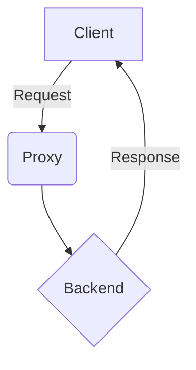

# Jekyll Chirpy Reference Guide

A concise reference for developing, writing, and customizing blogs with the [Chirpy](https://github.com/cotes2020/jekyll-theme-chirpy) theme.

---

## 1. Local Development & Workflow

### Core Commands

```bash
# Install Ruby dependencies
bundle install

# Run locally with live reload
bundle exec jekyll serve --livereload

# Run with drafts included
bundle exec jekyll serve --drafts

# Production build
JEKYLL_ENV=production bundle exec jekyll build
```

### Publishing Workflow

* **Drafts**: Place in `_drafts/post-title.md` (no date prefix).
* **Publishing**: Move to `_posts/YYYY-MM-DD-post-title.md`.
* **Cross-platform deployment**: When committing `Gemfile.lock` from macOS/Windows for GitHub Actions deployment:
  ```bash
  bundle lock --add-platform x86_64-linux
  ```

---

## 2. Post Front Matter

```yaml
---
title: "Post Title"
date: YYYY-MM-DD HH:MM:SS +/-TTTT
categories: [TopCategory, SubCategory]  # Max 2 levels supported
tags: [tag1, tag2, tag3]               # Preferred 3-5 tags
pin: true                              # Pin to top of home page (optional)
math: true                             # Enable MathJax (optional)
mermaid: true                          # Enable Mermaid diagrams (optional)
media_subpath: '/assets/img/posts/YYYYMMDD' # Base path for post images/videos (optional)
image:
  path: /assets/img/posts/YYYYMMDD/hero.webp
  lqip: data:image/webp;base64,...     # Base64 or path to LQIP placeholder
  alt: Descriptive hero image alt text
---
```

---

## 3. Typography & Text Formatting

### Prompts / Callout Boxes

```markdown
> Tip message
{: .prompt-tip }

> Info message
{: .prompt-info }

> Warning message
{: .prompt-warning }

> Danger message
{: .prompt-danger }
```

### Headings & Table of Contents

* By default, H2 and H3 headings populate the TOC.
* **Skip TOC for a heading**:
  ```markdown
  ## Heading to Skip {: data-toc-skip='' }
  ```

### Lists & Notes

```markdown
<!-- Task list -->
- [ ] Todo item
- [x] Completed item

<!-- Description list -->
Term
: Definition text

<!-- Inline filepath -->
`/path/to/file.ext`{: .filepath}

<!-- Footnotes -->
Text referencing footnote[^1].
[^1]: Footnote source content.
```

---

## 4. Code Blocks

Chirpy uses Rouge syntax highlighting. *(Note: `` tag is incompatible with Chirpy).*

### Code Block Options

````markdown
<!-- Language highlighting with line numbers (default) -->
```bash
echo "Hello"
```

<!-- Specify filename in header -->
```sass
@import "colors/light";
```
{: file="_sass/custom.scss" }

<!-- Hide line numbers -->
```shell
npm run build
```
{: .nolineno }

<!-- Display raw Liquid tags without rendering -->

```liquid
{{ page.title }}
```

````

---

## 5. Images & Media Embeds

### Images with Layout Attributes

```markdown
<!-- Default centered with caption -->
{: width="972" height="589" }
_Caption text centered beneath image_

<!-- Float left / right -->
{: .w-50 .left }
{: .w-50 .right }

<!-- Dark / Light mode switching with shadow and rounded corners -->
{: .light .shadow .rounded-10 w='1200' h='630' }
{: .dark .shadow .rounded-10 w='1200' h='630' }

<!-- Explicit LQIP on inline image -->
{: lqip="/path/to/lqip.webp" }
```

### Video & Audio Embeds

```liquid
 Social Platforms 





 Direct Video File 


 Direct Audio File 

```

---

## 6. Mathematics & Diagrams

### MathJax (`math: true` in Front Matter)

* **Block equations**: **Must** have empty blank lines before and after `$$`.
* **Equation numbering & references**:
  ```markdown
  $$
  \begin{equation}
    E = mc^2
    \label{eq:energy}
  \end{equation}
  $$

  Refer to equation \eqref{eq:energy}.
  ```
* **Inline math**: `$$ E = mc^2 $$` (no blank lines).
* **Inline math inside lists**: Escape first dollar sign: `\$$ x + y = z $$`.

### Mermaid Diagrams (`mermaid: true` in Front Matter)

````markdown

```mermaid
flowchart TD
  A[Client] -->|Request| B(Proxy)
  B --> C{Backend}
  C -->|Response| A
```
````

---

## 7. Favicon Customization

1. Generate icons at [RealFaviconGenerator](https://realfavicongenerator.net/) using a 512×512 PNG/SVG.
2. Unzip the package and **DELETE `site.webmanifest`** from the extracted files *(Chirpy generates its own `site.webmanifest`)*.
3. Copy remaining files (`.png`, `.ico`, `.svg`) into `assets/img/favicons/`.

---

## 8. Asset Optimization Quick Commands

```bash
# Convert image to optimized WebP (1200x630, quality 85)
cwebp -q 85 -resize 1200 630 -sharpness 2 input.jpg -o output.webp

# Generate LQIP base64 data URI (32x32, blurred, <1.5 KB)
convert image.webp -resize 32x32 -blur 0x1 -quality 30 jpg:- | base64
```

---

## 9. Upgrading Chirpy to Latest Release (Preserving Posts)

To upgrade your theme to the latest release from [Chirpy Releases](https://github.com/cotes2020/jekyll-theme-chirpy/releases) directly on your working branch while keeping all personal posts, drafts, and assets intact:

### Step 1: Fetch Latest Upstream Release Tags

```bash
# Add upstream remote if not already present
git remote add upstream https://github.com/cotes2020/jekyll-theme-chirpy.git 2>/dev/null || true

# Fetch all release tags
git fetch upstream --tags
```

### Step 2: Stash Local Changes & Merge Release Tag

Stash any uncommitted modifications (e.g. in `package.json`) so Git doesn't block the merge:

```bash
# Stash uncommitted changes
git stash

# List release tags to find the latest version
git tag -l "v*" --sort="v:refname" | tail -n 5

# Merge the target release tag without auto-committing
git merge <RELEASE_TAG> --no-commit
# Example: git merge v7.6.0 --no-commit

# Restore your stashed changes
git stash pop
```

### Step 3: Protect Personal Content & Configuration

Ensure personal posts, drafts, and configs are preserved, and discard upstream demo posts:

```bash
# Restore your personal posts, drafts, and configuration if touched
git checkout HEAD -- _posts/ _drafts/ _config.yml

# Remove any upstream demo posts pulled from the release tag
git rm -f _posts/2019-08-* 2>/dev/null || true
```

### Step 4: Recompile Assets & Update Dependencies

Since Chirpy v5.6/v7.0, compiled JS/CSS distribution files are generated locally:

```bash
npm install
npm run build
git add assets/js/dist _sass/vendors -f
bundle update
```

### Step 5: Test Locally & Commit

```bash
# Verify the upgraded site and drafts locally
bundle exec jekyll serve --drafts

# Commit the upgrade directly
git commit -m "chore: upgrade theme to <RELEASE_TAG>"
```

> **Targeted File Update (No Git Merge):** To pull only the theme files (`_includes`, `_layouts`, `_sass`, `assets`, `tools`) from the release tag without merging git history:
> ```bash
> git checkout <RELEASE_TAG> -- _includes _layouts _sass assets tools
> npm run build && git add assets/js/dist _sass/vendors -f
> git commit -m "chore: update theme templates to <RELEASE_TAG>"
> ```
{: .prompt-tip }


